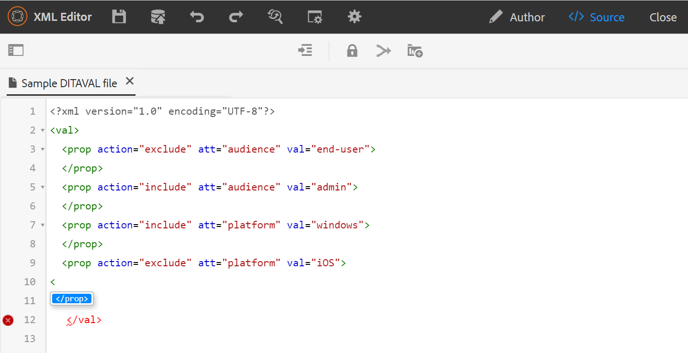

# editor DITAVAL {#ditaval-editor}

I file DITAVAL vengono utilizzati per generare output condizionale. In un singolo argomento, puoi aggiungere condizioni utilizzando gli attributi dell’elemento per condizionare il contenuto. Quindi, create un file DITAVAL in cui specificate le condizioni che devono essere selezionate per generare il contenuto e quali condizioni devono essere escluse dall&#39;output finale.

AEM Guides consente di creare e modificare facilmente i file DITAVAL mediante l&#39;editor DITAVAL. L&#39;editor DITAVAL recupera gli attributi \(o tag\) definiti nel sistema ed è possibile utilizzarli per creare o modificare file DITAVAL. Per ulteriori dettagli sulla creazione e la gestione dei tag in AEM, consulta la sezione [Amministrazione dei tag](https://experienceleague.adobe.com/docs/experience-manager-cloud-service/sites/authoring/features/tags.html?lang=en) nella documentazione di AEM.

## Crea file DITAVAL

Per creare un file DITAVAL, effettuate le seguenti operazioni:

1. Nell’interfaccia utente di Assets, individua il percorso in cui desideri creare il file DITAVAL.

1. Fare clic su **Crea** \> **Argomento DITA**.

1. Nella pagina Blueprint, seleziona il modello di file DITAVAL e fai clic su **Avanti**.

1. Nella pagina Proprietà, specifica **Titolo** e **Nome** per il file DITAVAL.

   >[!NOTE]
   >
   > Il nome viene suggerito automaticamente in base al Titolo del file. Se si desidera specificare manualmente il nome del file, assicurarsi che il nome non contenga spazi, apostrofi o parentesi graffe e che termini con .ditaval.

1. Fai clic su **Crea**. Viene visualizzato il messaggio Topic Created (Creazione argomento).

   Potete scegliere di aprire il file DITAVAL per la modifica nell&#39;editor DITAVAL o salvare il file dell&#39;argomento nel repository AEM.

## Modifica file DITAVAL

Per modificare un file DITAVAL, effettuare le seguenti operazioni:

1. Nell’interfaccia utente di Assets, individua il file DITAVAL da modificare.

1. Per ottenere un blocco esclusivo sul file, selezionare il file e fare clic su **Estrai**.

1. Selezionare il file e fare clic su **Modifica** per aprire il file nell&#39;editor DITAVAL di AEM Guides.

   L&#39;editor DITAVAL consente di eseguire le seguenti operazioni:

   A: Attiva/Disattiva pannello sinistro
Attiva/disattiva la visualizzazione del pannello sinistro. Se avete aperto il file DITAVAL tramite mappa DITA, la mappa e l&#39;archivio vengono visualizzati in questo pannello. Per ulteriori informazioni sull&#39;apertura di un file tramite mappa DITA, vedere [Modificare gli argomenti tramite mappa DITA](map-editor-advanced-map-editor.md#id17ACJ0F0FHS).

   B: Salva
Salva le modifiche apportate nel file. Tutte le modifiche vengono salvate nella versione corrente del file.

   C: Aggiungi proprietà
Aggiungi una singola proprietà nel file DITAVAL.

   

   Nel primo elenco a discesa sono elencati gli attributi DITA consentiti che è possibile utilizzare nel file DITAVAL. Sono supportati cinque attributi: `audience`, `platform`, `product`, `props` e `otherprops`.

   Il secondo elenco a discesa mostra i valori configurati per l’attributo selezionato. Nell&#39;elenco a discesa successivo vengono quindi visualizzate le azioni che è possibile configurare per l&#39;attributo selezionato. I valori consentiti nel menu a discesa delle azioni sono - `include`, `exclude`, `passthrough` e `flag`. Per ulteriori informazioni su questi valori, vedere la definizione dell&#39;elemento [prop](http://docs.oasis-open.org/dita/dita/v1.3/errata01/os/complete/part3-all-inclusive/langRef/ditaval/ditaval-prop.html#ditaval-prop) nella documentazione OASIS DITA

   D: Aggiungi tutte le proprietà
Se desiderate aggiungere tutte le proprietà condizionali o gli attributi definiti nel sistema con un solo clic, utilizzate la funzione Aggiungi tutte le proprietà.

   >[!NOTE]
   >
   > Se tutte le proprietà condizionali definite esistono già nel file DITAVAL, non è possibile aggiungere altre proprietà. Viene visualizzato un messaggio di errore in questo scenario.

   

1. Dopo aver modificato il file DITAVAL, fai clic su **Salva**.

   >[!NOTE]
   >
   > Se si chiude il file senza salvare, le modifiche andranno perse. Se non desideri confermare le modifiche nell&#39;archivio di AEM, fai clic su **Chiudi**, quindi su **Chiudi senza salvare** nella finestra di dialogo **Modifiche non salvate**.

## Visualizzazioni dell’editor DITAVAL

L’editor DITAVAL di AEM Guides supporta la visualizzazione dei file DITAVAL in due diverse modalità o visualizzazioni:

**Autore**: si tratta di una visualizzazione tipica di What You See is What You Get (WYSISYG\) dell&#39;editor DITAVAL. Puoi aggiungere o rimuovere proprietà utilizzando la semplice interfaccia utente, che presenta le proprietà, i relativi valori e le azioni nell’elenco a discesa. Nella vista Autore sono disponibili le opzioni per inserire una singola proprietà e tutte le proprietà con un solo clic.

Per trovare la versione del file DITAVAL su cui si sta attualmente lavorando, posizionare il puntatore del mouse sul nome del file.

**Source**: nella visualizzazione Source viene visualizzato l&#39;XML sottostante che costituisce il file DITAVAL. Oltre a eseguire modifiche regolari del testo in questa visualizzazione, un autore può anche aggiungere o modificare proprietà utilizzando Smart Catalog.

Per richiamare lo Smart Catalog, posizionare il cursore alla fine di qualsiasi definizione di proprietà e immettere &quot;&lt;&quot;. Nell&#39;editor verrà visualizzato un elenco di tutti gli elementi XML validi che è possibile inserire in tale posizione.

