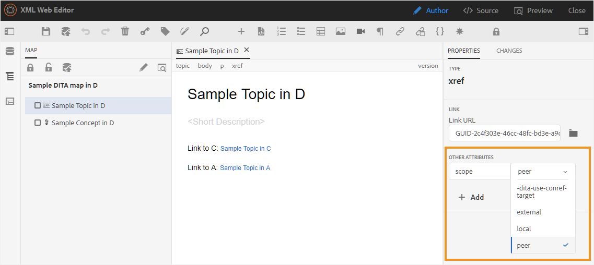

# Predefiniti di AEM Sites nel dashboard delle mappe {#id205BE3008SW}

Puoi creare predefiniti di AEM Sites dal dashboard delle mappe e configurarli per generare l’output di AEM Sites.

Per l’output di AEM Sites sono disponibili le seguenti opzioni:

| Opzioni AEM Sites | Descrizione |
| --- | --- |
| Tipo di output | Tipo di output che si desidera generare. Per generare l’output reattivo di AEM Sites, scegli l’opzione AEM Sites. |
| Nome impostazione | Assegna un nome descrittivo alle impostazioni di AEM Sites che stai creando. Ad esempio, puoi specificare *Output clienti interni* o *Output utenti finali*. |
| Nome sito | Nome del sito in cui l’output viene memorizzato nell’archivio AEM.  Viene creato un nodo nell&#39;archivio AEM con il nome specificato qui. Se non si specifica il nome del sito, il nodo del sito viene creato con il nome del file mappa DITA.  Il nome del sito specificato viene utilizzato anche come titolo nella scheda del browser.  È inoltre possibile utilizzare le variabili durante l&#39;impostazione del nome del sito. Per ulteriori dettagli sull&#39;utilizzo delle variabili, vedere [Utilizzare le variabili per impostare le opzioni Percorso di destinazione, Nome sito o Nome file](generate-output-use-variables.md#id18BUG70K05Z). |
| Design | Selezionare il modello struttura da utilizzare per generare l&#39;output.  Per informazioni dettagliate sull&#39;utilizzo di modelli di progettazione personalizzati per generare output, contattare l&#39;amministratore della pubblicazione. |
| Percorso di destinazione | Il percorso all’interno dell’archivio AEM in cui è memorizzato l’output. Durante la generazione dell’output finale, il Nome sito e il Percorso di destinazione vengono combinati. Ad esempio, se si specifica Nome sito come `user-guide` e Percorso di destinazione come `/content/output/aem-guides`, l&#39;output finale viene generato sotto il nodo `/content/output/aem-guides/user-guide`.  È inoltre possibile utilizzare le variabili durante l&#39;impostazione del percorso di destinazione. Per ulteriori dettagli sull&#39;utilizzo delle variabili, vedere [Utilizzare le variabili per impostare le opzioni Percorso di destinazione, Nome sito o Nome file](generate-output-use-variables.md#id18BUG70K05Z). |
| Applica condizioni tramite | Selezionare una delle opzioni seguenti:  **Nessuna applicazione**: selezionare questa opzione se non si desidera applicare alcuna condizione all&#39;output pubblicato. **File DITAVal**: selezionare i file DITAVal per generare contenuto condizionale. È possibile selezionare più file DITAVal utilizzando la finestra di dialogo Sfoglia o digitando il percorso del file. Utilizza l’icona a forma di croce accanto al nome del file per rimuoverlo. I file DITAVal vengono valutati nell&#39;ordine specificato, pertanto le condizioni specificate nel primo file hanno la precedenza rispetto a quelle specificate nei file successivi. È possibile mantenere l&#39;ordine dei file aggiungendo o eliminando file. Se il file DITAVal viene spostato in un&#39;altra posizione o eliminato, non viene eliminato automaticamente dal dashboard delle mappe. È necessario aggiornare il percorso nel caso in cui i file vengano spostati o eliminati. Passa il cursore del mouse sul nome del file per visualizzare il percorso nell’archivio di AEM in cui è memorizzato il file. È possibile selezionare solo i file DITAVal e viene visualizzato un errore se si seleziona un altro tipo di file. **Predefinito condizione**: seleziona un predefinito condizione dall&#39;elenco a discesa per applicare una condizione durante la pubblicazione dell&#39;output. Questa opzione è visibile se è stata aggiunta una condizione per il file di mapping DITA. Le impostazioni condizionali sono disponibili nella scheda Predefiniti condizione della console delle mappe DITA. Per ulteriori informazioni sul predefinito di condizione, vedere [Utilizzare i predefiniti di condizione](generate-output-use-condition-presets.md#id1825FL004PN). |
| Pagine di output esistenti | Selezionare l&#39;opzione **Sovrascrivi contenuto** per sovrascrivere il contenuto nelle pagine esistenti. Questa opzione sovrascrive solo il contenuto presente nei nodi content e head della pagina. Questa opzione consente la pubblicazione mista dei contenuti. Selezionando questa opzione è possibile selezionare l&#39;eliminazione di pagine orfane dall&#39;output pubblicato. Opzione *default* per la creazione dell&#39;output di AEM Sites.  Selezionare l&#39;opzione **Elimina e crea** per forzare l&#39;eliminazione delle pagine esistenti durante la pubblicazione. Questa opzione elimina il nodo della pagina insieme al relativo contenuto e a tutte le pagine figlie al suo interno. Utilizza questa opzione se hai modificato il modello di progettazione del predefinito di output o se desideri rimuovere eventuali pagine aggiuntive già presenti nella destinazione. |
| Elimina pagine del sito orfano | Se si seleziona **Sovrascrivi contenuto** nell&#39;impostazione **Pagine di output esistenti**, viene visualizzata questa opzione. Se selezioni questa opzione, tutte le pagine orfane vengono eliminate dal sito AEM pubblicato. Per eseguire correttamente questa funzione, è necessario pubblicare l&#39;intera mappa DITA e non utilizzare la pubblicazione incrementale.  Si supponga di aver pubblicato una mappa DITA contenente gli argomenti a.dita, b.dita e c.dita. Prima di pubblicare di nuovo la mappa, hai rimosso l’argomento b.dita dalla mappa. Ora, se hai selezionato questa opzione, tutto il contenuto relativo a b.dita viene rimosso dall’output di AEM Sites e vengono pubblicati solo a.dita e c.dita.  Questa caratteristica non rimuove alcuna mappa figlio pubblicata. Ad esempio, se la mappa padre contiene una mappa figlio e si rimuove l&#39;intera mappa figlio, il contenuto della mappa figlio non viene eliminato dall&#39;output pubblicato. Tuttavia, se rimuovi un argomento da una mappa figlio e lo ripubblichi, il contenuto dell&#39;argomento rimosso viene eliminato dall&#39;output del sito.  Inoltre, se è presente contenuto di riferimento che viene rimosso prima della ripubblicazione, i dati del contenuto di riferimento non vengono rimossi.  **Nota**: le informazioni sulle pagine orfane eliminate vengono acquisite anche nei registri di generazione dell&#39;output. Per ulteriori informazioni sull&#39;accesso ai file di log, vedere [Visualizzare e controllare il file di log](generate-output-basic-troubleshooting.md#id1821I0Y0G0A__id1822G0P0CHS). |
| Mantieni file temporanei | Selezionare questa opzione per mantenere i file temporanei generati da DITA-OT. Se si verificano errori durante la generazione dell&#39;output tramite DITA-OT, selezionare questa opzione per mantenere i file temporanei. È quindi possibile utilizzare tali file per risolvere eventuali errori di generazione dell&#39;output.    Dopo aver generato l&#39;output, selezionare l&#39;icona **Scarica file temporanei**  per scaricare la cartella ZIP contenente i file temporanei.    **Nota**: se le proprietà del file vengono aggiunte durante la generazione, i file temporanei di output includono anche un file *metadata.xml* contenente tali proprietà. |
| Genera un PDF separato per ogni argomento | Se questa opzione è selezionata, viene creato anche un PDF per ogni argomento della mappa DITA. Quando si sceglie questa opzione, viene visualizzata una nuova opzione Dividi percorso PDF.  Nel campo Dividi percorso PDF specificare il percorso in cui memorizzare i PDF generati per ciascun argomento.  **Nota**: AEM Guides utilizza il plug-in DITA-OT denominato pdfx per generare PDF per ogni argomento. Questo plug-in è fornito in dotazione con il pacchetto DITA-OT fornito con il prodotto. Puoi personalizzare questo plug-in per generare PDF in base alle tue esigenze. Se si utilizza un plug-in DITA-OT personalizzato, assicurarsi di integrare il plug-in pdfx per disporre della funzionalità di generazione PDF a livello di argomento. |
| Esegui flusso di lavoro di post-generazione | Quando scegli questa opzione, viene visualizzato un nuovo elenco a discesa Flusso di lavoro di post-generazione contenente tutti i flussi di lavoro configurati in AEM. È necessario selezionare un flusso di lavoro da eseguire dopo il completamento del flusso di lavoro di generazione dell&#39;output. |
| Usa linea di base | Se è stata creata una baseline per la mappa DITA selezionata, selezionare questa opzione per specificare la versione da pubblicare.  **Importante**: quando si genera l&#39;output incrementale per il sito AEM, l&#39;output viene creato utilizzando la versione corrente dei file e non la baseline allegata.  Per ulteriori dettagli, vedere [Utilizzare la previsione](generate-output-use-baseline-for-publishing.md#id1825FI0J0PF). |
| Proprietà | Seleziona le proprietà da elaborare come metadati. Queste proprietà vengono impostate dalla pagina Proprietà del file mappa DITA o del file mappa segnalibro. Le proprietà selezionate dall&#39;elenco a discesa vengono visualizzate nel campo **Proprietà file**. Seleziona l’icona a forma di croce accanto alla proprietà per rimuoverla.   **Nota**: le proprietà dei metadati fanno distinzione tra maiuscole e minuscole.  *Se è stata selezionata una baseline, i valori delle proprietà si basano sulla versione della baseline selezionata. * Se non è stata selezionata una baseline, i valori delle proprietà si basano sulla versione più recente.  È inoltre possibile trasferire i metadati all&#39;output utilizzando la pubblicazione DITA-OT. Per ulteriori dettagli, vedere [Trasmettere i metadati all&#39;output utilizzando DITA-OT](pass-metadata-dita-ot.md#id21BJ00QD0XA).  **Nota**: se non hai definito `cq:tags` nell&#39;opzione Proprietà, i valori per `cq:tags` vengono scelti dalla copia di lavoro corrente anche se hai selezionato una previsione per la pubblicazione. |
| Usa proprietà mappa come impostazione predefinita | Se questa opzione è selezionata, le proprietà definite per il file mappa vengono copiate anche negli argomenti in cui tali proprietà non sono definite. Considera i punti seguenti durante l&#39;utilizzo di questa opzione:  *È possibile passare alle pagine di AEM Sites solo le proprietà String, Date o Long (singole e multivalore). * I valori dei metadati per una proprietà di tipo String non supportano caratteri speciali (ad esempio `@, #, " "`). * Questa opzione deve essere utilizzata insieme all&#39;opzione `Properties`. |

## Nota aggiuntiva su AEM Sites

### Genera output basato su articoli dall’editor web

È possibile generare l&#39;output di AEM Sites per uno o più argomenti o per l&#39;intera mappa DITA dall&#39;Editor Web. È necessario creare predefiniti di output per la mappa DITA e quindi generare facilmente l&#39;output AEM Sites per la mappa. Se hai aggiornato alcuni argomenti nella mappa, puoi anche generare l’output di AEM Sites solo per tali argomenti dall’editor web. Per ulteriori dettagli, vedere [Pubblicazione basata su articolo dall&#39;editor Web](web-editor-article-publishing.md#id218CK0U019I).

### Genera output di argomenti di collegamento da altre mappe

È uno scenario molto comune disporre di un set elevato di documenti distribuiti in più cartelle e mappe DITA. Diventa estremamente complesso pubblicare contenuti collegati da varie posizioni. Per impostazione predefinita, tutti i collegamenti `<xref>` sono creati con `local` `@scope`. La pubblicazione di tali argomenti non comporta alcuna sfida, in quanto utilizza un collegamento diretto all’argomento. Se l&#39;argomento non è incluso nella mappa DITA corrente, il collegamento non visualizza il contenuto collegato.

Un altro modo per collegare il contenuto consiste nel creare un collegamento utilizzando `peer` `@scope`. Per tali contenuti, il collegamento viene risolto in fase di esecuzione scegliendo il titolo del file e il contesto configurato per l&#39;argomento collegato dal contesto di pubblicazione della mappa DITA. La schermata seguente mostra il pannello Proprietà per un collegamento con `peer` `@scope`:

{width="800" align="left"}

Per semplificare la pubblicazione di mappe complesse e argomenti collegati ad altri argomenti in altre mappe, AEM Guides consente di impostare il contesto di pubblicazione per ciascun predefinito di output.

Il contesto di pubblicazione consente di specificare l’argomento da utilizzare per la mappatura per la pubblicazione di un output specifico. Comprendiamo questo con l&#39;aiuto di un esempio — supponiamo che tu abbia quattro cartelle: campione a, campione b, campione c e campione d. Ogni cartella contiene una mappa DITA, ovvero mappa DITA A, mappa DITA B, mappa DITA C e mappa DITA D. Il collegamento tra mappe si verifica quando un argomento nella mappa DITA A si collega a un argomento nella mappa DITA B, C o D. Nella schermata seguente, un argomento di esempio contiene i collegamenti \(o riferimenti\) ai file che fanno parte di altre mappe DITA.

{width="350" align="left"}

Ora, quando configuri le impostazioni di pubblicazione di AEM Sites per il file mappa che contiene questo argomento, puoi selezionare quale contesto di pubblicazione per il contenuto collegato viene utilizzato durante la pubblicazione. Un contesto di pubblicazione è una combinazione di mappa DITA e relativo predefinito di output. Il predefinito di output, a sua volta, contiene una versione specifica del contenuto e dei predefiniti condizionali. L&#39;intera combinazione della mappa DITA, del predefinito di output, della versione di \(files\) e delle condizioni definisce il contesto di pubblicazione di una mappa collegata.

Per specificare il contesto di pubblicazione per i file con collegamento incrociato, effettua le seguenti operazioni:

1. Aprire la scheda **Predefiniti di output** della mappa DITA che si desidera pubblicare.

1. Selezionare il predefinito di output **Sito AEM**.

   Vengono visualizzate le schede Impostazioni predefiniti di AEM e Contesto di pubblicazione.

   {width="800" align="left"}

1. Apri la scheda **Contesto di pubblicazione**.

   Viene visualizzato un elenco di argomenti dipendenti. Questi sono gli argomenti collegati da alcuni argomenti della mappa corrente, ma sono disponibili in altre mappe DITA.

   >[!NOTE]
   >
   > La scheda Contesto di pubblicazione mostra gli argomenti collegati solo con `peer` `@scope`. Per i collegamenti con `local` `@scope`, non è necessario specificare il contesto di pubblicazione.

   Per impostazione predefinita, per tutti gli argomenti collegati sono selezionati il predefinito di output e la mappa più recente.

   {width="800" align="left"}

1. Per modificare la selezione predefinita della mappa e del predefinito DITA, fare clic su **Modifica** \(nella barra degli strumenti principale\).

1. Se si desidera utilizzare l&#39;output pubblicato più di recente di ciascun file dipendente nella mappa, selezionare **Usa il contesto di pubblicazione generato più di recente per tutti gli argomenti dipendenti**.

1. Nell&#39;elenco a discesa **Mappa padre** selezionare il file di mappa con il cui output si desidera collegare l&#39;output della mappa corrente.

   Quando selezioni un file di mappa, l’UUID della mappa viene visualizzato nella colonna UUID mappa principale. I predefiniti di output associati alla mappa selezionata sono elencati nell&#39;elenco Predefiniti mappa padre.

1. Nell&#39;elenco a discesa Predefinito **della mappa padre** selezionare il predefinito di output con cui si desidera collegare l&#39;output della mappa corrente.

1. Selezionare la mappa richiesta e il relativo predefinito di output per tutti gli argomenti dipendenti, quindi fare clic su **Fine**.

   È ora impostato il contesto per gli argomenti dipendenti. Potete generare l&#39;output per la mappa corrente. Per ulteriori informazioni sulla generazione dell&#39;output, vedere [Generare l&#39;output per una mappa DITA dalla console delle mappe](generate-output-for-a-dita-map.md#).

### Pubblicazione mista

AEM Guides supporta la pubblicazione di contenuti DITA all’interno del sito AEM esistente. Se ad esempio si dispone di un sito esistente, è possibile utilizzare l&#39;output di AEM Sites per pubblicare solo il contenuto DITA del sito. In questo processo, il contenuto non DITA esistente non viene modificato dal processo di pubblicazione. Per ulteriori informazioni sulla configurazione del sito per la pubblicazione di solo contenuti DITA, contattare l&#39;amministratore della pubblicazione.

### Pubblicazione `conref`

Se utilizzi `conref` nel contenuto, questo verrà pubblicato come contenuto normale o incorporato insieme al contenuto nell&#39;argomento sorgente \(o riferimento\). Viene eseguito il rendering del contenuto `conref` insieme al contenuto principale e non viene creata alcuna pagina del sito separata per lo stesso. Quando si cerca il contenuto a cui si fa riferimento in `conref`, nei risultati della ricerca verrà visualizzato solo l&#39;argomento principale o la pagina contenente il contenuto di `conref`.

>[!NOTE]
>
>Se hai generato pagine separate per il contenuto di `conref` utilizzando AEM Guides versione 3.5 o precedenti, si consiglia di pulire/eliminare tali pagine utilizzando l&#39;opzione [Elimina pagine del sito orfano](#delete-orphan-page-aem-site).

### Cercare una stringa all’interno del contenuto

Puoi cercare una stringa nell’output di AEM Sites. Per impostazione predefinita, è possibile cercare la stringa solo nei titoli. Per cercare la stringa nel contenuto o nel corpo dell’output di AEM Sites, contatta l’amministratore di sistema per abilitare la proprietà flattening.enabled.

{width="650" align="left"}

Per ulteriori dettagli vedi la sezione *Configurare l&#39;appiattimento della struttura dei nodi del sito AEM* nella guida Installare e configurare Adobe Experience Manager Guides.

**Argomento padre:**[ Informazioni sui predefiniti di output](generate-output-understand-presets.md)
