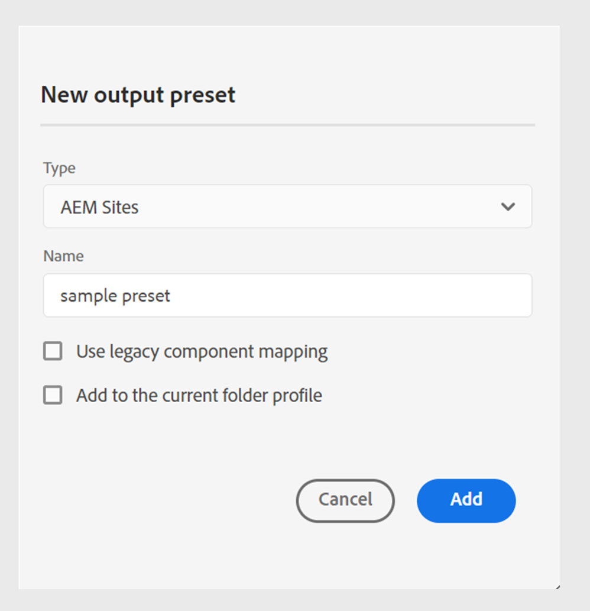

# Predefiniti di AEM Sites nell’editor web

Puoi creare predefiniti di AEM Sites dall’editor web e configurarli per generare l’output di AEM Sites. L&#39;output di AEM Sites si basa sulla mappatura dei componenti compositi insieme a `guides-components`, facilitando la creazione e la gestione efficienti dei contenuti.

Experience Manager Guides fornisce modelli predefiniti per la creazione di AEM Sites. Questi predefiniti consentono di garantire la coerenza nel layout e nella struttura del contenuto.
- [Crea le home page](/help/product-guide/cs-install-guide/download-install-aem-sites-templates-cs.md#create-a-home-page-using-the-template) in base a questi modelli predefiniti.
- Puoi [modificare i modelli di argomento](/help/product-guide/cs-install-guide/download-install-aem-sites-templates-cs.md#package-installation) e applicare gli stili in base alle tue esigenze.
- Puoi anche [personalizzare i modelli AEM Sites esistenti](/help/product-guide/cs-install-guide/download-install-aem-sites-templates-cs.md#customize-existing-aem-sites-templates).

## Creare predefiniti di AEM Sites

Per creare i predefiniti di AEM Sites dall’editor web, effettua le seguenti operazioni:

1. Nel pannello Repository, aprire il file mappa DITA in Vista mappa.
1. Nella scheda **Output**, seleziona l&#39;icona + per creare un predefinito di output.
1. Selezionare **AEM Sites** dal menu a discesa **Tipo** nella finestra di dialogo **Nuovo predefinito di output**.
1. Deseleziona l&#39;opzione **Usa mapping di componenti legacy** nella finestra di dialogo **Nuovo predefinito di output**.

>[!NOTE]
>
>Prima di configurare i predefiniti di AEM Sites per Experience Manager Guides, l’amministratore deve creare una struttura AEM Sites utilizzando i modelli.
>- **Software on-premise**: ulteriori informazioni su come [scaricare e installare modelli AEM Sites](/help/product-guide/install-guide/download-install-aem-sites-templates.md) per software on-premise.
>- **Cloud Service**: ulteriori informazioni su come [scaricare e installare modelli AEM Sites](/help/product-guide/cs-install-guide/download-install-aem-sites-templates-cs.md) per Cloud Service.

### Aggiungi predefiniti al profilo cartella corrente

In qualità di amministratore, Experience Manager Guides ti consente di creare e gestire i predefiniti di output per i profili globali e delle cartelle. Selezionare l&#39;opzione **Aggiungi al profilo cartella corrente** nella finestra di dialogo **Nuovo predefinito di output** per creare un predefinito di output per il profilo cartella corrente. L&#39;icona  indica un predefinito a livello di profilo della cartella.  Ulteriori informazioni su [Gestire i predefiniti di output globali e del profilo cartella](./web-editor-manage-output-presets.md).

### Predefiniti di AEM Sites basati sulla mappatura di componenti legacy

Puoi anche creare i predefiniti di AEM Sites utilizzando la mappatura dei componenti legacy. Per creare i predefiniti di AEM Sites in base alla mappatura dei componenti legacy, seleziona **Utilizza mappatura componenti legacy** nella finestra di dialogo **Nuovo predefinito di output**.

Alcune opzioni possono differire per i predefiniti che utilizzano la mappatura di componenti legacy.

## Configurare i predefiniti di AEM Sites

Le configurazioni sono organizzate nelle schede **Generale**, **Contenuto**, **Elenco argomenti** e **Riferimenti a mappe incrociate**.

**Generale**

La scheda **Generale** contiene le seguenti configurazioni relative alla generazione di output:

- Usa percorso del sito
- Percorso sito
- Sito
- Percorso di pubblicazione
- Modello pagina argomento
- Genera nomi di pagina in base a
   - Nome file argomento
   - Titolo argomento
- Pulizia delle pagine generate in precedenza
   - Elimina le pagine generate in precedenza per gli argomenti rimossi dalla mappa
   - Elimina tutte le pagine create da altre origini nel percorso seguente:
- Flusso di lavoro di post generazione

**Contenuto**

La scheda **Contenuto** contiene le seguenti configurazioni:

- Usa linea di base
- Filtro condizione
- Argomenti aggiuntivi della riga di comando DITA-OT
- Metadati
   - Proprietà file (Assets)
   - Utilizzare le proprietà della mappa come fallback

Per ulteriori informazioni, vedere [Configurazione AEM Sites](#aem_sites_config).

**Elenco argomenti**

In **Elenco argomenti** viene visualizzato l&#39;elenco degli argomenti presenti nella copia di lavoro corrente della mappa DITA. Per impostazione predefinita, sono inclusi tutti gli argomenti. Puoi selezionare argomenti specifici e generare l’output di AEM Sites solo per essi. Ad esempio, sono stati aggiornati alcuni argomenti in modo da poter pubblicare solo tali argomenti anziché l&#39;intera mappa DITA.

La scheda **Elenco argomenti** è presente nei predefiniti di AEM che non sono stati creati in base alla mappatura legacy.

**Riferimenti cross-map**
Questo elenco contiene argomenti contenenti riferimenti a mappe incrociate con `scope ="peer"`. È possibile specificare il contesto di pubblicazione per un elenco di riferimenti a mappe incrociate con `scope="peer"` ad argomenti disponibili in altre mappe DITA. Questa scheda viene visualizzata se si utilizza la versione di Experience Manager Guides (UUID).

Ulteriori informazioni su come [pubblicare argomenti collegati](#publish-linked-topics).

## Configurazione AEM Sites {#aem_sites_config}

Per l’output di AEM Sites sono disponibili le seguenti opzioni:

| Opzioni AEM Sites | Descrizione |
| --- | --- |
| Usa percorso del sito | Utilizza questa opzione per pubblicare i contenuti in un sito Experience Manager. Seleziona questa opzione se conosci il percorso esatto del sito in cui desideri pubblicare l’output. Inoltre, indica il percorso completo nel campo Percorso sito. |
| Percorso sito | Questa opzione viene visualizzata se si seleziona **Usa percorso sito**. Sfoglia il percorso esatto del sito Experience Manager in cui desideri pubblicare l’output. |
| Sito | Nome del Experience Manager Sites in cui desideri pubblicare il contenuto. Le opzioni nel menu a discesa vengono compilate in base all’elenco dei siti disponibili in AEM Sites.  Seleziona **Aggiorna**  per recuperare un nuovo elenco di opzioni e riflettere i dati aggiornati. |
| Percorso di pubblicazione | Il percorso all’interno dell’archivio AEM in cui è memorizzato l’output. Il Percorso di pubblicazione viene compilato con tutti i percorsi che contengono pagine create in base al modello della home page. L&#39;output AEM Sites della mappa DITA viene generato in questo percorso.  Se ad esempio si specifica il sito come `AEMG-Docs` e il percorso di pubblicazione come `aemg-docs-en/docs/product-abc.`, l&#39;output di AEM Sites verrà generato nel nodo `aemg-docs-en/docs/product-abc/` in `crx/de`. |
| Modello pagina argomento | Componenti strutturali che consentono di organizzare i contenuti in modo coerente in più documenti. Questi modelli sono predefiniti nel modello Sito Adobe Experience Manager. Le opzioni vengono compilate con tutti i modelli di pagina dell&#39;argomento disponibili per il sito selezionato. Selezionare il modello da applicare a tutti gli argomenti di output. |
| Genera nomi di pagina in base a | **Nome file argomento**: utilizza il nome file dell&#39;argomento DITA per creare l&#39;URL del sito.   **Titolo argomento**: utilizza il titolo dell&#39;argomento DITA per creare i nomi dei siti Experience Manager. |
| Pulizia delle pagine generate in precedenza | - **Elimina le pagine generate in precedenza per l&#39;argomento rimosse dalla mappa**: se la struttura della mappa DTIA cambia, è possibile utilizzare questa opzione per rimuovere le pagine generate in precedenza per gli argomenti rimossi. Questa funzione è disponibile solo per la pubblicazione di mappe complete.  Si supponga di aver pubblicato una mappa DITA contenente gli argomenti a.dita, b.dita e c.dita. Prima di pubblicare di nuovo la mappa, hai rimosso l’argomento b.dita dalla mappa. Ora, se hai selezionato questa opzione, tutto il contenuto relativo a b.dita viene rimosso dall’output di AEM Sites e vengono pubblicati solo a.dita e c.dita.  **Nota**: le informazioni sulle pagine eliminate vengono acquisite anche nei registri di generazione dell&#39;output. Per ulteriori informazioni sull&#39;accesso ai file di log, [Visualizzare e controllare il file di log](generate-output-basic-troubleshooting.md#id1821I0Y0G0A__id1822G0P0CHS).   **Attenzione**: quando si eliminano gli argomenti, le pagine non sono più disponibili nel sito pubblicato. Pertanto, prima di eliminare gli argomenti, viene visualizzato un avviso. Conferma l&#39;eliminazione.  - **Elimina tutte le pagine create da altre origini nel percorso**: se si seleziona questa opzione, verranno eliminate tutte le pagine pubblicate nel percorso da altre mappe, singoli argomenti o qualsiasi altra origine. Le pagine non sono più disponibili dal sito pubblicato. Pertanto, prima di eliminare gli argomenti, viene visualizzato un avviso. Conferma l&#39;eliminazione. |
| Flusso di lavoro di post-generazione | Quando scegli questa opzione, viene visualizzato un nuovo elenco a discesa Flusso di lavoro di post-generazione contenente tutti i flussi di lavoro configurati in AEM. È necessario selezionare un flusso di lavoro da eseguire dopo il completamento del flusso di lavoro di generazione dell&#39;output. |
| Usa linea di base | Se è stata creata una baseline per la mappa DITA selezionata, selezionare questa opzione per specificare la versione da pubblicare.  **Importante**: quando si genera l&#39;output incrementale per il sito AEM, l&#39;output viene creato utilizzando la versione corrente dei file e non la baseline allegata.  Visualizza [Utilizza la previsione](generate-output-use-baseline-for-publishing.md#id1825FI0J0PF) per ulteriori dettagli. |
| Filtro condizionale | Selezionare una delle opzioni seguenti:  **Nessuna**: selezionare questa opzione se non si desidera applicare alcuna condizione all&#39;output pubblicato. **Utilizzo di DITAVAL**: selezionare i file DITAVal per generare contenuto condizionale. È possibile selezionare più file DITAVal utilizzando la finestra di dialogo Sfoglia o digitando il percorso del file. Utilizza l’icona a forma di croce accanto al nome del file per rimuoverlo. I file DITAVal vengono valutati nell&#39;ordine specificato, pertanto le condizioni specificate nel primo file hanno la precedenza rispetto a quelle specificate nei file successivi. È possibile mantenere l&#39;ordine dei file aggiungendo o eliminando file. Se il file DITAVal viene spostato in un&#39;altra posizione o eliminato, non viene eliminato automaticamente dal dashboard delle mappe. È necessario aggiornare il percorso nel caso in cui i file vengano spostati o eliminati. Passa il cursore del mouse sul nome del file per visualizzare il percorso nell’archivio AEM in cui è memorizzato il file. È possibile selezionare solo i file DITAVal e viene visualizzato un errore se si seleziona un altro tipo di file. **Predefinito condizione**: seleziona un predefinito condizione dall&#39;elenco a discesa per applicare una condizione durante la pubblicazione dell&#39;output. Questa opzione è visibile se è stata aggiunta una condizione per il file di mapping DITA. Le impostazioni condizionali sono disponibili nella scheda Predefiniti condizione della console delle mappe DITA. Per ulteriori informazioni sul predefinito di condizione, visualizzare [Usa predefiniti di condizione](generate-output-use-condition-presets.md#id1825FL004PN). |
| Argomenti aggiuntivi della riga di comando DITA-OT | Specificare gli argomenti aggiuntivi che si desidera vengano elaborati da DITA-OT durante la generazione dell&#39;output. Per informazioni dettagliate sugli argomenti della riga di comando supportati in DITA-OT, visualizzare la [documentazione DITA-OT](https://www.dita-ot.org/). |
| Metadati    Proprietà file (Assets) | Seleziona le proprietà da elaborare come metadati. Queste proprietà vengono impostate dalla pagina Proprietà del file mappa DITA o del file mappa segnalibro. Le proprietà selezionate dall&#39;elenco a discesa vengono visualizzate nel campo **Proprietà file**. Seleziona l’icona a forma di croce accanto alla proprietà per rimuoverla.   **Nota**: le proprietà dei metadati fanno distinzione tra maiuscole e minuscole.  *Se è stata selezionata una baseline, i valori delle proprietà si basano sulla versione della baseline selezionata. * Se non è stata selezionata una baseline, i valori delle proprietà si basano sulla versione più recente.  È inoltre possibile trasferire i metadati all&#39;output utilizzando la pubblicazione DITA-OT. Per ulteriori dettagli, [Trasmettere i metadati all&#39;output utilizzando DITA-OT](pass-metadata-dita-ot.md#id21BJ00QD0XA).  **Nota**: se non hai definito `cq:tags` nell&#39;opzione Proprietà, i valori per `cq:tags` vengono scelti dalla copia di lavoro corrente anche se hai selezionato una previsione per la pubblicazione. |
| Metadati    Utilizza le proprietà mappa come fallback | Se questa opzione è selezionata, le proprietà definite per il file mappa vengono copiate anche negli argomenti in cui tali proprietà non sono definite. Durante l&#39;utilizzo di questa opzione, prendere in considerazione i seguenti punti:  *È possibile passare alle pagine del sito AEM solo le proprietà String, Date o Long (singole e multivalore). * I valori dei metadati per una proprietà di tipo String non supportano caratteri speciali (ad esempio `@, #, " "`). * Questa opzione deve essere utilizzata insieme all&#39;opzione `Properties`. |
| Mantieni file temporanei | Selezionare questa opzione per mantenere i file temporanei generati da DITA-OT. Se si verificano errori durante la generazione dell&#39;output tramite DITA-OT, selezionare questa opzione per mantenere i file temporanei. È quindi possibile utilizzare tali file per risolvere eventuali errori di generazione dell&#39;output.    Dopo aver generato l&#39;output, selezionare l&#39;icona **Scarica file temporanei**  per scaricare la cartella ZIP contenente i file temporanei.    **Nota**: se le proprietà del file vengono aggiunte durante la generazione, i file temporanei di output includono anche un file *metadata.xml* contenente tali proprietà. |

### Generare l’output di AEM Sites utilizzando i modelli

Experience Manager Guides consente di utilizzare i modelli predefiniti o di aggiungere modelli AEM Sites personalizzati.

Prima di configurare i predefiniti di AEM Sites, accertati di creare una struttura AEM Sites utilizzando i modelli.\
Per ulteriori dettagli, visualizzare [Scaricare e installare i modelli di AEM Sites](/help/product-guide/install-guide/download-install-aem-sites-templates.md).

Per creare e configurare un predefinito AEM Sites, effettua le seguenti operazioni:
1. Aprire la scheda **Predefiniti di output** della mappa DITA che si desidera pubblicare.
1. Seleziona il predefinito di output **AEM Sites**.
1. (Facoltativo) Deseleziona l&#39;opzione **Usa mappatura componenti legacy** per creare un predefinito AEM Sites non legacy.
1. Fare clic su **Aggiungi**. Viene creato il predefinito per AEM Sites.
1. Puoi configurare il modello predefinito di Sites in due modi:
   1. Selezionare **Sito**, quindi scegliere il percorso di pubblicazione e i modelli di pagina dell&#39;argomento dalle opzioni popolate:
      1. Seleziona il sito.
      1. Seleziona **Sito**. Ad esempio, `AEMG Docs`.
      1. Le opzioni **Percorso pubblicazione** e **Modello pagina argomento** vengono impostate automaticamente nel menu a discesa. Puoi anche scegliere le opzioni. Ad esempio, `AEMG-Docs-Site/en/docs/product1` e `Topic page` sono impostati rispettivamente.
   1. Selezionare il percorso completo del sito:
      1. Selezionare l&#39;opzione **Usa percorso sito**.
      1. Selezionare il percorso completo del sito. Ad esempio, `/content/AEMG-Docs-Site/en/docs/product1`.
      1. Il &#39;Modello pagina argomento&#39; viene impostato automaticamente come `Topic Page`.

1. Salvate le modifiche apportate al predefinito.
1. Selezionare l&#39;opzione **Genera**.
1. Genera AEM Sites per la mappa corrispondente. Ad esempio, `/content/AEMG-Docs-Site/en/docs/product`.

   >[!NOTE]
   >
   > Se pubblichi il contenuto in un sito AEM per la prima volta, si consiglia di pubblicare le pagine a livello di sito. In questo modo l&#39;output verrà visualizzato correttamente nell&#39;istanza **Pubblica** senza alcuna interruzione CSS.

### Pubblica argomenti collegati

Experience Manager Guides semplifica la pubblicazione di documenti complessi consentendo la creazione di riferimenti ad argomenti utilizzando `peer @scope`. Puoi quindi definire il contesto di pubblicazione di questi riferimenti dai predefiniti di AEM Sites e infine generare l’output degli argomenti collegati.
Per ulteriori dettagli, visualizzare [Genera output di argomenti di collegamento da altre mappe](../user-guide/generate-output-aem-site.md#generate-output-linking-topics-from-other-maps).

Per specificare il contesto di pubblicazione per i file con collegamento incrociato, effettua le seguenti operazioni:
1. Aprire la scheda **Predefiniti di output** della mappa DITA che si desidera pubblicare.
1. Seleziona il predefinito di output **AEM Sites**.

   Puoi visualizzare le schede **Generale**, **Contenuto**, **Elenco argomenti** e **Riferimenti a più mappe**. **I riferimenti di mappe incrociate** vengono visualizzati se si utilizza la versione di Experience Manager Guides (UUID).

   Non potrai visualizzare il collegamento delle mappe incrociate nei seguenti casi:
   - Per i predefiniti creati prima della versione 4.6. La scheda Riferimenti incrociati (Cross references) è disattivata e viene visualizzata una descrizione comando, Fare riferimento al quadro comandi Mappa (Map).
   - Per i predefiniti creati dal dashboard delle mappe. Viene visualizzata la descrizione comando Mappa dashboard.
   - Per i predefiniti preconfigurati, viene visualizzata la descrizione comando Mappa dashboard.
   - Per i predefiniti globali, create una copia locale di questo predefinito globale per impostare i riferimenti delle mappe incrociate.
Se desiderate utilizzare i predefiniti di AEM Sites dall&#39;editor Web, create un nuovo predefinito o duplicate quello esistente.

1. Apri la scheda **Riferimenti cross map**.

   Viene visualizzato un elenco di argomenti e relativi riferimenti. È possibile specificare il contesto di pubblicazione per un elenco di riferimenti di mappe incrociate ad argomenti disponibili in altre mappe DITA con `scope="peer"`.

   Per utilizzare il pannello dei riferimenti delle mappe incrociate dall&#39;editor Web, `<xrefs>` deve avere ID univoci. Gli ID univoci per `<xrefs>` verranno generati automaticamente quando si modifica o si salva il contenuto precedente, se l&#39;ID non è presente.

   >[!NOTE]
   >
   >La scheda **Riferimenti a mappe incrociate** mostra gli argomenti collegati solo con `scope="peer"`. Per i collegamenti con `scope="local"`, non è necessario specificare il contesto di pubblicazione.

   Per impostazione predefinita, per tutti gli argomenti collegati vengono selezionati il predefinito di output e la mappa più recente. Per impostazione predefinita, il contesto di pubblicazione per tutti gli argomenti collegati è impostato su `<Most recently generated>` mappa.

   

1. Se si desidera utilizzare l&#39;output pubblicato più di recente di ciascun file dipendente nella mappa, selezionare **Usa contesto di pubblicazione generato più di recente** per tutti gli argomenti dipendenti.
È necessario pubblicare la mappa selezionata come mappa padre prima di pubblicare la mappa contenente gli argomenti collegati. Se la mappa con argomenti collegati non è pubblicata, i collegamenti verranno visualizzati come testo normale anziché come collegamenti ipertestuali nell’output di AEM Sites.
Seleziona lo stesso tipo di predefinito AEM Sites per l’argomento collegato. Ad esempio, se il predefinito AEM Sites corrente utilizza la mappatura di componenti legacy, seleziona un predefinito AEM Sites simile all’argomento collegato.
1. Nell&#39;elenco a discesa Mappa padre selezionare il file di mappa con il quale si desidera collegare l&#39;output della mappa corrente.
Quando si seleziona un file di mappa, nella colonna UUID mappa principale viene visualizzato l&#39;UUID della mappa. I predefiniti di output associati alla mappa selezionata sono elencati nell&#39;elenco Predefiniti mappa padre. Ad esempio, l&#39;argomento 1 nella Mappa A contiene un riferimento all&#39;argomento 2. L&#39;argomento 2 può essere presente in una o più mappe. Per ogni collegamento puoi selezionare la mappa principale e un predefinito specifico oppure l’output pubblicato più di recente.

1. Se in un file si fa riferimento allo stesso argomento più di una volta, è possibile aggiungere un contesto di pubblicazione diverso per ogni istanza. Questo offre maggiore flessibilità e controllo sui contenuti. Ad esempio, l&#39;argomento 3 è presente sia nella Mappa B che nella Mappa C. L&#39;argomento 1 contiene due riferimenti all&#39;argomento 3. Potete scegliere Mappa B come mappa padre per il primo collegamento e Mappa C come mappa padre per il secondo collegamento.

1. Nell&#39;elenco a discesa Predefinito mappa padre selezionare il predefinito di output con cui si desidera collegare l&#39;output della mappa corrente.
   >[!NOTE]
   >
   > I diversi predefiniti di AEM Sites della mappa corrente vengono visualizzati nell’elenco a discesa. Se non selezioni un predefinito, viene visualizzata un’icona di avviso e la generazione dell’output ha esito negativo.
1. Selezionare la mappa richiesta e il relativo predefinito di output per tutti gli argomenti di origine, quindi selezionare **Genera**.

**Argomento padre:** [Informazioni sui predefiniti di output](generate-output-understand-presets.md)
