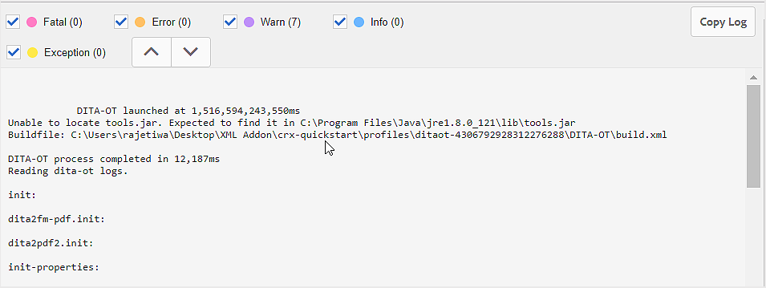

# Risoluzione dei problemi di base {#id1821I0Y0G0A}

Quando si lavora con AEM Guides, è possibile che si verifichino degli errori durante la pubblicazione o l’apertura del documento. Tali errori possono essere presenti nella mappa DITA, nell&#39;argomento o nel processo AEM Guides stesso. Questa sezione fornisce informazioni su come accedere e analizzare le informazioni nel file di registro di generazione dell&#39;output. Inoltre, se l&#39;argomento DITA è troppo grande, potrebbe essere visualizzato l&#39;errore di compilazione JSP. Questa sezione fornisce anche informazioni su come risolvere l’errore di compilazione JSP.

## Visualizza e controlla il file di registro {#id1822G0P0CHS}

Per visualizzare e controllare il file di registro di generazione dell’output, effettua le seguenti operazioni:

1. Dopo aver avviato il processo di generazione dell&#39;output, fare clic su **Output** nella console delle mappe DITA.

   La colonna **General** degli **Output generati** mostra le icone per dare un segnale visivo sull&#39;esito positivo o negativo della generazione dell&#39;output.

   {width="300" align="left"}

   Nella schermata precedente, la prima e la terza icona mostrano la generazione di output non riuscita. La seconda icona mostra una generazione di output corretta, ma con messaggi. L’ultima è una generazione di output di successo senza alcun messaggio.

1. Fai clic sul collegamento nella colonna **Generated At** al termine del processo.

   Il file di registro viene aperto in una nuova scheda.

   {width="800" align="left"}

1. Applica i seguenti filtri per evidenziare il testo nel file di registro:
   - Fatale: evidenzia gli errori irreversibili nel file di registro con colore rosa.
   - Errore: evidenzia gli errori nel file di registro con un colore arancione.
   - Avvertenza: evidenzia gli avvisi nel file di registro con colore viola.
   - Info: evidenzia i messaggi informativi nel file di registro con il colore blu.
   - Eccezione: evidenzia le eccezioni nel file di registro con un colore giallo.
1. Utilizzare i pulsanti di spostamento su e giù per passare al testo evidenziato nel file di log.

   In alternativa, scorri il file di registro e controlla i messaggi.

## Copiare e controllare il file di registro in un editor di testo

Per copiare e controllare il file di registro di generazione dell’output in un editor di testo, effettua le seguenti operazioni:

1. Dopo aver avviato il processo di generazione dell&#39;output, fare clic su **Output** nella console delle mappe DITA.

1. Fai clic sul collegamento nella colonna **Generated At** al termine del processo.

   Il file di registro viene aperto in una nuova scheda.

1. Fare clic sul pulsante **Copia registro**. Il file di registro viene copiato negli Appunti.
1. Apri un editor di testo e incolla il file di registro nell’editor.

1. Scorrere il file di registro e verificare la presenza di messaggi.

   Le seguenti informazioni consentono di determinare se si è verificato un errore nel file DITA o nel processo AEM Guides:

   - *Errore relativo al file di mappa DITA*: se viene rilevato un errore nel file di mappa DITA o in qualsiasi altro file contenuto nella mappa DITA, il file di registro conterrà una stringa &quot;BUILD FAILED&quot;. È possibile controllare le informazioni fornite nel file di registro per individuare il file errato e risolvere il problema.

   Nel seguente frammento del file di log di esempio è possibile visualizzare il messaggio `BUILD FAILED` insieme al motivo dell&#39;errore.

   {width="650" align="left"}

   - *Errore relativo ad AEM Guides*: l&#39;altro tipo di errore che è possibile identificare nel file di registro è relativo al processo AEM Guides stesso. In questo caso, il file mappa DITA viene analizzato correttamente, ma il processo di generazione dell&#39;output non riesce a causa di un errore interno in AEM Guides. Per questo tipo di errori è necessario rivolgersi al team di supporto tecnico.

   Nel seguente frammento del file di registro di esempio è possibile visualizzare il messaggio `BUILD SUCCESSFUL`, seguito da un altro errore tecnico.

   {width="650" align="left"}

## Risolvi errore di compilazione JSP

Se l&#39;argomento DITA è troppo grande, è possibile che nel browser venga visualizzato l&#39;errore di compilazione JSP \(`org.apache.sling.api.request.TooManyCallsException`\). Questo errore può essere visualizzato quando si apre un argomento per la modifica, la revisione o la pubblicazione.

Per risolvere il problema, effettua le seguenti operazioni:

1. Nella navigazione globale, selezionare Strumenti e scegliere Operazioni \> Console Web.

   Viene visualizzata la pagina Configurazione console Web Adobe Experience Manager.

1. Cerca e fai clic sul componente *Apache Sling Main Servlet*.

   Vengono visualizzate le opzioni configurabili per Apache Sling Main Servlet.

1. Aumenta il valore per il parametro *Numero di chiamate per richiesta* in base alle tue esigenze.

**Argomento padre:**[ Generazione output](generate-output.md)
