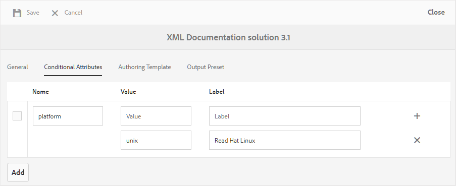
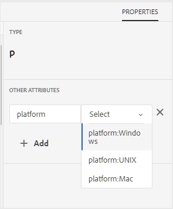

# Profilatura attributi condizionale {#id1843I0HN0Y4}

A livello aziendale, è estremamente importante assicurarsi di disporre di un sistema di assegnazione tag standard. I tag o gli attributi condizionali possono essere associati alle risorse digitali nell’archivio, il che consente di pubblicare l’output in base alle condizioni scelte. È ad esempio possibile creare un attributo condizionale per il contenuto di Mac e Windows. Quindi, aggiungi questi attributi al contenuto pertinente nei tuoi argomenti. Al momento della pubblicazione del contenuto, è possibile scegliere se si desidera pubblicare solo il contenuto di Windows o di Mac.

AEM Guides consente di creare e associare facilmente attributi condizionali utilizzando gli attributi DITA pertinenti. Puoi definire gli attributi condizionali a livello globale o a livello di cartella. Le condizioni definite a livello globale sono visibili in tutti i progetti e le condizioni specifiche della cartella sono visibili solo nei progetti creati all’interno della cartella specificata. Gli autori dei contenuti possono utilizzare questi attributi condizionali per condizionare il contenuto nei propri argomenti o mappe DITA che creano o utilizzano. Queste condizioni possono quindi essere utilizzate dall’editore per creare predefiniti condizionali. Utilizzando i predefiniti condizionali, l’editore può decidere quale condizione includere ed escludere dall’output pubblicato.

>[!NOTE]
>
> Puoi creare o modificare gli attributi condizionali in un Profilo cartella a cui hai accesso. Se l’amministratore di sistema non ti ha concesso l’accesso a un profilo di cartella, non puoi creare o modificare gli attributi condizionali nel Profilo cartella.

Per definire gli attributi condizionali, effettuare le seguenti operazioni:

1. Fai clic sul collegamento Adobe Experience Manager in alto e scegli **Strumenti**.

1. Selezionare **Guide** dall&#39;elenco degli strumenti.

1. Fare clic sul riquadro **Profili cartella** e selezionare un profilo cartella.

   >[!NOTE]
   >
   > Non è possibile modificare il profilo globale.

1. Fai clic sulla scheda **Attributi condizionali** e fai clic su **Modifica**.

   Viene visualizzata la tabella Attributi condizionali.

1. Fai clic su **Aggiungi**.

1. Immetti **Nome**, **Valore** e **Etichetta** per l&#39;attributo.

   Puoi salvare un profilo con solo il nome dell’attributo. Tuttavia, un attributo può essere utilizzato solo quando ha un valore specificato. Se si specificano sia - value che label per un attributo, nell&#39;editor Web verrà comunque visualizzato solo il valore dell&#39;attributo. L’etichetta viene mostrata all’amministratore di pubblicazione al momento della creazione del predefinito condizionale.

   La schermata seguente mostra la definizione per l&#39;attributo `platform` con valore di `unix` e etichetta di `Red Hat Linux`.

   {width="800"}

1. Se si desidera aggiungere altri valori per lo stesso attributo, fare clic sull&#39;icona **+** e immettere un valore e un&#39;etichetta aggiuntivi.

1. Per aggiungere altri attributi, fare clic su **Aggiungi**.

1. Fai clic su **Salva** per salvare le modifiche.

L&#39;attributo `platform` è archiviato nel sistema. Ogni volta che un autore decide di utilizzare l&#39;attributo `platform` in un argomento DITA in una cartella, i valori verranno visualizzati nella scheda Proprietà dell&#39;Editor Web.

{width="350"}

**Argomento padre:**&#x200B;[&#x200B; Generazione output](generate-output.md)
