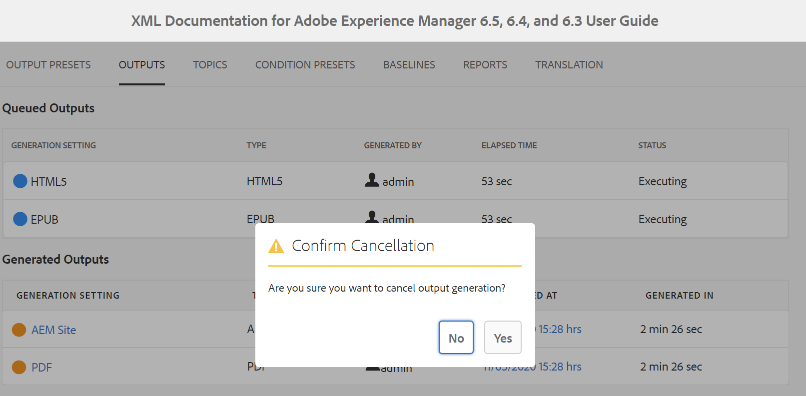

# Genera output per una mappa DITA dalla console delle mappe {#id1825FG00UHT}

Per generare l&#39;output per una mappa DITA, effettuare le seguenti operazioni:

1. Nell’interfaccia utente di Assets, accedi al file di mappa DITA che desideri pubblicare e fai clic su di esso.

   Viene visualizzata la console Mappa DITA con l&#39;elenco dei predefiniti di output disponibili per generare l&#39;output.

1. Selezionate uno o più predefiniti di output da utilizzare per generare l&#39;output.

   {width="800" align="left"}

   >[!NOTE]
   >
   > Se si sta generando l&#39;output del sito AEM, il processo di pubblicazione utilizza la struttura definita nel file `.ditamap` per creare la struttura del sito AEM.

1. Fai clic sull’icona Genera per avviare il processo di generazione dell’output.

Puoi visualizzare lo stato corrente della richiesta di generazione dell’output facendo clic su Output. Per ulteriori informazioni, vedere [Visualizzare lo stato dell&#39;attività di generazione output](#viewing_output_history)

>[!IMPORTANT]
>
> Se un processo di generazione dell&#39;output per un predefinito è in coda o in corso, non è possibile avviare un&#39;altra operazione di generazione dell&#39;output per lo stesso predefinito.

È possibile generare l&#39;output di PDF per uno o più predefiniti di output creati per una mappa DITA dall&#39;Editor Web. Per ulteriori dettagli, vedere [Utilizzare il pannello Generazione rapida per generare e visualizzare l&#39;output per i predefiniti](web-editor-quick-generate-panel.md#).

È inoltre possibile generare l&#39;output del sito AEM per uno o più argomenti o per l&#39;intera mappa DITA dall&#39;Editor Web. Per ulteriori dettagli, vedere [Pubblicazione basata su articolo dall&#39;editor Web](web-editor-article-publishing.md#id218CK0U019I).

## Generazione output incrementale {#generating_standalone_topic}

>[!NOTE]
>
> La generazione dell’output incrementale è applicabile solo all’output del sito AEM. Inoltre, è possibile rigenerare solo gli argomenti DITA \(.dita/.xml\) da una mappa DITA o da mappe secondarie. Se si seleziona una mappa DITA, una mappa secondaria, un gruppo di argomenti o un argomento con `@processing-role="resource-only"`, l&#39;opzione di rigenerazione non è disponibile.

In alcuni casi è possibile aggiornare solo alcuni argomenti della mappa DITA e inviare in diretta solo gli argomenti aggiornati. Per gestire tali scenari, AEM Guides consente di creare output incrementali. Se sono stati aggiornati alcuni argomenti, non è necessario rigenerare l&#39;intera mappa DITA. È possibile selezionare solo gli argomenti aggiornati e rigenerarli.

Se la mappa è bloccata e hai aggiornato un singolo argomento nella mappa, devi rigenerare l’intera mappa affinché l’argomento o il contenuto aggiornato si rifletta nell’output. L’opzione di rigenerazione dell’output non viene visualizzata a livello di argomento, ma è disponibile solo a livello di mappa \(chunked\). Questo è applicabile alla mappa principale e a tutte le mappe secondarie.

Per rigenerare l&#39;output per un argomento specifico o un gruppo di argomenti, effettuare le operazioni riportate di seguito.

>[!IMPORTANT]
>
> Durante la rigenerazione dell&#39;output del sito AEM, l&#39;output viene creato utilizzando la versione corrente dei file e non la baseline allegata.

1. Nell’interfaccia utente di Assets, accedi al file di mappa DITA e fai clic su di esso.

   Viene visualizzata la console Mappa DITA con l&#39;elenco dei predefiniti di output disponibili per generare l&#39;output.

1. Selezionare la scheda **Argomenti**.

   Viene visualizzato un elenco di argomenti disponibili nella mappa DITA.

1. Selezionate gli argomenti da rigenerare.

   >[!NOTE]
   >
   > Se sono stati aggiunti nuovi argomenti alla mappa DITA, non sarà possibile generarli da qui. È innanzitutto necessario pubblicare gli argomenti appena aggiunti utilizzando la funzione di pubblicazione mappa DITA.

   {width="800" align="left"}

1. Fare clic su **Rigenera**.

   Viene visualizzata la pagina Rigenera argomenti selezionati.

1. Selezionate il predefinito di output da utilizzare per rigenerare gli argomenti selezionati.

1. Fare clic su **Rigenera** per avviare il processo di generazione dell&#39;output.

>[!IMPORTANT]
>
> Se si rinomina un titolo di argomento e si rigenera l&#39;argomento, il titolo dell&#39;argomento aggiornato non viene riportato nel sommario della mappa DITA. Per aggiornare il titolo dell&#39;argomento nel sommario, è necessario generare l&#39;intera mappa DITA.

Puoi visualizzare lo stato corrente della richiesta di generazione dell’output facendo clic su Output. Per ulteriori informazioni, vedere [Visualizzare lo stato dell&#39;attività di generazione output](#viewing_output_history).

## Visualizza lo stato dell&#39;attività di generazione output {#viewing_output_history}

Dopo aver avviato l&#39;attività di generazione dell&#39;output per una mappa o rigenerato gli argomenti selezionati, AEM Guides invia l&#39;attività alla coda di generazione dell&#39;output. Questa coda viene aggiornata in tempo reale, mostrando lo stato di ogni operazione di generazione output nella coda.

Per visualizzare la coda di generazione dell’output, effettua le seguenti operazioni:

1. Nell’interfaccia utente di Assets, passa a e fai clic sul file di mappa di cui desideri controllare lo stato di generazione dell’output.

1. Fare clic su **Output**.

   {width="800" align="left"}

   La pagina Output è divisa in due parti:

   - **Output in coda:**

     Elenca gli output in attesa di generazione o in fase di generazione. Le attività in coda o in corso vengono visualizzate con un&#39;icona blu prima del nome del predefinito. È inoltre possibile trovare l&#39;impostazione di generazione dell&#39;output o il predefinito utilizzato per l&#39;attività in coda, il tipo, l&#39;utente che ha avviato l&#39;attività, il tempo trascorso dalla data di accodamento dell&#39;attività e lo stato corrente.

     Fai clic sul collegamento per accedere al **Dashboard di pubblicazione** e visualizzare lo stato di esecuzione corrente. Nel dashboard di pubblicazione è disponibile un elenco di tutte le attività di pubblicazione attive. I **Output in coda** e il collegamento **Dashboard di pubblicazione** vengono visualizzati solo quando sono presenti output in attesa di generazione o in fase di generazione. Non vengono visualizzate al completamento delle attività di output.Per ulteriori dettagli su Dashboard di pubblicazione, vedere [Gestire le attività di pubblicazione tramite Dashboard di pubblicazione](generate-output-publish-dashboard.md#).

   - **Output generati**

     Elenca le attività di output completate. Anche in questo caso, le informazioni mostrate qui sono simili a quelle della sezione Output in coda, ma con alcune differenze. Sono disponibili nuove informazioni sotto forma di icona dei risultati di output e del tempo di generazione dell&#39;output.

     In questo elenco è possibile che siano presenti attività eseguite correttamente, attività eseguite con un messaggio o attività non riuscite. Le attività completate vengono visualizzate con l&#39;icona verde, quelle con un messaggio con l&#39;icona arancione e quelle non riuscite con l&#39;icona rossa.

     Per tutte le attività, il processo di pubblicazione crea un file di registro \(logs.txt\) a cui è possibile accedere facendo clic sul collegamento nella colonna Generato a. Per le attività con errori o messaggi, è possibile controllare il file di log, illustrato nella sezione [Visualizza e controllare il file di log](generate-output-basic-troubleshooting.md#id1822G0P0CHS).

     >[!NOTE]
     >
     > Quando fai clic su un collegamento dell’output PDF generato, ti viene richiesto di scaricare il PDF. Questo è il comportamento predefinito in AEM 6.5 e 6.4.

## Annullare un&#39;attività di generazione output {#id2061H100T5Z}

AEM Guides offre agli editori un modo semplice per annullare qualsiasi attività di pubblicazione in corso. In qualità di editore, puoi annullare un&#39;attività di pubblicazione in corso dalla console delle mappe DITA o dal [Dashboard di pubblicazione](generate-output-publish-dashboard.md#).

Per annullare un&#39;attività di generazione output dalla console delle mappe DITA, effettuare le seguenti operazioni:

1. Nell’interfaccia utente di Assets, passa a e fai clic sul file di mappa di cui desideri annullare un’attività di generazione di output in corso.

1. Fare clic su **Output**.

1. Nell&#39;elenco Output in coda, posizionare il puntatore del mouse su un&#39;attività che si desidera annullare.

1. Fai clic sull&#39;icona *Annulla questo processo*.

   {width="800" align="left"}

1. Fare clic su **Sì** al prompt del messaggio Conferma annullamento.

   {width="800" align="left"}

   Se l&#39;attività non è ancora stata avviata, il comando di annullamento viene eseguito sull&#39;attività. Per un&#39;attività che viene annullata, lo stato è impostato su Annullamento.

   Una volta annullata, l&#39;attività viene spostata nell&#39;elenco **Output generati** con stato **Annullato**. Quando passi il cursore del mouse sull’attività annullata, viene visualizzato il nome dell’utente che ha annullato l’attività. Nella schermata seguente, l&#39;attività *HTML5* è stata annullata.

   {width="800" align="left"}

## Eliminare un&#39;attività di output dalla console delle mappe DITA

Quando si generano più output per una mappa DITA, in un periodo di tempo l&#39;elenco Output generati per tale mappa diventa molto lungo. In qualità di editore, è possibile cancellare la cronologia di output di qualsiasi file mappa rimuovendo le attività obsolete dall&#39;elenco *Output generati*. L&#39;output non viene rimosso dal sistema, ma solo la voce dell&#39;output generato viene rimossa dall&#39;elenco *Output generati*.

Per rimuovere un task di output dall&#39;elenco Output generato, effettuare le operazioni riportate di seguito.

1. Nell’interfaccia utente di Assets, passa a e fai clic sul file di mappa da cui desideri eliminare le attività.

1. Fare clic su **Output**.

1. Nell&#39;elenco Output generati posizionare il puntatore del mouse su un&#39;attività che si desidera eliminare.

1. Fai clic sull’icona Elimina.

   {width="800" align="left"}

1. Fare clic su **Sì** nel prompt dei messaggi Conferma eliminazione.

   L&#39;attività viene eliminata dall&#39;elenco Output generati.

**Argomento padre:**&#x200B;[ Generazione output](generate-output.md)
