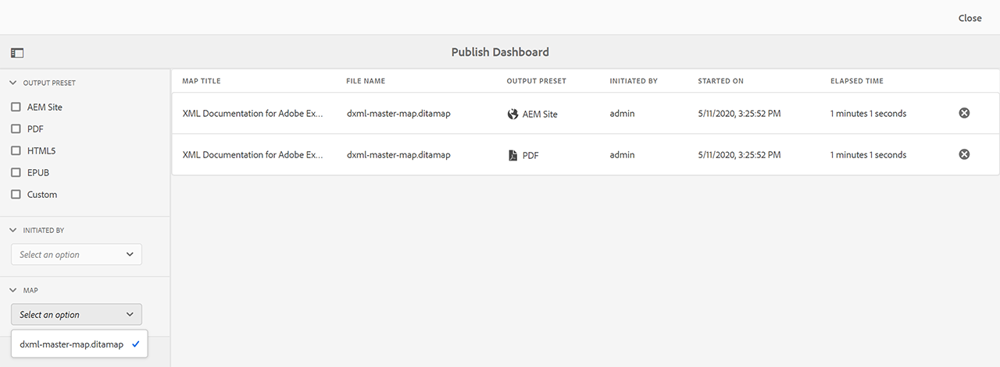

# Gestire le attività di pubblicazione tramite il dashboard di pubblicazione {#id205CC08305Z}

Quando nel sistema è in esecuzione un set elevato di attività di pubblicazione, diventa praticamente impossibile controllare singolarmente ogni mappa DITA per monitorare l&#39;attività di pubblicazione. AEM Guides offre agli amministratori e agli editori una vista unificata di tutte le attività di pubblicazione in esecuzione nel sistema. Nel dashboard di pubblicazione è disponibile un elenco di tutte le attività di pubblicazione attive.

Il dashboard di pubblicazione offre una panoramica completa di tutte le attività di pubblicazione attualmente in esecuzione nel sistema.

{width="800"}

Il dashboard di pubblicazione contiene i seguenti dettagli:

- **Titolo mappa**: titolo di un file di mappa attualmente pubblicato o presente nella coda di pubblicazione.

- **Nome file** - Nome file della mappa DITA.

- **Predefinito di output** - Nome del predefinito di output utilizzato per generare l&#39;output.

- **Avviato da** - Nome utente dell&#39;utente che ha avviato l&#39;attività di pubblicazione.

- **Avviato il** - Data e ora di inizio dell&#39;attività di pubblicazione.

- **Tempo trascorso** - Tempo trascorso dall&#39;esecuzione dell&#39;attività di pubblicazione nel sistema.

- **Icona Elimina** - Annulla o interrompi un&#39;attività di pubblicazione.

Il pannello a sinistra nel dashboard di pubblicazione fornisce le seguenti opzioni di filtro:

- **Predefinito di output** - Selezionare uno o più predefiniti di output per i quali si desidera visualizzare le attività di pubblicazione attualmente attive. Nella schermata seguente, le attività di pubblicazione vengono filtrate in modo da mostrare solo le attività che utilizzano il predefinito di output Sito di AEM:

  {width="800"}

- **Avviato da** - Selezionare un nome utente dall&#39;elenco per visualizzare le attività di pubblicazione avviate dall&#39;utente selezionato.

- **Mappa** - Seleziona un file di mappa dall&#39;elenco per visualizzare le attività di pubblicazione in esecuzione per la mappa selezionata.

## Accedere al dashboard di pubblicazione {#id205CC100DY4}

Per accedere al dashboard di pubblicazione, effettua le seguenti operazioni:

>[!NOTE]
>
> Solo un amministratore o un editore può accedere al dashboard di pubblicazione.

1. Fai clic sul collegamento Adobe Experience Manager in alto e scegli **Strumenti**.

1. Seleziona **Guide** dall&#39;elenco degli strumenti.

1. Fai clic sul riquadro **Pubblica dashboard**.

   Viene visualizzato il dashboard di pubblicazione con un elenco di tutte le attività di pubblicazione attive nel sistema.

   Se si fa clic sul collegamento Nome file, viene visualizzata la console delle mappe DITA della mappa selezionata.

   {width="800"}

>[!NOTE]
>
> Mentre generate l&#39;output dal dashboard mappa, potete accedere al dashboard Pubblica (Publish) anche dalla scheda Output (Output). Per ulteriori dettagli, vedere [Visualizzare lo stato dell&#39;attività di generazione output](generate-output-for-a-dita-map.md#viewing_output_history).

## Annullare un’attività di pubblicazione

Per annullare un’attività di generazione output dal dashboard di pubblicazione, effettua le seguenti operazioni:

1. [Accedi al dashboard di pubblicazione](#id205CC100DY4).

1. Nell&#39;elenco delle attività di pubblicazione attive fare clic sull&#39;icona Elimina di un&#39;attività che si desidera annullare.

   {width="800"}

1. Fare clic su **Sì** al prompt del messaggio Conferma annullamento.

   Il comando di annullamento viene accettato e l&#39;annullamento viene tentato finché l&#39;attività rimane attiva. Una volta terminata, l&#39;attività viene rimossa dall&#39;elenco delle attività attualmente attivo. Lo stato dell&#39;attività viene aggiornato anche nella console delle mappe DITA come Annullato. Nella schermata seguente, l&#39;attività *HTML5* è stata annullata da Dashboard di pubblicazione e il suo stato è stato modificato anche nella console delle mappe DITA.

   {width="800"}

**Argomento padre:**&#x200B;[&#x200B; Generazione output](generate-output.md)
