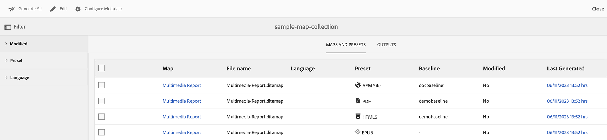

# Usa raccolta mappe per la generazione dell&#39;output {#id1723F20G0HS}

In qualsiasi organizzazione, un prodotto può avere più tipi di documentazione. In qualità di specialista della pubblicazione, desideri controllare l’output che desideri generare per ciascun documento. Inoltre, dovrebbe essere possibile pubblicare in batch più documenti con un solo clic.

AEM Guides consente di organizzare i contenuti da pubblicare tramite un dashboard denominato Raccolta mappe. Una raccolta di mappe consente di assemblare tutti i diversi tipi di documenti in un&#39;unica unità. È possibile scegliere il tipo di output che si desidera generare per ciascun documento nella raccolta di mappe. Inoltre, puoi anche generare l’output e vedere l’avanzamento della generazione dell’output dal dashboard di pubblicazione.

Raccolta mappe consente di visualizzare eventuali modifiche apportate a una mappa rispetto all’ultimo output pubblicato. Puoi visualizzare i dettagli nella scheda Mappe e predefiniti della raccolta mappe e quindi ripubblicare l’output se necessario. Per ulteriori informazioni, vedere Aggiunta di una mappa a una raccolta di mappe.

## Creare una raccolta di mappe e aggiungere mappe DITA

Per creare una raccolta di mappe e aggiungere mappe DITA alla raccolta, effettuare le seguenti operazioni:

1. Nell&#39;interfaccia utente di Assets, fai clic su **Mappa raccolte**.

   Se il collegamento Mappa raccolte non è disponibile, seleziona l&#39;opzione **Navigazione** nella barra a sinistra, quindi fai clic su **Mappa raccolte**.

   {width="350" align="left"}

1. Immetti un Titolo per la raccolta di mappe.
1. Fai clic su **Crea**.

   Al momento della creazione della raccolta di mappe viene visualizzato un messaggio di operazione riuscita.

1. Fai clic su **Chiudi** nel messaggio di successo.

   Il file di mappa appena creato viene visualizzato nella pagina Mappa raccolte.

1. Fai clic sulla casella grigia nel riquadro della raccolta che desideri modificare.
1. Fare clic su **Modifica** e quindi su **Aggiungi mappe**.
1. Individuare e aggiungere le mappe DITA che si desidera aggiungere all&#39;insieme Map.

   Per impostazione predefinita, tutti i predefiniti e le impostazioni internazionali associati alla mappa vengono aggiunti automaticamente.

1. Selezionare l&#39;output desiderato attivando o disattivando il pulsante scorrevole.
1. Fai clic su **Fine**.

   I file di mappa DITA vengono aggiunti alla raccolta di mappe.

   {width="800" align="left"}

Nella pagina della raccolta sono visualizzate le seguenti opzioni di filtro e i seguenti dettagli della mappa:

- **Filtro:** La barra più recente mostra i filtri seguenti:
   - **Modificato**: è possibile selezionare Sì o No. Se si seleziona sì, nella tabella Mappe e predefiniti verranno visualizzate solo le mappe DITA modificate.
   - **Predefinito**: selezionare un predefinito per il quale si desidera filtrare i file di mappa. Se ad esempio si sceglie il predefinito *Sito AEM*, verranno visualizzate solo le mappe con il predefinito di output *Sito AEM* configurato.
   - **Lingua**: è possibile selezionare qualsiasi codice lingua disponibile e visualizzare solo la lingua selezionata nella tabella Mappe e predefiniti.
- Tabella **Mappe e predefiniti**: la tabella Mappe e predefiniti presenta le informazioni nelle colonne seguenti:
   - **Mappa**: mostra il titolo del file di mappa DITA.
   - **Nome file**: mostra il nome del file della mappa DITA.
   - **Lingua**: mostra la lingua della mappa DITA.
   - **Predefinito**: mostra il tipo di predefinito di output configurato nel file di mappa.
   - **Linea di base**: mostra la linea di base utilizzata dal predefinito di output.  Se non viene utilizzata alcuna linea di base, viene visualizzato un trattino &quot;-&quot;
   - **Modificato**: indica se la mappa DITA è stata aggiornata dopo l&#39;ultima pubblicazione. In base a queste informazioni, è possibile decidere se ripubblicare o meno l&#39;output per questa mappa DITA.
   - **Ultima generazione**: mostra la data e l&#39;ora dell&#39;ultimo output generato.

## Configurare e generare l’output utilizzando una raccolta di mappe

Per configurare e generare l’output utilizzando una raccolta di mappe, effettua le seguenti operazioni:

1. Apri la raccolta delle mappe.Puoi visualizzare i vari predefiniti di output come Sito AEM, PDF (incluso Native PDF), HTML5, EPUB e Predefiniti personalizzati. Puoi anche visualizzare i predefiniti per i profili globali e delle cartelle creati dall’amministratore.

   L&#39;icona  indica un predefinito a livello di profilo della cartella.
1. \(Facoltativo\) Effettuare una delle seguenti operazioni in base alle proprie esigenze:
   - Applica i filtri dalla barra a sinistra per filtrare le mappe modificate, il predefinito di output o la lingua.
   - Se necessario, fare clic su **Modifica** e modificare l&#39;output desiderato attivando o disattivando il pulsante scorrevole.

     >[!NOTE]
     >  
     > Per impostazione predefinita, qualsiasi nuovo predefinito è disattivato.

1. È possibile abilitare i predefiniti per una mappa DITA nei modi seguenti:

   - Abilita qualsiasi singolo predefinito.
   - Abilitare **Tutti i predefiniti** per una mappa DITA per selezionare tutti i predefiniti contemporaneamente. Questa opzione è disabilitata per impostazione predefinita.
   - Abilitare **Predefiniti profilo cartella** per una mappa DITA per selezionare tutti i relativi predefiniti profilo cartella. Questa opzione è disabilitata per impostazione predefinita.

     {width="800" align="left"}

1. Effettua una delle seguenti operazioni:

   - Per generare l&#39;output delle mappe selezionate, selezionare i file di mappa e fare clic su **Genera selezionati**.
   - Per generare l&#39;output di tutte le mappe DITA con i relativi predefiniti configurati, fare clic su **Genera tutto**.

   >[!IMPORTANT]
   >
   > Se un processo di generazione dell&#39;output per un predefinito o una mappa DITA è in coda o in corso, non è possibile avviare un&#39;altra attività di generazione dell&#39;output per lo stesso predefinito o mappa.

## Configurare le proprietà dei metadati

Nell&#39;insieme map è possibile configurare le proprietà dei metadati in blocco per le mappe DITA. Selezionare **Configura metadati** per aprire la pagina **Metadati risorsa**. Nella pagina **Metadati risorsa**, tutte le mappe presenti nella raccolta sono elencate a sinistra.

{width="800" align="left"}

Per configurare le proprietà dei metadati, effettua le seguenti operazioni:

1. Puoi scegliere le mappe per le quali desideri aggiornare i metadati. Per impostazione predefinita, vengono selezionate tutte le mappe DITA presenti.

1. Dopo aver selezionato le mappe DITA, è possibile visualizzare proprietà quali metadati, attivazione o disattivazione della pianificazione, riferimenti, stato del documento e altro ancora.

1. Aggiorna le proprietà dei metadati.

1. Fai clic su **Salva e chiudi** in alto per salvare gli aggiornamenti.
1. (Facoltativo) Quando aggiorni i tag, puoi anche selezionare Aggiungi nel menu a discesa **Salva e chiudi** per aggiungere i nuovi tag all&#39;elenco esistente.
1. Fai clic su **Invia** dal menu a discesa **Salva e chiudi**.
Le proprietà dei metadati vengono aggiornate per le mappe DITA selezionate in blocco dalla raccolta di mappe.

>[!NOTE]
> 
>Per il menu a discesa **Stato documento**, è possibile selezionare solo gli stati del documento che sono consentiti in comune per tutte le mappe DITA selezionate. Per ulteriori informazioni, visualizzare [**Stato documento**](./web-editor-document-states.md).

Le proprietà dei metadati sono sincronizzate con le proprietà del file. Dopo averli aggiornati, è possibile visualizzarli dal pannello **Proprietà file** nell&#39;editor Web.

## Eliminare una raccolta Mappa o una mappa DITA dalla raccolta Mappa

- Per eliminare una raccolta mappe, selezionare una raccolta nella pagina Raccolta mappe e fare clic su **Elimina**.
- Per eliminare una mappa DITA da una raccolta mappe, aprire la raccolta mappe in modalità Modifica, selezionare il file di mappa DITA e fare clic su **Rimuovi da raccolta**.

Verranno inoltre rimossi tutti i predefiniti o le impostazioni internazionali associati alla mappa DITA dall&#39;insieme Map.

## Annullare un&#39;attività di generazione output da una raccolta di mappe

Analogamente all&#39;annullamento di un&#39;attività di generazione output dalla [console mappe DITA](generate-output-for-a-dita-map.md#id2061H100T5Z) o dal [dashboard di pubblicazione](generate-output-publish-dashboard.md#), è possibile annullare un&#39;attività di generazione output da una raccolta mappe. Accedere alla scheda Output di una raccolta di mappe e passare all&#39;attività di pubblicazione che si desidera annullare, quindi fare clic sull&#39;icona **Annulla questo processo** per annullare l&#39;attività di pubblicazione.

{width="800" align="left"}

**Argomento padre:**&#x200B;[ Generazione output](generate-output.md)
