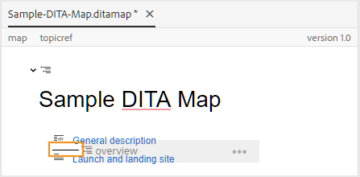
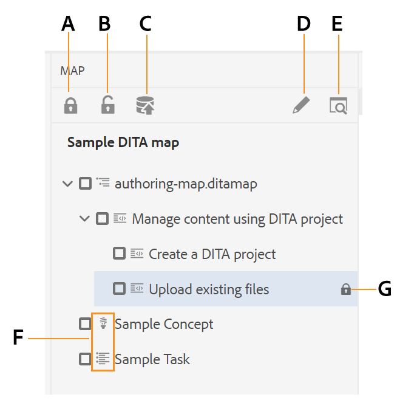

# Utilizzare l’Editor di mappe avanzato {#id1942D0S0IHS}

L’Editor mappe avanzato è dotato di un’interfaccia utente intuitiva ed è simile all’Editor web. Quando si apre un file di mapping nell&#39;editor Web, viene visualizzata un&#39;opzione che consente di modificare il file di mapping tramite l&#39;interfaccia Editor mapping avanzato. L’Editor mappe avanzato consente di aggiungere riferimenti ad argomenti, riferimenti chiave, strutturare il contenuto e altro ancora.

Oltre a modificare i file di mapping direttamente dall&#39;editor Web, è possibile aprire i file degli argomenti in una mappa per modificare l&#39;editor Web. Questo argomento illustra le funzioni dell&#39;Editor mappe avanzate e le modalità di apertura e modifica dei file in una mappa DITA nell&#39;Editor Web.

## Aggiungere argomenti a un file di mappa

Per creare il file di mappa mediante l&#39;Editor mappe avanzato, effettuare le seguenti operazioni:

1. Nell’interfaccia utente di Assets, individua il file di mappa da modificare.

   >[!NOTE]
   >
   > Assicurati di non aver attivato la modalità di selezione delle risorse.

1. Per ottenere un blocco esclusivo sul file mappa, selezionare il file mappa e fare clic su **Estrai**.

   >[!NOTE]
   >
   > Una volta impostato un blocco esclusivo su un file di mappa, gli altri utenti non potranno modificare la mappa. Tuttavia, sarebbero in grado di lavorare sugli argomenti all&#39;interno del file di mappa. Se l&#39;amministratore ha configurato l&#39;editor Web per estrarre i file prima di modificarli, non sarà possibile modificare un file finché non lo si estrae. Analogamente, se configurata, verrà richiesto di archiviare qualsiasi file estratto prima di chiuderlo

1. Con il file mappa selezionato, fare clic su **Modifica argomenti**.

   {width="800" align="left"}

   Oppure, puoi anche selezionare l&#39;opzione **Modifica argomenti** dal menu Azioni del file di mappa:

   {width="800" align="left"}

   Il file di mappa viene aperto per la modifica in nell’Editor web.

1. Fai clic sull&#39;icona **Modifica**.

   {width="550" align="left"}

   La mappa viene aperta nell’interfaccia dell’Editor mappe avanzato. Se hai aperto un nuovo file di mappa, nell’editor viene visualizzato solo il titolo della mappa.

   {width="800" align="left"}

   - **A** - \(*Barra degli strumenti principale*\): simile alla barra degli strumenti principale dell&#39;editor Web. Per ulteriori dettagli, vedi [Barra degli strumenti principale](web-editor-features.md#id2051EA0G05Z) nell&#39;editor Web.

   - **B** - \(*Barra degli strumenti secondaria*\) Questa è la barra degli strumenti secondaria che consente di utilizzare i file di mapping. Per ulteriori informazioni sulle funzionalità disponibili tramite la barra degli strumenti Secondaria, vedere [Funzionalità disponibili nella barra degli strumenti dell&#39;Editor mappe avanzate](#id205DEC0005Z).

   - **C** - \(*Visualizzazioni mappa*\): consente di passare dall&#39;Editor mappa a Layout, Autore, Source e Anteprima. La visualizzazione **Layout** consente di organizzare gli argomenti in una mappa DITA. In questo modo viene visualizzata la struttura o la struttura gerarchica della mappa. La visualizzazione **Autore** consente di modificare gli argomenti nell&#39;Editor mappa. Questo offre anche la vista WYSIWYG del file di mappa. La visualizzazione **Source** consente di utilizzare l&#39;XML sottostante del file di mapping. L&#39;anteprima offre una visualizzazione consolidata di tutti gli argomenti e delle mappe secondarie all&#39;interno del file di mappa. Il collegamento **Chiudi** chiude il file di mapping.

   - **D** - \(*Pannello sinistro*\): consente di accedere al pannello sinistro che consente di accedere ai Preferiti, all&#39;archivio, alla mappa, alla struttura e ad altre funzionalità. È possibile espanderla o comprimerla facendo clic sull&#39;icona Espandi barra laterale \(\). Per ulteriori dettagli sulle funzionalità disponibili nel pannello sinistro, vedere [Pannello sinistro](web-editor-features.md#id2051EA0M0HS) nell&#39;editor Web.

   - **E** - \(*Area centrale*\): area di modifica contenuto mappa.

   - **F** - \(*Pannello destro*\): consente di accedere al pannello Proprietà. Puoi visualizzare le proprietà del contenuto e le proprietà della mappa dell’argomento o della mappa selezionata. Per ulteriori dettagli sulle funzionalità disponibili in questo pannello, vedi [Pannello destro](web-editor-features.md#id2051EB003YK) nell&#39;editor Web.

1. Nel pannello sinistro passare alla **vista archivio**.

1. Nell’archivio di AEM, passa alla cartella contenente gli argomenti o le mappe secondarie che desideri aggiungere.

1. Selezionare l&#39;argomento o il file di mapping nella **Vista repository** e trascinarlo nell&#39;area di modifica del contenuto di mapping \(middle\).

   L&#39;argomento viene aggiunto nella mappa.

   {width="800" align="left"}

1. Per aggiungere argomenti successivi o una mappa secondaria, trascinare l&#39;argomento o la mappa secondaria nella posizione desiderata nella mappa.

   Durante la creazione del file di mappa, considera i punti seguenti:

   - Il file viene aggiunto in un punto in cui la barra orizzontale viene visualizzata nell&#39;area di modifica delle mappe. Nella schermata seguente, l&#39;argomento *Panoramica* verrà aggiunto tra gli argomenti *Descrizione generale* e *Launch and Landing Site*.

     {width="350" align="left"}

   - Per sostituire un argomento, posizionare l&#39;argomento in alto, a sinistra o a destra dell&#39;argomento che si desidera sostituire. Una barra verticale a sinistra o a destra di un argomento indica che verrà sostituito con l&#39;argomento che viene rilasciato su di esso.

     {width="550" align="left"}

     Tuttavia, prima di sostituire un argomento, viene visualizzata una richiesta di conferma. L’argomento viene sostituito solo dopo la conferma.

     {width="300" align="left"}

   - Se si aggiunge una mappa secondaria alla mappa DITA, questa verrà visualizzata come collegamento nella mappa DITA. Per visualizzare tutti gli argomenti della mappa secondaria, fare clic sul collegamento corrispondente. Il contenuto della mappa secondaria viene visualizzato in una nuova scheda. Allo stesso modo, per aprire un argomento dalla mappa DITA, fare clic sul collegamento dell&#39;argomento e aprirlo nella nuova scheda.

   - È possibile utilizzare i tasti di scelta rapida CTRL+Z e CTRL+Y o le rispettive icone nella barra degli strumenti per annullare o ripristinare eventuali modifiche apportate alla mappa.

   - Per modificare la posizione di un argomento, selezionare l&#39;argomento \(facendo clic sull&#39;icona dell&#39;argomento\), quindi trascinarlo nella posizione desiderata nel file di mappa. Verificare che la barra orizzontale sia visibile nel punto in cui si desidera inserire l&#39;argomento. Nella schermata seguente, l&#39;argomento *Launch and Landing Site* viene spostato dopo l&#39;argomento *Overview*.

     {width="350" align="left"}

   - Per verificare le proprietà del file mappa, fare clic con il pulsante destro del mouse in un punto qualsiasi dell&#39;area di modifica delle mappe e scegliere **Proprietà** dal menu di scelta rapida. In base alla versione di AEM in uso, puoi visualizzare proprietà quali metadati, pianificazione \(de\)attivazione, riferimenti, stato del documento e altro ancora.

1. Fai clic su **Salva**.

## Funzioni disponibili nella barra degli strumenti dell’Editor mappe avanzate {#id205DEC0005Z}

La barra degli strumenti nell&#39;Editor mapping avanzato è simile all&#39;argomento Editor Web. Le operazioni di base, come l’attivazione del pannello sinistro, il salvataggio della mappa, la creazione di una nuova versione della mappa, l’annullamento/ripristino dell’ultima operazione e l’eliminazione degli elementi selezionati, sono comuni in entrambi gli editor. Per informazioni dettagliate sul funzionamento di queste operazioni, vedere la sezione [Informazioni sulle caratteristiche dell&#39;editor Web](web-editor-features.md#).

Nella barra degli strumenti delle viste Layout e Autore sono disponibili anche le seguenti operazioni specifiche per le mappe:

## Vista Layout {#id205DEC0005Z_layout_view}

Quando si apre una mappa per la modifica, viene aperta la vista Layout dell&#39;Editor mappa.La vista Layout visualizza la gerarchia della mappa in una vista a struttura e consente di organizzare gli argomenti in una mappa.

>[!NOTE]
>
> Nella vista Layout vengono visualizzati solo i riferimenti presenti in una mappa. Se alcuni riferimenti sono interrotti, a sinistra del riferimento viene visualizzato un piccolo simbolo di croce

Nella vista Layout potete eseguire le seguenti operazioni:

**Inserisci riferimento argomento** - 

Visualizza la finestra di dialogo di ricerca dell&#39;argomento. Passare al file argomento/mappa che si desidera inserire e fare clic su Seleziona per aggiungerlo alla mappa.
{width="800" align="left"}

**Inserisci gruppo di argomenti** - 

Inserire l&#39;elemento `topicgroup`. Per ulteriori informazioni sul raggruppamento degli argomenti, vedere la documentazione [topicgroup](https://docs.oasis-open.org/dita/v1.0/langspec/topicgroup.html) in Specifiche del linguaggio OASIS DITA.

**Inserisci definizione chiave** - 

Visualizza la finestra di dialogo Inserisci keydef. Utilizzare questa finestra di dialogo per definire qualsiasi definizione di chiave che si desidera utilizzare nella mappa.

{width="300" align="left"}

**Inserisci prima/Inserisci dopo** -  / 

Visualizza la finestra di dialogo Inserisci elemento. Selezionare l&#39;elemento che si desidera inserire nella mappa. A seconda dell&#39;operazione, il nuovo elemento viene inserito prima o dopo l&#39;elemento corrente nella mappa.

**Inserisci argomento principale** - 

Questa icona viene visualizzata quando apri una mappa segnalibro per la modifica. È possibile inserire componenti all&#39;inizio del libro come un sommario, un indice e un elenco di tabelle.

**Inserisci argomento precedente** - 

Questa icona viene visualizzata quando apri una mappa segnalibro per la modifica. È possibile inserire componenti per una fine del libro, ad esempio un indice, un glossario e un elenco di figure.

**Sposta l&#39;elemento selezionato a sinistra/a destra** -  / 

Fare clic sulla freccia sinistra per spostare l&#39;argomento verso il lato sinistro nella gerarchia. Questo essenzialmente promuove il rispettivo argomento di un livello superiore nella gerarchia. Ad esempio, se si fa clic sulla freccia sinistra mentre è selezionato un argomento figlio, l&#39;argomento diventa di pari livello rispetto all&#39;argomento precedente. Analogamente, se si fa clic sulla freccia destra, l&#39;argomento viene spinto verso destra, rendendolo l&#39;elemento figlio dell&#39;argomento al di sopra di esso.

**Sposta l&#39;elemento selezionato su/giù** - / 

Fare clic sulle icone della freccia su o giù per spostare l&#39;argomento verso l&#39;alto o verso il basso nella gerarchia.

>[!NOTE]
>
> Potete anche trascinare i riferimenti per spostarli in una mappa.

**Blocca/Sblocca** -  / 

Ottiene un blocco sul file mappa e lo rilascia. Se nel file di mappa sono presenti modifiche non salvate, al momento del rilascio del blocco viene richiesto di salvare il file di mappa. Le modifiche vengono salvate nella versione corrente del file di mappa.

**Unisci** - 

Per ulteriori dettagli sull&#39;unione del contenuto di una versione diversa dello stesso file o di un file diverso, vedere [Unisci](web-editor-features.md#id205DF04E0HS) nell&#39;editor Web.

**Cronologia versioni** - 

Controlla le versioni e le etichette disponibili nell’argomento attivo e ripristina qualsiasi versione dall’editor stesso.

**Etichetta versione** - 

Visualizza la finestra di dialogo Gestione etichette versione. Seleziona una versione dall’elenco a discesa. Scegliere l&#39;etichetta da applicare alla versione selezionata e fare clic su **Aggiungi etichetta** per aggiungerla.

**Opzioni di visualizzazione** - 

Visualizza un elenco a discesa che consente di scegliere Mostra numeri di riga, Mostra casella di controllo e Mostra nome file.

- **Mostra numeri di riga**

Mostra o nasconde il numero di riga per ciascun argomento. I numeri di riga vengono visualizzati a seconda del livello nella gerarchia.

- **Mostra casella di controllo**

Mostra o nasconde una casella di controllo per ciascun argomento. È possibile utilizzare la casella di controllo per selezionare l&#39;argomento\(s\) ed eseguire varie attività utilizzando il menu Opzioni. Per ulteriori dettagli, vedere il menu [Opzioni](#id228ID8006H8).

- **Mostra nome file**

Mostra il nome del file dei titoli degli argomenti.

>[!NOTE]
>
> Quando si posiziona il puntatore del mouse sul titolo di un argomento, viene visualizzato il percorso del file.

**Visualizza gli argomenti in base ai filtri condizionali** Se sono state applicate condizioni a un argomento, a destra dell&#39;argomento viene visualizzata un&#39;icona di filtro. Quando passi il puntatore del mouse su un’icona di filtro, viene visualizzata la condizione applicata e il relativo valore di attributo.

**Menu Opzioni nella visualizzazione Layout**

Oltre ad organizzare gli argomenti nel file mappa, è possibile eseguire le azioni seguenti utilizzando il menu Opzioni disponibile per un elemento nella vista Layout:

{width="650" align="left"}

- **Aggiungi**: puoi scegliere di aggiungere un nuovo argomento o un riferimento vuoto dall&#39;Editor mappe:
   - **Riferimento vuoto**: questa opzione consente di aggiungere un riferimento vuoto nella mappa DITA. In seguito è possibile fare doppio clic sul riferimento vuoto inserito e aggiungere i dettagli dell&#39;argomento. Per ulteriori dettagli, vedere [Creare un argomento](web-editor-features.md#id228ICI0105U) nell&#39;editor Web.
   - **Nuovo argomento**: quando si sceglie di creare un nuovo argomento dal menu, viene visualizzata la finestra di dialogo Crea nuovo argomento. Nella finestra di dialogo Crea nuovo argomento, fornisci i dettagli richiesti e fai clic su Crea. Per ulteriori dettagli, vedere [Creare un argomento](web-editor-features.md#id228ICI0105U) nell&#39;editor Web.
- **Sposta**: è possibile scegliere di spostare un argomento verso l&#39;alto/il basso/a destra/a sinistra nella gerarchia.È inoltre possibile trascinare un argomento o una mappa dal pannello dell&#39;archivio alla mappa aperta nell&#39;Editor mappe.
- **Annulla**: annulla l&#39;ultima operazione nella visualizzazione Layout.
- **Ripeti**: ripeti l&#39;ultima operazione nella visualizzazione Layout.
- **Copia**: copia il riferimento selezionato dal file mappa.

  >[!NOTE]
  >
  > Potete visualizzare e quindi selezionare le caselle di controllo per copiare più riferimenti.

- **Incolla**: incolla i riferimenti copiati nella posizione corrente della gerarchia.
- **Elimina**: elimina i riferimenti selezionati dal file di mapping.

  >[!NOTE]
  >
  > È possibile visualizzare e quindi selezionare le caselle di controllo per eliminare più riferimenti.

## Pannello a destra nell’editor mappa

Nel pannello di destra vengono visualizzate le Proprietà contenuto e le Proprietà mappa nella vista Layout dell’Editor mappa.

**Proprietà contenuto**

Il pannello Proprietà contenuto contiene informazioni sul tipo di argomento attualmente selezionato nella mappa, il relativo URL di collegamento e i relativi attributi. Per ulteriori dettagli, vedere [Proprietà contenuto](web-editor-features.md#id228IDB00HMM) nell&#39;editor Web.

- **Altri attributi** Se l&#39;amministratore ha creato un profilo per gli attributi, questi verranno ottenuti insieme ai relativi valori configurati. Utilizzando il pannello delle proprietà del contenuto, potete scegliere questi attributi e assegnarli al contenuto pertinente nell&#39;argomento. Puoi anche assegnare gli attributi configurati dall&#39;amministratore nella scheda **Visualizza attributi** delle impostazioni dell&#39;editor. Gli attributi definiti per un elemento vengono visualizzati nella vista Layout e Struttura. Questo consente di esaminare rapidamente tutti gli argomenti di una mappa per cui è definito un attributo specifico. Ad esempio, tutti gli argomenti per i quali l’attributo platform è definito come &quot;Android&quot;.

  {width="650" align="left"}

  Per ulteriori dettagli, vedere *Attributi di visualizzazione* nella descrizione della funzionalità *Impostazioni editor* nella sezione [Pannello sinistro](web-editor-features.md#id2051EA0M0HS).

- **Metadati** Utilizzando i metadati, puoi impostare le informazioni sui metadati. Puoi definire il Titolo navigazione, il Testo collegamento, la Descrizione breve e le Parole chiave.

Per ulteriori informazioni sugli attributi e i metadati standard dell&#39;argomento, vedere la documentazione [topicref](https://docs.oasis-open.org/dita/v1.2/os/spec/langref/topicref.html) in Specifiche del linguaggio OASIS DITA.

**Proprietà mappa**

Visualizza la finestra di dialogo Proprietà mappa, in cui è possibile impostare gli attributi e le informazioni sui metadati per la mappa.

## Visualizzazione Autore {#id205DEC0005Z_author_view}

La visualizzazione **Autore** consente di modificare la mappa DITA nell&#39;editor Web. Mostra la vista WYSIWYG dell’Editor mappe e alcune delle icone visualizzate nella vista Author sono uguali alla vista Layout. Per ulteriori dettagli, vedere [Visualizzazione Layout](#id205DEC0005Z_layout_view). Inoltre, è possibile visualizzare le icone seguenti ed eseguire le attività correlate dalla vista Autore:

**Inserisci prima/Inserisci dopo** -  / 

Visualizza la finestra di dialogo Inserisci elemento. Selezionare l&#39;elemento che si desidera inserire nella mappa. A seconda dell&#39;operazione, il nuovo elemento viene inserito prima o dopo l&#39;elemento corrente nella mappa.

**Inserisci elemento** - 

Visualizza la finestra di dialogo Inserisci elemento. Seleziona l’elemento da inserire. È possibile utilizzare la tastiera per scorrere l&#39;elenco degli elementi e premere Invio per inserire l&#39;elemento richiesto. In alternativa, puoi fare clic direttamente sull’elemento per inserirlo nella mappa.

**Inserisci tabella relazioni** - 

Inserisce una tabella di relazioni nella mappa. Poiché il concetto di utilizzo della tabella delle relazioni è uguale a quello descritto nella sezione Editor mappe di base, vedere [Utilizzo delle tabelle delle relazioni nell&#39;Editor mappe di base](map-editor-basic-map-editor.md#id1944B0I0COB) per ulteriori dettagli.

**Inserisci contenuto riutilizzabile** - 

Visualizza la finestra di dialogo Riutilizza contenuto. Utilizzare questa finestra di dialogo per inserire il contenuto che si desidera riutilizzare nella mappa.

**Aggiorna attributo titolo navigazione** - 

Sincronizza l&#39;elemento `title` di un file di riferimento in una mappa con il valore specificato nel relativo attributo `@navtitle`. È possibile aggiungere diversi tipi di file di riferimento in una mappa, ad esempio mappe di argomenti, riferimenti, attività, sottomappe e così via. La maggior parte di questi file supporta l&#39;attributo `@navtitle`. Se un file contiene l&#39;attributo `@navtitle`, viene aggiornato l&#39;attributo `@navtitle` per lo stesso file nella mappa. Se l&#39;attributo `@navtitle` non è presente, l&#39;attributo `@navtitle` viene aggiunto a tale file di riferimento e anche il relativo `title` viene aggiornato per visualizzare l&#39;attributo `@navtitle`.

>[!NOTE]
>
> L&#39;amministratore può configurare l&#39;aggiunta automatica dell&#39;attributo `@navtitle` a ogni file di riferimento aggiunto a una mappa. Per ulteriori dettagli sulla configurazione dell&#39;aggiunta automatica dell&#39;attributo `@navtitle`, vedere *Includere l&#39;attributo @navtitle per impostazione predefinita* in Installare e configurare Adobe Experience Manager Guides as a Cloud Service.

Fare clic sull&#39;icona Aggiorna attributo titolo navigazione per sincronizzare i valori dell&#39;elemento `title` e dell&#39;attributo `@navtitle`.

**Attiva/Disattiva visualizzazione tag** - 

Mostra o nasconde i tag XML. I tag fungono da segnali visivi che indicano il limite di un elemento. In questa modalità, se desideri inserire un riferimento ad argomento/mappa, trascina il file desiderato prima o dopo il tag. La barra orizzontale non viene visualizzata nella modalità Visualizzazione tag.

**Attiva/Disattiva revisioni** - 

È possibile tenere traccia di tutti gli aggiornamenti effettuati nel file di mappa attivando la modalità Revisioni. Dopo aver abilitato le modifiche di traccia, tutti gli inserimenti e le eliminazioni vengono acquisiti nel documento. Per ulteriori dettagli, vedere [Abilitare/disabilitare le revisioni](web-editor-features.md#id205DF0203Y4) nell&#39;editor Web.

**Crea attività di revisione** - 

È possibile creare un&#39;attività di revisione dell&#39;argomento corrente o un file di mapping direttamente dall&#39;editor Web. Aprire il file per il quale si desidera creare l&#39;attività di revisione e fare clic su Crea attività di revisione per avviare il processo di creazione della revisione. Segui le istruzioni fornite in [Rivedi argomenti o mappe](review.md#) per ulteriori dettagli.

## Modifica argomenti tramite mappa DITA {#id17ACJ0F0FHS}

La modifica di un singolo argomento non fornisce all&#39;autore il contesto completo. L&#39;autore non dispone di informazioni sulla posizione di un argomento in una mappa DITA. Senza queste informazioni contestuali, per gli autori diventa un po’ difficile creare contenuti.

AEM Guides consente agli autori di aprire una mappa DITA nell&#39;Editor Web e di visualizzare il posizionamento degli argomenti nella mappa. In questo modo gli autori possono sapere esattamente dove si trova l’argomento all’interno della mappa e creare contenuti più rilevanti. Inoltre, se più autori lavorano a un progetto, possono sapere quali argomenti sono disponibili nella mappa e riutilizzare il contenuto, se necessario.

Per modificare gli argomenti tramite una mappa DITA, effettuare le seguenti operazioni:

1. Nell&#39;interfaccia utente di Assets, passare alla mappa DITA contenente gli argomenti che si desidera modificare.
1. Fare clic sulla mappa DITA per aprirla nella console delle mappe DITA.
1. Selezionare la scheda **Argomenti** per visualizzare l&#39;elenco degli argomenti disponibili nella mappa DITA.

   >[!TIP]
   >
   > La scheda Argomenti consente di scaricare il file mappa con i relativi dipendenti. Per ulteriori dettagli, vedere [Esportare un file di mapping DITA](authoring-download-assets.md#id218UBA00IXA).

1. Nella barra degli strumenti principale, fare clic su **Modifica argomenti**.

   La mappa DITA viene visualizzata nell&#39;Editor Web.

   >[!NOTE]
   >
   > È inoltre possibile selezionare il file di mapping DITA nell&#39;interfaccia utente di Assets e fare clic su **Modifica argomenti** nella barra degli strumenti principale per avviare l&#39;editor Web.

   {width="350" align="left"}

1. \(*Facoltativo*\) È inoltre possibile selezionare un argomento dalla mappa ed estrarre il file prima di modificarlo. Per estrarre il file\(s\), selezionare uno o più file dal riquadro di sinistra e fare clic su **Estrai**. Puoi anche rilasciare il blocco su qualsiasi file selezionando il file estratto e facendo clic sull&#39;icona **Annulla estrazione e sblocca** nella vista Mappa.

   >[!IMPORTANT]
   >
   > Se l&#39;amministratore ha configurato l&#39;opzione **Disattiva modifica senza estrazione**, è necessario estrarre il file prima di modificarlo. Se non si estrae il file, il documento verrà aperto nell&#39;editor in modalità di sola lettura.

   Nella schermata seguente vengono evidenziate le icone per Check-Out e Blocco \(A\), Annulla Check-Out e Sblocca \(B\), Salva come nuova versione e Sblocca \(C\), Modifica \(D\), Anteprima \(E\), icone diverse che mostrano i diversi tipi di file DITA \(F\) e i file estratti \(G\).

   {width="550" align="left"}

1. Fare clic su un collegamento di argomento per aprirlo nell&#39;editor Web per la modifica.

   È possibile aprire più argomenti nell&#39;editor e ogni argomento viene aperto in una nuova scheda nell&#39;editor. Anche se la mappa DITA contiene mappe secondarie, gli argomenti delle mappe secondarie vengono aperti in una nuova scheda per la modifica. Se si desidera visualizzare gli argomenti sotto una mappa secondaria, è possibile fare clic su ed espandere la mappa secondaria.

   {width="800" align="left"}

   Se si fa clic su un file di mappa, la mappa viene aperta in una nuova scheda del browser Web.

1. Dopo aver modificato gli argomenti, puoi effettuare le seguenti operazioni:

   - Puoi salvarli singolarmente. Se fai clic su **Chiudi senza salvare** i tuoi argomenti, verrà visualizzata una finestra di dialogo in cui ti viene richiesto di salvare gli argomenti non salvati:

     {width="550" align="left"}

     È possibile scegliere di salvare tutti gli argomenti selezionati o deselezionare gli argomenti che non si desidera salvare.

   - È possibile archiviare l&#39;argomento utilizzando il pulsante **Salva come nuova versione e sblocca**. Quando si salva una versione dell&#39;argomento, viene creata una nuova versione e viene rilasciato anche il blocco.

     Si consiglia di salvare le modifiche prima di archiviare i file.  Quando si salvano le modifiche, il file XML viene convalidato.

   - È inoltre possibile selezionare e archiviare più argomenti utilizzando il pulsante **Salva come nuova versione e sblocca**. Quando si salva una versione degli argomenti, viene creata una nuova versione per ciascun argomento e viene rilasciato anche il blocco. È inoltre possibile visualizzare l&#39;avanzamento dell&#39;archiviazione degli argomenti nella finestra di dialogo **Salva come nuova versione e sblocca**. Al momento del check-in dei file viene visualizzato un messaggio di operazione riuscita.

   - Se l&#39;amministratore ha attivato l&#39;opzione di archiviazione dei file alla chiusura, verrà richiesto di salvare i file alla chiusura dei file estratti. Se questa opzione è attivata, quando si chiude l&#39;editor con i file modificati, viene visualizzato l&#39;elenco dei file estratti che devono essere salvati. I file estratti vengono visualizzati con un&#39;icona di blocco:

     {width="550" align="left"}

      - Facendo clic sul pulsante **Chiudi senza salvare**, i file vengono chiusi senza salvare le modifiche.

      - Facendo clic sul pulsante **Salva** le modifiche vengono salvate, ma non vengono archiviati i file.

      - Se si seleziona l&#39;opzione **Verifica file** e si fa clic sul pulsante **Salva**, i file vengono archiviati \(viene creata un&#39;altra versione\) e i file vengono salvati.

## Visualizzare l’anteprima di una mappa

Oltre a poter visualizzare la posizione di ciascun file argomento all&#39;interno di una mappa, è consigliabile visualizzare il contenuto della mappa in un unico flusso consecutivo. La funzione Anteprima mappa consente di visualizzare l&#39;intero contenuto del file mappa con un solo clic. Non è necessario generare un output del file di mappa per vedere come si presenterà l’intera mappa dopo la pubblicazione. Potete semplicemente accedere all&#39;anteprima della mappa e tutti gli argomenti e le mappe secondarie vengono visualizzati sotto forma di libro.

Puoi accedere all’anteprima di una mappa da:

- **Interfaccia utente di Assets**: nell&#39;interfaccia utente di Assets, passare alla posizione della mappa, selezionare il file della mappa e scegliere **Anteprima mappa** nella barra degli strumenti. L’anteprima della mappa viene visualizzata in una nuova scheda. È possibile visualizzare il contenuto di tutti gli argomenti nella modalità anteprima. In questa visualizzazione non è possibile modificare alcun argomento.

  >[!NOTE]
  >
  > Se l&#39;opzione *Anteprima mappa* non è visibile nella barra degli strumenti principale, potrebbe essere stata spostata nel menu della barra degli strumenti **Altro**.

- **Editor mappe avanzato**: nell&#39;Editor mappe avanzato, fare clic sull&#39;icona Anteprima per visualizzare l&#39;anteprima della mappa corrente.

  {width="350" align="left"}

  Nella modalità di anteprima puoi eseguire le seguenti attività aggiuntive:

   - Fare clic con il pulsante destro del mouse su un argomento e selezionare **Modifica** per aprire l&#39;argomento per la modifica in una nuova scheda.

     >[!NOTE]
     >
     > Se non si dispone dei diritti di modifica, l&#39;argomento verrà aperto in modalità di sola lettura.

   - Passa all’argomento desiderato facendo clic sul titolo dell’argomento nella struttura ad albero della mappa \(nel pannello a sinistra\).

   - L&#39;argomento corrente nell&#39;anteprima della mappa viene evidenziato anche nella struttura della mappa.

**Argomento padre:** [Utilizzare l&#39;editor mappe](map-editor.md)
