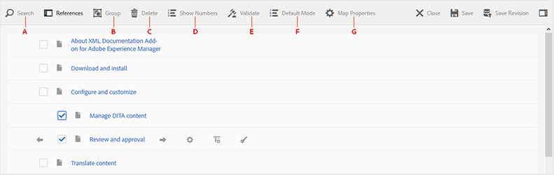
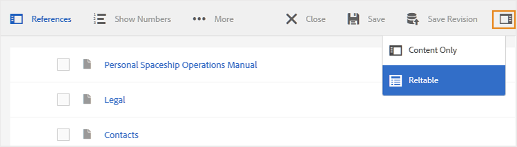
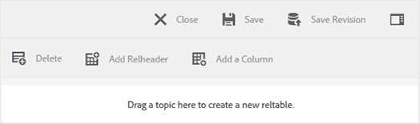

# Utilizzare l’Editor mappa di base {#id1942CM005Y4}

>[!NOTE]
>
> L’Editor mappe di base, precedentemente disponibile in Experience Manager Guides, è stato dichiarato obsoleto a partire dalle versioni 4.3 e 2307. Non è possibile accedere all&#39;Editor mappe di base per creare e gestire mappe DITA.
>Si consiglia di utilizzare l’Editor di mappe avanzato. Advanced Map Editor offre funzioni avanzate e migliori opzioni di personalizzazione. Ulteriori informazioni su come utilizzare [Editor mappe avanzato](../user-guide/map-editor-advanced-map-editor.md).

Basic Map Editor fornisce una semplice funzione di trascinamento della selezione per aggiungere argomenti dall&#39;archivio AEM per creare la mappa DITA o la mappa segnalibro. È possibile aggiungere argomenti nidificati, tabelle di relazioni \(reltable\), attributi e informazioni sui metadati, nonché convalidare la mappa per verificarne la correttezza.

>[!NOTE]
>
> Se l&#39;amministratore ha attivato l&#39;opzione Editor mappe avanzate, non sarà possibile accedere all&#39;Editor mappe di base. Per impostazione predefinita, tutti i file di mappa si aprono nell’Editor mappe avanzato.

Le sezioni seguenti descrivono le varie funzioni disponibili nell’Editor mappa di base.

## Aggiungere argomenti a un file di mappa {#id193CBL0505Z}

Dopo aver creato un file di mappa, è necessario aggiungere argomenti al file di mappa. Utilizzando l&#39;Editor mapping di base è possibile aggiungere argomenti, tabelle di relazioni o altri file di mapping.

Per creare il file mappa, effettua le seguenti operazioni:

1. Nell’interfaccia utente di Assets, individua il file di mappa da modificare.

1. Per ottenere un blocco esclusivo sul file mappa, selezionare il file mappa e fare clic su **Estrai**.

   >[!NOTE]
   >
   > Una volta impostato un blocco esclusivo su un file di mappa, gli altri utenti non potranno modificare la mappa. Tuttavia, sarebbero in grado di lavorare sugli argomenti all&#39;interno del file di mappa.

1. Con il file di mappa selezionato, fai clic su **Modifica**.

   Il file mappa viene aperto per la modifica nell&#39;Editor mappa. Utilizzando l’Editor mappa, puoi creare una mappa utilizzando gli argomenti attualmente disponibili che vengono visualizzati nella barra Riferimenti.

   {width="800" align="left"}

1. Utilizzando la barra **Riferimenti**, passa alla cartella contenente gli argomenti o le mappe secondarie che desideri aggiungere.

   >[!NOTE]
   >
   > Puoi aggiungere argomenti o mappe secondarie da qualsiasi cartella nella barra Riferimenti.

1. Per aggiungere il primo argomento alla mappa, trascinarlo sull&#39;Editor mappe di base.

   >[!NOTE]
   >
   > Dopo aver aggiunto il primo collegamento, il collegamento Aggiungi nuovo riferimento è disponibile quando si passa il puntatore del mouse su un argomento esistente nella mappa.

1. Per aggiungere argomenti successivi o una mappa secondaria, trascinare l&#39;argomento o la mappa secondaria nella posizione desiderata nella mappa.

   Se si aggiunge una mappa secondaria alla mappa DITA, questa verrà visualizzata come collegamento nella mappa DITA. Per visualizzare tutti gli argomenti della mappa secondaria, fare clic sul collegamento della mappa secondaria. Il contenuto della mappa secondaria viene visualizzato in una nuova scheda.

   >[!NOTE]
   >
   > Se si rilascia un nuovo argomento su un argomento esistente nella mappa, viene visualizzato un messaggio sulla sostituzione dell&#39;argomento. Fare clic su Sì se si desidera sostituire l&#39;argomento, su No se non si desidera sostituire l&#39;argomento. È possibile utilizzare CTRL+Z e CTRL+Y per annullare o ripristinare qualsiasi modifica nella mappa.

1. Fai clic su **Salva**.

## Funzioni disponibili nella barra degli strumenti dell&#39;Editor mappe di base

La barra degli strumenti principale nell’Editor mappa di base consente di eseguire le seguenti attività:

{width="800" align="left"}

**A: Ricerca**

Puoi cercare e includere gli argomenti richiesti da DAM. Facendo clic su questa icona viene visualizzata la finestra di dialogo Ricerca:

{width="800" align="left"}

Immettere le parole chiave che si desidera cercare. Tali parole chiave vengono associate ai valori di nome file, contenuto e anche attributo dell&#39;argomento. Quando i risultati della ricerca sono disponibili, seleziona l’argomento o gli argomenti desiderati e fai clic sul pulsante Seleziona per aggiungere i file selezionati alla fine della struttura della mappa. È possibile filtrare i risultati della ricerca specificando i parametri Modifica data.

**B: Gruppo**

Fare clic sulla casella di controllo a sinistra degli argomenti e fare clic su Raggruppa nella barra degli strumenti per raggruppare gli argomenti selezionati. Per ulteriori informazioni sul raggruppamento degli argomenti, vedere la documentazione [topicgroup](https://docs.oasis-open.org/dita/v1.0/langspec/topicgroup.html) in Specifiche del linguaggio OASIS DITA.

**C: Delete**

Click the checkbox to the left of a topic and click Delete in the toolbar to remove the selected topics from the map.

**D: Show Numbers/Hide Numbers**

Display \(or hide\) numbering for the topics in the map.

**E: Validate**

Check whether the map is valid or has errors.

**F: Default Mode/XML Mode**

In the **Default Mode**, clicking a topic link shows the preview of the topic in a new tab. Clicking on the **Default Mode** icon changes its mode to **XML Mode**. In **XML Mode**, clicking anywhere in a topic row shows the underlying XML of topic references within the topic. In the source XML view, there is an **Auto Indent** option that reorganizes the XML code in presentable and easily readable format. In case you are editing a map manually, the source view also performs validation checks. In case your XML contains errors, the same gets highlighted in the **XML Mode** and you are not allowed to save the DITA map file. If you want to view the XML for the entire map, click anywhere outside the topic boundary.

**Note:** In the Default Mode you can use the keyboard shortcuts to undo \(`Ctrl+z`\) or redo \(`Ctrl+y`\) the last action.

{width="650" align="left"}

**G: Map Properties**

Display the Map Properties dialog wherein you can set the attributes and metadata information for the map. To add an attribute, click the **Add** button at the bottom-left corner of the dialog to get the **Attribute** drop-down list. From the list, select the attribute that you want to add. If the selected attribute has pre-defined values specified in the DTD, then those values would be presented in a new drop-down list. You can select the desired value from the drop-down list. If there is no pre-defined value, then you will be presented a text box to enter a value for the selected attribute.

{width="300" align="left"}

## Features available at topic level in the Basic Map Editor

When you hover your mouse pointer over a topic or a sub-map file in the Basic Map Editor, you can perform the following tasks:

{width="650" align="left"}

**A: Move Left or Move Right**

Fare clic sulle icone freccia sinistra o destra per spostare l&#39;argomento a sinistra o a destra. Se si sposta un argomento in questo modo, esso diventa un elemento secondario \(nest\) o di pari livello \(remove nesting\) rispetto all&#39;argomento precedente.

**B: proprietà**

Fare clic sull&#39;icona Proprietà per aprire la finestra di dialogo Proprietà Topicref. Questa finestra di dialogo consente di impostare gli attributi dell&#39;argomento e le informazioni sui metadati. Per ulteriori informazioni sugli attributi e i metadati standard dell&#39;argomento, vedere la documentazione [topicref](https://docs.oasis-open.org/dita/v1.2/os/spec/langref/topicref.html) in Specifiche del linguaggio OASIS DITA.

{width="350" align="left"}

**C: Aggiungi Nuovo Riferimento**

Fare clic sull&#39;icona Aggiungi nuovo riferimento per aggiungere un nuovo riferimento come pari livello dell&#39;argomento corrente.

**D: Aggiungi nuova definizione chiave**

Fai clic sull’icona Chiave per aggiungere una nuova definizione di chiave. Qualsiasi chiave sovrascritta o già definita nella mappa viene visualizzata in rosso. Se si fa clic sull&#39;icona Proprietà su una definizione di tasto, viene visualizzata la finestra di dialogo Proprietà keydef.

## Utilizzare le tabelle di relazione nell&#39;Editor mapping di base {#id1944B0I0COB}

Gli editor di mappe di AEM Guides sono dotati di una potente funzione che consente di creare e modificare tabelle di relazioni nella mappa DITA.

Per utilizzare le tabelle di relazione nell&#39;Editor mapping di base, effettuare le operazioni riportate di seguito.

1. Nell&#39;interfaccia utente di Assets, passare alla mappa DITA in cui si desidera creare la tabella delle relazioni.

1. Fare clic sulla mappa DITA per aprirla nella console delle mappe DITA.

1. Selezionare la scheda **Argomenti** per visualizzare l&#39;elenco degli argomenti disponibili nella mappa DITA.

   >[!TIP]
   >
   > La scheda Argomenti consente di scaricare il file mappa con i relativi dipendenti. Per ulteriori dettagli, vedere [Esportare un file di mapping DITA](authoring-download-assets.md#id218UBA00IXA).

1. Nella barra degli strumenti principale, fare clic su **Modifica**.

   Il file mappa viene aperto nell&#39;Editor mappe di base.

1. Selezionare **Reltable** nella barra degli strumenti.

   {width="650" align="left"}

1. Trascinare gli argomenti dall&#39;elenco degli argomenti all&#39;editor Reltable.

   >[!NOTE]
   >
   > Puoi aggiungere argomenti da qualsiasi cartella nella barra Riferimenti.

   {width="550" align="left"}

1. Per aggiungere un&#39;intestazione alla tabella delle relazioni, fare clic su **Aggiungi Relheader**.

1. Per aggiungere una colonna alla tabella delle relazioni, fare clic su **Aggiungi colonna**.

   {width="550" align="left"}

1. Fai clic su **Salva**.

Dall’editor della tabella delle relazioni è inoltre possibile eseguire le azioni seguenti:

**Elimina righe o colonne**

Se si desidera eliminare una colonna dalla tabella, selezionare la casella di controllo nell&#39;intestazione della colonna e fare clic su Elimina. Se si desidera rimuovere una riga dalla tabella, selezionare la casella di controllo nella prima colonna della riga corrispondente e fare clic su Elimina.

**Eliminare un argomento**

Se si desidera eliminare un argomento dalla tabella, fare clic sull&#39;icona a forma di croce accanto all&#39;argomento.

**Elimina la tabella delle relazioni**

Se si desidera eliminare la tabella delle relazioni, fare clic in un punto qualsiasi all&#39;esterno della tabella delle relazioni e quindi fare clic su Elimina.

**Argomento padre:**[ Utilizzare l&#39;editor mappe](map-editor.md)
