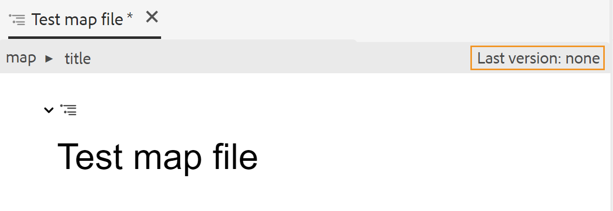

# Creare una mappa {#id176FEN0D05Z}

AEM Guides fornisce due modelli di mappe preconfigurati: DITA map e Bookmap. Puoi anche creare modelli di mappa personalizzati e condividerli con gli autori per creare file di mappa.

Per creare un file di mappa, effettua le seguenti operazioni:

1. Nell’interfaccia utente di Assets, individua il percorso in cui desideri creare il file mappa.

1. Fare clic su **Crea** \> **Mappa DITA**.

1. Nella pagina Blueprint, seleziona il tipo di modelli di mappa che desideri utilizzare e fai clic su **Avanti**.

   >[!NOTE]
   >
   > Il modo in cui gli argomenti vengono trattati in un file di mappa dipende dal modello di mappa. Se ad esempio si seleziona il modello Mappa, verranno utilizzati i riferimenti agli argomenti \(`topicref`\) per fare riferimento agli argomenti. In caso di Bookmap, i riferimenti agli argomenti vengono creati utilizzando l&#39;elemento `chapter` in DITA.

   {width="650" align="left"}

1. Nella pagina Proprietà, specifica la mappa **Titolo**.

1. \(Facoltativo\) Specificare il file **Name**.

   Se l’amministratore ha configurato il nome file automatico in base all’impostazione UUID, l’opzione per specificare il nome file non sarà visibile. Al file viene automaticamente assegnato un nome di file basato su UUID.

   Se è disponibile l’opzione di denominazione del file, anche il nome viene suggerito automaticamente in base al Titolo della mappa. Se si desidera specificare manualmente il nome del file di mapping, verificare che il nome del file non contenga spazi, apostrofi o parentesi graffe e termini con `.ditamap`.

1. Fai clic su **Crea**.

   Viene visualizzato il messaggio Mappa creata.

   A ogni nuovo file di mappa creato dall&#39;interfaccia utente di Assets **Create** \> **DITA Map** o dall&#39;editor Web viene assegnato un ID di mappa univoco. Inoltre, la nuova mappa viene salvata come copia di lavoro più recente in DAM. Fino a quando non salvi una revisione di una mappa appena creata, nella Cronologia versioni non viene visualizzato alcun numero di versione. Se apri la mappa per la modifica, le informazioni sulla versione vengono visualizzate nell’angolo superiore destro della scheda del file mappa:

   {width="650" align="left"}

   Le informazioni sulla versione di una mappa appena creata vengono visualizzate come *none*. Quando salvi una nuova versione, ad essa viene assegnato il numero di versione 1.0. Per ulteriori informazioni sul salvataggio di una nuova versione, vedere [Salva come nuova versione](web-editor-features.md#save-as-new-version-id209ME400GXA).

   Puoi scegliere di aprire la mappa per la modifica nell’editor di mappe configurato oppure di salvare il file di mappa nell’archivio AEM.

   >[!NOTE]
   >
   > Per utilizzare l&#39;Editor mapping avanzato, accedere al file di mapping nell&#39;Editor Web. Se l&#39;amministratore ha configurato l&#39;Editor mapping avanzato come editor predefinito nei file di mapping, il file di mapping viene aperto direttamente nell&#39;Editor mapping avanzato per la modifica. Consulta *Impostare l&#39;Editor mappe avanzate come predefinito* nella sezione Installare e configurare Adobe Experience Manager Guides as a Cloud Service.

**Argomento padre:**&#x200B;[&#x200B; Utilizzare l&#39;editor mappe](map-editor.md)
