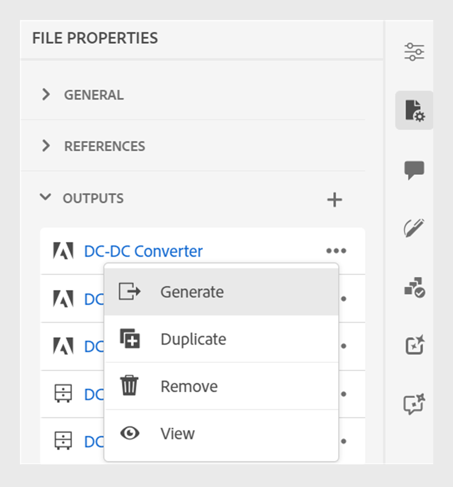

# Pagine Publish Adobe Experience Manager Sites

La pagina Experience Manager Sites fa riferimento al contenuto pubblicato sul sito web Adobe Experience Manager. Experience Manager Guides consente di pubblicare un argomento autonomo in una pagina Sites.

Questa funzione consente di pubblicare un argomento e i relativi elementi senza creare una mappa DITA e i predefiniti di output. Puoi aggiornare facilmente l’argomento, ripubblicare la pagina Sites e riutilizzarla in diverse pagine web. Utilizzando questa funzione è possibile pubblicare facilmente articoli autonomi o contenuti di marketing.

Per generare una pagina Sites, effettuare le seguenti operazioni:

1. Seleziona **Nuovo output**  dalla sezione **Output** nelle **Proprietà file** di un argomento.
1. Selezionare **Pagina siti**.

1. Nella finestra di dialogo **Genera pagina Sites**, compila i seguenti dettagli:
   {width="500" align="left"}

   *Aggiungere il percorso, il titolo, il nome e i dettagli del modello per pubblicare un argomento o i relativi elementi come pagina Sites. *

   * **Percorso**: sfogliare e selezionare il percorso della cartella in cui si desidera pubblicare la pagina Sites.
   * **Titolo**: digita il titolo della pagina Sites. Per impostazione predefinita, il titolo viene compilato con il titolo dell’argomento. Puoi modificarlo. Questo titolo viene utilizzato per generare il nome della pagina Sites.
   * **Nome**: digitare il nome della pagina Sites. Per impostazione predefinita, il nome viene compilato con il titolo dell’argomento e i caratteri non consentiti, come spazi e caratteri speciali, vengono sostituiti con &quot;_&quot;. Ad esempio, *sample_sites_page*. Puoi modificarlo. Questo nome viene utilizzato per generare l’URL per la pagina Sites.
   * **Modello pagina**: seleziona il modello di pagina Sites per creare la pagina Sites. Puoi visualizzare i modelli nella cartella sul percorso selezionato. L’amministratore può anche caricare modelli personalizzati.

   * Puoi anche selezionare condizioni diverse per pubblicare il contenuto.  Selezionare una delle opzioni seguenti:

      * **Nessuno**: selezionare questa opzione se non si desidera applicare alcuna condizione all&#39;output pubblicato.
      * **Utilizzo di DITAVAL**: selezionare il file DITAVAL per generare contenuto personalizzato. Potete selezionare il file DITAVAL utilizzando la finestra di dialogo Sfoglia (Browse) o digitando il percorso del file.
      * **Utilizzo di attributi**: è possibile definire attributi di condizione negli argomenti DITA. Quindi, seleziona l’attributo della condizione per pubblicare il contenuto pertinente.

     >[!NOTE]
     > 
     >Le condizioni sono abilitate solo se gli attributi della condizione sono definiti nell&#39;argomento.

1. Fai clic su **Genera** per pubblicare la pagina Sites.
1. Puoi visualizzare la pagina Sites per un argomento nella sezione **Output** delle **Proprietà file**. Le pagine Sites vengono visualizzate in base alla data e all’ora di pubblicazione, la più recente delle quali corrisponde alla prima.

   {width=300 align=&quot;left&quot;}

   *Visualizzare la pagina Sites presente per un argomento e ripubblicarla.*

Dopo aver pubblicato la pagina Sites, puoi utilizzarli su qualsiasi sito Adobe Experience Manager.

## Menu Opzioni per un Experience Manager Sites

Puoi anche eseguire le seguenti azioni per un Experience Manager Sites dal menu **Opzioni**:

* **Genera**: ripubblica la pagina Sites per aggiornarla con il contenuto più recente dell&#39;argomento DITA. Quando rigeneri l’output senza modificare il percorso, il nome, il titolo, il modello e le condizioni, la pagina Sites viene semplicemente aggiornata con il contenuto più recente.

* **Duplicato**: duplicare una pagina Sites. Puoi modificare il percorso, il nome, il titolo e il modello. È inoltre possibile selezionare condizioni diverse quando si duplica una pagina Sites.

* **Rimuovi**: rimuovi una pagina Sites dall&#39;elenco degli output. Viene visualizzata una richiesta di conferma. Dopo la conferma, la pagina Sites viene rimossa dall&#39;elenco **Output**. Tuttavia, la pagina Sites non viene eliminata definitivamente.

* **Visualizza**: visualizza l&#39;editor di pagine Sites. Puoi anche apportare modifiche e salvarle.
