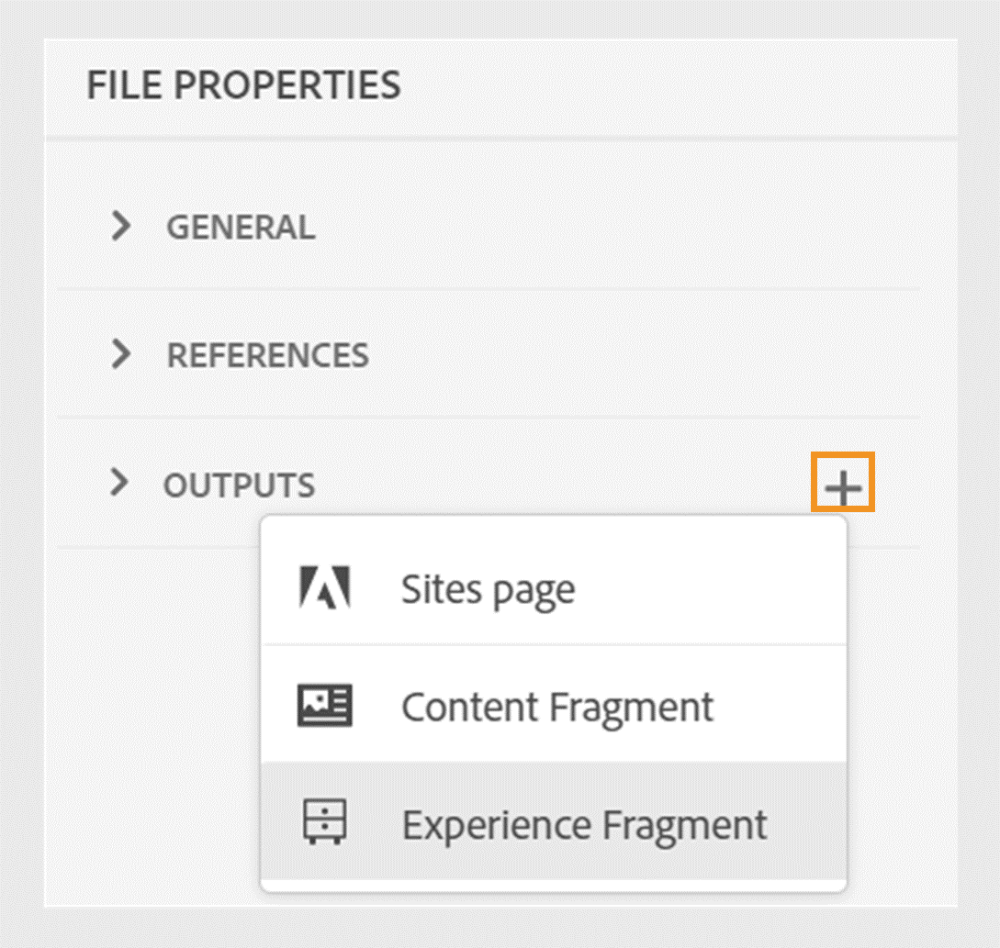

# Frammenti esperienza Publish

I frammenti di esperienza sono parti di contenuto modulare in Adobe Experience Manager. Questi blocchi di contenuto sono basati su modelli e incapsulano sia il contenuto che il relativo layout. Questi contenuti riutilizzabili consentono ai creatori di contenuti di assemblare e fornire esperienze coerenti e scalabili su più canali supportati da Experience Manager. Questa funzione consente di creare facilmente esperienze di marketing coerenti in modo efficiente, come newsletter, banner promozionali e testimonianze di clienti.

Experience Manager Guides consente di pubblicare un argomento o i relativi elementi in un frammento di esperienza. Puoi creare una mappatura basata su JSON tra un argomento e i relativi elementi in un frammento di esperienza. Quindi, utilizza la mappatura per pubblicare un argomento o i relativi elementi in un frammento di esperienza. Puoi quindi utilizzare i frammenti di esperienza in qualsiasi sito di Experienci Manager o estrarre i dettagli tramite API supportate da Frammenti di esperienza.

Per generare un frammento di esperienza, effettua le seguenti operazioni:

1. Crea una cartella nei Frammenti esperienza. Utilizza questa cartella per salvare i frammenti esperienza creati in base ai modelli di frammenti esperienza. Ad esempio, *frammenti esperienza-vendite*.
1. Seleziona la cartella, quindi fai clic sull&#39;icona **Proprietà** in alto.
1. Modifica le proprietà della cartella (ad esempio, *frammenti esperienza-vendite*).

   * **Titolo**: visualizza o modifica il titolo della cartella.

   * **Modelli consentiti**: contiene l&#39;elenco dei modelli che possono essere aggiunti come pagine figlie del frammento di esperienza. Per aggiungere il modello consentito, specificare l&#39;espressione regolare per il recupero dei modelli richiesti nel campo **Modelli consentiti**.
Ad esempio:
     `/libs/cq/experience-fragments/components/experiencefragment/template`

     Se non si definisce un modello consentito per una cartella, i modelli vengono selezionati dalla cartella principale o dalla cartella dei modelli per impostazione predefinita.
   * **Ordinabile**: consente di modificare l&#39;ordine delle risorse all&#39;interno di una cartella.
     {width="650" align="left"}
     *Aggiungi la configurazione cloud nelle proprietà della cartella per collegarla ai modelli di frammento.*
1. Per generare un frammento di esperienza, seleziona **Nuovo output**  dalla sezione **Output** nelle **Proprietà file** di un argomento.
1. Seleziona **Frammento esperienza**.\
   {width="300" align="left"}

   *Aggiungi un nuovo frammento di esperienza dalle proprietà file di un argomento*.

   >[!NOTE]
   >
   > È inoltre possibile pubblicare un frammento di esperienza dalla **vista archivio**. Seleziona l’argomento da pubblicare come frammento di esperienza. Quindi, dal menu **Opzioni**, seleziona **Publish As** > **Frammento esperienza**.

1. Nella finestra di dialogo **Genera frammento esperienza**, compila i seguenti dettagli:
   {width="500" align="left"}

   *Aggiungi il percorso, il modello e i dettagli di mappatura per pubblicare un argomento o i relativi elementi come frammento di esperienza. È possibile sovrascrivere un frammento di esperienza esistente.*

   * **Percorso**: sfoglia e seleziona il percorso della cartella in cui desideri pubblicare il frammento di esperienza. Puoi anche selezionare un frammento di esperienza esistente e ripubblicarlo.
   * **Titolo**: digita il titolo del frammento di esperienza. Per impostazione predefinita, il titolo viene compilato con il titolo dell’argomento. Puoi modificarlo. Questo titolo viene utilizzato per generare il nome del frammento di esperienza.
   * **Nome**: digita il nome del frammento di esperienza. Per impostazione predefinita, il nome viene compilato con il titolo dell&#39;argomento e gli spazi vengono sostituiti con &quot;_&quot;. Ad esempio, *sample_experience_fragment*. Puoi modificarlo. Questo nome viene utilizzato per generare l’URL per il frammento di esperienza.
   * **Modello**: seleziona il modello Frammento esperienza da utilizzare per creare il frammento esperienza. I modelli vengono selezionati dalla cartella configurata nelle proprietà.
   * **Mapping**: seleziona il mapping dal file *experienceFragmentMapping.json* e lo visualizza.

     L&#39;amministratore può aggiungere le mappature nel file *experienceFragmentMapping.json*.  Ulteriori informazioni su come [creare una mappatura tra un argomento e un frammento di esperienza](../cs-install-guide/conf-experience-fragment-mapping-cs.md) nella Guida all&#39;installazione e alla configurazione.

   * Puoi anche selezionare condizioni diverse per pubblicare il contenuto.  Selezionare una delle opzioni seguenti:

      * **Nessuno**: selezionare questa opzione se non si desidera applicare alcuna condizione all&#39;output pubblicato.
      * **Utilizzo di DITAVAL**: selezionare il file DITAVAL per generare contenuto personalizzato. Potete selezionare il file DITAVAL utilizzando la finestra di dialogo Sfoglia (Browse) o digitando il percorso del file.
      * **Utilizzo di attributi**: è possibile definire attributi di condizione negli argomenti DITA. Quindi, seleziona l’attributo della condizione per pubblicare il contenuto pertinente.

     >[!NOTE]
     > 
     >Le condizioni sono abilitate solo se gli attributi della condizione sono definiti nell&#39;argomento.

   * Selezionare la casella di controllo **Sovrascrivi contenuto esistente** se il frammento di esperienza esiste già e si desidera sovrascriverlo. Se non selezioni la casella di controllo e il frammento di esperienza esiste già, in Experience Manager Guides viene visualizzato un errore.
1. Fai clic su **Genera** per pubblicare il frammento di esperienza.
1. Puoi visualizzare i frammenti di esperienza per un argomento nella sezione **Output** delle **Proprietà file**. I Frammenti esperienza vengono visualizzati in base alla data e all’ora di pubblicazione, il più recente dei quali è il primo.

   {width=300 align=&quot;left&quot;}

   *Visualizza i frammenti di esperienza presenti in un argomento e ripubblicali.*

Dopo aver pubblicato i frammenti esperienza, puoi utilizzarli su qualsiasi sito Adobe Experience Manager.

## Menu Opzioni per un frammento esperienza

Puoi anche eseguire le seguenti azioni per un frammento di esperienza dal menu **Opzioni**:

* **Genera**: ripubblica il frammento di esperienza per aggiornarlo con il contenuto più recente dell&#39;argomento DITA. Quando rigeneri l’output, non puoi modificare il percorso, il nome, il titolo e il modello del frammento di esperienza. Tuttavia, potete selezionare condizioni diverse durante la rigenerazione dell&#39;output.

* **Duplicato**: duplicare un frammento di esperienza. Puoi modificare il percorso, il nome, il titolo e il modello. Puoi anche selezionare condizioni diverse quando duplichi un frammento di esperienza.

* **Rimuovi**: rimuovi un frammento di esperienza dall&#39;elenco degli output. Viene visualizzata una richiesta di conferma. Dopo la conferma, il frammento di esperienza viene rimosso dall&#39;elenco **Output**. Tuttavia, il frammento di esperienza non viene eliminato dalla cartella.

* **Visualizza**: visualizza l&#39;editor frammenti esperienza. Puoi anche apportare modifiche e salvarle.
