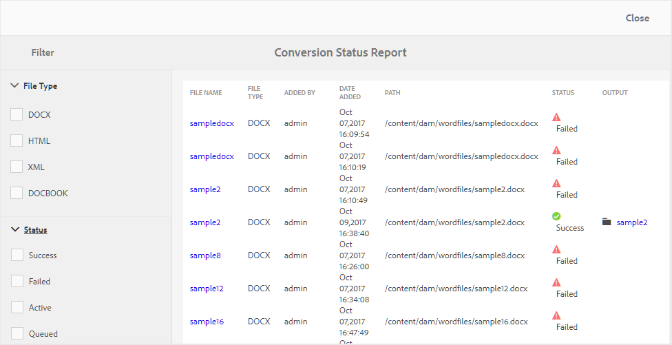

# Rapporto sullo stato della conversione {#id205BBA00WZZ}

AEM Guides fornisce una solida funzione di conversione per convertire documenti di vari formati in DITA. Il rapporto sullo stato della conversione fornisce una visualizzazione consolidata di tutte le attività di conversione eseguite da AEM Guides.

Per visualizzare il rapporto Stato conversione, effettuare le seguenti operazioni:

1. Fai clic sul collegamento Adobe Experience Manager in alto e scegli **Strumenti**.

1. Selezionare **Guide** dall&#39;elenco degli strumenti.

1. Fai clic sulla sezione **Rapporto sullo stato di conversione**.

   Viene visualizzato il Rapporto sullo stato della conversione per tutti i task di conversione eseguiti sul sistema.

   {width="800" align="left"}

1. La pagina del rapporto è divisa in due parti:

   - **Filtro:**

     Puoi filtrare i dati del rapporto in base al tipo di file e allo stato della conversione. In Tipo file è possibile scegliere di visualizzare i dati del report per i documenti di Word, HTML strutturato, XML e DocBook. Nello stato è possibile scegliere di visualizzare i dati del report per le attività eseguite correttamente, non riuscite, attive o in coda.

     Nella schermata seguente vengono visualizzati i dati del rapporto per le attività di conversione con stato Non riuscito, Attivo e In coda.

     {width="800" align="left"}

   - **Dati report:**

     I dati del rapporto contengono le colonne seguenti:

      - **Nome file**: nome del file di origine in cui è stato eseguito il processo di conversione. Se si fa clic sul collegamento Nome file, viene visualizzata la posizione del documento di origine.

      - **Tipo file**: tipo di documento di origine, ad esempio Word, HTML strutturato, XML e DocBook.

      - **Aggiunto da**: nome dell&#39;utente che ha eseguito l&#39;attività di conversione.

      - **Data aggiunta**: data in cui è stata eseguita l&#39;attività. Facendo clic sul collegamento Data aggiunta, viene scaricato il file di registro.

      - **Percorso**: percorso completo del documento di origine.

      - **Stato**: stato delle attività di conversione - Completate, Non riuscite, Attive o In coda.

      - **Output**: percorso del documento convertito. Facendo clic sul collegamento Output si raggiunge la posizione in cui viene salvato l&#39;output.

**Argomento padre:**&#x200B;[ Report](reports-intro.md)
