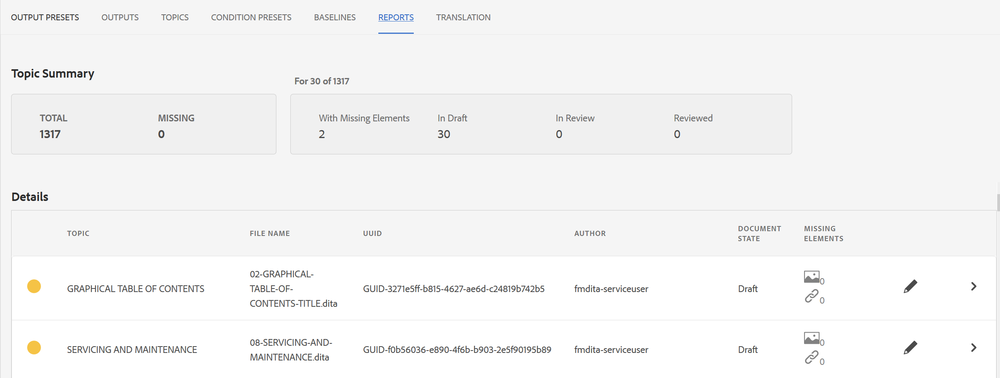

# Rapporto mappa DITA dal dashboard delle mappe {#id205BB800EEN}

AEM Guides fornisce agli amministratori le funzionalità di reporting per verificare l’integrità complessiva della documentazione prima che venga trasmessa in diretta o resa disponibile agli utenti finali. Il report mappa DITA dal dashboard delle mappe in AEM Guides fornisce informazioni preziose come gli argomenti mancanti, gli argomenti con elementi mancanti, l&#39;UUID degli argomenti e dei file multimediali di riferimento e lo stato di revisione di ciascun argomento. Un report dettagliato a livello di singolo argomento fornisce inoltre informazioni relative al contenuto DITA, ad esempio riferimenti al contenuto e immagini mancanti o rimandi.

>[!NOTE]
>
> AEM Guides aggiorna questo rapporto su ogni evento che determina una modifica nel file di mappa o quando viene aggiornato qualsiasi riferimento all’interno del file dell’argomento.

Per visualizzare il rapporto Mappa DITA, effettuare le seguenti operazioni:

1. Nell&#39;interfaccia utente di Assets, passare al file di mapping DITA per il quale si desidera visualizzare il report e fare clic su di esso.

1. Fai clic su **Rapporti**.

   {width="800" align="left"}

   La pagina Rapporti è divisa in due parti:

   - **Riepilogo argomenti:**

     Elenca il riepilogo generale del file di mapping selezionato. Osservando il Riepilogo, è possibile conoscere rapidamente il numero totale di argomenti nella mappa, gli argomenti mancanti, il numero di argomenti con elementi mancanti, lo stato degli argomenti: In bozza, In revisione o Rivisto.

   - **Dettagli:**

     Quando si fa clic su un argomento, viene visualizzato un report dettagliato dell&#39;argomento selezionato.

     {width="800" align="left"}

     Gli elementi evidenziati in **A**, **B**, **C** e **D** sono descritti di seguito:

      - **Argomento**: titolo dell&#39;argomento specificato nella mappa DITA. Passando il puntatore del mouse sul titolo dell&#39;argomento viene visualizzato il percorso completo dell&#39;argomento. In caso di problemi nell&#39;argomento, come riferimenti o immagini mancanti, viene visualizzato un punto rosso prima del titolo dell&#39;argomento.

      - **Nome file**: nome del file.

      - **UUID**: identificatore univoco universale \(UUID\) del file.

      - **Autore**: utente che ha lavorato per ultimo su questo argomento.

      - **Stato documento**: lo stato corrente del documento: Bozza, In revisione o Rivisto.

      - **Missing Topics \(B\)**: If there are topics with broken references, then those topics are listed under the Missing Topics list.

      - **Missing Elements**: Lists the number of missing images or broken cross-references, if any.

      - **Open in Editor \(D\)**: Clicking this icon opens the topic in the Web Editor.

   Items highlighted under **E** are described below:

   - **Multimedia**: Path of images used in the topic is shown along with its UUID. If you click on the image path, the corresponding image is opened in a pop-up window. Broken image links are listed in red color.

   - **Content References**: Path of the content referred in the topic is shown along with its UUID. If you click on the title of the referred content, the corresponding topic is opened in Preview mode.

   - **Cross Reference**: Path of the cross-referenced content is shown along with its UUID. If you click on the title of the referred content, the corresponding topic is opened in Preview mode. Broken cross-references are listed in red color.

   - **Review**: Shows the status of the review task of the topic. You can see the status \(open or close\), due date, and assignee for the topic under review. If you click the topic link, it opens the topic in review mode.

   - **Used In**: Shows a list of other topics or maps where the topic is used. The UUID of all such topics and maps is also listed.

Besides the report for each individual topic, administrators also have access to information such as publishing history of a DITA map. For more information about the history of generated outputs, see [View the status of the output generation task](generate-output-for-a-dita-map.md#viewing_output_history).

## Generate the CSV of DITA map report

You can download and export the CSV of a DITA map report. The CSV contains the detailed DITA map report.

Perform the following steps to generate the CSV of a DITA map report:

1. Click **Generate Report** on the top-left to generate the DITA map report.

   {width="800" align="left"}

1. You will receive a notification once the report is ready to download. Click **Download** to download the CSV of the generated report.

   {width="550" align="left"}

   You can also download the CSV of the generated report later from the AEM notification Inbox.

   Click the generated report in the Inbox to download the report.

   {width="300" align="left"}

Once the report is downloaded in the Inbox you can also select the report and use the Open icon on the top to open the selected report.

**Argomento padre:**&#x200B;[&#x200B; Report](reports-intro.md)
