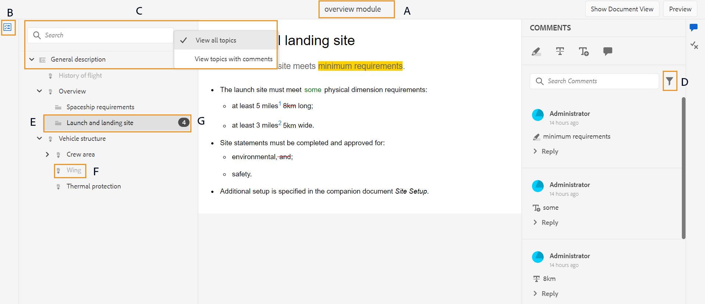
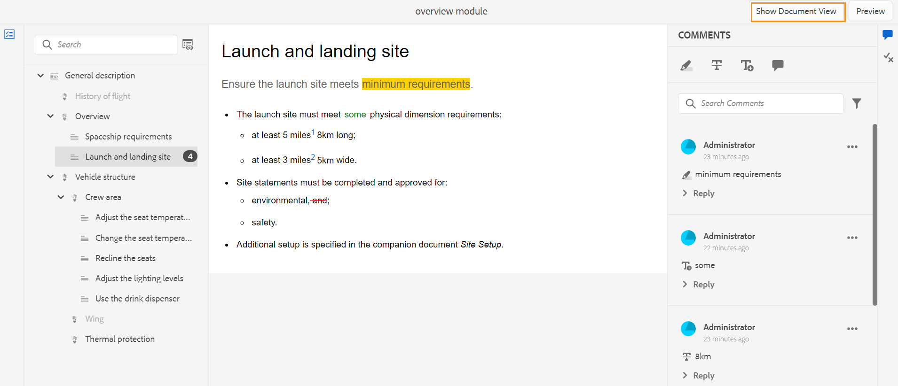
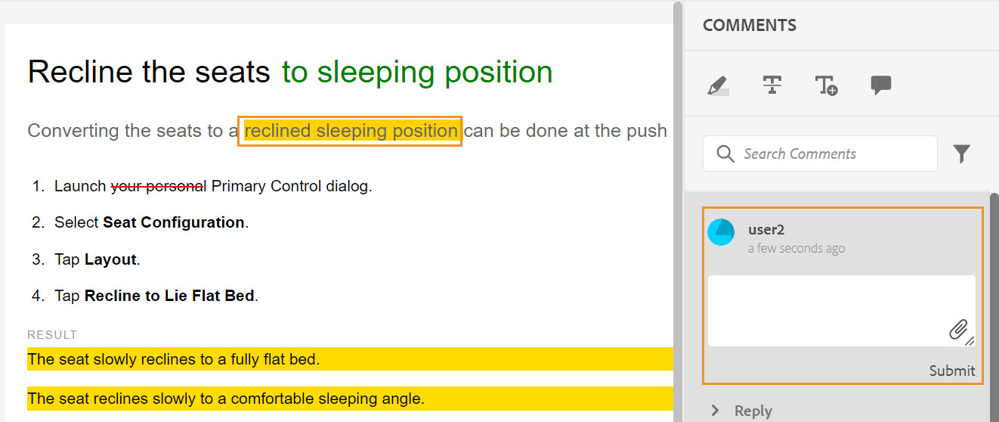
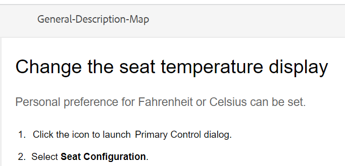
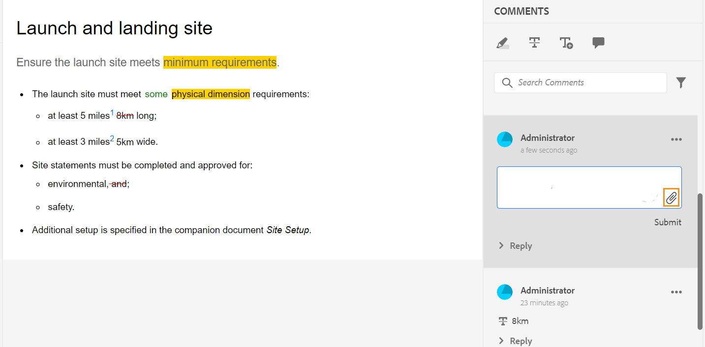
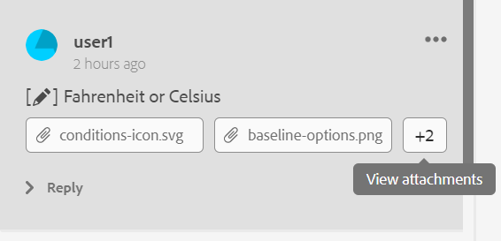
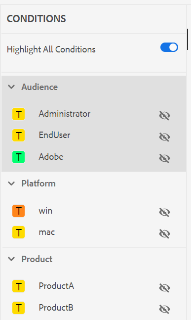
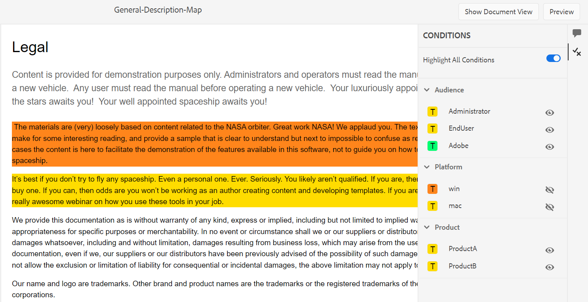

# Rivedi argomenti {#id2056B0W0FBI}

Se sei un revisore, riceverai un’e-mail di richiesta di revisione con il collegamento agli argomenti di revisione. Facendo clic sul collegamento si accede alla pagina di revisione in cui è possibile aggiungere il proprio feedback sugli argomenti condivisi.

Per rivedere un argomento, effettua le seguenti operazioni:

1. Fai clic sul collegamento diretto fornito nell’e-mail della richiesta di revisione.

   Il collegamento argomento o mappa viene aperto in un browser.

   >[!NOTE]
   >
   > Puoi anche accedere al collegamento di revisione dell’argomento dalla tua area di notifica della casella in entrata nell’interfaccia utente di AEM.

1. A seconda del modo in cui viene avviata la revisione dell’argomento, è possibile visualizzare una delle due schermate seguenti:

   >[!NOTE]
   >
   > L’interfaccia utente potrebbe essere diversa se hai creato la revisione in:
   >
   > - AEM Guides as a Cloud Service versione di novembre 2022 o precedente
   > - AEM Guides versione 4.1 o precedente

   Quando si utilizza una mappa DITA per avviare il flusso di lavoro di revisione, viene visualizzata la seguente schermata:

   {width="800" align="left"}

   In questa schermata sono disponibili le seguenti opzioni:

   - **A**: nome dell&#39;attività di revisione.
   - **B**: fare clic sull&#39;icona Visualizzazione argomenti per visualizzare o nascondere il pannello degli argomenti.

   - **C**: è possibile cercare l&#39;argomento richiesto immettendo parte del testo del titolo o del percorso file nella barra di ricerca.

     Selezionare  vicino alla barra di ricerca per scegliere di visualizzare tutti gli argomenti o visualizzare gli argomenti con commenti. Per impostazione predefinita, è possibile visualizzare tutti gli argomenti presenti nell&#39;attività di revisione.

   - **D**: i numeri evidenziati da ***F*** possono essere filtrati scegliendo l&#39;opzione di filtro desiderata da qui. È possibile filtrare i commenti in base al tipo, allo stato, al revisore o alla versione. Ad esempio, per visualizzare il numero di commenti barrati in ciascuno degli argomenti della sezione Revisione, fare clic sull&#39;icona del filtro e quindi scegliere **Tipo di revisione** \> **Eliminazione**.

     >[!NOTE]
     >
     > Quando applicate i filtri, nel pannello dei commenti vengono visualizzati solo i commenti che corrispondono ai filtri selezionati. Il numero di commenti filtrati viene visualizzato a sinistra nel pannello degli argomenti.

   - **E**: un argomento assegnato per la revisione al revisore corrente è visualizzato in nero ed è cliccabile. Quando il revisore fa clic su un collegamento di argomento, l’argomento viene riportato in alto sullo schermo.
   - **F**: un argomento non disponibile per la revisione è disattivato. L&#39;argomento viene visualizzato in modalità di sola lettura e non è consentito aggiungere commenti di revisione su tali argomenti.

   - **G**: numero di commenti ricevuti su un argomento. Questo numero cambia in base al filtro applicato.

   Tutti gli argomenti della mappa vengono visualizzati come un unico documento composito. Gli argomenti che il revisore può esaminare vengono visualizzati normalmente. Gli argomenti che non possono essere esaminati dalla revisione non vengono visualizzati.

   {width="800" align="left"}

   Nella schermata precedente, l’argomento Descrizione generale è condiviso per la revisione del revisore corrente, che viene visualizzato normalmente. Tuttavia, l’argomento successivo, Cronologia del contenuto del volo, non viene condiviso per la revisione e viene visualizzato in modalità di sola lettura. L’argomento attualmente in discussione è evidenziato anche nel sommario.

   Quando si selezionano e si condividono uno o più argomenti per la revisione, viene visualizzata la seguente schermata:

   {width="800" align="left"}

   >[!NOTE]
   >
   > In caso di più argomenti, questi vengono visualizzati come un unico documento composito nella visualizzazione documento. La schermata precedente evidenzia due diversi argomenti presentati uno dopo l’altro in un’unica vista.

1. Apri il pannello Commenti facendo clic sull&#39;icona **Commenti** nell&#39;angolo superiore destro della barra degli strumenti.

   Fornisci i commenti di revisione selezionando un tipo di commento appropriato dalla barra degli strumenti e premendo Invio per inviare il commento.

   >[!NOTE]
   >
   > Il pannello Commenti mostra i commenti forniti solo sugli argomenti correnti. Quando si sposta lo stato attivo su un altro argomento, vengono visualizzati i commenti relativi all&#39;altro argomento.

1. Dopo aver completato la revisione dell&#39;argomento, fare clic sul pulsante **Chiudi**. Facendo clic sul pulsante **Chiudi**, verrai reindirizzato alla pagina da cui hai effettuato l&#39;accesso all&#39;argomento della revisione.

## Funzionalità aggiuntive disponibili nella schermata di revisione

**Visualizzazione documento e visualizzazione argomento** - Per impostazione predefinita, se più argomenti sono condivisi per la revisione, viene mostrata ai revisori una visualizzazione documento composita degli argomenti. In caso di revisione di mappe DITA, tutti gli argomenti della mappa vengono presentati sotto forma di un singolo documento, simile a una visualizzazione libro. Se lo desideri, puoi anche fare clic su un particolare argomento e solo tale argomento viene quindi visualizzato nella schermata di revisione.

Quando si visualizza un singolo argomento, viene visualizzata un&#39;opzione aggiuntiva per tornare alla visualizzazione del documento. Nella schermata seguente, viene aperto per la revisione un particolare argomento di un file di mappa. L&#39;opzione evidenziata - **Mostra visualizzazione documento** consente all&#39;utente di tornare alla visualizzazione documento del file di mappa.

{width="800" align="left"}

**Utilizzo di diversi tipi di strumenti per la creazione di commenti** - È possibile aggiungere commenti in linea evidenziando il testo, barrando il testo, inserendo testo o aggiungendo una nota di commento. Di seguito sono descritti i diversi tipi di strumenti per la creazione di commenti disponibili nella barra degli strumenti Commenti:

{width="350" align="left"}

- **Evidenzia** \(\): per aggiungere un commento di evidenziazione, selezionare il testo e fare clic sull&#39;icona Evidenzia. Oppure, fai clic sull’icona Evidenzia e seleziona il testo desiderato:

  {width="650" align="left"}

  Nel pannello Commenti viene visualizzato un pop-up in cui è possibile aggiungere il commento per il contenuto evidenziato.

- **Barrato** \(\): per suggerire la rimozione del contenuto, selezionarlo e fare clic sull&#39;icona Barrato. Oppure, seleziona il testo desiderato e fai clic sul tasto Canc:

  Nel pannello Commenti viene visualizzato un pop-up in cui è possibile aggiungere il commento per il contenuto eliminato.

- **Inserisci testo** \(\): se si desidera inserire del testo, fare clic sull&#39;icona Inserisci testo e posizionare il cursore nel punto in cui si desidera inserire il testo e digitare le informazioni. In alternativa, posizionare il cursore nel punto in cui si desidera inserire il testo e iniziare a digitare. Le informazioni aggiunte vengono visualizzate in verde:

- **Aggiungi commento**\(\): se desideri aggiungere un commento di tipo nota, fai clic sull&#39;icona Aggiungi commento e immetti il commento nel pop-up.

**Barra degli strumenti contestuale**

È inoltre possibile evidenziare o barrare rapidamente il testo con la barra degli strumenti contestuale. Per aggiungere un commento utilizzando la barra degli strumenti contestuale, effettua le seguenti operazioni:

1. Selezionate il testo da evidenziare o barrare. Viene visualizzata la barra degli strumenti contestuale.

   {width="550" align="left"}

1. Fai clic sull&#39;icona **Evidenzia** o **Barrato**.
1. È possibile aggiungere commenti nel pannello dei commenti per l&#39;azione di evidenziazione o barratura.

**Revisione tramite il pannello Commenti** - Il pannello Commenti visualizza un elenco di commenti relativi all&#39;argomento corrente. In questo pannello sono elencati anche i commenti di altri revisori, se l&#39;argomento viene inviato a più revisori. Ogni commento nel pannello dei commenti è collegato al testo corrispondente nell&#39;argomento corrente. Consente di identificare il testo commentato. Each comment displays the name of the reviewer who has added the comment along with the timestamp.

I commenti vengono visualizzati nell&#39;ordine del testo commentato nel documento. For example, there is a highlight comment on the first sentence and an insert text comment on the second sentence in the first paragraph then the highlight text comment is displayed before the inserted text comment.

The tasks that you can perform using the Comments panel are described below:

- Clicking on a comment highlights and shows the corresponding comment&#39;s location in the document.
- You can add replies to comments.
- You can edit your own comment by clicking on your commented text in the Comments panel and then selecting **Edit** from the Options menu.
- You can delete your own comments by clicking on the comment in the Comments panel and then selecting the **Delete** option from the Options menu.

  {width="300" align="left"}

  >[!NOTE]
  >
  > The Options menu appears only when you hover over your own comments. It is not displayed for the comments by other reviewers.

- All participating users can respond to comments submitted by other users. On a comment, click **Reply** and press Enter to submit a response.

**Modalità anteprima**

- Opening a topic in the Preview mode shows how a topic will be displayed when it is viewed by an author after applying all the changes. For example, all inserted text is shown as normal text and all striked off \(deleted\) text is removed from the content.

- The following screenshot shows the content in *Review* mode:

{width="550" align="left"}

The following screenshot shows the content in *Preview* mode:

{width="550" align="left"}

**Add attachments to comments** -   If you want to supplement your comment by providing additional information which is available in some other file, you can do so by attaching it with your comment. As a reviewer, you can easily add one or multiple files from your local system to your comment. A file can be added to all supported forms of comments - Highlight, Strikethrough, Insert Text, or a Comment.

When you insert any of the comments, the commenting pop-up appears. After providing additional comments or information in the pop-up, you submit it by hitting Enter. Once the comment is added, you get the option to add an attachment to that comment.

{width="800" align="left"}

In the above screenshot, the document contains the highlight comment&#39;s pop-up and the comment is also added in the Comments panel. The file attachment icon is available along with the comment at both the locations.

Per aggiungere un allegato al commento, effettua le seguenti operazioni:

1. Fare clic sull&#39;icona  *Aggiungi allegato* nel commento con cui si desidera aggiungere un allegato.

   Viene visualizzata la finestra di dialogo Apri file.

1. Selezionare uno o più file da allegare.

   I file selezionati vengono visualizzati insieme al commento nel pannello Commenti.

   Nel pannello Commenti potete visualizzare il nome del file e le relative dimensioni. È inoltre possibile rimuovere un file facendo clic sull&#39;icona di eliminazione  associata al nome del file.

1. Fai clic su **Invia**.

   Gli allegati vengono caricati e aggiunti al commento.

**Note aggiuntive sull&#39;utilizzo degli allegati:**

- Per impostazione predefinita, vengono visualizzati solo due file allegati con un commento. Se ci sono altri file, il pulsante **Visualizza allegato** a destra mostra il numero di tutti gli allegati \(che sono più di due\) associati al commento. Fare clic sul numero per visualizzare tutti gli allegati. Se ad esempio sono presenti quattro allegati con un commento, sul pulsante verrà visualizzato +2.

{width="550" align="left"}

- Passando il puntatore del mouse su un allegato è possibile scaricare o rimuovere l&#39;allegato. La rimozione dell’allegato è disponibile solo se il revisore corrente ha aggiunto tale commento, come illustrato nella schermata seguente:

{width="550" align="left"}

Gli altri revisori o autori ottengono solo l’opzione Scarica allegato.

{width="550" align="left"}

- È possibile scaricare tutti gli allegati associati a un commento dalla finestra di dialogo **Visualizza allegati**. Seleziona gli allegati e fai clic sull&#39;icona **Scarica** a livello di commento.

- È inoltre possibile eliminare gli allegati associati a un commento dalla finestra di dialogo **Visualizza allegati**. Selezionare gli allegati e fare clic sull&#39;icona **Elimina**.

{width="550" align="left"}

**Pannello Condizioni** -   Se l&#39;argomento include contenuto condizionale, a destra verrà visualizzata l&#39;icona **Condizioni** \(\). Facendo clic sull&#39;icona **Condizioni** viene aperto il pannello Condizioni che consente di evidenziare il contenuto in base alle condizioni disponibili nell&#39;argomento.

:   Per impostazione predefinita, l&#39;opzione **Evidenzia tutte le condizioni** è attivata, tutte le condizioni sono selezionate, l&#39;intero contenuto viene visualizzato e il contenuto condizionale viene visualizzato come evidenziato sia in modalità di revisione che di anteprima.

:   È possibile disabilitare l&#39;opzione **Evidenzia tutte le condizioni** e visualizzare tutto il contenuto presente nell&#39;argomento come testo normale senza evidenziazioni.

{width="350" align="left"}

Puoi scegliere di nascondere o mostrare una condizione specifica.

- Se nascondi una condizione, il contenuto che la presenta non viene evidenziato nella modalità di revisione.
- Se mostri una condizione, il contenuto condizionale viene evidenziato nella modalità di revisione. Ad esempio, nella schermata seguente, solo il contenuto utilizza due condizioni: `win` e `mac` è evidenziato.

{width="650" align="left"}

In modalità anteprima vengono visualizzati il contenuto non condizionale e il contenuto condizionale che utilizza le due condizioni visualizzate: `win` e `mac`. Il contenuto condizionale rimanente per il quale le condizioni sono nascoste non viene visualizzato.

**Revisione in tempo reale** -   Il pannello Commenti viene aggiornato in tempo reale con i commenti e il feedback o l’azione eseguita dall’autore sui commenti.

- Più revisori potranno lasciare commenti o rispondere ai commenti contemporaneamente sullo stesso documento. Per individuare il revisore del documento, posizionare il puntatore del mouse sull&#39;icona utente nell&#39;angolo in alto a destra dello schermo.

- Se un argomento fa parte di più attività di revisione, i commenti aggiunti in un&#39;attività non vengono visualizzati nell&#39;altra attività.

- Facendo clic sull&#39;icona Commento obsoleto \(\) vengono visualizzate le differenze tra l&#39;ultima e la versione commentata del documento. I numeri di versione \(delle versioni confrontate\) vengono visualizzati nella parte superiore dei documenti.

  {width="800" align="left"}

  >[!NOTE]
  >
  > Quando passi il cursore sull’icona Commento obsoleto, viene visualizzato il numero di versione dell’argomento su cui è stato aggiunto il commento. Ad esempio, se un commento è stato dato alla versione 1.0, viene visualizzato lo stesso.

- Se si fa clic su un commento non aggiornato, nel pannello a sinistra viene visualizzata la relativa versione. La versione precedente viene visualizzata nel pannello a sinistra, mentre la versione corrente nel pannello a destra. Tutti i commenti sulla versione obsoleta vengono importati sul lato sinistro. Puoi confrontare la versione precedente con la versione corrente.

**Filtra commenti** -   È possibile filtrare i commenti in un documento per visualizzare commenti specifici in base alle esigenze. Per filtrare i commenti, fare clic sull&#39;icona **Filtro** \(\) visualizzata nel menu a destra della casella di testo Cerca commenti nel pannello Commenti.

Seleziona una o più delle seguenti opzioni di filtro dalla finestra di dialogo **Tipo filtro** e fai clic su **Applica**.

- **Tipo di revisione** - Filtra in base al tipo di commenti: Evidenzia, Elimina, Inserimento o Commento.
- **Stato revisione** - Filtra in base allo stato del commento come Accettato, Rifiutato o Nessuno.
- **Revisori** - Filtra in base al nome del revisore.

- **Versioni** - Filtra in base ai commenti ricevuti su una particolare versione dell&#39;argomento.

  Quando si utilizzano i filtri, i commenti nel pannello di destra vengono filtrati in base alla selezione e il numero di commenti nel pannello di sinistra viene aggiornato di conseguenza.

Per rimuovere il filtro e visualizzare tutti i commenti, deselezionare tutti i filtri dalla finestra di dialogo **Tipo filtro** e fare clic su **Applica**.

**Argomento padre:**[ Rivedi argomenti o mappe](review.md)
