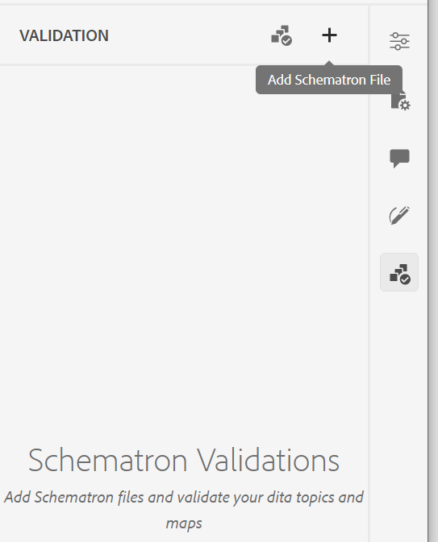

# Supporto per i file Schematron

&quot;Schematron&quot; refers to a rule-based validation language used to define tests for an XML file. Web editor supports Schematron files. You can import the Schematron files and also edit them in Web Editor. Using a Schematron file you can define certain rules and then validate them for a DITA topic or a map.

>[!NOTE]
>
> Web editor supports ISO Schematron.


## Import Schematron files

Perform the following steps to import the Schematron files:

{width="300" align="left"}

1. Navigate to the required folder (where you want to upload the files) in *Repository View*.
1. Click the **Options** icon to open the context menu and choose **Upload Assets**.
1. In the **Upload Assets** dialog, you can change the destination folder in the **Select Asset Folder** field.
1. Click **Choose Files** and browse to select the Schematron files. You can select one or more Schematron files and then click **Upload**.

## Validate a DITA topic or map with Schematron

After importing Schematron files, you can edit them in the Web Editor. You can use the Schematron files to validate the topics or a DITA map. For example, you can create the following rules for a DITA map or topic:

* A title is defined for a DITA map.
* A short description of a certain length has been added.
* There should be at least one topicref in the map.

When you open a topic in the Web Editor, a Schematron Validation panel appears in the right. Perform the following steps to add and validate a topic or map with a Schematron file:
{width="300" align="left"}

1. Click the Schematron icon (), to open the Schematron panel.
1. Utilizzate Aggiungi file di schema (Add Schematron File) per aggiungere file di schema.
1. Se il file Schematron non presenta errori, viene aggiunto ed elencato nel pannello Convalida. Viene visualizzato un messaggio di errore per il file Schematron contenente errori.
   >[!NOTE]
   >
   >Per rimuoverla, potete utilizzare l&#39;icona croce accanto al nome del file Schematron.
1. Fare clic su Convalida con schema per convalidare l&#39;argomento.

   * Se l’argomento non rispetta alcuna regola, viene visualizzato il messaggio di convalida riuscita per il file.
   * Se l&#39;argomento non rispetta una regola, ad esempio se non contiene un titolo ed è convalidato per lo Schematron specificato in precedenza, viene visualizzato un errore di convalida.

1. Fai clic sul messaggio di errore per evidenziare l’elemento contenente l’errore nell’argomento/mappa aperto.

Il supporto Schematron nell&#39;Editor Web consente di convalidare i file in base a un insieme di regole e di mantenere coerenza e correttezza negli argomenti.

## Utilizzare le istruzioni di asserzione e di report per verificare la presenza di regole{#schematron-assert-report}

AEM Guides supporta anche le istruzioni di asserzione e di rapporto in Schematron. Queste istruzioni consentono di convalidare gli argomenti DITA.

### Dichiarazione asserzione

Un’istruzione assert genera un messaggio quando un’istruzione di test restituisce false. Ad esempio, se desideri che il titolo sia in grassetto, puoi definire un’istruzione di asserzione per esso.

```XML
<sch:rule context="title"> 
    <sch:assert test = "b"> Title should be bold </sch:assert>
  </sch:rule>
```

Quando si convalidano gli argomenti DITA con Schematron, viene visualizzato un messaggio per gli argomenti in cui il titolo non è in grassetto.

### Dichiarazione rapporto

Un’istruzione di report genera un messaggio quando un’istruzione di test restituisce true. Ad esempio, se desideri che la descrizione breve sia inferiore o uguale a 150 caratteri, puoi definire un’istruzione di rapporto per verificare gli argomenti in cui la descrizione breve è superiore a 150 caratteri.
Quando si convalidano gli argomenti DITA con Schematron, si ottiene un report completo delle regole in cui l&#39;istruzione report restituisce true. Viene visualizzato un messaggio per gli argomenti in cui la descrizione breve supera i 150 caratteri.


```XML
<sch:rule context="shortdesc"> 
        <sch:let name="characters" value="string-length(.)"/> 
        <sch:report test="$characters &gt; 150">  
        The short description has <sch:value-of select="$characters"/> characters. It should contain more than 150 characters.      
        </sch:report>   
    </sch:rule> 
```

>[!NOTE]
>
> Utilizzare solo espressioni Xpath 2.0 durante la scrittura delle regole Schematron.

## Usa espressioni Regex{#schematron-regex-espressions}

È inoltre possibile utilizzare le espressioni Regex per definire una regola con la funzione matches() e quindi eseguire la convalida utilizzando il file Schematron.

Ad esempio, puoi utilizzarlo per visualizzare un messaggio se il titolo contiene una sola parola.

```XML
<assert test="not(matches(.,'^\w+$'))"> 
No one word titles.
</assert>  
```


## Definire pattern astratti{#schematron-abstract-patterns}

AEM Guides supporta anche i modelli astratti in Schematron. È possibile definire pattern astratti generici riutilizzandoli.  Potete creare parametri segnaposto che specificano il pattern effettivo.


L’utilizzo di modelli astratti può semplificare lo schema Schematron riducendo la duplicazione delle regole e semplificando la gestione e l’aggiornamento della logica di convalida. Può inoltre semplificare la comprensione dello schema, in quanto consente di definire logiche di convalida complesse in un unico modello astratto che può essere riutilizzato in tutto lo schema.


Ad esempio, il codice XML seguente crea un modello astratto a cui fa riferimento il modello effettivo utilizzando l&#39;ID.

```XML
<sch:pattern abstract="true" id="LimitNoOfWords"> 

<sch:rule context="$parentElement"> 

<sch:let name="words" value="string-length(.)"/> 

<sch:assert test="$words &lt; $maxWords"> 

You have <sch:value-of select="$words"/> letters. This should be lesser than <sch:value-of select="$maxWords"/>. 

</sch:assert>  

<sch:assert test="$words &gt; $minWords"> 

You have <sch:value-of select="$words"/> letters. This should be greater than <sch:value-of select="$minWords"/>. 

</sch:assert>  

</sch:rule> 

</sch:pattern> 

<sch:pattern is-a="LimitNoOfWords" id="extend-LimitNoOfWords"> 

<sch:param name="parentElement" value="title"/> 

<param name="minWords" value="1"/> 

<param name="maxWords" value="8"/> 

</sch:pattern> 
```
