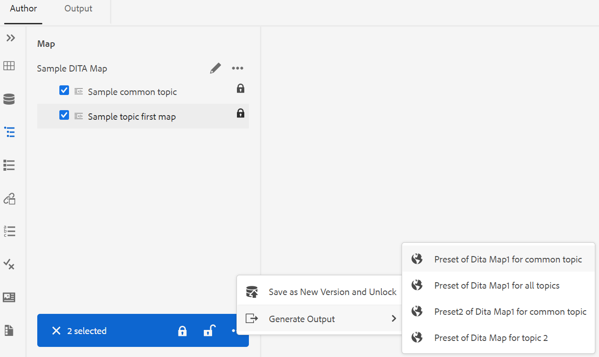

# Genera output dal pannello Repository o dal pannello Vista mappa {#id218CL6010AE}

È inoltre possibile utilizzare i predefiniti di output creati per la mappa DITA per generare l&#39;output dal pannello Repository o dal pannello Vista mappa.

- Utilizzare la funzionalità **Generazione rapida** nel pannello Archivio o nel pannello Visualizzazione mappa per generare l&#39;output per il singolo argomento selezionato o per l&#39;intera mappa DITA.

  >[!NOTE]
  >
  > È inoltre possibile accedere alla funzionalità **Generazione rapida** dal pannello Preferiti o dal pannello Ricerca.

- Utilizzare la funzionalità **Genera output** nel pannello Vista mappa per generare l&#39;output per i diversi argomenti selezionati.

## Pubblicare un argomento utilizzato in una o più mappe DITA

Per generare l&#39;output per uno o più argomenti nella mappa DITA, effettuare le seguenti operazioni:

1. Nella scheda **Autore** selezionare l&#39;argomento nella mappa DITA che si desidera pubblicare.

1. Selezionare **Generazione rapida** dal menu Opzioni dell&#39;argomento selezionato.
   {width="650"}

1. Per pubblicare un argomento utilizzato in una singola mappa DITA, selezionare i predefiniti di output della mappa che si desidera utilizzare per la pubblicazione e fare clic su **Genera**.
   {width="350"}

1. Viene visualizzato lo stato del processo di generazione dell’output. Per visualizzare l&#39;output, posizionare il puntatore del mouse sull&#39;argomento e fare clic su Visualizza output.

1. Se si dispone di un argomento comune utilizzato in più argomenti, selezionare le varie mappe DITA e i predefiniti di output che si desidera utilizzare per pubblicare e fare clic su **Genera.**

   {width="350"}

1. Viene visualizzato lo stato del processo di generazione dell’output.

   - **Argomenti**: elenca gli argomenti selezionati per i quali viene generato l&#39;output.
   - **Predefinito**: visualizza i predefiniti di output contenenti gli argomenti selezionati.
   - **Mappa**: elenca le mappe DITA che contengono l&#39;argomento selezionato.
   - **Stato**: visualizza lo stato di pubblicazione di ciascun argomento.
Per visualizzare l&#39;output, posizionare il puntatore del mouse sull&#39;argomento e fare clic su Visualizza output.
     {width="800"}

## Generare l&#39;output per una mappa DITA dall&#39;editor Web

Per generare l&#39;output per l&#39;intera mappa DITA, effettuare le seguenti operazioni:

1. Nella scheda **Autore** selezionare la mappa DITA che si desidera pubblicare.

1. Selezionare **Generazione rapida** dal menu Opzioni della mappa DITA.

   {width="650"}

1. Selezionare i predefiniti di output della mappa DITA che si desidera utilizzare per la pubblicazione e fare clic su **Genera.**

1. Viene visualizzato lo stato del processo di generazione dell’output. Per visualizzare l&#39;output, posizionare il puntatore del mouse sull&#39;argomento e fare clic su Visualizza output.

## Genera output per più argomenti

Per generare l&#39;output per più argomenti nella mappa DITA dal pannello Vista mappa, effettuate le seguenti operazioni:

1. Nella scheda **Autore** selezionare gli argomenti che si desidera pubblicare.

1. Selezionare **Genera output** dal menu Opzioni nella parte inferiore.

1. Selezionare il predefinito di output della mappa DITA che si desidera utilizzare per la pubblicazione.

   >[!NOTE]
   >
   > Verranno visualizzati solo i predefiniti di output della mappa DITA corrente che contengono tutti gli argomenti selezionati.

   {width="650"}

1. Viene visualizzato lo stato del processo di generazione dell’output.Per visualizzare l&#39;output, posizionare il puntatore del mouse sull&#39;argomento e fare clic su Visualizza output.

**Argomento padre:**[ Pubblicazione basata su articolo dall&#39;editor Web](web-editor-article-publishing.md)
