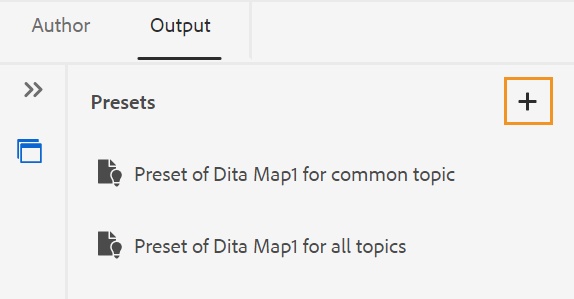
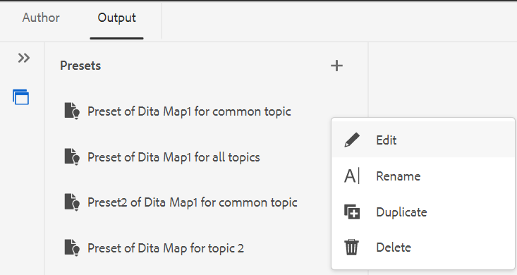

# Creare predefiniti di output dall’editor web {#id218CL400JW3}

Per creare predefiniti di output per la mappa DITA, effettuate le seguenti operazioni:

1. Nell’interfaccia utente di Assets, individua il file di mappa da modificare.

1. Per ottenere un blocco esclusivo sul file mappa, selezionare il file mappa e fare clic su **Estrai**.

1. Selezionare l&#39;opzione **Modifica argomenti** dal menu Azioni del file di mapping.

   Il file mappa viene aperto per la modifica nell&#39;editor Web.

   >[!NOTE]
   >
   > Potete aggiungere o eliminare qualsiasi argomento dalla mappa utilizzando l&#39;Editor mappe avanzato. Per ulteriori dettagli, vedere [Utilizzare l&#39;Editor mappe avanzato](map-editor-advanced-map-editor.md#).

1. Nella scheda **Output**, selezionare l&#39;icona + per creare un predefinito di output per la mappa DITA.

   {width="350"}

1. Immettere il nome del predefinito nella finestra di dialogo Aggiungi predefinito, quindi fare clic su **Aggiungi**.

1. Immetti i seguenti dettagli di configurazione.

   1. Selezionare le opzioni richieste nella scheda **Generale**. Potete scegliere di creare un predefinito di output con o senza condizioni. È inoltre possibile utilizzare un file DITVAL. AEM Guides consente inoltre di selezionare una baseline per la pubblicazione di una versione specifica della mappa DITA.
   1. Immetti i dettagli del sito AEM nella scheda **AEM**. **Sito** visualizza l&#39;elenco di AEM Sites disponibili nell&#39;archivio AEM. **Categoria**, **Modello sezione** e **Modello articolo** sono i componenti strutturali utilizzati per organizzare l&#39;aspetto dell&#39;output. Sono predefiniti nel modello Sito AEM.

      >[!NOTE]
      >
      > Aggiorna ciascun menu a discesa per ottenere l’ulteriore classificazione nel menu a discesa successivo.

   1. Dalla scheda **Articoli**, seleziona gli argomenti per i quali desideri generare l&#39;output.
1. Seleziona l&#39;icona **Genera predefinito** nella parte superiore per generare l&#39;output.

   {width="800"}

1. Viene visualizzato lo stato del processo di generazione dell’output. Nella colonna **Argomenti** sono elencati gli argomenti per i quali viene generato l&#39;output mentre nella colonna **Stato** è visualizzato lo stato di pubblicazione di ciascun argomento.

   Per visualizzare l&#39;output, posizionare il puntatore del mouse sull&#39;argomento e fare clic su Visualizza output.

   {width="800"}

>[!NOTE]
>
> Potete anche modificare, rinominare, duplicare o eliminare un predefinito di output esistente dal menu Opzioni (Options).

{width="550"}

**Argomento padre:**[ Pubblicazione basata su articolo dall&#39;editor Web](web-editor-article-publishing.md)
