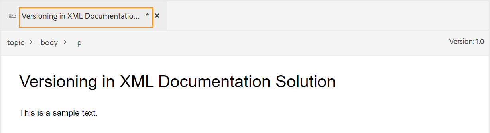

# Modificare gli argomenti nell&#39;editor Web {#id2056B040VUI}

L&#39;editor Web include una serie di funzioni di modifica che consentono di creare o modificare facilmente i file di argomenti. Per modificare un argomento nell&#39;Editor Web, è necessario eseguire la procedura seguente.

>[!IMPORTANT]
>
> Se si verifica un errore dell&#39;applicazione durante l&#39;utilizzo dell&#39;editor Web, aggiornare la pagina per continuare a lavorare.

1. Per apportare modifiche all&#39;argomento, fare clic all&#39;interno del bordo del testo dell&#39;elemento richiesto e iniziare ad apportare modifiche.

1. Per inserire un elemento specifico, fai clic su alla fine dell’elemento dopo il quale desideri inserire il nuovo elemento, quindi fai clic sull’icona dell’elemento richiesto nella barra degli strumenti. È inoltre possibile utilizzare la scelta rapida da tastiera `Alt+Enter` per richiamare il popup **Inserisci elemento**.

   Viene visualizzato un elenco di elementi che è possibile utilizzare nell&#39;argomento. AEM Guides esegue un posizionamento intelligente degli elementi in base alla loro posizione valida nell’argomento.

   >[!NOTE]
   >
   > È inoltre possibile scegliere quale icona visualizzare nella barra degli strumenti configurando il file `ui_config.json` che si trova in - `/etc/designs/fmdita/clientlibs/xmleditor/`. Per ulteriori informazioni sulla personalizzazione delle funzionalità, contattare l&#39;amministratore di sistema.

1. Dopo aver modificato il documento, fare clic su **Salva**.

   >[!NOTE]
   >
   > Se non si desidera eseguire il commit delle modifiche nell&#39;archivio di AEM, fare clic su **Chiudi** e quindi su **Chiudi senza salvare** nella finestra di dialogo Modifiche non salvate.

## Selezione parziale del contenuto tra gli elementi

Experience Manager Guides consente inoltre di selezionare il contenuto tra gli elementi. Dopo aver selezionato il contenuto, puoi eseguire le operazioni seguenti:

- Formattazione ed eliminazione: applica al contenuto selezionato il grassetto, il corsivo, la sottolineatura o persino l’eliminazione. Il contenuto dei tag aperti validi viene quindi unito e visualizzato sotto un singolo elemento. È ad esempio possibile selezionare il contenuto di un paragrafo ed estendere la selezione a un altro paragrafo. Quindi, se rendi in grassetto il contenuto selezionato, tutto il contenuto in grassetto dei tag aperti viene unito e visualizzato sotto un singolo elemento di paragrafo.

Allo stesso modo, se elimini il contenuto selezionato, il contenuto rimanente dopo l’eliminazione nei tag aperti viene unito.

- Racchiudi il contenuto in un elemento valido: per racchiuderlo in un elemento valido, effettua le seguenti operazioni:

   - Seleziona il contenuto all’interno di un elemento.
   - Seleziona l&#39;icona  dalla barra degli strumenti secondaria nella parte superiore per visualizzare la finestra di dialogo **Racchiudi con elemento**. Nella finestra di dialogo sono elencati gli elementi validi per il contenuto selezionato.

     >[!NOTE]
     >
     > È inoltre possibile visualizzare la finestra di dialogo Surround con elemento selezionando il menu di scelta rapida del contenuto selezionato.

   - Selezionate un elemento dalla finestra di dialogo. Il contenuto selezionato viene racchiuso sotto tale elemento. Se ad esempio si seleziona il contenuto in un paragrafo e quindi si sceglie l&#39;elemento `<note>` dalla finestra di dialogo **Racchiudi con elemento**, il contenuto selezionato verrà visualizzato in una nota.\
      {width="300" align="left"}

## Aggiorna il browser durante la modifica dei file

Experience Manager Guides supporta l’aggiornamento del browser quando si modifica il contenuto nell’editor web. Questa funzione consente di continuare a modificare il contenuto in caso di errore dell’applicazione durante il lavoro. Se si preme il pulsante di aggiornamento del browser mentre uno o più file con modifiche non salvate vengono aperti per la modifica, viene visualizzato un avviso che segnala che le modifiche non salvate potrebbero andare perse. È possibile annullare l&#39;operazione di aggiornamento e salvare i file per mantenere le modifiche.

Anche durante l&#39;aggiornamento del browser, le visualizzazioni dei pannelli sinistro e destro vengono mantenute nell&#39;editor Web. Experience Manager Guides ripristina l&#39;ultimo stato salvato dei file aperti nell&#39;editor Web quando si aggiorna il browser. Ad esempio, i file aperti nel pannello Repository vengono aperti nuovamente. Il pannello mappa viene mantenuto insieme alla mappa aperta in precedenza.

L&#39;argomento attivo o la mappa DITA viene riaperto nell&#39;area di modifica del contenuto.

Anche il pannello di destra viene riaperto e visualizza la stessa vista di prima dell’aggiornamento.

## Indicatore copia di lavoro

AEM Guides fornisce l’indicatore della copia di lavoro che indica se la \(copia di lavoro\) corrente del file è sincronizzata o meno con la versione salvata. Se sono state apportate modifiche alla copia corrente e il file non è stato salvato, nella scheda File dell&#39;argomento verrà visualizzato il simbolo \* insieme al titolo. Questo indicatore funge da promemoria per il salvataggio delle modifiche e scompare quando si salva il file.

{width="550" align="left"}

AEM Guides indica anche se l’ultima copia salvata \(working\) del file è sincronizzata o meno con la versione salvata. Se sono presenti modifiche non salvate tra la copia in modifica e l&#39;ultima versione salvata, viene visualizzato un segno \* insieme alle informazioni sulla versione visualizzate nell&#39;angolo superiore destro della scheda del file dell&#39;argomento. Questo indicatore funge da promemoria per salvare e creare una versione dalla copia \(working\) corrente del file.

{width="550" align="left"}

## Aprire i file bloccati in modalità Autore e Source

Quando un file DITA o Markdown viene bloccato o estratto da un altro utente, non è possibile modificare o modificare il contenuto. Tuttavia, è ancora possibile visualizzare il file in formato di sola lettura sia nella modalità **Autore** che nella modalità **Source**, oltre alla modalità **Anteprima**.

Nella modalità di sola lettura è possibile visualizzare il contenuto, i tag e gli attributi nelle modalità **Autore** o **Source**. È inoltre possibile modificare le proprietà del file.

Nella barra degli strumenti vengono visualizzate le icone seguenti per l&#39;accesso in sola lettura:

- Attiva/disattiva visualizzazione tag
- Cronologia delle versioni
- Etichetta versione

In Experience Manager Guides viene inoltre visualizzato un indicatore **Accesso in sola lettura** accanto al numero di versione.

È possibile accedere alla visualizzazione **Layout** per le mappe DITA di sola lettura. Questa visualizzazione consente di visualizzare la mappa DITA e le relative proprietà, ma impedisce le modifiche.

>[!NOTE]
>
> Gli utenti amministratori a livello di cartella devono aggiornare *ui_config.json* in modo da poter accedere in modo armonioso ai file di sola lettura nelle modalità Autore, Source e Layout.

## Individuare un file aperto nella vista Archivio

Quando si apre un file nell&#39;editor Web, in Experience Manager Guides è disponibile la funzionalità che consente di individuare il file nella vista Archivio. Ad esempio, individua l&#39;argomento corrente durante la modifica.

È possibile disattivare la funzionalità per individuare il file con l&#39;opzione **Individua sempre i file nel repository** dalla scheda **Aspetto** delle **Preferenze utente**.

**Argomento padre:**&#x200B;[ Utilizzare l&#39;editor Web](web-editor.md)
