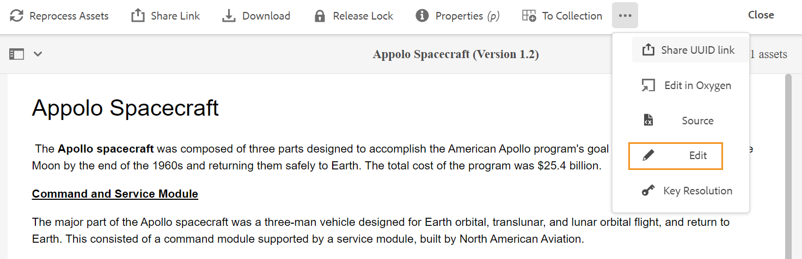
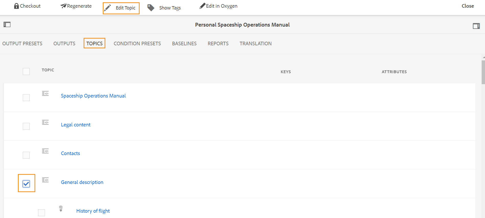

# Avviare l’editor web {#id2056B0140HS}

È possibile avviare l&#39;Editor Web dalle posizioni seguenti:

- [Pagina di navigazione di AEM](#id2056BG00RZJ)
- [Interfaccia utente di AEM Assets](#id2056BG0307U)
- [Console mappe DITA](#id2056BG090BF)

Nelle sezioni seguenti viene descritto come accedere e avviare l&#39;editor Web da varie posizioni.

## Pagina di navigazione di AEM {#id2056BG00RZJ}

Quando accedi ad AEM, viene visualizzata la pagina Navigazione:

{width="800"}

Facendo clic sul collegamento **Guide** si accede direttamente all&#39;editor Web.

{width="800"}

Dopo aver avviato l&#39;editor Web senza selezionare alcun file, viene visualizzata una schermata dell&#39;editor Web vuota. È possibile aprire un file per la modifica dal repository di AEM o dalla raccolta Preferiti.

- Fai clic sull&#39;icona **Guide** ( ) per tornare alla pagina di navigazione di AEM.

- Il pulsante **Chiudi** ti porta a una destinazione basata sulla configurazione:

  

  
 Servizi cloud 

  Se utilizzi Cloud Services, fai clic sul pulsante **Chiudi** per tornare alla pagina di navigazione di AEM.
  

  

  
 Software on-premise

  Se utilizzi AEM Guides On-Premise Software (versione 4.2.1 e successive), fai clic sul pulsante **Chiudi** a destra per tornare al percorso del file corrente nell&#39;interfaccia utente di Assets.

  

## Interfaccia utente di AEM Assets {#id2056BG0307U}

Un’altra posizione da cui è possibile avviare l’editor web è quella dell’interfaccia utente di AEM Assets. È possibile selezionare uno o più argomenti e aprirli direttamente nell&#39;editor Web. Per aprire un argomento nell&#39;editor Web, eseguire la procedura seguente:

1. Nell’interfaccia utente di Assets, individua l’argomento da modificare.

   >[!NOTE]
   >
   > Puoi anche visualizzare l’UUID dell’argomento.

   .

   {width="800"}

   >[!IMPORTANT]
   >
   > Verificare di disporre delle autorizzazioni di lettura e scrittura per la cartella contenente l&#39;argomento che si desidera modificare.

1. Per ottenere un blocco esclusivo sull&#39;argomento, selezionare l&#39;argomento e fare clic su **Estrai**.

   >[!IMPORTANT]
   >
   > Se l&#39;amministratore ha configurato l&#39;opzione **Disattiva modifica senza estrazione**, è necessario estrarre il file prima di modificarlo. Se non si estrae il file, non sarà possibile visualizzare l&#39;opzione di modifica.

1. Chiudi la modalità di selezione delle risorse e fai clic sull’argomento da modificare.

   Viene visualizzata l&#39;anteprima dell&#39;argomento.

   È possibile aprire l&#39;Editor Web dalla visualizzazione Elenco, dalla visualizzazione Scheda e dalla modalità Anteprima.

   >[!IMPORTANT]
   >
   > Se desideri aprire più argomenti per la modifica, seleziona gli argomenti desiderati dall’interfaccia utente di Assets e fai clic su Modifica. Assicurati che nel browser non sia abilitato il blocco dei popup, altrimenti verrà aperto per la modifica solo il primo argomento dell’elenco selezionato.

   {width="800"}

   Se non si desidera visualizzare l&#39;anteprima di un argomento e aprirlo direttamente nell&#39;editor Web, fare clic sull&#39;icona Modifica nel menu Azioni rapide nella vista a schede:

   {width="800"}

1. Fai clic su **Modifica** per aprire l&#39;argomento nell&#39;editor Web.

   {width="800"}

## Console mappe DITA {#id2056BG090BF}

Per aprire l&#39;Editor Web dalla console delle mappe DITA, effettuare le seguenti operazioni:

1. Nell&#39;interfaccia utente di Assets, passare al file di mapping DITA contenente l&#39;argomento che si desidera modificare e fare clic su di esso.

   Viene visualizzata la console delle mappe DITA.

1. Fai clic su **Argomenti**.

   Viene visualizzato un elenco di argomenti nel file mappa. L’UUID degli argomenti viene visualizzato sotto il titolo dell’argomento.

1. Selezionare il file dell&#39;argomento che si desidera modificare.

1. Fare clic su **Modifica argomento**.

   {width="800"}

1. L&#39;argomento viene aperto nell&#39;editor Web.

   >[!IMPORTANT]
   >
   > Se l&#39;amministratore ha configurato l&#39;opzione **Disattiva modifica senza estrazione**, è necessario estrarre il file prima di modificarlo. Se non si estrae il file, il documento viene aperto nell&#39;editor in modalità di sola lettura.

**Argomento padre:**&#x200B;[&#x200B; Utilizzare l&#39;editor Web](web-editor.md)
