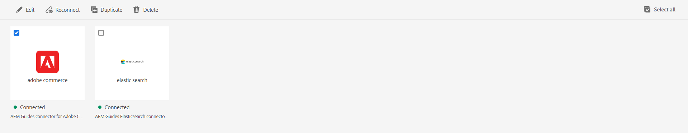

# Configurare un connettore origine dati dall’interfaccia utente

Experience Manager Guides viene fornito con lo strumento **Origini dati** che consente di configurare connettori predefiniti per le origini dati. È possibile impostare i connettori client JIRA, SQL (MySQL, PostgreSQL, Microsoft SQL Server, SQLite, MariaDB, H2DB), AdobeCommerce, Elasticsearch e REST generico.


Oltre a questi connettori predefiniti, Experience Manager Guides fornisce i connettori per le origini dati Salsify, Akeneo e ADO (Microsoft Azure DevOps Board). Puoi scaricare e installare questi connettori open-source dall&#39;[archivio centrale Maven](https://central.sonatype.com/search?q=com.adobe.aem.addon.guides). Gli utenti possono quindi configurare questi connettori.
Scopri come [installare un connettore open-source](#install-open-source-connector).


Puoi anche connetterti a file di dati JSON utilizzando un connettore per file. Carica il file JSON dal computer o sfoglia le risorse Adobe Experience Manager. Quindi, crea snippet di contenuto o argomenti utilizzando i generatori.

Per configurare un connettore, effettuare le seguenti operazioni:

1. Seleziona il collegamento **Adobe Experience Manager** in alto e scegli Strumenti.
1. Selezionare **Guide** dall&#39;elenco degli strumenti.
1. Selezionare il riquadro **Origini dati**. Viene visualizzata la pagina **Origini dati**. È possibile visualizzare le origini dati collegate.

   È possibile passare dalla **Vista elenco** alla **Vista riquadro** per visualizzare le varie origini dati collegate come elenco o come riquadri.

   

   *Visualizzare o creare un connettore origine dati.*

1. Fai clic su **Crea**.
1. Selezionare il database per il quale si desidera creare il connettore. Ad esempio, il connettore Elasticsearch.

   >[!NOTE]
   >
   >Vengono elencati tutti i database predefiniti disponibili.

1. Fai clic su **Avanti**.
1. Immettere la configurazione e i dettagli di connessione in base al database.

   >[!TIP]
   >
   >* Passa il cursore sopra  vicino al campo per visualizzare ulteriori dettagli.
   >* I campi con * sono obbligatori. Ad esempio, puoi immettere i seguenti dettagli per il connettore Elasticsearch.

   * **Nome**: immettere il nome dell&#39;origine dati.
   * **Tipo di autenticazione**: selezionare il tipo di autenticazione dall&#39;elenco a discesa. Ad esempio, autenticazione nome utente-password di base
   * **Nome utente**: immetti il nome utente.
   * **Password**: immetti nome utente e password.
   * **URL**: aggiungi l&#39;URL API.


1. Selezionare l&#39;opzione **Escludi modelli factory** per escludere i modelli factory dall&#39;utilizzo per la generazione di argomenti e frammenti. Non verranno visualizzati nel menu a discesa **Modello di mappatura dati** nella finestra di dialogo **Aggiungi generatore frammenti di contenuto** o **Aggiungi generatore argomenti**.
1. Seleziona **Verifica connessione**. Puoi visualizzare il pulsante **Verifica connessione** abilitato solo dopo aver aggiunto i dettagli richiesti. Visualizza un messaggio di operazione riuscita se i dettagli della connessione sono corretti. In caso contrario, è possibile visualizzare un messaggio di errore.
1. Seleziona **Salva** nella parte superiore per salvare il connettore.     Visualizza il pulsante **Salva** attivato dopo aver compilato tutti i dettagli e aver stabilito la connessione.


   Se il connettore viene salvato correttamente, è possibile visualizzare l&#39;origine dati collegata nella pagina.

**Connessione a più risorse**

È possibile aggiungere o utilizzare più risorse in base a URL diversi per alcuni connettori, come ad esempio Generic REST Client, Salsify, Akeneo e Microsoft Azure DevOps Boards (ADO). Quindi, connettiti con loro per creare snippet di contenuto o argomenti utilizzando i generatori per loro.

Per creare una risorsa, effettua le seguenti operazioni:

1. Seleziona  nella **sezione risorse URL** per aggiungere una risorsa per ogni URL.
1. Configura tutti i dettagli nella finestra di dialogo **Aggiungi risorsa**.
1. Fai clic su **Aggiungi**.
1. Puoi modificare  o eliminare  la risorsa dall&#39;elenco delle risorse URL.
1. È inoltre possibile utilizzare le risorse predefinite disponibili per origini dati quali Salsify, Akeneo e Microsoft ADO. Disattiva le opzioni per la risorsa da non configurare per un’origine dati.

Questo consente di recuperare rapidamente i dati da una qualsiasi delle risorse per una particolare origine dati in un singolo frammento di contenuto o argomento.


## Installare un connettore open source{#install-open-source-connector}

Per pubblicare una dipendenza presente nell&#39;archivio centrale [Maven](https://central.sonatype.com/search?q=com.adobe.aem.addon.guides) in Cloud Services, è necessario includere e incorporare la dipendenza per un connettore open-source.

1. Aggiungi la dipendenza in `all/pom.xml` nel codice del progetto Git di Cloud Manager. Ad esempio, puoi aggiungere la seguente dipendenza per il connettore dell’origine dati delle bacheche DevOps di Microsoft Azure.


   ```
   <dependency>
       <groupId>com.adobe.aem.addon.guides</groupId>
       <artifactId>konnect-azure-devops</artifactId>
       <version>1.0.0</version>
       <type>jar</type>
   </dependency> 
   ```

1. Incorpora la dipendenza aggiunta.

   ```
   <embedded>
       <groupId>com.adobe.aem.addon.guides</groupId>
       <artifactId>konnect-azure-devops</artifactId>
       <type>jar</type>
       <target>/apps/aemdoxonaemcsstageprogram-vendor-packages/content/install</target>
   </embedded> 
   ```

1. Esegui la pipeline per applicare le modifiche in Cloud Services.
Il connettore è installato nell’ambiente.


## Funzioni disponibili per un connettore

* Consente di passare dalla **Vista elenco** alla **Vista riquadro** per visualizzare le varie origini dati collegate come elenco o sezioni.
* Selezionare la casella di controllo relativa a un singolo connettore. Fare clic su **Seleziona tutto** per selezionare tutti i connettori. È possibile fare clic su **Deseleziona tutto** quando sono selezionati tutti i connettori.



*Modifica, riconnetti, duplicato o elimina un connettore origine dati.*

Puoi utilizzare le seguenti funzionalità per il connettore nella pagina **Origini dati**:

* **Modifica**: modifica i dettagli di configurazione per il connettore selezionato.

* **Riconnetti**: riconnettiti a un connettore disconnesso.

* **Duplicato**: crea un nuovo connettore duplicato utilizzando il connettore corrente come base. Per impostazione predefinita, il connettore duplicato viene creato con un suffisso (come connectorname_1). Ad esempio, sample-elastic-search_1.
Se esiste un connettore con lo stesso nome, viene visualizzato un errore.

* **Elimina**: elimina il connettore selezionato.


Dopo aver configurato l&#39;origine dati, il connettore viene elencato nel **pannello Origini dati** nell&#39;editor Web. È quindi possibile connettersi all&#39;origine dati e inserire uno snippet di contenuto negli argomenti. Per ulteriori dettagli, visualizzare [Inserire uno snippet di contenuto dall&#39;origine dati](../user-guide/web-editor-content-snippet.md).

