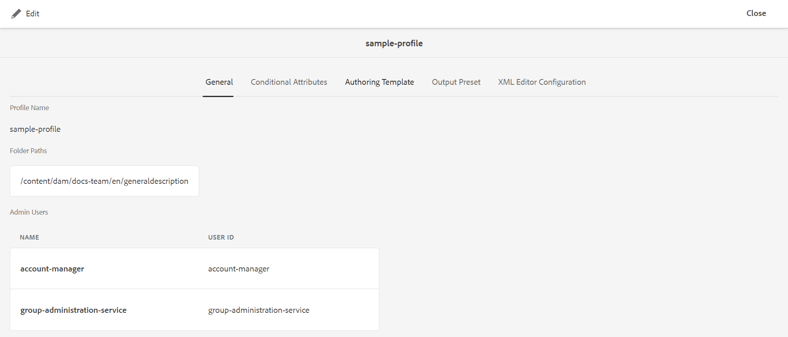

# Configurare profili globali o a livello di cartella {#id181AH2003PF}

In un&#39;azienda, gruppi o prodotti diversi possono utilizzare diversi modelli di authoring, modelli di output, profili di attributi condizionali \(o schemi argomento\) e configurazioni dell&#39;editor Web. Configurarli solo a livello aziendale (o globale) può rendere difficile l’esperienza degli autori, in quanto vedranno modelli o profili che non sono rilevanti per loro.

Le guide AEM consentono di configurare le configurazioni di authoring \(topic o map\), i modelli di output, gli attributi condizionali e gli editor Web a livello aziendale (global\) e di cartella. In questo modo è possibile segregare le configurazioni per diversi reparti o prodotti dell&#39;azienda.

Inoltre, puoi delegare le configurazioni specifiche della cartella a un reparto o agli amministratori di prodotto per decentralizzare l’amministrazione.

Utilizzando il riquadro Profili cartella nelle impostazioni delle Guide, è possibile configurare le impostazioni nelle schede seguenti:

{width="800" align="left"}

- **Generale**: la scheda generale è disponibile solo quando configuri le impostazioni a livello di cartella \ (o progetto/prodotto\). È possibile configurare impostazioni quali i percorsi delle cartelle in cui verranno applicate le impostazioni e gli utenti che disporranno dei diritti di amministratore per creare o aggiornare le configurazioni.

- **Attributi condizionali**: utilizza questa scheda per configurare gli attributi condizionali a livello globale o di cartella. Un attributo condizionale è una combinazione del nome e del valore dell&#39;attributo e puoi anche definire un&#39;etichetta per esso. È possibile utilizzare gli attributi DITA standard o attributi personalizzati. Gli attributi condizionali definiti a livello globale vengono resi disponibili a tutti gli utenti nei vari progetti. Se sono stati definiti attributi condizionali a livello di cartella, questi vengono uniti agli attributi condizionali definiti a livello globale.

- **Modelli**: utilizza questa scheda per configurare i modelli che gli autori utilizzeranno per creare o pubblicare contenuti DITA. Sono disponibili i seguenti modelli di argomento predefiniti:

   - Glossario

   - Riferimento

   - Argomento

   - Concetto

   - Attività

   - Risoluzione dei problemi

   - Vuoto

   - DITAVAL

  >[!NOTE]
  >
  > È possibile utilizzare uno qualsiasi dei modelli esistenti come base per creare nuovi modelli. Il modello DITA vuoto non contiene alcuna struttura o elemento come gli altri modelli. È possibile utilizzare come base qualsiasi modello DITA OOTB, apportarvi modifiche e salvarlo con un nome diverso. Dopo aver apportato le modifiche necessarie, aggiungi il modello aggiornato alla configurazione globale o a livello di cartella dei modelli di authoring, quindi diventa disponibile per l’authoring.

  Oltre ai modelli di argomento, puoi anche definire i modelli di mappa che verranno resi disponibili agli autori. Sono disponibili i seguenti modelli di mappa predefiniti:

   - Mappa

   - Bookmap

- **Predefinito di output**: simile ai modelli, esistono cinque predefiniti di output preconfigurati:

   - Sito AEM

   - PDF

   - HTML5

   - EPUB

   - Personale

  Gli editori possono utilizzare questi predefiniti di output predefiniti per pubblicare i contenuti. Questi predefiniti possono essere configurati da un amministratore del profilo globale o a livello di cartella. Una volta configurati, i predefiniti di pubblicazione diventano disponibili per gli editori per le mappe DITA appena create. È inoltre possibile applicare predefiniti di pubblicazione alle mappe DITA esistenti. Vedere [Applicare le modifiche ai predefiniti](#id18AGD0K0OHS) per ulteriori dettagli.

- **Configurazioni editor XML**: utilizza questa scheda per personalizzare l’aspetto e le varie funzioni dell’editor web. Per l&#39;editor Web sono disponibili le seguenti impostazioni configurabili:

   - Configurazione interfaccia utente editor XML
   - Layout modello CSS
   - Snippet editor XML
   - Etichette di versione del contenuto XML
   - Rootmap \(solo a livello di cartella\)

Puoi configurare entrambi: profilo globale e profilo a livello di cartella. In un profilo a livello di cartella, puoi definire le cartelle in cui applicare le impostazioni. Queste impostazioni includono gli attributi condizionali, i modelli, i predefiniti di output e le impostazioni dell&#39;editor XML. I predefiniti condizionali, i modelli e le configurazioni dell&#39;editor XML vengono quindi resi disponibili agli autori che lavorano nelle cartelle configurate. Analogamente, gli editori avranno accesso ai predefiniti di output configurati definiti nelle cartelle configurate.

Un profilo a livello di cartella sostituisce le impostazioni configurate nel profilo globale. In altre parole, se una cartella dispone di un profilo a livello di cartella, verranno visualizzati i modelli, i modelli di output e le impostazioni dell&#39;editor XML configurati nel profilo di cartella corrispondente. Non mostra le impostazioni configurate nel profilo globale. Tuttavia, questo non si applica agli attributi condizionali. In caso di attributi condizionali, gli attributi condizionali vengono uniti a livello globale e di cartella.

Le sezioni seguenti descrivono come configurare profili globali e profili a livello di cartella.

## Configurare il profilo globale

Per configurare il profilo globale, effettua le seguenti operazioni:

1. Accedi a Adobe Experience Manager come amministratore.

1. Fai clic sul collegamento Adobe Experience Manager in alto e scegli **Strumenti**.

1. Seleziona **Guide** dall&#39;elenco degli strumenti e fare clic su **Profili cartella**.

   Per la prima volta viene visualizzata la pagina Profili cartella con solo il riquadro Profilo globale.

   {width="800" align="left"}

1. Fai clic sul pulsante **Profilo globale** affiancare.

1. Per configurare **Attributi condizionali**, vedi [Configurare gli attributi condizionali per i profili globali o a livello di cartella](#id1889D0I305Z).

1. Per configurare **Modelli**, vedi [Configurare i modelli di authoring](#id1889D0IL0Y4).

1. Per configurare **Predefiniti di output**, vedi [Configurare i predefiniti di output](#id18AGD0IH0Y4).

1. Per configurare la configurazione dell&#39;editor XML, vedere [Configurazione e personalizzazione dell&#39;editor Web XML](#id2065G300O5Z).

1. Dopo aver apportato tutti gli aggiornamenti necessari, salva e chiudi la **Profilo globale**.


## Creare e configurare un profilo a livello di cartella

Per configurare un profilo a livello di cartella, effettua le seguenti operazioni:

1. Accedi a Adobe Experience Manager come amministratore.

1. Fai clic sul collegamento Adobe Experience Manager in alto e scegli **Strumenti**.

1. Seleziona **Guide** dall’elenco degli strumenti e fai clic sul pulsante **Profili cartella** affiancare.

   Per la prima volta, la pagina Profili cartella viene visualizzata solo con la sezione Profilo globale predefinita.

1. Fai clic su **Crea**.

   {width="300" align="left"}

1. Immetti i seguenti dettagli in **Crea profilo cartella** finestra di dialogo:
   - Nome del profilo della cartella.
   - Percorso della cartella in cui sarà applicabile il profilo.

     >[!NOTE]
     >
     > Non è possibile applicare più profili cartella a una cartella. Assicurati che alla cartella che stai selezionando non siano applicati altri profili. Nel caso di cartelle padre-figlio con profili specifici, la cartella figlio utilizzerà le configurazioni del proprio profilo. Le configurazioni della cartella principale non sostituiscono le configurazioni di una cartella secondaria.

1. Fai clic su **Crea**.

   Nella pagina Profili cartella viene creata una nuova tessera con il nome del profilo di cartella

1. Fai clic sulla sezione del profilo della cartella da modificare.

   Viene visualizzata una scheda Generale con il nome del profilo della cartella e le informazioni sulla cartella configurata.

1. Clic **Modifica** per aggiungere più cartelle e utenti che avranno accesso amministrativo per modificare il profilo della cartella.

   >[!NOTE]
   >
   > Gli utenti che aggiungi qui disporranno dei diritti di amministratore per aggiornare gli attributi condizionali, il modello e i predefiniti di output configurati per questo profilo di cartella.

1. Per aggiungere una cartella, fai clic sull’icona Sfoglia in Percorso cartella, individua e seleziona una cartella, quindi fai clic su Aggiungi per aggiungere la cartella a questo profilo.

   >[!NOTE]
   >
   > Assicurati che alla cartella selezionata qui non siano associati altri profili a livello di cartella.

1. Per aggiungere un utente, selezionalo da **Utenti amministratori** e fai clic su **Aggiungi**.

   >[!NOTE]
   >
   > Puoi aggiungere più utenti al profilo di cartella dall’elenco a discesa. Puoi anche rimuovere un utente amministratore esistente dall’elenco facendo clic sull’icona Elimina accanto all’ID utente.

1. Dopo aver aggiunto al profilo della cartella tutte le cartelle e gli utenti richiesti, fai clic su **Salva**.


È ora possibile configurare gli attributi condizionali, i modelli, i predefiniti di output e l&#39;editor XML.

>[!IMPORTANT]
>
> Quando crei un profilo di cartella, per impostazione predefinita non contiene modelli. Devi aggiungere i modelli richiesti nel profilo della cartella per renderli disponibili agli autori.

## Configurare gli attributi condizionali per i profili globali o a livello di cartella {#id1889D0I305Z}

Per configurare gli attributi condizionali standard supportati da DITA a livello globale o di cartella, effettuare le seguenti operazioni:

1. Accedi a Adobe Experience Manager come amministratore o come utente con diritti di amministratore per un profilo a livello di cartella.

1. Fai clic sul collegamento Adobe Experience Manager in alto e scegli **Strumenti**.

1. Seleziona **Guide** dall’elenco degli strumenti e fai clic sul pulsante **Profili cartella** affiancare.

1. Fai clic sulla sezione del profilo che desideri configurare.

   >[!NOTE]
   >
   > Puoi scegliere di configurare gli attributi condizionali nel Profilo globale o in un profilo a livello di cartella.

1. Nella pagina del profilo, fai clic su **Attributi condizionali** scheda.

1. Clic **Modifica**.

1. Clic **Aggiungi**.

1. Inserisci il **Nome**, **Valore**, e un **Etichetta** per l’attributo condizionale.

   Puoi salvare un profilo con solo il nome dell’attributo. Tuttavia, un attributo può essere utilizzato solo quando ha un valore specificato. Se si specificano sia - value che label per un attributo, nell&#39;editor Web verrà visualizzata l&#39;etichetta dell&#39;attributo condizionale. Inoltre, l’etichetta viene mostrata all’amministratore della pubblicazione al momento della creazione di un predefinito condizionale.

   La schermata seguente mostra la definizione per `platform` con possibili valori ed etichette.

   

1. Per aggiungere altri valori per lo stesso attributo, fare clic sul pulsante **+** e immettere il valore e l&#39;etichetta aggiuntivi.

1. Per aggiungere altri attributi, fare clic su **Aggiungi**.

1. Fai clic su **Salva**.


Se si utilizza un attributo personalizzato, deve essere un attributo DITA valido supportato dalla DTD. Se si desidera utilizzare qualsiasi attributo, che non è un attributo DITA standard, eseguire i seguenti passaggi aggiuntivi:

1. Aggiungere l&#39;attributo personalizzato al file DTD. Ad esempio, se il file DTD è commonElements.mod, è necessario individuarlo nella directory DTD. Il percorso predefinito del file DTD di sistema è:

   /libs/fmdita/dita\_resources/DITA-1.3/dtd/base/dtd/commonElements.mod

   >[!IMPORTANT]
   >
   > Il file DTD specializzato deve far parte della distribuzione del codice personalizzato. Le DTD in /apps fanno parte della distribuzione del prodotto e vengono quindi sovrascritte con l&#39;installazione di qualsiasi nuova versione. Si consiglia di aggiungere DTD specializzata in /var/dxml/dita\_resources all&#39;interno della cartella del progetto e di includere il percorso DTD/catalogo nel profilo DITA.Per ulteriori informazioni, vedere [Integrare la specializzazione DITA](dita-ot-specialization.md#id211MB0E00XA).

1. Utilizza Gestione pacchetti per scaricare il file /libs/fmdita/config/condAttrList.xml:

1. Crea una copia del file condAttrList.xml nel percorso seguente nell’archivio Git di Cloud Manager:

   `/apps/fmdfmdita/config/condAttrList.xml`

1. Salva il file.

1. Aggiungi attributi personalizzati al profilo globale o a livello di cartella.


## Configurare i modelli {#id1889D0IL0Y4}

Le guide AEM includono 7 modelli di argomenti predefiniti, 2 modelli di mappe DITA e 3 modelli PDF. Puoi scegliere di avere solo pochi modelli disponibili per gli autori e gli editori. Se utilizzi un modello personalizzato, lo stesso può essere configurato e reso disponibile per l’authoring e la pubblicazione. Utilizzi il **Modelli** nella configurazione di Profili cartella per aggiungere o rimuovere modelli di argomenti, mappe o PDF da profili globali o a livello di cartella.

Anche prima di configurare i modelli di argomento, mappa o PDF a livello globale o di cartella, puoi definire un percorso in cui memorizzare i modelli personalizzati. Per configurare un percorso personalizzato per la memorizzazione dei modelli, vedi [Configura percorso cartella modello DITA personalizzato](conf-template-tags-custom-dita-topic-template.md#id191LCF0095Z).

Per aggiungere i modelli di argomento, mappa o PDF a un profilo di cartella, effettua le seguenti operazioni:

1. Accedi a Adobe Experience Manager come amministratore o come utente con diritti di amministratore per un profilo a livello di cartella.

1. Fai clic sul collegamento Adobe Experience Manager in alto e scegli **Strumenti**.

1. Seleziona **Guide** dall’elenco degli strumenti e fai clic sul pulsante **Profili cartella** affiancare.

1. Fai clic sulla sezione del profilo che desideri configurare.

   >[!NOTE]
   >
   > Puoi scegliere di configurare un modello nel Profilo globale o in un profilo a livello di cartella.

1. Nella pagina del profilo, fai clic su **Modelli** scheda.
1. Clic **Modifica**.

   Per aggiungere modelli di Argomento, Mappa e PDF, puoi effettuare una ricerca dalla posizione predefinita o cercarla.

   >[!NOTE]
   >
   > Per impostazione predefinita, tutti i modelli sono memorizzati nella cartella /content/dam/dita-templates. Il `dita-templates` la cartella contiene `topics`, `maps`, e `PDF` sottocartelle in cui sono memorizzati i modelli di argomento, mappa e PDF. È possibile aggiungere i modelli personalizzati \(.dita,.xml o .ditamapfiles\) nelle cartelle dei modelli predefinite. Una volta aggiunto il modello nella cartella predefinita, potrai aggiungerlo nel profilo globale o cartella. Per ulteriori informazioni sulla creazione di modelli personalizzati tramite l&#39;Editor Web, vedere [Creare un modello di authoring personalizzato](#id1917D0EG0HJ).

   {width="800" align="left"}

1. Aggiungi al tuo profilo i modelli di argomento, mappa e PDF richiesti.

   Per aggiungere un modello, effettuare una delle seguenti operazioni:

   - Scegli **Cerca o digita** e immettere o selezionare il nome di un modello dall&#39;elenco a discesa. L’elenco a discesa è costituito da tutti i modelli predefiniti ed eventuali nuovi modelli creati.

     {width="800" align="left"}

   - Clic **Sfoglia** e seleziona un modello da DAM.

1. Clic **Aggiungi**.

   I modelli selezionati vengono aggiunti all&#39;elenco dei modelli.

   {width="800" align="left"}

   >[!NOTE]
   >
   > È possibile modificare l&#39;ordine dei modelli trascinandoli nella posizione desiderata nell&#39;elenco. La posizione dei modelli controlla l’ordine in cui vengono visualizzati nella pagina Blueprint nel flusso di lavoro per la creazione di argomenti o mappe.

1. Per impostare le regole di traduzione, sfogliare il percorso SRX per trovare la cartella che contiene i file SRX. Il formato SRX \(Segmentation Rules eXchange\) è uno standard per lo scambio di regole di segmentazione tra utenti e ambienti di traduzione diversi. È possibile creare una cartella e aggiungervi file SRX personalizzati.

   Dopo aver creato la cartella che contiene i file SRX, è possibile aggiungere il percorso della cartella in **Posizione SRX traduzione** all&#39;interno del profilo della cartella.

   Guide AEM seleziona le regole SRX in base alla lingua di origine del progetto di traduzione. Cerca un file SRX personalizzato per una lingua e, se non definisci un file SRX personalizzato, seleziona le regole in base alle regole di traduzione predefinite.

1. Fai clic su **Salva**.


Se hai configurato i modelli su un profilo a livello di cartella, i modelli configurati vengono associati alla cartella configurata. Tutti i progetti creati nella cartella configurata avranno accesso solo ai modelli configurati nel profilo a livello di cartella.

## Creare un modello di authoring personalizzato {#id1917D0EG0HJ}

Le guide AEM consentono di creare facilmente modelli. In qualità di amministratore di sistema, puoi utilizzare l’Editor web per creare modelli di authoring da zero. Puoi quindi aggiungere il nuovo modello nel profilo globale o assegnarlo a una cartella specifica utilizzando il profilo specifico della cartella.

Per creare un modello di authoring personalizzato, effettua le seguenti operazioni:

1. Accedi a Adobe Experience Manager come amministratore.

1. Nell’interfaccia utente Assets, passa alla cartella configurata per memorizzare i file modello. Per impostazione predefinita, tutti i modelli di argomento sono memorizzati nella cartella /content/dam/dita-templates/topic.

   >[!NOTE]
   >
   > Per configurare un percorso personalizzato per l&#39;archiviazione di modelli di argomento o mappa, vedere [Configura percorso cartella modello DITA personalizzato](conf-template-tags-custom-dita-topic-template.md#id191LCF0095Z)

1. Clic **Crea** \> **Modello DITA**.

1. Nella pagina Blueprint selezionare il tipo di modello di argomento DITA da creare.

   >[!NOTE]
   >
   > È possibile utilizzare il modello vuoto per iniziare da zero. Il modello vuoto non contiene alcuna struttura o elemento.

1. Fai clic su **Avanti**.

1. Nella pagina Proprietà del nuovo modello, immetti un valore **Titolo**, **Nome**, e **Descrizione** per il modello.

   >[!NOTE]
   >
   > Il nome viene suggerito automaticamente in base al Titolo del modello. Se desideri specificare manualmente il nome, accertati che il Nome non contenga spazi, apostrofi o parentesi graffe e termini con .dita.

1. *\(Facoltativo\)* Fai clic su **Aggiungi una miniatura** sul browser per e seleziona una miniatura da associare al modello.

1. Fai clic su **Crea**.

   Viene visualizzato il messaggio Topic Created (Creazione argomento).

   È possibile scegliere di aprire il modello per la modifica nell&#39;editor Web o di salvare il file modello nel percorso dell&#39;archivio modelli. Una volta creato il modello, è possibile utilizzare l&#39;Editor Web per personalizzarlo in base alle proprie esigenze di creazione. Una volta installato un modello, accertati di associarlo a un profilo globale o a livello di cartella.


## Configurare i predefiniti di output {#id18AGD0IH0Y4}

In una tipica configurazione Enterprise, è possibile utilizzare diversi modelli di output per diversi prodotti o guide utente. Inoltre, potrebbero esserci alcuni processi comuni di generazione dell’output che dovrebbero essere utilizzati da tutti gli editori e un set di processi specifici di generazione dell’output per uno specifico gruppo di editori o progetti.

Le guide AEM consentono all&#39;amministratore di creare predefiniti di output con impostazioni specifiche che possono essere utilizzate da tutti gli editori o da un gruppo specifico di editori per generare output. Ad esempio, l’amministratore può creare un predefinito di output per generare una guida utente comune a tutti gli editori. E un altro per creare i manuali utente di programmazione specifici per un insieme di editori. Entrambi questi predefiniti possono essere configurati per utilizzare diversi modelli di output. In questo esempio, il predefinito di pubblicazione comune per la generazione della guida utente può essere configurato a livello globale. Inoltre, il predefinito di output per la generazione del manuale utente può essere configurato a livello di cartella.

Una volta creati i predefiniti di output nel sistema, tutte le mappe DITA create successivamente utilizzeranno i predefiniti di default per generare l&#39;output. Tuttavia, tutte le mappe DITA esistenti continuerebbero a utilizzare i predefiniti di output precedentemente configurati con esse. Se si desidera applicare il nuovo predefinito di output a tutte le mappe DITA esistenti, è necessario eseguire il flusso di lavoro Applica modifiche predefinito.

Oltre ai predefiniti configurati a livello globale o aziendale, un editore disporrebbe comunque dei diritti per creare più predefiniti di output. Tuttavia, tali predefiniti sono associati alla mappa DITA per la quale vengono creati. Per ulteriori dettagli sulla creazione di predefiniti di output regolari per una mappa DITA, consultate *Creare, modificare, duplicare o rimuovere un predefinito di output* nella guida Utilizzo delle guide di Adobe Experience Manager as a Cloud Service.

Per configurare predefiniti di output globali o specifici per le cartelle, effettua le seguenti operazioni:

1. Accedi a Adobe Experience Manager come amministratore o come utente con diritti di amministratore per un profilo specifico della cartella.

1. Fai clic sul collegamento Adobe Experience Manager in alto e scegli **Strumenti**.

1. Seleziona **Guide** dall’elenco degli strumenti e fai clic sul pulsante **Profili cartella** affiancare.

1. Fai clic sulla sezione del profilo che desideri configurare.

   >[!NOTE]
   >
   > Puoi scegliere di configurare i predefiniti di output nel Profilo globale o in un profilo specifico per la cartella.

1. Nella pagina del profilo. fai clic sul pulsante **Predefiniti di output** scheda.

   Viene visualizzato un elenco di predefiniti di output predefiniti, che include AEM Site, PDF, HTML5, EPUB e CUSTOM.

1. Per creare o modificare un predefinito di output, effettuate una delle seguenti operazioni:

   - Clic **Crea** per creare un nuovo predefinito di output da zero.
   - Fare clic su Duplica per creare una copia del predefinito di output selezionato. Potete apportare modifiche al predefinito duplicato e salvarlo.

   - Clic **Modifica** per aprire la configurazione del predefinito selezionato per la modifica.

     Per informazioni sulle impostazioni del predefinito di output, consultate *Informazioni sui predefiniti di output* nella guida Utilizzo delle guide di Adobe Experience Manager as a Cloud Service.

1. Clic **Salva** per salvare le impostazioni predefinite.


Tutte le mappe DITA create o caricate in seguito avranno il predefinito di output nuovo o aggiornato.

## Applicare le modifiche ai predefiniti {#id18AGD0K0OHS}

Un nuovo predefinito di output creato a livello globale viene reso disponibile per tutte le nuove mappe DITA create in futuro. Analogamente, se viene creato un nuovo predefinito di output a livello di cartella, tale predefinito viene reso disponibile per tutte le mappe che verranno create nella cartella configurata. Per impostazione predefinita, non viene reso disponibile un nuovo predefinito di output per nessuna mappa DITA esistente.

Se avete aggiornato un predefinito di output esistente o desiderate rendere disponibile un nuovo predefinito di output per le mappe DITA esistenti, effettuate le seguenti operazioni:

1. Accedi a Adobe Experience Manager come amministratore o come utente con diritti di amministratore per un profilo specifico della cartella.

1. Fai clic sul collegamento Adobe Experience Manager in alto e scegli **Strumenti**.

1. Seleziona **Guide** dall’elenco degli strumenti e fai clic sul pulsante **Profili cartella** affiancare.

1. Fai clic sulla sezione del profilo che desideri configurare.

   >[!NOTE]
   >
   > Puoi scegliere di configurare i predefiniti di output nel Profilo globale o in un profilo specifico per la cartella.

1. Nella pagina del profilo. fai clic sul pulsante **Predefiniti di output** scheda.

   Viene visualizzato un elenco di predefiniti di output predefiniti, che include AEM Site, PDF, HTML5, EPUB e CUSTOM.

1. Selezionate il predefinito di output da applicare alle mappe DITA esistenti.

1. Clic **Applica modifiche predefinito** nella barra degli strumenti principale.

1. Nella finestra di dialogo Applica modifiche predefinito, puoi scegliere tra:

   - **Selezione dell’opzione Sovrascrivi predefinito esistente**: se selezioni questa opzione, eventuali aggiornamenti apportati nei predefiniti di output esistenti sovrascriveranno le impostazioni in tutte le mappe DITA esistenti in cui viene utilizzato il predefinito. Tuttavia, questa operazione comporterà la perdita di eventuali informazioni esistenti relative al predefinito condizionale e alla linea di base associate alla mappa.

   - **Non selezionare l&#39;opzione Sovrascrivi predefinito esistente**: se non selezioni questa opzione, eventuali aggiornamenti apportati nei predefiniti di output esistenti non influiranno sulle mappe DITA esistenti. Solo i nuovi predefiniti aggiunti vengono aggiunti alle mappe DITA esistenti. La mappa DITA appena creata ottiene sia i predefiniti di output aggiornati che i nuovi predefiniti aggiunti.

1. Clic **OK** per applicare le modifiche dai predefiniti di output selezionati a tutte le mappe DITA esistenti.


## Configurazione e personalizzazione dell&#39;editor Web XML {#id2065G300O5Z}

Per impostazione predefinita, l&#39;editor Web XML è dotato di numerose funzioni che consentono agli autori di creare documenti DITA. Se lavorate in un ambiente restrittivo, potete scegliere quali funzioni sono esposte agli autori. La scheda Configurazione dell&#39;editor XML consente di controllare facilmente le funzioni e di modificare l&#39;aspetto dell&#39;editor Web. In qualità di amministratore, puoi personalizzare i seguenti componenti dell’editor web:

**Configurazione interfaccia utente editor XML**

Questa impostazione consente di controllare la barra degli strumenti e gli altri elementi dell&#39;interfaccia utente dell&#39;editor Web. Fai clic sull&#39;icona Scarica per scaricare il file ui\_config.json sul sistema locale. Puoi quindi apportare modifiche al file e al caricamento allo stesso modo. A seconda della posizione in cui stai caricando il file, a livello globale o a livello di cartella, le modifiche vengono applicate di conseguenza. Per ulteriori dettagli su come personalizzare l&#39;editor XML utilizzando il file ui\_config.json, vedi [Personalizza barra degli strumenti](conf-web-editor-customize-toolbar.md#).

**Layout modello CSS**

Scaricare il file disponibile in questa sezione per personalizzare l&#39;aspetto del documento quando viene visualizzato in anteprima o aperto per la modifica nell&#39;editor Web. Il file CSS predefinito disponibile per il download è solo un file di test, che non deve essere utilizzato per la personalizzazione. Puoi creare un file CSS con le personalizzazioni per l’editor web e caricarlo allo stesso modo. Ad esempio, puoi creare un file .css con il seguente codice:

```
.title {    font-size: 9em;}
```

Salva questo file e caricalo nella sezione Layout modello CSS. La prossima volta che scarichi il file, otterrai il file CSS più recente utilizzato nell’editor web.

**Snippet editor XML**

Utilizzando il file di configurazione in questa sezione, puoi creare alcuni snippet predefiniti e condividerli con gli autori. La struttura predefinita del file è la seguente:

```
{
   "snippetID": {
      "name": "snippet Name",
      "description": "snippet Description",
      "value": "<i>this is snippet value</i>"
  }
}
```

Per creare uno snippet sono necessari i seguenti dettagli:

snippetID : ID univoco dello snippet. Può richiedere un valore alfanumerico.

name : nome descrittivo per identificare lo snippet. Questo nome viene visualizzato nel pannello Snippet.

description : Aggiunge un&#39;informazione descrittiva per lo snippet.

value : specifica il codice XML del frammento.

>[!NOTE]
>
> È possibile aggiungere altri snippet aggiungendo una virgola \(,\) alla fine della definizione dello snippet e ripetendo la stessa struttura per lo snippet successivo.

**Etichette di versione del contenuto XML**

Per impostazione predefinita, agli autori è consentito creare etichette di loro scelta e associarle ai propri file di argomento. Tuttavia, questo può portare a molte varianti della stessa etichetta, ad esempio una potrebbe avere le etichette &quot;Release 1.0&quot;, &quot;Release 1.0&quot;, &quot;Release 1&quot; per identificare la stessa fase di un argomento. Per evitare tali etichette incoerenti nel sistema, puoi creare un elenco predefinito di etichette tra cui gli autori potranno quindi scegliere. L’uso di etichette coerenti consente una migliore gestione dei file nel sistema.

Utilizzando la configurazione dell’etichetta della versione, puoi caricare un elenco di etichette valide per la tua organizzazione. Scarica il file label.json predefinito e modificalo come mostrato di seguito:

```
{
"label1":"Draft",
"label2":"PM-Review",
"label3":"Engg-Review",
"label4":"QE-Review",
"label5":"Ready for Loc",
"label6":"Ready for Publish"
}
```

Nell’esempio precedente, &quot;label1&quot; è l’identificatore della sequenza di etichette e viene aggiunto dall’etichetta visualizzata dagli autori ovunque sia richiesta un’etichetta. Salvare il file e caricarlo nella sezione Etichette versione contenuto XML.

>[!IMPORTANT]
>
> Affinché le configurazioni a livello di cartella diventino effettive, gli utenti devono selezionare il profilo in Preferenze utente nell’Editor web.

**Rootmap**

Se gli autori utilizzano una mappa principale specifica, puoi cercare e selezionare tale mappa qui. Puoi definire la rootmap solo per un profilo a livello di cartella.
