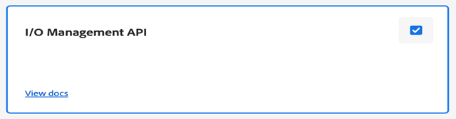

# Configurare l’Assistente alle guide basato sull’intelligenza artificiale per cercare contenuti

In qualità di amministratore, puoi configurare la funzione Assistente guide per gli autori. Il servizio Assistente Guide è protetto dall’autenticazione basata su autenticazione Adobe IMS. Integra il tuo ambiente con i flussi di lavoro di autenticazione sicuri basati su token di Adobe e inizia a utilizzare la nuova funzione Assistente Guide. Le seguenti configurazioni consentono di aggiungere la scheda **Configurazione IA** a un profilo di cartella. Una volta aggiunto, è possibile utilizzare la funzionalità Assistente Guide nell&#39;editor Web.

## Creare configurazioni IMS in Adobe Developer Console

Per creare configurazioni IMS in Adobe Developer Console, effettua le seguenti operazioni:

>[!NOTE]
>
>Se hai già creato un progetto OAuth per configurare la funzione Suggerimenti avanzati o la pubblicazione basata su microservizi, puoi saltare i seguenti passaggi per creare il progetto.

1. Avvia [Adobe Developer Console](https://developer.adobe.com/console).
1. Dopo aver effettuato correttamente l&#39;accesso a Developer Console, verrà visualizzata la schermata **Home**. Nella schermata **Home** è possibile trovare facilmente informazioni e collegamenti rapidi, inclusi i collegamenti di navigazione superiore a progetti e download.
1. Per creare un nuovo progetto vuoto, seleziona **Crea nuovo progetto** dai collegamenti **Avvio rapido**.
    {width="550" align="left"}
   *Crea un nuovo progetto.*

1. Selezionare **Aggiungi API** dalla schermata **Progetti**.  Viene visualizzata la schermata **Aggiungi API**. Questa schermata mostra tutte le API, gli eventi e i servizi disponibili per prodotti e tecnologie di Adobe con cui puoi sviluppare applicazioni.

1. Seleziona l&#39;**API di gestione I/O** per aggiungerla al progetto.
   
   *Aggiungi API di gestione I/O al progetto.*

1. Crea una nuova **credenziale OAuth** e salvala.
    {width="3000" align="left"}
   *Configura le credenziali OAuth nell&#39;API.*

1. Nella scheda **Progetti**, scegli l&#39;opzione **OAuth Server to Server**, quindi seleziona le credenziali appena create.

1. Seleziona il collegamento **OAuth Server-to-Server** per visualizzare i dettagli delle credenziali del progetto.

    {width="800" align="left"}

   *Connettersi al progetto per visualizzare i dettagli delle credenziali.*

1. Torna alla scheda **Progetti** e seleziona **Panoramica progetto** a sinistra.

   

   *Introduzione al nuovo progetto.*

1. Fai clic sul pulsante **Scarica** nella parte superiore per scaricare il JSON del servizio.

   

   *Scarica i dettagli del servizio JSON.*

Hai configurato i dettagli di autenticazione OAuth e scaricato i dettagli del servizio JSON. Mantieni il file a portata di mano in quanto richiesto nella sezione successiva.

### Aggiungere la configurazione IMS all’ambiente

Per aggiungere la configurazione IMS all’ambiente, effettua le seguenti operazioni:

1. Apri Experience Manager e seleziona il programma, che contiene l’ambiente da configurare.
1. Passa alla scheda **Ambienti**.
1. Seleziona il nome dell’ambiente da configurare. Dovresti passare alla pagina **Informazioni sull&#39;ambiente**.
1. Passa alla scheda **Configurazione**.
1. Aggiornare il campo JSON SERVICE_ACCOUNT_DETAILS. Assicurati di usare lo stesso nome e la stessa configurazione forniti nella schermata seguente.

{width="800" align="left"}


*Aggiungi i dettagli di configurazione dell&#39;ambiente.*


Dopo aver aggiunto la configurazione IMS all’ambiente, esegui i seguenti passaggi per collegare queste proprietà ad AEM Guides utilizzando OSGi:

1. Nel codice del progetto Git di Cloud Manager, aggiungi i due file seguenti (per il contenuto del file, visualizza [Appendice](#appendix)).

   * `com.adobe.aem.guides.eventing.ImsConfiguratorService.cfg.json`

1. Assicurati che i file appena aggiunti siano coperti dal tuo `filter.xml`.
1. Esegui il commit e invia le modifiche Git.
1. Esegui la pipeline per applicare le modifiche all’ambiente.

Al termine dell&#39;operazione, sarà possibile utilizzare la funzionalità **Assistente Guide**.


## Appendice {#appendix}

**File**:
`com.adobe.aem.guides.eventing.ImsConfiguratorService.cfg.json`

**Contenuto**:

```
{
 "service.account.details": "$[secret:SERVICE_ACCOUNT_DETAILS]",
}
```


Al termine della configurazione, nel pannello destro dell&#39;editor Web viene visualizzata l&#39;icona **Assistente guide** . Selezionare l&#39;icona per visualizzare il pannello **Assistente guide**.
Per ulteriori dettagli, visualizzare la sezione [Assistente alle guide basate sull&#39;intelligenza artificiale per la ricerca del contenuto](../user-guide/ai-based-guides-assistant.md) nella Guida utente di Experience Manager.
