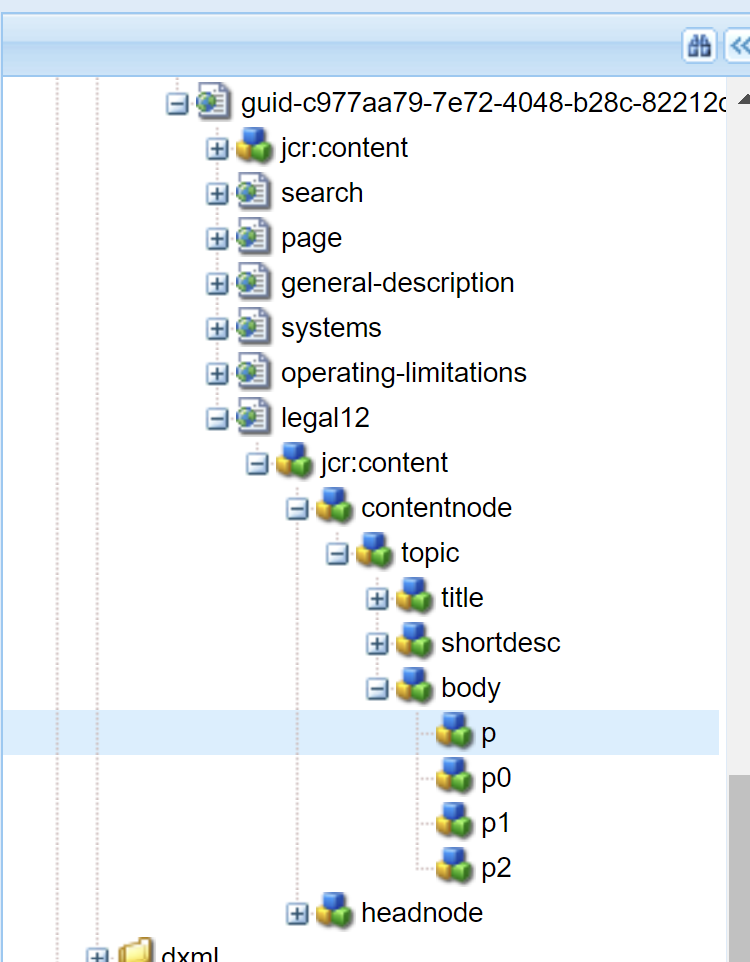
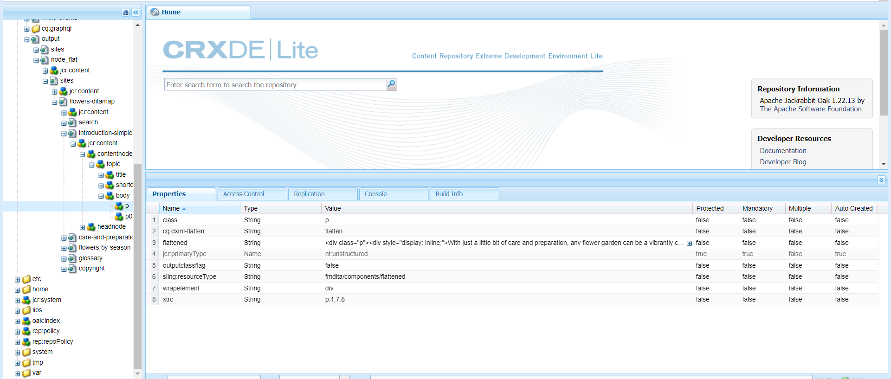
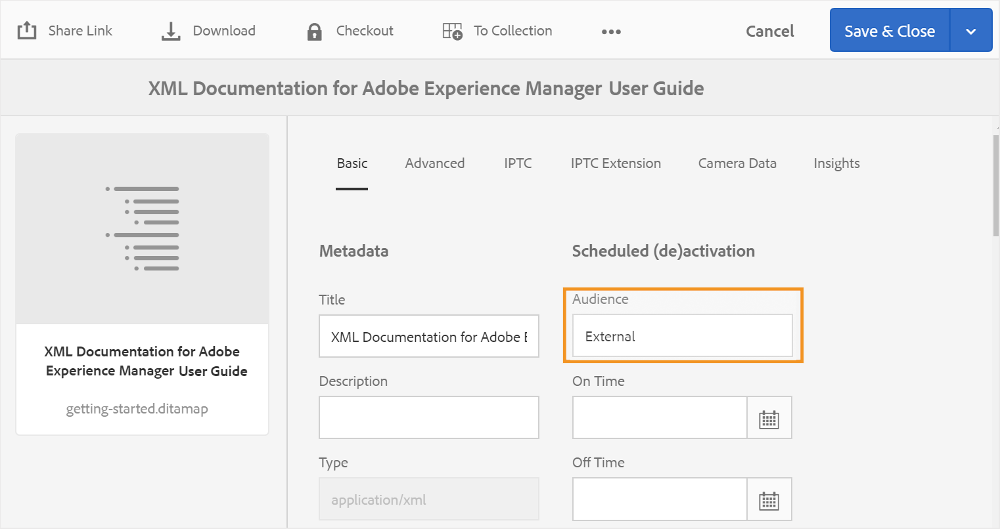

# Configurare le impostazioni di generazione dell’output {#id181AI0B0E30}

Le guide AEM includono numerose opzioni di configurazione per personalizzare il processo di generazione dell’output. Questo argomento descrive tutte le configurazioni e le personalizzazioni utili per configurare il processo di generazione dell’output.

## Configurare la scheda Baseline nel dashboard delle mappe DITA {#id223MD0D0YRM}

Per nascondere la scheda Linea di base nel quadro comandi Mappa DITA, effettuare le seguenti operazioni:

1. Utilizzare le istruzioni fornite in [Sostituzioni configurazione](download-install-additional-config-override.md#) per creare il file di configurazione.
1. Nel file di configurazione, fornisci i seguenti dettagli \(property\) per configurare la scheda baseline nel dashboard delle mappe.

| PID | Chiave proprietà | Valore proprietà |
|---|------------|--------------|
| `com.adobe.fmdita.config.ConfigManager` | `hide.tabs.baseline` | Booleano\(`true/false`\).**Valore predefinito**: `true` |

>[!NOTE]
>
> Questa configurazione è attivata per impostazione predefinita e la scheda Linea di base non è disponibile nel dashboard delle mappe.

## Configurare la pubblicazione mista in un sito AEM esistente {#id1691I0V0MGR}

Se si dispone di un sito AEM che contiene contenuto DITA, è possibile configurare l&#39;output del sito AEM per pubblicare contenuto DITA in una posizione predefinita all&#39;interno del sito. Ad esempio, nella schermata seguente di una pagina del sito AEM, il `ditacontent` Il nodo è riservato all&#39;archiviazione di contenuto DITA:


I nodi rimanenti nella pagina vengono creati direttamente dall’editor del sito AEM. Configurando l&#39;impostazione di pubblicazione in modo che il contenuto DITA venga pubblicato in una posizione predefinita, il processo di pubblicazione delle guide AEM non modificherà nessuno dei contenuti non DITA esistenti.

Per consentire la pubblicazione di contenuto DITA in un nodo predefinito, è necessario eseguire le seguenti configurazioni sul sito esistente:

- Configurare le proprietà del modello del sito

- Aggiungere nodi al sito per pubblicare contenuti DITA


Per configurare le proprietà del modello del sito esistente, effettua le seguenti operazioni:

1. Utilizza Gestione pacchetti per scaricare il file /libs/fmdita/config/templates/default.

   >[!NOTE]
   >
   > Non rendere disponibili personalizzazioni nei file di configurazione predefiniti in `libs` nodo. È necessario creare una sovrapposizione del `libs` nodo in `apps` e aggiorna i file richiesti nel `apps` solo nodo.

1. Aggiungi le seguenti proprietà:

   | Nome proprietà | Tipo | Valore |
   |-------------|----|-----|
   | `topicContentNode` | Stringa | Specificare il nome del nodo in cui pubblicare il contenuto DITA. Ad esempio, il nodo predefinito in cui AEM Guides pubblica il contenuto DITA è: <br> `jcr:content/contentnode` |
   | `topicHeadNode` | Stringa | Specificare il nome del nodo in cui memorizzare le informazioni sui metadati del contenuto DITA. Ad esempio, il nodo predefinito in cui AEM Guides memorizza le informazioni sui metadati è: <br> `jcr:content/headnode` |


La prossima volta che pubblichi un contenuto DITA utilizzando le configurazioni dei modelli del sito, il contenuto viene pubblicato nei nodi specificati in `topicContentNode` e `topicHeadNode` proprietà.

## Personalizzare l’output del sito AEM {#id166TG0B30WR}

Le guide dell’AEM supportano la creazione di output nei seguenti formati:

- Sito AEM
- PDF
- HTML5
- EPUB
- Output personalizzato tramite DITA-OT

Per l&#39;output Sito AEM, è possibile assegnare diversi modelli struttura con diverse attività di output. Questi modelli di progettazione possono eseguire il rendering del contenuto DITA in layout diversi. Ad esempio, puoi specificare diversi modelli di progettazione per il pubblico interno ed esterno.

È inoltre possibile utilizzare plug-in DITA Open Toolkit \(DITA-OT\) personalizzati con le guide AEM. È possibile caricare questi plug-in DITA-OT personalizzati per generare l&#39;output di PDF in un modo specifico.

>[!TIP]
>
> Consulta la *Pubblicazione di siti AEM* sezione nella guida alle best practice per le best practice sulla creazione dell’output del sito AEM.


### Personalizza modello struttura per generare output {#customize_xml-add-on}

Le guide AEM utilizzano una serie di modelli di progettazione predefiniti per generare l’output del sito AEM. Puoi personalizzare i modelli di progettazione delle Guide AEM per generare l’output conforme al tuo marchio aziendale. Un modello di progettazione è una raccolta di vari stili \(CSS\), script \(lato server e lato client\), risorse \(immagini, loghi e altre risorse\) e nodi JCR che collegano tutte queste risorse. Un modello di progettazione può essere semplice come un singolo script lato server con solo un paio di nodi JCR o una combinazione complessa di stili, risorse e nodi JCR. I modelli di progettazione vengono utilizzati dal sottosistema di pubblicazione delle guide dell’AEM durante la generazione dell’output del sito AEM e controllano la struttura, l’aspetto dell’output generato.

Non esiste alcuna restrizione relativa alla posizione delle risorse del modello di progettazione nel server, ma in genere sono organizzate in modo logico in base alla loro funzione. Ad esempio, il modello predefinito ha tutti i suoi file JavaScript e CSS memorizzati in `/etc/designs/fmdita/clientlibs/siteoutput/default` cartella. Ovunque si trovino questi file, sono collegati tra loro da una raccolta di nodi JCR. Insieme, questi nodi JCR e i file costituiscono l’intero modello di progettazione.

Il modello struttura predefinito fornito con le guide AEM consente di personalizzare i componenti della pagina di destinazione, dell’argomento e della ricerca. Potete creare una copia del progetto di default e delle maschere di riferimento corrispondenti e specificare componenti diversi per generare l&#39;output desiderato.

Per specificare il modello di progettazione da utilizzare per la generazione di output del sito AEM, effettua le seguenti operazioni:

1. Utilizzare Gestione pacchetti per scaricare il modello di progettazione predefinito dal percorso seguente:

   /libs/fmdita/config/templates

1. Crea una copia dei file scaricati nella seguente posizione nell’archivio Git di Cloud Manager:

   /apps/fmdita/config/templates

1. È inoltre necessario scaricare e copiare i modelli a cui si fa riferimento dal nodo del modello predefinito. I modelli a cui si fa riferimento si trovano in:

   /libs/fmdita/templates/default/cqtemplates

   Le proprietà del modello di progettazione delle guide AEM sono descritte nella tabella seguente.

   | Proprietà | Descrizione |
   |--------|-----------|
   | `landingPageTemplate`, `searchPageTemplate`, `topicPageTemplate`, `shadowPageTemplate` | Specifica la `cq:Template` nodo per le pagine corrispondenti \(destinazione, ricerca e argomento\). Per impostazione predefinita, il `cq:Template` per queste pagine si trova in `/libs/fmdita/templates/default/cqtemplates` nodo. Questo nodo definisce la struttura e le proprietà delle pagine di destinazione, ricerca e argomento.<br> Il `shadowPageTemplate` viene utilizzato per ottimizzare il contenuto a blocchi. È necessario impostare il valore di questa proprietà su: `fmdita/templates/default/cqtemplates/shadowpage` <br> **Nota:** Specificare un valore per `topicPageTemplate`. Il `landingPageTemplate` e `searchPageTemplate` sono proprietà facoltative. Se non desideri che le pagine di ricerca e di destinazione vengano generate, non specificare queste proprietà. |
   | `title` | Nome descrittivo del modello di progettazione. |
   | `topicContentNode` | Posizione del nodo che conterrà il contenuto DITA in una pagina dell&#39;argomento. Il percorso è relativo alla pagina dell&#39;argomento. |
   | `topicHeadNode` | Posizione del nodo che conterrà i valori head \(o metadati\) derivati dal contenuto DITA. Il percorso è relativo alla pagina dell&#39;argomento. |
   | `tocNode` | Posizione del nodo che conterrà il sommario. Percorso relativo alla pagina di destinazione o al percorso di destinazione. |
   | `basePathProp` | Nome della proprietà per la memorizzazione del percorso della directory principale del sito pubblicato. |
   | `indexPathProp` | Nome della proprietà per la memorizzazione del percorso della pagina di destinazione/indice del sito pubblicato. |
   | `pdfPathProp` | Nome della proprietà per l&#39;archiviazione del percorso del PDF dell&#39;argomento, se è abilitata la generazione del PDF dell&#39;argomento. |
   | `pdfTypeProp` | Il nome della proprietà per memorizzare il tipo della generazione di PDF. Attualmente questa proprietà contiene sempre &quot;Argomento&quot;. |
   | `searchPathProp` | Il nome della proprietà per memorizzare il percorso della pagina di ricerca, se il modello include una pagina di ricerca. |
   | `siteTitleProp` | Nome della proprietà per memorizzare il titolo del sito da pubblicare. Questo titolo è in genere lo stesso del titolo della mappa pubblicata. |
   | `sourcePathProp` | Nome della proprietà per la memorizzazione del percorso dell&#39;argomento DITA di origine per la pagina corrente. |
   | `tocPathProp` | Nome della proprietà per la memorizzazione del percorso della directory principale del sommario per il sito pubblicato. |


>[!NOTE]
>
> Dopo aver creato un nodo del modello di progettazione personalizzato, è necessario aggiornare l’opzione Progettazione nei predefiniti di output del sito AEM per utilizzare il nodo del modello di progettazione personalizzato.

Per ulteriori informazioni, consulta [Creazione del primo sito Web Adobe Experience Manager](https://experienceleague.adobe.com/docs/experience-manager-learn/getting-started-wknd-tutorial-develop/overview.html?lang=en) e [Nozioni di base](https://experienceleague.adobe.com/docs/experience-manager-cloud-service/implementing/developing/full-stack/develop-wknd-tutorial.html?lang=en) di sviluppare un proprio sito web sull’AEM.

### Usa il titolo del documento per generare l&#39;output del sito AEM

Quando si genera l’output del sito AEM, il modo in cui gli URL vengono generati svolge un ruolo importante nella reperibilità dei contenuti. Se utilizzi nomi di file basati su UUID, la generazione di URL basati su UUID dei file non sarà semplice da cercare. In qualità di amministratore o di editore, hai il controllo su come generare gli URL per l’output del sito AEM. Le guide AEM forniscono una configurazione attraverso la quale puoi scegliere di generare gli URL dell’output del sito AEM utilizzando il titolo del file anziché i nomi di file basati su UUID. Per impostazione predefinita, per i file system basati su UUID questa opzione è attivata. Ciò implicava che quando si genera l&#39;output del sito AEM per file system basati su UUID, i titoli del file vengono utilizzati per generare gli URL e non gli UUID dei file.

>[!NOTE]
>
> Puoi configurare ulteriormente le regole in modo da consentire solo un set di caratteri negli URL di un output di un sito AEM. Per ulteriori dettagli, consulta [Configurare le regole di bonifica del nome file per la creazione di argomenti e la pubblicazione dell&#39;output del sito AEM](#id2164D0KD0XA).

Utilizzare le istruzioni fornite in [Sostituzioni configurazione](download-install-additional-config-override.md#) per creare il file di configurazione. Nel file di configurazione, fornisci i seguenti dettagli \(property\) per configurare la generazione di URL nell’output del sito AEM:

| PID | Chiave proprietà | Valore proprietà |
|---|------------|--------------|
| `com.adobe.fmdita.config.ConfigManager` | `aemsite.pagetitle` | Booleano \(true/false\). Se desideri generare l’output utilizzando il titolo della pagina, imposta questa proprietà su true. Per impostazione predefinita, viene impostato per utilizzare il nome del file.<br> **Valore predefinito**: false |

### Configura l’URL dell’output del sito AEM per utilizzare il titolo del documento

Puoi utilizzare i titoli dei documenti nell’URL dell’output del sito AEM. Se il nome del file non esiste o contiene tutti i caratteri speciali, puoi configurare il sistema per sostituire i caratteri speciali con un separatore nell’URL dell’output del sito AEM. Puoi anche configurarlo per sostituirli con il nome del primo argomento secondario.


Per configurare i nomi delle pagine, effettuare le seguenti operazioni:

1. Utilizzare le istruzioni fornite in [Sostituzioni configurazione](download-install-additional-config-override.md#) per creare il file di configurazione.
1. Nel file di configurazione, fornisci i seguenti dettagli (proprietà) per configurare i nomi delle pagine per gli argomenti.

| PID | Chiave proprietà | Valore proprietà |
|---|------------|--------------|
| `com.adobe.fmdita.common.SanitizeNodeName` | `nodename.systemDefinedPageName` | Booleano (`true/false`). **Valore predefinito**: `false` |

Ad esempio, se *@navtitle* in `<topichead>` contiene tutti i caratteri speciali e puoi impostare `aemsite.pagetitle` proprietà su true e, per impostazione predefinita, utilizza un separatore. Se si imposta `nodename.systemDefinedPageName` su true, viene visualizzato il nome del primo argomento figlio.


### Configurare le regole di bonifica del nome file per la creazione di argomenti e la pubblicazione dell&#39;output del sito AEM {#id2164D0KD0XA}

In qualità di amministratore, puoi definire un elenco di caratteri speciali validi consentiti nei nomi dei file, che alla fine formeranno l’URL di un output di sito AEM. Nelle versioni precedenti, gli utenti potevano definire nomi di file contenenti caratteri speciali come `@`, `$`, `>`, e altro ancora. Questi caratteri speciali hanno prodotto un URL codificato nella generazione di pagine del sito AEM.

A partire dalla versione 3.8, sono state aggiunte configurazioni per definire un elenco di caratteri speciali consentiti nei nomi dei file. Per impostazione predefinita, la configurazione del nome file valida contiene &quot;`a-z A-Z 0-9 - _`&quot;. Ciò significa che durante la creazione di un file, è possibile inserire qualsiasi carattere speciale nel titolo del file, ma internamente verrà sostituito con un trattino \(`-`\) nel nome file. Ad esempio, puoi assegnare al file il titolo Introduzione 1 o Introduction@1; il nome file corrispondente generato in entrambi i casi sarà Introduzione-1.

Quando definisci un elenco di caratteri validi, ricorda che questi caratteri &quot;`*/:[\]|#%{}?&<>"/+`&quot; e `a space` sarà sempre sostituito da un trattino \(`-`\).

>[!NOTE]
>
> Se non configuri l’elenco dei caratteri speciali validi, il processo di creazione del file potrebbe fornire risultati imprevisti.

Utilizzare le istruzioni fornite in [Sostituzioni configurazione](download-install-additional-config-override.md#) per creare il file di configurazione. Nel file di configurazione, fornisci i seguenti dettagli \(property\) per configurare i caratteri speciali validi nei nomi dei file e nell’output del sito AEM:

| PID | Chiave proprietà | Valore proprietà |
|---|------------|--------------|
| `com.adobe.fmdita.common.SanitizeNodeNameImpl` | `aemsite.DisallowedFileNameChars` | Assicurati che la proprietà sia impostata su ``'<>`@$``. Puoi aggiungere altri caratteri speciali a questo elenco. |

Puoi anche configurare le altre proprietà, ad esempio l’utilizzo di lettere minuscole nei nomi dei file, di un separatore per la gestione dei caratteri non validi e del numero massimo di caratteri consentiti nei nomi dei file. Per configurare queste proprietà, aggiungi le seguenti coppie di valori chiave nel file di configurazione:

| Chiave proprietà | Valore proprietà |
|------------|--------------|
| `nodename.uselower` | Booleano \(true/false\).<br> **Valore predefinito**: true |
| `nodename.separator` | Qualsiasi carattere. <br> **Valore predefinito**: \_ *\(trattino basso\)* |
| `nodename.maxlength` | Valore intero.<br> **Valore predefinito**: 50 |

### Configurare l’appiattimento della struttura dei nodi del sito AEM

Quando si genera l&#39;output Sito AEM, viene creato internamente un nodo per ogni elemento degli argomenti. Per una mappa DITA con migliaia di argomenti, questa struttura di nodi può diventare troppo profonda. Questo tipo di struttura di nodi profondamente nidificata può presentare problemi di prestazioni per siti più grandi. L’istantanea seguente mostra la struttura dei nodi profondamente nidificati per un output di un sito AEM:


Nell’istantanea precedente, noterai che viene creato un nodo per ogni `p` e i sottoelementi successivi e una struttura simile viene creata per ogni altro elemento utilizzato nell&#39;argomento.

Le guide AEM consentono di configurare il modo in cui la struttura dei nodi dell’output del sito AEM viene creata internamente. È possibile appiattire la struttura del nodo in corrispondenza di elementi specifici, il che significa che è possibile definire un elemento che verrà considerato come elemento principale e tutti i sottoelementi al suo interno verranno uniti all’elemento principale. Ad esempio, se decidi di appiattire il `p` , quindi qualsiasi elemento visualizzato all&#39;interno del `p` L&#39;elemento verrà unito all&#39;elemento principale `p` elemento. Non verrà creata una nota separata per alcun sottoelemento all’interno del `p` elemento. L&#39;istantanea seguente mostra la struttura del nodo appiattita in corrispondenza di `p` elemento:



Per appiattire la struttura dei nodi del sito AEM, effettuare le seguenti operazioni:

1. Identifica l’elemento in corrispondenza del quale desideri appiattire la struttura del nodo:

1. Sovrapposizione del `libs` nodo in `apps` e aprire il file elementmapping.xml.

1. Aggiungi il `<flatten>true</flatten>` proprietà nella definizione dell&#39;elemento in corrispondenza del quale si desidera appiattire la struttura del nodo. Ad esempio, se desideri &quot;appiattire&quot; la struttura dei nodi in corrispondenza del `p` , quindi aggiungere l&#39;attributo flatten nella definizione di `p` come mostrato di seguito:

   ```XML
   <ditaelement>
         <name>p</name>
         <class>- topic/p</class>
         <componentpath>fmdita/components/dita/wrapper</componentpath>
         <type>COMPOSITE</type>
         <target>para</target>
         <flatten>true</flatten>
         <wrapelement>div</wrapelement>
      </ditaelement>
   ```

   >[!NOTE]
   >
   > Per impostazione predefinita, la proprietà del nodo appiattito è stata configurata in corrispondenza di `p` elemento.

1. Utilizzare le istruzioni fornite in [Sostituzioni configurazione](download-install-additional-config-override.md#) per creare il file di configurazione.
1. Nel file di configurazione, fornisci i seguenti dettagli di \(property\):

   | PID | Chiave proprietà | Valore proprietà |
   |---|------------|--------------|
   | `com.adobe.dxml.flattening.FlatteningConfigurationService` | `flattening.enabled` | Booleano \(true/false\).<br> **Valore predefinito**: `false` |


Ora, quando si genera l’output del sito AEM, i nodi all’interno del `p` vengono appiattiti e memorizzati all&#39;interno del `p` elemento stesso. Potete trovare le nuove proprietà di conversione per `p` in CRXDE.


**Cerca una stringa all’interno del contenuto nell’output del sito AEM**

Per impostazione predefinita, è possibile cercare una stringa nei titoli solo all’interno dell’output del sito AEM. Puoi configurare il sistema in modo da cercare una stringa sia nei titoli che nel contenuto o nel corpo dell’output del sito AEM.

>[!NOTE]
>
> A volte la ricerca può funzionare per alcuni elementi nel contenuto, ma puoi configurarla per funzionare per l’intero contenuto.



Per abilitare la ricerca, devi configurare l’appiattimento della struttura dei nodi del sito AEM.

ATTENZIONE:

È possibile cercare fino a 1 MB di contenuto appiattito. Ad esempio, nella schermata precedente, puoi cercare se il contenuto in &lt;p> è &lt;= 1 Mb.

>[!NOTE]
>
> La ricerca funziona sugli elementi solo se `<flatten>`è impostato su true. Per impostazione predefinita, le guide dell’AEM presentano `<flatten>` attributo impostato su true per gli elementi di testo comunemente utilizzati come &lt;p> &lt;ul> &lt;li>. Tuttavia, se hai creato alcuni elementi personalizzati, devi impostare `<flatten>` nel file elementmapping.xml.

**Impedire l’appiattimento della struttura dei nodi del sito AEM**

Simile a specificare il nodo da appiattire nell&#39;output del sito AEM, puoi anche specificare un elemento che desideri escludere da questa configurazione. Ad esempio, per appiattire i nodi in corrispondenza di `body` ma non si desidera alcuna `table` elemento in `body` per appiattire, puoi aggiungere la proprietà exclude all’interno di `table` definizione dell&#39;elemento.

Per escludere `table` dall&#39;appiattimento, aggiungi la seguente proprietà al `table` definizione elemento:

`<preventancestorflattening>true|false</preventancestorflattening>`

### Configurare il controllo delle versioni per le pagine eliminate nell’output del sito AEM

Quando si genera l’output del sito AEM con **Elimina e** Crea ****selezionata per l&#39;impostazione Pagine di output esistenti, viene creata una versione per la pagina\(s\) da eliminare. Puoi configurare il sistema in modo da interrompere la creazione di una versione prima dell’eliminazione.

Per interrompere la creazione di una versione per le pagine da eliminare, effettua le seguenti operazioni:

1. Utilizzare le istruzioni fornite in [Sostituzioni configurazione](download-install-additional-config-override.md#) per creare il file di configurazione.
1. Nel file di configurazione, fornisci i seguenti dettagli \(property\) per configurare **Non creare una versione per le pagine eliminate** opzione:

   | PID | Chiave proprietà | Valore proprietà |
   |---|------------|--------------|
   | `com.adobe.fmdita.confi g.ConfigManager` | `no.version.creation.on.deletion` | Booleano \(true/false\).<br> **Valore predefinito**: `true` |

   >[!NOTE]
   >
   > Selezionando questa opzione, gli utenti potranno eliminare direttamente le pagine senza creare alcuna versione. Se l&#39;opzione non è selezionata, viene creata una versione prima che le pagine\(s\) vengano eliminate.

### Configurare il rewriter personalizzato con Experience Manager Guides {#custom-rewriter}

Experience Manager Guides ha un sling personalizzato [**rewriter**](https://sling.apache.org/documentation/bundles/output-rewriting-pipelines-org-apache-sling-rewriter.html) modulo per la gestione dei collegamenti generati in caso di mappe incrociate (collegamenti tra gli argomenti di due mappe diverse). La configurazione del rewriter è installata nel percorso seguente: <br> `/apps/fmdita/config/rewriter/fmdita-crossmap-link-patcher`.

Se nel codebase è presente un altro rewriter di sling personalizzato, utilizza un `'order'` valore maggiore di 50, utilizzato dal rewriter sling di Experience Manager Guides `'order'` 50  Per evitare questo problema, è necessario un valore >50. Per ulteriori dettagli, vedi [Pipeline di riscrittura di output](https://sling.apache.org/documentation/bundles/output-rewriting-pipelines-org-apache-sling-rewriter.html).


## Utilizzare i metadati nell&#39;output di pubblicazione tramite DITA-OT {#id191LF0U0TY4}

Le guide AEM consentono di trasmettere metadati personalizzati durante la pubblicazione dell&#39;output tramite DITA-OT. In qualità di amministratore e di editore, è necessario eseguire le seguenti attività per configurare e utilizzare metadati personalizzati nell’output pubblicato:

- In qualità di amministratore, aggiungere i metadati richiesti nel sistema in modo che siano disponibili nella pagina Proprietà della mappa DITA.

- In qualità di amministratore, aggiungi i metadati personalizzati nell&#39;elenco dei metadati in modo che vengano visualizzati nella console delle mappe DITA.

- In qualità di editore, configura e aggiungi i metadati personalizzati con la mappa DITA e genera l’output richiesto.


Per aggiungere i metadati richiesti nel sistema, effettuare le seguenti operazioni:

1. Accedi a Adobe Experience Manager come amministratore.

1. Fai clic sul collegamento Adobe Experience Manager in alto e scegli **Strumenti**.

1. Seleziona **Risorse** dall&#39;elenco degli strumenti.

1. Fai clic sul pulsante **Schemi metadati** affiancare.

   Viene visualizzata la pagina Forms schema metadati.

1. Seleziona la **predefinito** dall&#39;elenco.

   >[!NOTE]
   >
   > Le proprietà visualizzate nella pagina Proprietà di una mappa DITA vengono ricavate da questo modulo.

1. Clic **Modifica**.

1. Aggiungi i metadati personalizzati che desideri utilizzare negli output pubblicati. Ad esempio, aggiungeremo i metadati del pubblico come segue:

   1. Dalla sezione **Genera modulo** elenco dei componenti, trascinamento della selezione **Testo su riga singola** nel modulo.

   2. Seleziona il nuovo campo per aprire **Impostazioni** del campo.

   3. In **Etichetta campo**, immetti il nome dei metadati: Pubblico.

   4. In **Mappa su proprietà** impostazione, specificare ./jcr:content/metadata/&lt;name of=&quot;&quot; the=&quot;&quot; metadata=&quot;&quot;>. Per il nostro esempio, lo imposteremo su ./jcr:content/metadata/audience.

   Utilizzando questi passaggi, aggiungi tutti i parametri di metadati richiesti.

1. Fai clic su **Salva**.


Il nuovo parametro ora viene visualizzato nella pagina Proprietà per tutte le mappe DITA.


Successivamente, è necessario rendere disponibili i metadati personalizzati nella console delle mappe DITA. Per rendere disponibili i metadati personalizzati sulla dashboard delle mappe DITA, effettuare le seguenti operazioni:

1. Utilizza Gestione pacchetti per accedere al file metadataList disponibile nella seguente posizione nell’archivio Git di Cloud Manager:

   /libs/fmdita/config/metadataList

   >[!NOTE]
   >
   > Il file metadataList contiene un elenco di proprietà visualizzate nel **Proprietà** elenco a discesa di una mappa DITA nel dashboard delle mappe. Per impostazione predefinita, in questo file sono elencate quattro proprietà: docstate, dc:language, dc:description e dc:title.

1. Aggiungi i metadati personalizzati aggiunti nella pagina Forms dello schema metadati. Nel nostro esempio, aggiungi il parametro audience alla fine dell’elenco predefinito.


Ora i metadati personalizzati verranno visualizzati nella console delle mappe DITA **Proprietà** elenco a discesa.

Infine, in qualità di editore, è necessario includere i metadati personalizzati nell’output pubblicato. Per elaborare i metadati personalizzati durante la generazione dell’output, effettua le seguenti operazioni:

1. Nell’interfaccia utente Assets, individua la mappa DITA da pubblicare.

1. Selezionare il file mappa DITA e aprirne la pagina delle proprietà.

1. Nella pagina Proprietà, specifica il valore per i metadati personalizzati. Per il nostro esempio, abbiamo specificato il valore External per il parametro audience.

   

1. Fai clic su **Salva e chiudi**.

1. Fare clic sul file mappa DITA per aprire la console Mappa DITA.

1. In **Predefiniti di output** , selezionare il predefinito di output da utilizzare per generare l&#39;output.

1. Clic **Modifica**.

1. Dalla sezione **Proprietà** dall&#39;elenco a discesa, selezionare le proprietà che si desidera trasferire al processo di pubblicazione.

   


Le proprietà/metadati selezionati vengono trasmessi al processo di pubblicazione e sono resi disponibili nell’output finale.

### Convalida metadati passati a DITA-OT per l&#39;elaborazione

Per convalidare i valori dei metadati passati al DITA-OT, è possibile utilizzare un ambiente locale che utilizza un file jar pronto per il cloud. Poiché non è possibile accedere al file system locale sul cloud, l’unico modo per convalidare il file dei metadati è tramite cloud ready jar.

- Nome file: metadata.xml
- Posizione file: crx-quickstart/profiles/ditamaps/&lt;ditamap-1234>

  Per accedere a metadata.xml:

   - Accedi al percorso del server in cui è in esecuzione l’istanza AEM.
   - Migrazione a crx-quickstart/profiles/ditamaps/&lt;newly-created-directory-name>/metadata.xml.
- Formato file di esempio:

  **metadati.xml**

  ```XML
  <?xml version="1.0" encoding="UTF-8" standalone="no"?>
  <root>
     <Path id="/absolutePath/sampleMap.ditamap">
        <metadata>
           <meta isArray="false" key="dc:description">This is a file</meta>
           <meta isArray="false" key="dc:title">Myfile</meta>
           <meta isArray="true" key="multivalueText">One;Two;Three</meta>
        </metadata>
     </Path>
     <Path id="/absolutePath/sampleTopic.dita">
        <metadata>
           <meta isArray="false" key="dc:description">description for the accountability</meta>
           <meta isArray="false" key="dc:title">accountability title</meta>
           <meta isArray="true" key="multivalueText">value1</meta>
        </metadata>
     </Path>
  </root>
  ```


- isArray: attributo booleano che definisce se i metadati sono un valore multiplo \(Array\) o meno. I valori sono delimitati da un punto e virgola.
- ID percorso: percorso assoluto del file memorizzato nella directory temp.

>[!NOTE]
>
> Se per il file non sono presenti metadati particolari, &lt;meta> Il tag con la chiave non verrà visualizzato come proprietà per il file nel file metadata.xml.

## Personalizzare la mappatura degli elementi DITA con i componenti AEM {#id1679J600HEL}

Gli elementi DITA nelle guide AEM sono mappati ai corrispondenti componenti AEM. Le guide AEM utilizzano questa mappatura nei flussi di lavoro, ad esempio pubblicazione e revisione, per convertire l’elemento DITA in un componente AEM corrispondente. La mappatura è definita nel `elementmapping.xml` , accessibile tramite Gestione pacchetti.

>[!NOTE]
>
> Non rendere disponibili personalizzazioni nei file di configurazione predefiniti in ``libs`` nodo. È necessario creare una sovrapposizione del ``libs`` nodo in ``apps`` e aggiorna i file richiesti nel ``apps`` solo nodo.

È possibile utilizzare le mappature di elementi DITA predefinite oppure mappare gli elementi DITA ai componenti AEM personalizzati. Per utilizzare i componenti AEM personalizzati, è necessario comprendere la struttura del `elementmapping.xml` file.

### struttura elementmapping.xml

Panoramica di alto livello della `elementmapping.xml` La struttura è spiegata di seguito:

1. Per ogni elemento DITA viene innanzitutto eseguita la ricerca di una mappatura di componente corrispondente in base al nome dell&#39;elemento. Ad esempio:

   ```XML
   <ditaelement>     
      <name>**substeps**</name>  
      <class>- topic/ol task/substeps</class>  
      <componentpath>dita/components/ditaolist</componentpath>  
      <type>COMPOSITE</type>  
      <target>para</target>
   </ditaelement>
   ```

   Nell&#39;esempio precedente, tutti `substeps` Il rendering degli elementi DITA viene eseguito utilizzando `dita/components/ditaolist` componente.

1. Se un elemento DITA non trova una corrispondenza in base al nome, viene trovata una corrispondenza in base al `class` è completato. Ad esempio:

   ```XML
   <ditaelement>  
      <name>topic</name>  
      <class>**- topic/topic**</class>  
      <componentpath>fmdita/components/dita/topic</componentpath>  
      <type>COMPOSITE</type>  
      <target>para</target>  
      <attributemap> 
         <attribute from="id" to="id" />  
      </attributemap>
   </ditaelement>
   ```

   Nell’esempio precedente, se non è stata definita alcuna mappatura per il `task` , quindi il `task` è mappato al componente precedente perché `task` viene ereditato da `topic` componente.

1. Quando un elemento ha una mappatura componente corrispondente, l’ulteriore elaborazione dei suoi elementi secondari è determinata da `type`. Ad esempio:

   ```XML
   <ditaelement>  
      <name>title</name>  
      <class>- topic/title</class>  
      <componentpath>foundation/components/title</componentpath>  
      <type>**STANDALONE**</type>  
      <target>para</target>  
      <textprop>jcr:title</textprop>
   </ditaelement>
   ```

   `type` accetta i seguenti valori:

   - COMPOSITO: da elemento a componente *la mappatura continua per gli elementi figlio* anche.

   - STANDALONE: gli elementi secondari dell’elemento corrente sono *non ulteriormente mappato*.

   Nell&#39;esempio precedente, se `<title>` L&#39;elemento contiene elementi figlio, che non verranno mappati ad alcun altro componente. Il componente per `<title>` è responsabile del rendering di tutti gli elementi figlio all&#39;interno del `<title>` elemento.

1. Se sono presenti più componenti mappati a un singolo elemento DITA, viene selezionata la corrispondenza migliore per l’elemento. Per selezionare il componente di corrispondenza migliore, viene considerata la specializzazione del dominio e della struttura degli elementi DITA.

   Se sono presenti elementi DITA con specializzazione di dominio e un componente è mappato per la specializzazione di dominio, a tale componente viene assegnata la priorità alta.

   Analogamente, se esistono elementi DITA con specializzazione strutturale e un componente è mappato per la specializzazione strutturale, a tale componente viene assegnata la priorità alta.

1. È possibile utilizzare `<attributemap>` nella mappatura degli elementi per mappare i valori degli attributi alle proprietà corrispondenti del nodo.
1. `textprop` può essere utilizzato per serializzare il contenuto di testo di un elemento DITA in una proprietà nodo. Inoltre, può essere utilizzato più volte in un tag elemento per serializzare il contenuto di testo in più posizioni nella gerarchia pubblicata. Puoi anche personalizzare la posizione e il nome della proprietà target. Ad esempio:

   ```XML
   <ditaelement>
      <name>title</name>
      <componentpath>foundation/components/title</componentpath>
      <type>STANDALONE</type>
      <target>para</target>
       <textprop>**jcr:title**</textprop>
   </ditaelement>
   ```

   La mappatura dell’elemento precedente specifica che il contenuto del testo di `<title>` verrà salvato come valore di una proprietà denominata `jcr:title` sul nodo di output.

1. `xmlprop` può essere utilizzato per serializzare l’intero XML di un dato elemento a una proprietà del nodo. Il componente può quindi leggere questa proprietà del nodo ed eseguire il rendering personalizzato. Ad esempio:

   ```XML
   <ditaelement>
       <name>svg-container</name>
      <class>+ topic/foreign svg-d/svg-container</class>
       <componentpath>fmdita/components/dita/svg</componentpath>
       <type>STANDALONE</type>
       <target>para</target>
      <xmlprop>**data**</xmlprop>
   </ditaelement>
   ```

   Il mapping di elementi sopra riportato specifica che l&#39;intero markup XML per l&#39;elemento `<svg-container>` verrà salvato come valore di una proprietà denominata `data` sul nodo di output.

1. Esiste uno speciale mapping di attributi per gestire la risoluzione del percorso nel processo di generazione dell&#39;output. Ad esempio:

   ```XML
   <attributemap>
      <attribute from="href" to="fileReference" ispath="true" rel="source" />
      <attribute from="height" to="height" />
       <attribute from="width" to="width" />
   </attributemap>
   ```

   Per quanto sopra `attributemap`, il `href` nell&#39;elemento DITA verrà mappato a una proprietà nodo denominata `fileReference`. Ora da `ispath` è impostato su `true`, il processo di generazione dell&#39;output risolve questo percorso e lo imposta in `fileReference` proprietà del nodo.

   Il modo in cui questa risoluzione si verifica è determinato sulla base del valore del `rel` attributo nella mappatura degli attributi.

   - Se `rel=source`, quindi il valore di `href` viene risolto in relazione al file di origine DITA attualmente in fase di elaborazione. Il valore di `href` viene risolto e posizionato nel valore di `fileReference` proprietà.

   - Se `rel=target`, quindi il valore di `href` viene risolto in relazione alla posizione di pubblicazione principale. Il valore di `href` viene risolto e posizionato nel valore di `fileReference` proprietà.

   Se non desideri che si verifichi alcuna pre-elaborazione o risoluzione sugli attributi del percorso, non è necessario specificare `ispath` attributo. Il valore viene copiato così come è e il componente può eseguire la risoluzione richiesta.


### Schema elemento DITA

Di seguito è riportato un esempio dello schema dell&#39;elemento DITA in `elementmapping.xml` file:

```XML
<ditaelement>        
    <name>element_name</name>    
    <class>element_class</class>    
    <componentpath>fmdita/components/dita/component_name</componentpath>    
    <type>COMPOSITE|STANDALONE</type>     
    <attributeprop>propname_a</attributeprop>      
    <textprop>propname_t</textprop>    
    <xmlprop>propname_x</xmlprop>     
    <xpath>xpath expression string</xpath>     
    <target>head|para</target>     
    <wrapelement>div</wrapelement>     
    <wrapclass>class_name</wrapclass>     
    <attributemap>         
        <attribute from="attrname"         to="propname"         ispath="true|false"         rel="source|target" />    
    </attributemap>    
    <skip>true|false</skip> 
</ditaelement>
```

Nella tabella seguente vengono descritti gli elementi dello schema di elementi DITA:

| Elemento | Descrizione |
|-------|-----------|
| `<ditaelement>` | Nodo di primo livello per ogni elemento di mappatura. |
| `<class>` | Attributo di classe dell&#39;elemento DITA di destinazione per il quale si sta scrivendo il componente.<br> Ad esempio, l&#39;attributo class per l&#39;argomento DITA è: <br> `- topic/topic` |
| `<componentpath>` | Percorso CRXDE del componente AEM mappato. |
| `<type>` | Valori possibili:<br> -   **COMPOSITO**: elabora anche elementi secondari <br> -   **STANDALONE**: ignora l’elaborazione degli elementi figlio |
| `<attributeprop>` | Utilizzato per la mappatura di attributi e valori DITA serializzati ai nodi AEM come proprietà. Ad esempio, se hai `<note type="Caution">` e il componente mappato per questo elemento ha `<attributeprop>attr_t</ attributeprop>`, quindi l’attributo e il valore del nodo vengono serializzati in `attr_t` proprietà del nodo AEM corrispondente \( `attr_t->type="caution"`\). |
| `<textprop>propname_t</textprop>` | Salva il `getTextContent()` output in proprietà definito da `propname_t.` <br> **Nota:** Questa è una proprietà ottimizzata. |
| `<xmlprop>propname_x </xmlprop>` | Salva l&#39;XML serializzato di questo nodo nella proprietà definita da `propname_x.<br> `**Nota:** Questa è una proprietà ottimizzata. |
| `<xpath>` | Se l&#39;elemento XPath viene fornito nel mapping di elementi, insieme al nome e alla classe dell&#39;elemento deve essere soddisfatta anche la condizione XPath affinché venga utilizzato il mapping di componenti. |
| `<target>` | Posizionare l&#39;elemento DITA nell&#39;archivio crx nella posizione specificata.<br> Valori possibili: <br> - **testa**: sotto il nodo head <br> - **text**: sotto il nodo paragrafo |
| `<wrapelement>` | L’elemento HTML in cui racchiudere il contenuto. |
| `<wrapclass>` | Il valore dell’elemento nella proprietà `wrapclass.` |
| `<attributemap>` | Nodo contenitore contenente uno o più `<attribute>` nodi. |
| `<attribute from="attrname" to="propname" ispath="true|false" rel="source|target" />` | Mappa gli attributi DITA alle proprietà AEM: <br> -   **`from`**: nome attributo DITA <br> -   **`to`**: nome della proprietà del componente AEM <br> -   **`ispath`**: se l’attributo è un valore percorso \ (ad esempio: *immagine*\) <br> -   **`rel`**: se il percorso è l’origine o la destinazione <br> **Nota:** Se `attrname` inizia con `%`, quindi mappa `attrname minus '%'` a prop &#39; `propname`&quot;. |

**Note aggiuntive**

- Se prevedi di ignorare la mappatura degli elementi predefinita, ti consigliamo di non apportare le modifiche nell’impostazione predefinita `elementmapping.xml` file. Devi creare un nuovo file XML di mappatura e posizionarlo in un’altra posizione, preferibilmente all’interno della cartella delle app personalizzate che crei.

- In `elementmapping.xml` file, esistono molte voci di mappatura che fanno riferimento al componente fmdita/components/dita/wrapper. Wrapper è un componente generico che esegue il rendering di costrutti DITA relativamente semplici utilizzando le proprietà sul nodo del sito per generare HTML rilevanti. Utilizza il `wrapelement` per generare i tag di inclusione e delega il rendering secondario ai componenti corrispondenti. Ciò è utile nei casi in cui desideri solo un componente contenitore. Invece di creare un nuovo componente che esegue il rendering di un tag contenitore specifico come `div` o `p`, è possibile utilizzare il componente Wrapper con `wrapelement` e `wrapclass` per ottenere lo stesso effetto.

- Si sconsiglia di salvare grandi quantità di testo nelle proprietà String JCR. Il calcolo del tipo di proprietà ottimizzato nella generazione dell’output assicura che il contenuto di testo di grandi dimensioni non venga salvato come tipo di stringa. Quando invece è necessario salvare un contenuto superiore a una determinata soglia, il tipo della proprietà viene modificato in binario. Per impostazione predefinita, questa soglia è configurata su 512 byte, ma può essere modificata in Configuration Manager \(*com.adobe.fmdita.config.ConfigManager*\) modificando la **Salva come soglia binaria** impostazione.

- Se prevedi di ignorare alcuni \(e non tutti\) dei mapping degli elementi, non devi replicare l’intero `elementmapping.xml` file. È necessario creare un nuovo file di mapping XML e definire solo gli elementi sovrascritti.

- Dopo aver creato il file XML nel percorso personalizzato, aggiornare `Override Element Mapping` impostazione in `com.adobe.fmdita.config.ConfigManager` pacchetto.


## Personalizza console mappe DITA {#id188HC08M0CZ}

Le guide AEM offrono la flessibilità di estendere le funzionalità della console delle mappe DITA. Ad esempio, se disponi di un set di rapporti diversi da quelli disponibili nelle Guide AEM, puoi aggiungerli alla console delle mappe. Per personalizzare la console delle mappe, devi creare una libreria client AEM \(o ClientLib\) che conterrà il codice necessario per eseguire la funzionalità necessaria.

>[!NOTE]
>
> Non è consigliata la modifica diretta ai componenti della pagina, in quanto verrà sovrascritta dalle nuove versioni del prodotto.

Le guide AEM forniscono le `apps.fmdita.dashboard-extn` categoria per personalizzare la console mappa. Ogni volta che viene caricata la console delle mappe, la funzionalità creata in `apps.fmdita.dashboard-extn` La categoria viene eseguita e caricata.

>[!NOTE]
>
> Per ulteriori informazioni sulla creazione della libreria client AEM, consulta [Utilizzo delle librerie lato client](https://experienceleague.adobe.com/docs/experience-manager-cloud-service/implementing/developing/full-stack/clientlibs.html?lang=en).

## Gestione della rappresentazione delle immagini durante la generazione dell&#39;output {#id177BF0G0VY4}

L’AEM viene fornito con una serie di flussi di lavoro e di handle di file multimediali predefiniti per l’elaborazione delle risorse. In AEM, esistono flussi di lavoro predefiniti per gestire l’elaborazione delle risorse per i tipi MIME più comuni. In genere, per ogni immagine caricata, AEM crea più rappresentazioni dello stesso in formato binario. Queste rappresentazioni possono avere dimensioni diverse, una risoluzione diversa, una filigrana aggiunta o altre caratteristiche modificate. Per ulteriori informazioni su come AEM gestisce le risorse, consulta [Elaborazione delle risorse tramite gestori di contenuti multimediali e flussi di lavoro](https://experienceleague.adobe.com/docs/experience-manager-cloud-service/assets/asset-microservices-overview.html?lang=en) nella documentazione AEM.

Le guide AEM consentono di configurare quale rappresentazione di immagini utilizzare al momento della generazione dell’output per i documenti. Ad esempio, puoi scegliere una delle rappresentazioni immagine predefinite oppure crearne una e utilizzare la stessa opzione per pubblicare i documenti. La mappatura della rappresentazione dell&#39;immagine per la pubblicazione dei documenti è memorizzata in `/libs/fmdita/config/ **renditionmap.xml**` file. Uno snippet di `renditionmap.xml` è il seguente:

>[!NOTE]
>
> È consigliabile creare una copia del `renditionmap.xml` file in `apps` per tutte le personalizzazioni.

```XML
<renditionmap>
   <mapelement>
      <mimetype>image/png</mimetype>
      <rendition output="AEMSITE">cq5dam.web.1280.1280.jpeg</rendition>
      <rendition output="PDF">original</rendition>
      <rendition output="HTML5">cq5dam.web.1280.1280.jpeg</rendition>
      <rendition output="EPUB">cq5dam.web.1280.1280.jpeg</rendition>
      <rendition output="CUSTOM">cq5dam.web.1280.1280.jpeg</rendition>
   </mapelement>
...
</renditionmap>
```

Il `mimetype` element specifica il tipo MIME del formato di file. Il `rendition output` specifica il tipo di formato di output e il nome della rappresentazione \(ad esempio, `cq5dam.web.1280.1280.jpeg`\) da utilizzare per la pubblicazione dell&#39;output specificato. Puoi specificare le rappresentazioni di immagini da utilizzare per tutti i formati di output supportati: AEMSITE, PDF, HTML5, EPUB e CUSTOM.

Se la rappresentazione specificata non è presente, il processo di pubblicazione delle guide AEM cerca innanzitutto la rappresentazione web dell’immagine specificata. Se non viene trovata nemmeno la rappresentazione web, viene utilizzata la rappresentazione originale dell’immagine.

>[!NOTE]
>
> Queste rappresentazioni di immagini controllano solo la generazione dell&#39;output. La rappresentazione Web di un&#39;immagine viene utilizzata quando si apre un documento per l&#39;anteprima o la revisione.

## Configurare il periodo di rimozione automatica per la cronologia di output {#id19AAI070V8Q}

Quando generi un output, questo viene creato insieme ai registri di output. Per le mappe DITA di grandi dimensioni, questi registri possono occupare una grande quantità di spazio nell’archivio. Per impostazione predefinita, i registri vengono memorizzati nella seguente posizione nell’archivio:

`/var/dxml/metadata/outputHistory`

In un certo periodo di tempo, le dimensioni collettive di tutti i file di registro potevano raggiungere i GB. Le guide AEM consentono di configurare un periodo di tempo per mantenere questi file di registro nell’archivio. Dopo il periodo di tempo specificato, i registri e la cronologia di generazione dell’output vengono eliminati dall’archivio.

>[!NOTE]
>
> La cronologia di generazione dell&#39;output è la voce di registro nell&#39;elenco Output generati della scheda Output.

La configurazione della funzione di rimozione della cronologia influisce sulla generazione dell&#39;output per tutte le mappe DITA nel repository. Nella scheda Output di una mappa DITA, la cronologia viene eliminata dopo il numero di giorni e all&#39;ora specificati nell&#39;impostazione.

>[!NOTE]
>
> La rimozione dei file di registro e della cronologia di generazione dell’output non ha alcun impatto sull’output generato.

Utilizzare le istruzioni fornite in [Sostituzioni configurazione](download-install-additional-config-override.md#) per creare il file di configurazione. Nel file di configurazione, fornisci i seguenti dettagli \(property\) per impostare un giorno e un’ora per eliminare la cronologia e i registri di output:

| PID | Chiave proprietà | Valore proprietà |
|---|------------|--------------|
| `com.adobe.fmdita.config.ConfigManager` | `output.history.purgeperiod` | Specifica il numero di giorni dopo i quali la cronologia di output e i registri di output vengono eliminati. Se si desidera disattivare questa funzione, impostare questa proprietà su 0.Everyday alla data specificata per l&#39;esecuzione del processo di rimozione sugli output generati prima del numero di giorni specificato in questa proprietà. <br> **Valore predefinito**: 5 |
| `output.history.purgetime` | Specificare l&#39;ora in cui viene avviato il processo di rimozione. <br> **Valore predefinito**: 0:00 \(o 12:00 mezzanotte\) |

## Modifica il limite dell’elenco di output generato di recente {#id1679JH0H0O2}

È possibile modificare il numero massimo di output generati visualizzati nella scheda Output per una mappa DITA.

Utilizzare le istruzioni fornite in [Sostituzioni configurazione](download-install-additional-config-override.md#) per creare il file di configurazione. Nel file di configurazione, fornisci i seguenti dettagli \(property\) per modificare il numero di output da visualizzare nell’elenco:

| PID | Chiave proprietà | Valore proprietà |
|---|------------|--------------|
| `com.adobe.fmdita.config.ConfigManager` | `output.historylimit` | Valore intero.<br> **Valore predefinito**: 25 |

>[!TIP]
>
> Consulta la *Cronologia output* sezione nella guida alle best practice per le best practice sull’utilizzo della cronologia degli output.
