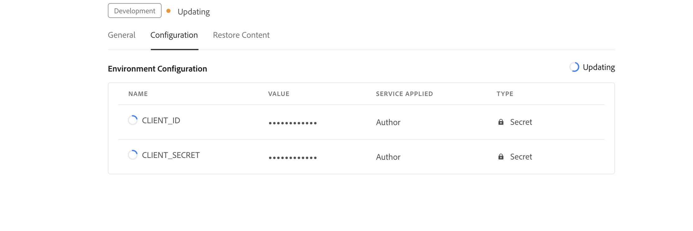

# Configurare i suggerimenti avanzati per la creazione

In qualità di amministratore, puoi configurare la funzione Suggerimenti avanzati per gli autori. Poiché il servizio di suggerimenti avanzati è protetto dall’autenticazione basata sull’autenticazione IMS di Adobe, integra i tuoi ambienti con i flussi di lavoro di autenticazione basati su token sicuri di Adobe e inizia a utilizzare la nuova soluzione di suggerimenti avanzati. La seguente configurazione consente di aggiungere una scheda di configurazione AI al profilo della cartella. Una volta aggiunta, è possibile utilizzare la funzionalità di suggerimenti avanzati nell’editor web.

## Creare configurazioni IMS nella console di Adobe Developer

Per creare configurazioni IMS nella console Adobe Developer, effettua le seguenti operazioni:
1. Launch [Console Adobe Developer](https://developer.adobe.com/console).
1. Dopo aver effettuato correttamente l’accesso a Console sviluppatori, visualizzerai **Home** schermo. Il **Home** è la schermata in cui puoi trovare facilmente informazioni e collegamenti rapidi, inclusi i collegamenti di navigazione superiore per Progetti e Download.
1. Per creare un nuovo progetto vuoto, seleziona  **Crea nuovo progetto** dal  **Guida rapida** collegamenti.
    {width="550" align="left"}
   *Crea un nuovo progetto.*

1. Seleziona  **Aggiungi API**  dal  **Progetti** schermo.  Il **Aggiungere un’API** schermo. Questa schermata mostra tutte le API, gli eventi e i servizi disponibili per prodotti e tecnologie di Adobe con cui puoi sviluppare applicazioni.

1. Seleziona la **API di gestione I/O** per aggiungerlo al progetto.
   
   *Aggiungi l&#39;API di gestione I/O al progetto.*

1. Crea un nuovo **Credenziali OAuth** e salvalo.
    {width="3000" align="left"}
   *Configura le credenziali OAuth nell’API.*

1. In  **Progetti** , selezionare le credenziali appena create.

1. Seleziona la **OAuth Server-to-Server** per visualizzare i dettagli delle credenziali del progetto.

 {width="800" align="left"}
*Connettiti al progetto per visualizzare i dettagli delle credenziali.*
1. Copiare le chiavi CLIENT_ID e CLIENT_SECRET.

Ora hai configurato i dettagli di autenticazione OAuth. Tenere a portata di mano questi due tasti, in quanto sono richiesti nella sezione successiva.

### Aggiungere la configurazione IMS all’ambiente

Per aggiungere la configurazione IMS all’ambiente, effettua le seguenti operazioni:

1. Apri Experience Manager e quindi seleziona il programma contenente l’ambiente da configurare.
1. Passa a **Ambienti** scheda.
1. Seleziona il nome dell’ambiente da configurare. Dovresti passare alla pagina Informazioni ambiente.
1. Passa a **Configurazione** scheda.
1. Aggiungi le chiavi CLIENT_ID e CLIENT_SECRET come mostrato nella schermata seguente. Assicurati di utilizzare gli stessi nomi e la stessa configurazione evidenziati di seguito.
    {width="800" align="left"}
   *Aggiungi i dettagli di configurazione dell’ambiente.*


Dopo aver aggiunto la configurazione IMS all’ambiente, effettua le seguenti operazioni per collegare queste proprietà alle guide dell’AEM utilizzando OSGi:

1. Nel codice del progetto Git di Cloud Manager, aggiungi i due file seguenti (per il contenuto dei file, visualizza [Appendice](#appendix).

   * `com.adobe.fmdita.ims.service.ImsOauthUserAccountHeadersImpl.cfg.json`
   * `com.adobe.fmdita.smartsuggest.service.SmartSuggestConfigurationConsumer.cfg.json`
1. Assicurati che i file appena aggiunti siano coperti dal tuo `filter.xml`.
1. Esegui il commit e invia le modifiche Git.
1. Esegui la pipeline per applicare le modifiche all’ambiente.

Al termine dell’operazione, dovresti essere in grado di utilizzare la nuova pubblicazione cloud basata su microservizi.


## Appendice {#appendix}

**File**:
`com.adobe.fmdita.ims.service.ImsOauthUserAccountHeadersImpl.cfg.json`

**Contenuto**:

```
{
  "client.id": "$[secret:CLIENT_ID]",
  "client.secret": "$[secret:CLIENT_SECRET]",
  "ims.url": "https://ims-na1.adobelogin.com"
}
```

**File**: `com.adobe.fmdita.smartsuggest.service.SmartSuggestConfigurationConsumer.cfg.json`

**Contenuto**:

```
{
  "smart.suggestion.flag":true,
  "conref.inline.threshold":0.6,
  "conref.block.threshold":0.7,
  "emerald.url":"https://adobeioruntime.net/apis/543112-smartsuggest/emerald/v1",
  "instance.type":"prod"
}
```

## Dettagli configurazione suggerimenti avanzati

| Chiave | Descrizione | Valori consentiti |
|---|---|---|
| smart.suggestion.flag | Controlla se i suggerimenti avanzati sono abilitati o meno | true/false |
| conref.inline.threshold | Soglia che controlla la precisione/richiamo dei suggerimenti recuperati per il tag attualmente digitato dall’utente. | -1,0 &lt;= x &lt;= 1,0 |
| conref.block.threshold | Soglia che controlla la precisione/il richiamo dei suggerimenti recuperati per i tag nell’intero file. | -1,0 &lt;= x &lt;= 1,0 |
| emerald.url | Endpoint per il database vettoriale Emerald | [https://adobeioruntime.net/apis/543112-smartsuggest/emerald/v1](https://adobeioruntime.net/apis/543112-smartsuggest/emerald/v1) |
| instance.type | Tipo di istanza dell’AEM. Assicurati che questo sia univoco per ogni istanza AEM in cui sono configurati suggerimenti avanzati. Un caso d’uso potrebbe essere quello di testare la funzione nell’ambiente di stage con &quot;instance.type&quot; = &quot;stage&quot; mentre, allo stesso tempo, la funzione è configurata anche su &quot;prod&quot;. | Qualsiasi chiave univoca che identifica l’ambiente &quot;dev&quot;/&quot;stage&quot;/&quot;prod&quot;/&quot;test1&quot;/&quot;stage2&quot; |

Dopo aver configurato, l’icona dei suggerimenti avanzati viene visualizzata nel pannello a destra dell’Editor web. Quando modifichi gli argomenti, puoi visualizzare l’elenco dei suggerimenti avanzati. Per ulteriori dettagli, vedi [Suggerimenti avanzati basati sull’intelligenza artificiale per l’authoring](../user-guide/web-editor-content-snippet.md).
