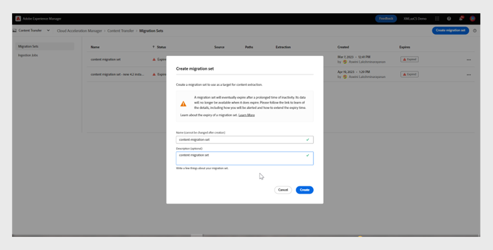
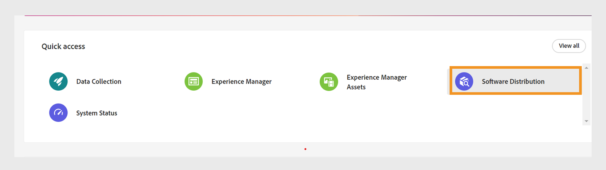

# Migrazione dei contenuti da locale a Cloud Service

Experience Manager as a Cloud Service fornisce una base tecnologica scalabile, sicura e agile per Experience Manager Guides, Assets, Forms e Screens. Questo consente agli addetti al marketing e ai professionisti IT di concentrarsi sulla distribuzione di esperienze significative su larga scala.
Ad Experience Manager as a Cloud Service, i team possono concentrarsi sull’innovazione invece di pianificare gli aggiornamenti dei prodotti. Le nuove funzioni dei prodotti vengono testate in modo approfondito e distribuite ai team senza interruzioni, in modo che possano sempre accedere all’ultima versione di Adobe Experience Manager.

Questo articolo fornisce una procedura dettagliata per la migrazione dei contenuti Experience Manager Guides on-premise o Managed Services ai Cloud Service, garantendo una transizione senza intoppi alla piattaforma basata su cloud.

## Prerequisiti

* Adobe Experience Manager 6.4 o versioni successive
* La versione di Experience Manager Guides deve essere UUID. Se utilizzi una versione non UUID di Adobe Experience Manager Guides, esegui prima la migrazione a UUID seguendo i passaggi descritti in [Migrare contenuto non DITA](../install-guide/migrate-uuid-non-uuid.md).
* Accedi a **Cloud Acceleration Manager** per l&#39;istanza cloud in cui desideri eseguire la migrazione del contenuto
* È supportata una dimensione archivio fino a 20 TB
* Dimensioni totali indice Lucene di 25 GB
* La lunghezza del nome di un nodo deve essere inferiore a 150 byte

## Processo di migrazione

**Strumento Content Transfer** è uno strumento sviluppato da Adobe che può essere utilizzato per avviare la migrazione del contenuto esistente da un&#39;istanza Adobe Experience Manager On-Premise o Managed Services di origine all&#39;istanza Experience Manager Cloud Service di destinazione.
Questo strumento trasferisce automaticamente anche entità principali (utenti o gruppi).

Puoi scaricare lo **strumento Content Transfer** come file ZIP dal portale **Software Distribution**:

1. Selezionare la scheda **AEM as a Cloud Service** nel portale **Distribuzione software**.
1. Cerca **Strumento Trasferimento contenuti**.
1. Selezionare **Strumento Content Transfer** dall&#39;elenco e scaricarlo.

Quindi installa il pacchetto tramite **Gestione pacchetti** nell&#39;istanza Adobe Experience Manager di origine. Assicurati di scaricare la versione più recente.
Per ulteriori dettagli sull&#39;ultima versione, visualizzare le [Note sulla versione](https://experienceleague.adobe.com/docs/experience-manager-cloud-service/content/release-notes/release-notes/release-notes-current.html?lang=en).

>[!NOTE]
> 
> È supportata solo la versione 2.0.0 o successiva e si consiglia di utilizzare la versione più recente.

Per migrare i contenuti Experience Manager Guides a Experience Manager as a Cloud Service, effettua le seguenti operazioni.

1. Accedi a [experience.adobe.com](https://experience.adobe.com/) e seleziona **Experience Manager**.

   

1. Fai clic su **Avvia** nella sezione **Cloud Acceleration Manager**.
   

1. Crea il primo progetto.
   

1. Aggiungi il nome e la descrizione e fai clic su **Crea**. Il progetto è stato creato.
1. Seleziona il progetto creato e apri la schermata del progetto.
1. Fai clic su **Rivedi** nella sezione **Trasferimento contenuti**.

   

1. Fare clic su **Crea set di migrazione**.

1. Immetti il nome e la descrizione del set di migrazione.

   

1. Dopo la creazione, seleziona i tre punti e seleziona **Copia chiave di estrazione**.

1. Fai clic su **Copia negli Appunti**. Crea il primo progetto.
   

1. Seleziona **Adobe Experience Manager** nella parte superiore, quindi seleziona il riquadro **Distribuzione software**.
   

1. Nel portale **Distribuzione software**, selezionare **Adobe Experience Manager come scheda Cloud Service**, cercare &quot;strumento di trasferimento dei contenuti&quot; e scaricare il pacchetto dello strumento di trasferimento dei contenuti.

   >[!NOTE]
   >
   >  Assicurati di scaricare la versione più recente.

1. Carica e installa il pacchetto `content-transfer.all-3.0.10.zip` in **Gestione pacchetti** dell&#39;istanza locale.
   

1. Nell&#39;istanza locale selezionare **Strumenti** > **Operazioni** > **Migrazione contenuto** > **Trasferimento contenuti**.

1. Seleziona **Trasferimento contenuti**, crea un set di migrazione e incolla la chiave di estrazione copiata da Cloud Acceleration Manager. In questo modo viene stabilita una connessione tra l&#39;origine e la destinazione. Quindi verifica la chiave e ne mostra la validità dopo aver inserito il valore.

1. Abilita l&#39;opzione **Includi versioni** per includere le versioni dei file.
   

1. Specifica il percorso di cui vuoi eseguire la migrazione e fai clic su **Salva**.
Ad esempio, `/content/sites`
o
   `/content/dam/tech-docs`
   

   >[!NOTE]
   >
   > È necessario eseguire la migrazione dei percorsi seguenti obbligatoriamente per il contenuto di **Experience Manager Guides**.

   * `/content/dam`
   * `/var/dxml`

   Durante la creazione di un set di migrazione, i percorsi seguenti sono soggetti a restrizioni:
   * `/apps`
   * `/libs`
   * `/home`
   * `/etc` È consentito selezionare alcuni `/etc` percorsi in CTT.

1. Fai clic su **Salva**
1. Seleziona il **set di migrazione**, quindi seleziona **Estrai** nella parte superiore.
   

1. Verifica i dettagli nella finestra a comparsa **Estrazione set di migrazione** per i percorsi e le configurazioni selezionati e fai clic su **Estrai**. L’estrazione richiederà alcuni minuti e lo stato verrà visualizzato come aggiornato.
   

1. Una volta completata l&#39;estrazione e indicata dallo stato `finished`, vai a Cloud Acceleration Manager e seleziona il progetto creato al punto 18.
Per ulteriori informazioni, selezionare i tre punti, quindi selezionare **Visualizza dettagli**.

1. Nella finestra a comparsa Dettagli set di migrazione, verifica la configurazione del set di migrazione e chiudi la finestra a comparsa. Puoi visualizzare i percorsi e altre impostazioni come mostrato nella schermata seguente:
   

1. Fai clic su **Processi di acquisizione** > **Nuova acquisizione**.
1. Riconoscere i valori dei segni di spunta richiesti, quindi fare clic su **Crea**.
   

1. Scegli il set di migrazione, seleziona il server richiesto dell&#39;ambiente, quindi fai clic su **Acquisisci**.

   

## Eseguire lo strumento Content Transfer (Trasferimento contenuti) su un’istanza di Publish

Installa lo strumento Content Transfer (Trasferimento contenuti) sull’istanza Publish di origine per spostare il contenuto nell’istanza Publish di destinazione.
Lo strumento Content Transfer (Trasferimento contenuti) non distingue tra contenuto pubblicato e non pubblicato al momento dell’acquisizione del contenuto in un ambiente Publish. Il contenuto specificato nel set di migrazione viene acquisito nell’istanza di destinazione selezionata. L’utente può acquisire un set di migrazione in un’istanza Author, Publish o in entrambe.

### Approccio consigliato

Prendi in considerazione le seguenti raccomandazioni:

* Utilizzare la stessa versione dello **strumento Content Transfer** utilizzato nell&#39;istanza Autore.
* Durante l’acquisizione in Publish, il livello Publish non verrà ridotto (a differenza dell’authoring).
* Eseguire la migrazione di un solo nodo Publish. Prima di iniziare l’estrazione, rimuovilo dal load balancer.

>[!NOTE]
>
> Come precauzione, accertati che non si verifichino operazioni di scrittura sulle istanze di Publish, incluse le azioni avviate dall’utente come:
> * Distribuzione dei contenuti da AEM as a Cloud Service Author a Publish in tale ambiente
> * Sincronizzazione utenti tra istanze di Publish

## Risoluzione dei problemi

Se l’estrazione non riesce a causa del seguente errore, puoi risolvere il problema importando il certificato CA pertinente:

`javax.net.ssl.SSLHandshakeException: sun.security.validator.ValidatorException: PKIX path building failed: sun.security.provider.certpath.SunCertPathBuilderException: unable to find valid certification path to requested target`

**Motivo**: il server Adobe Experience Manager dispone di restrizioni firewall, pertanto aggiungi il seguente endpoint all&#39;elenco Consentiti.

`casstorageprod.blob.core.windows.net`

*Abilita registrazione SSL.*

