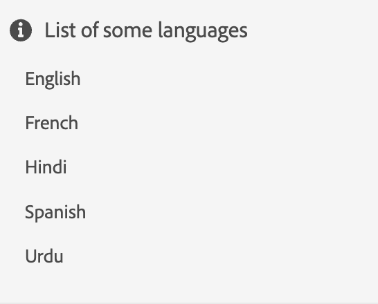

# Widget

È possibile combinare più componenti di base, come descritto nella sezione Componenti, per creare un widget.
I widget possono essere utilizzati per creare un nuovo componente &quot;più complesso&quot; o per strutturare gli elementi di un componente.

Approfondiamo il concetto di widget!

Inizieremo creando un semplice widget per visualizzare un elenco di lingue.

```js title="basicWidget.js"
const widgetJSON =  {
    "component": "div", 
    "id": "widget_languages", 
    "items": [ // adding components to the widget
        {
            "component": "div",
            "items": [
                {
                    "component": "icon",
                    "icon": "info"
                },
                {
                    "component": "label",
                    "label": "List of some languages"
                }
            ]
        },
        {
            "component": "list",
            "data": "@languages"
        }
    ]
},
```

`@languages` è un array definito nel modello di `widget_languages` come: [&quot;Inglese&quot;, &quot;Francese&quot;, &quot;Hindi&quot;, &quot;Spagnolo&quot;, &quot;Urdu&quot;]

Il widget di base sottoposto a rendering sarà simile al seguente:


