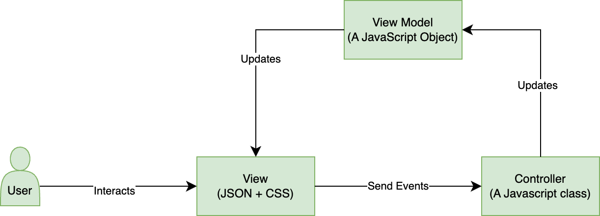

# Framework Jui

Prima di scoprire come scrivere estensioni, comprenderemo l’architettura del framework.
In modo da poterla estendere efficacemente.

## Introduzione

JUI è un framework MVC che si sovrappone ai componenti React e Adobe React Spectrum. JUI è l’interfaccia utente JSON. È costituito da più archivi Git.

JUI-Core è la libreria di base con tutta la logica necessaria per convertire la configurazione JSON in componenti react funzionanti e collegarla a un’istanza della classe di controller rilevante.
La libreria JUI-React-Spectrum dispone di widget wrapper di componenti Adobe React Spectrum

## Progettazione Core JUI

### Progettazione interfaccia utente MVC

### Widget

- Ha un ID univoco.
- Dispone di un singolo file JSON per la visualizzazione.
- Può avere un controller proprio o condiviso.
- Può utilizzare un modello padre o un nuovo modello.
- Può contenere elementi dell’interfaccia utente (componenti React)
- Può avere altri widget
- L&#39;app è un widget

### Elemento

- È un componente HTML/React.
- Non ha alcun modello, il suo usa il modello di widget principale.

### Gestore di Evento

- Successivo(eventOpts)
   - Per attivare un evento con alcune opzioni
- Subscribe(callback)
   - Ricevi la notifica che l’evento è stato attivato con la configurazione

### Modello app/globale

- Successivo (nuovo valore)
   - Per pubblicare un nuovo valore
- Subscribe(callback)
   - Per ricevere una notifica per il valore modificato
   - Prima volta che ottieni un valore obsoleto
- GetValue()
   - Per ottenere il valore corrente

### Controller

- Deve essere esteso dalla classe Controller
- API
- CreaModello
   - Per creare un modello separato di widget figlio
- InitEventHandler
   - Per creare un gestore di eventi separato per il widget figlio
- RegisterCommands
   - Per registrare eventi locali, principali o dell’app
- Next(eventName, eventHandler)
   - Per attivare l&#39;evento del gestore eventi widget figlio, del gestore eventi widget padre o del gestore eventi app
- Subscribe(callback, eventHandler)
- SubscribeAppModel(callback)

### Progettazione app di esempio

