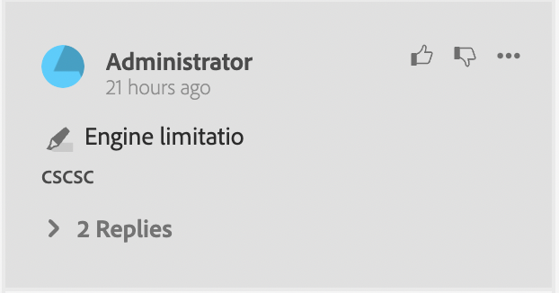

# Componenti dell’app di revisione

Di seguito sono riportati i componenti principali dell’app di revisione:

- Pannello Revisione In Linea: `id: inline_review_panel`
   - Il pannello destro in cui vengono visualizzati i commenti di revisione sul lato Editor XML.

- Recensioni argomento: `id: topic_reviews`
   - Il pannello a destra in cui vengono riprodotti i commenti nell’app di revisione.

- Commento revisione: `id: review_comment`
   - Il widget per ogni commento di revisione.

Commento sulla revisione dell&#39;app:

Commento di revisione lato editor XML:

- Risposta commento revisione: `id: comment_reply`
   - Il widget per ogni risposta di commento di revisione.
     

- Nuova risposta commento revisione: `id: comment_new_reply`
   - Il widget per la nuova risposta del commento di revisione.
     

- Casella degli strumenti di annotazione: `id: annotation_toolbox`
   - Barra degli strumenti in alto a destra nell’app di revisione.
     
