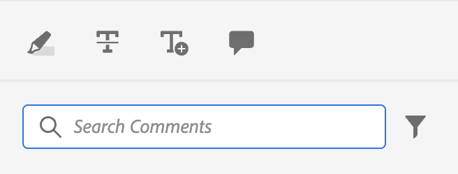

# Esempio di personalizzazione semplice

Scopri come integrare queste personalizzazioni nella nostra app AEM Guides.

Ad esempio, vogliamo aggiungere questo pulsante in una vista esistente dell’app.
Per questo abbiamo bisogno di 3 cose di base:

1. `id` del JSON della visualizzazione a cui desideri aggiungere il componente.
2. `target`, ovvero la posizione nel JSON a cui si desidera aggiungere il nuovo componente. `target` è definito utilizzando `key` e `value`. La coppia chiave-valore può essere qualsiasi attributo utilizzato per definire il componente che può essere utile per identificarlo in modo univoco.
È inoltre possibile utilizzare gli indici per fare riferimento alla destinazione.
Sono presenti 3 viewState: `APPEND`, `PREPEND`, `REPLACE`.
3. Il JSON del componente appena creato e i metodi corrispondenti.

Si supponga di voler aggiungere un pulsante alla casella degli strumenti di annotazione utilizzata nella revisione, che consente di aprire il file in AEM.

```typescript
export default {
  id: 'annotation_toolbox', 
  view: {
    items: [
      {
        component: 'button',
        icon: 'linkOut',
        title: 'Open topic in Assets view',
        'on-click': 'openTopicInAEM',
        target: {
          key: 'value',
          value: 'addcomment',
          viewState: VIEW_STATE.APPEND

        },
      },
    ],
  },
  controller: {
    openTopicInAEM: function (args) {
        const topicIndex = tcx.model.getValue(tcx.model.KEYS.REVIEW_CURR_TOPIC)
        const {allTopics = {}} = tcx.model.getValue(tcx.model.KEYS.REVIEW_DATA) || {}
        tcx.appGet('util').openInAEM(allTopics[topicIndex])
    },
  },
}
```

Nell’esempio precedente abbiamo:

1. `id` del JSON in cui vogliamo inserire il componente, ovvero `annotation_toolbox`
2. la destinazione è il pulsante `addcomment`. Il pulsante viene aggiunto dopo il pulsante `addcomment` utilizzando viewState `append`.
3. Definiamo l’evento al clic del pulsante nel controller.

JSON per &quot;annotation_toolbox&quot; `.src/jsons/review_app/annotation_toolbox.json`

Prima della personalizzazione, la casella degli strumenti per le annotazioni era simile alla seguente:



Dopo la personalizzazione, la casella degli strumenti di annotazione si presenta così:


## Aggiunta di CSS

Per coerenza forniamo il componente già formattato. Al JSON inserito verranno applicati stili intrinseci
Il modo principale per gestire i CSS è tramite la chiave extraClass nelle estensioni.

```js
{    
    "view":{
        items:[
            {
                compoenent:"button",
                extraClass:"underline bg-red",
            }
        ]
    }
}
```

Puoi inserire stili personalizzati con le classi CSS aggiungendo un file css alle clientlibs. Durante la compilazione verrà inoltre creato l&#39;output [Tailwind](https://tailwindcss.com/docs/utility-first) per le classi di utilità in tailwind. La configurazione per lo stesso è disponibile in `tailwind.config.js` dell&#39;estensione all&#39;indirizzo `./tailwind.config.js`
