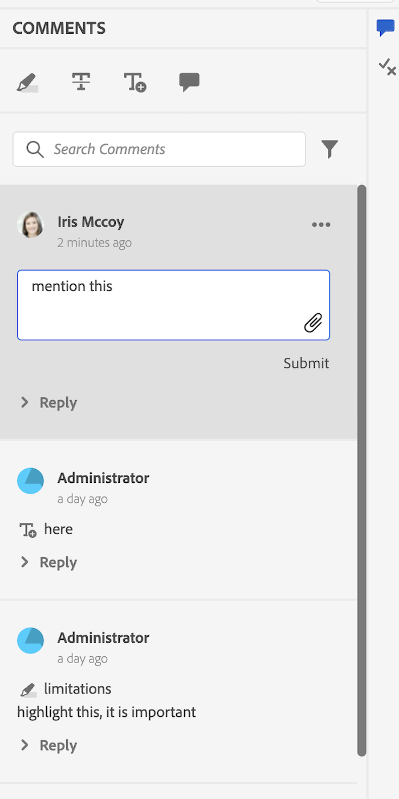
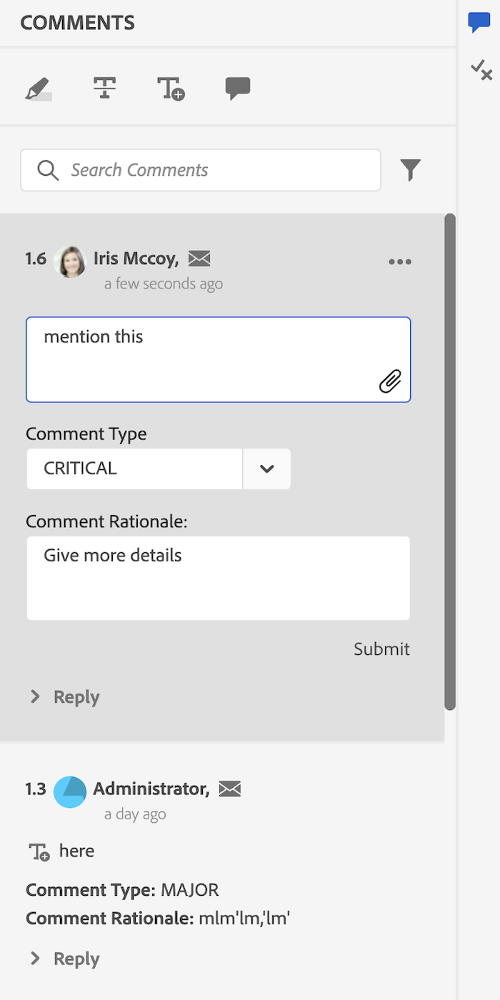

# Esempi

In questo pacchetto abbiamo anche fornito alcuni esempi di personalizzazione (disponibili all’indirizzo `guides_extension/src`). Segue una breve descrizione per ciascuno di essi.

1. [Menu di scelta rapida](./../../src/file_options.ts)
In questo esempio abbiamo personalizzato `file_options` menu di scelta rapida per rimuovere `Delete` e `Edit` e sostituire il `Duplicate` opzione con `Download` opzione.

2. [Pannello sinistro](../../src/left_panel_container.ts)
In questo esempio abbiamo personalizzato `left tab panel` per avere un altro`tab` con titolo &quot;TEST EXTENSION&quot; e un corrispondente `tab panel` che ha un’etichetta: `Test Tab Panel`

3. [Pannello a destra](../../src/right_panel_container.ts)
In questo esempio abbiamo personalizzato `right tab panel` per avere un altro `tab` con titolo &quot;TEST EXTENSION&quot; e un corrispondente `tab panel` che ha un’etichetta: `New Tab Panel`

4. [Pannello archivio](../../src/repository_panel.ts)

5. [Barra degli strumenti](../../src/toolbar.ts)
In questo esempio abbiamo sostituito il `Insert Element`, `Insert Paragraph`, `Insert Numbered List`, `Insert Bulleted List` con un solo pulsante `More Insert Options` contenente tutti questi elementi.

[Rivedi esempi di app]

1. [Casella degli strumenti Annotazione](../../src/review_app_examples/annotation_extension.ts)
In questo esempio è stato aggiunto un altro pulsante alla casella degli strumenti di annotazione che apre l’argomento di revisione corrente in AEM.

2. [Commento revisione](../../src/review_app_examples/review_comment.ts)
In questo esempio abbiamo aggiunto la sostituzione del nome utente con le informazioni utente (che comprendono il nome completo e il titolo del commento), aggiunto un ID commento univoco, un’icona mailTo e aggiunto campi di input per indicare la gravità e la motivazione del commento.
È stata aggiunta anche una sezione `accept with modification` sui commenti sul lato XMLEditor che apre una finestra di dialogo.

3. [Commenta risposta](../../src/review_app_examples/comment_reply.ts)
In questo esempio abbiamo aggiunto che il nome utente è stato sostituito da informazioni utente (che comprendono il nome completo e il titolo del commento) e aggiunto un’icona mailTo nell’intestazione del commento.

4. [Pannello Revisione in linea](../../src/review_app_examples/inline_review_panel.ts)
In questo file, calcoliamo e assegniamo l’ID commento univoco, indicato in `Review Comment` e `Comment Reply` esempi.
   - Il `setCommentId` Il metodo imposta l&#39;ID univoco di ogni commento in base al numero di commenti.

   - Il `setUserInfo` imposta il valore di userInfo, utilizzando il nome completo e il titolo di ciascun commento.

   - Il `onNewCommentEvent` assicura che `setUserInfo` viene richiamato per ogni nuovo commento o risposta.

   - Il `updatedProcessComments` viene eseguita per ogni nuovo evento di commento e assicura che `setCommentId` viene chiamato se si riceve un nuovo evento di commento.

5. [Pannello Revisioni argomenti](../../src/review_app_examples/topic_reviews.ts): questo file estende [Pannello Revisione in linea](../../src/review_app_examples/inline_review_panel.ts) in modo che le personalizzazioni aggiunte funzionino anche sul lato app di revisione.

6. [Finestra di dialogo Accetta con modifica](../../src/review_app_examples/accept_with_modification_dialog.ts)
Questo è un esempio di aggiunta di nuovi widget all’app. Qui abbiamo creato una nuova finestra di dialogo, che ha due campi di testo di input: `Revised Text` e `Adjudicator Comment Rationale`

Ecco il pannello di revisione prima e dopo la personalizzazione:

