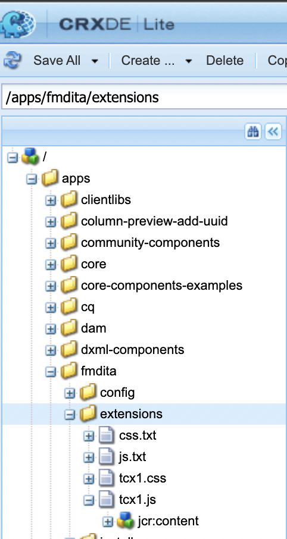

# Installazione e utilizzo del pacchetto di estensione di AEM Guides

Le estensioni consentono di personalizzare l’app AEM Guides in base alle esigenze. Questo framework di estensione è supportato con AEM Guides v4.3 e versioni successive (on-prem) e 2310 (cloud).

## Requisiti

Questo pacchetto richiede [git bash](https://github.com/git-guides/install-git) e npm

## Installazione

Il modo più semplice per avviare l’installazione del framework AEM Guides è tramite cli

```bash
npx @adobe/create-guides-extension
```

## Aggiunta del codice di personalizzazione

1. Aggiungere file di codice per ogni componente che si desidera estendere nella directory `src/`. Alcuni file di esempio sono già stati aggiunti per te.
2. Ora nel file `index.ts` che si trova nella directory `src/`:
   - Importa i file `.ts` con le personalizzazioni che desideri aggiungere nella build.
   - Aggiungi le importazioni a `window.extension`
   - Registra `id` del componente personalizzato e importazione corrispondente in `tcx extensions`
   - Fare riferimento all&#39;esempio `/src/index.ts`

## Creazione del codice personalizzato

- Eseguire `npm run build` nella directory radice. Si otterranno 3 file nella directory, `dist/`:
   - `build.css`
   - `guides-extension.js`
   - `guides-extension.umd.cjs`


## Aggiunta della personalizzazione ad AEM

- Vai a `CRXDE` `crx/de/index.jsp#/`
- Nella cartella `apps` creare un nuovo nodo di tipo `cq:ClientLibraryFolder`



- Nel `properties` del nodo, seleziona `Multi` e aggiungi la seguente proprietà
Nome: `categories`
Tipo: `String []`
Valore: `apps.fmdita.review_overrides`, `apps.fmdita.xml_editor.page_overrides`

>[!NOTE]
>
> Per la penultima interfaccia utente, i valori sarebbero: `apps.fmdita.penultimate.xml_editor.page_overrides` e `apps.fmdita.review_overrides`


- Per aggiungere il file js generato, crea un nuovo file, ad esempio `tcx1.js` nel nodo creato sopra. Aggiungere il codice da `dist/guides-extension.umd.cjs` o `dist/guides-extension.js`. Ora crea un nuovo file `js.txt`, qui aggiungiamo il nome del nostro file js, che in questo caso sarebbe:

```t
#base=.
tcx1.js
```

- Per aggiungere il file CSS generato, creare un nuovo file, ad esempio `tcx1.css` nel nodo creato sopra. Aggiungere il codice da `dist/build.css`. Ora crea un nuovo file `css.txt`, qui aggiungiamo il nome del nostro file css, che in questo caso sarebbe:

```t
#base=.
tcx1.css
```

- Esegui `shift + refresh` per caricare l&#39;app con le personalizzazioni.

## Risoluzione di problemi

Verifica che tutti i passaggi precedenti siano stati eseguiti correttamente.
Dopo aver aggiunto il codice a tcx.js, assicurati di eseguire un aggiornamento rapido (MAIUSC+AGGIORNA).
Apri AEM, fai clic con il pulsante destro del mouse e fai clic su `Inspect`
Vai a Origini e cerca il file `[node_name].js` (ad esempio, extensions.js). Eseguire un comando Control / Cmd + D per cercare il file. Se il file `.js` esiste con il codice JS incollato da `dist/guides-extension.umd.cjs` o `dist/guides-extension.js`, l&#39;installazione è completa
