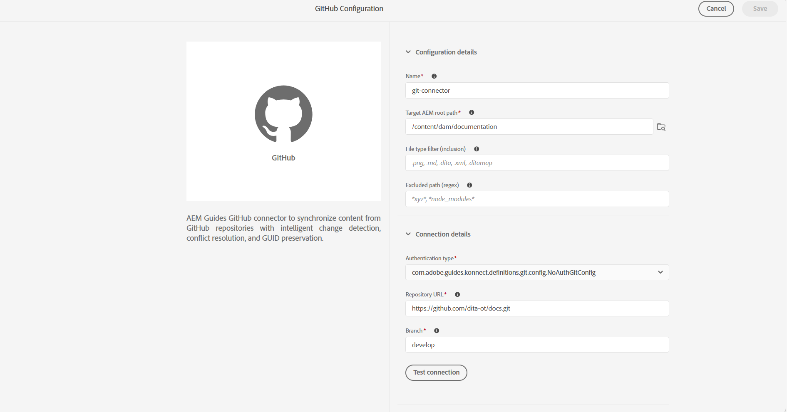

# Creare e configurare il connettore Git dall’interfaccia utente

>[!NOTE]
>
> Questa funzione è disabilitata per impostazione predefinita. Per abilitarlo nel tuo ambiente, contatta il team di successo del cliente.

Utilizza lo strumento Origini dati in Experience Manager Guides per creare e configurare un connettore Git dall’interfaccia utente. Dopo aver configurato correttamente il connettore, puoi utilizzarlo per importare il contenuto da un archivio Git in Experience Manager Guides.

>[!NOTE]
>
> Prima di iniziare, assicurati che il connettore Git sia distribuito al progetto Cloud Manager. Per informazioni dettagliate, visualizza [Aggiungere il connettore Git al progetto Cloud Manager.](#add-git-connector-to-your-cloud-manager-project)


1. Seleziona il collegamento **Adobe Experience Manager** in alto e scegli **Strumenti**.
1. Selezionare **Guide** dall&#39;elenco degli strumenti.
1. Selezionare il riquadro **Origini dati**. Viene visualizzata la pagina **Origini dati**.
1. Seleziona **Crea**.
1. Dall&#39;elenco dei connettori di origine dati, selezionare **GitHub**.

   {width="600"}

1. Seleziona **Avanti**.
1. Immetti la configurazione e i dettagli di connessione.

   {width="600"}

   >[!TIP]
   >
   >* Passa il cursore sopra  vicino al campo per visualizzare ulteriori dettagli.
   >* I campi con * sono obbligatori. Ad esempio, puoi immettere i seguenti dettagli per il connettore Elasticsearch.

   &#x200B;- **Nome**: immettere il nome dell&#39;origine dati.
   &#x200B;- **Percorso directory principale di AEM di destinazione**: immetti il percorso nell&#39;archivio AEM in cui deve essere archiviato il contenuto importato da Git.
   &#x200B;- **Filtro tipo file (inclusione)**: specificare i tipi di file da includere durante l&#39;importazione.
   &#x200B;- **Percorso escluso (regex)**: specificare i pattern di percorso da escludere dall&#39;importazione.
   &#x200B;- **Tipo di autenticazione**: selezionare il tipo di autenticazione dall&#39;elenco a discesa. Attualmente, **Personal Access Token (PAT)** è l&#39;unico metodo di autenticazione supportato. Immetti il PAT durante la configurazione del connettore per autenticare e accedere all’archivio Git.

     Scopri come [generare un token di accesso personale GitHub](https://docs.github.com/en/authentication/keeping-your-account-and-data-secure/managing-your-personal-access-tokens#creating-a-personal-access-token-classic).

     Durante la selezione degli ambiti durante la generazione di PAT su GitHub, assicurati di abilitare i seguenti ambiti:
     &#x200B;- **repo**: seleziona la casella di controllo di primo livello. Tutti i sottoambiti vengono selezionati automaticamente, consentendo l’accesso al contenuto dell’archivio, allo stato del commit e alle distribuzioni.
     &#x200B;- **admin:org**: selezionare solo **read:org**. Questo è necessario per risolvere l’appartenenza a un’organizzazione e a un team.
   * **URL archivio**: immettere l&#39;URL archivio Git da cui importare il contenuto.
   * **Ramo**: immettere il ramo da utilizzare per l&#39;importazione del contenuto.

1. Verifica la connessione. Il pulsante **Verifica connessione** è attivato solo dopo aver immesso i dettagli richiesti. Se i dettagli della connessione sono corretti, viene visualizzato un messaggio di operazione riuscita. In caso contrario, viene visualizzato un messaggio di errore.

   {width="600"}

1. Seleziona **Salva** nella parte superiore per salvare il connettore.

   Il pulsante Salva viene attivato solo dopo l&#39;immissione di tutti i dettagli richiesti e la connessione ha esito positivo. Se il connettore è stato salvato correttamente, è possibile visualizzare il connettore Github configurato nella pagina **Origini dati**.

   {width="600"}

## Aggiungere il connettore Git al progetto Cloud Manager

Prima che il connettore Git sia disponibile per la configurazione dalla pagina **Origini dati**, deve essere incorporato come una dipendenza nel progetto AEM. Per aggiungere la dipendenza, effettua le seguenti operazioni:

1. In `all/pom.xml` del progetto AEM, aggiungi il connettore Git come dipendenza in `<dependencies>`:

   ```xml
   <dependency>
       <groupId>com.adobe.aem.addon.guides</groupId>
       <artifactId>konnect-github</artifactId>
       <version>1.0.0</version>
   </dependency>
   ```

1. Nello stesso `pom.xml`, aggiungere la dipendenza alla sezione `<embeddeds>` della configurazione `filevault-package-maven-plugin`:

   ```xml
   <embedded>
       <groupId>com.adobe.aem.addon.guides</groupId>
       <artifactId>konnect-github</artifactId>
       <type>jar</type>
       <target>/apps/YOUR-vendor-packages/content/install</target>
   </embedded>
   ```

   Sostituisci `YOUR-vendor-packages` con il nome del pacchetto fornitore del progetto.

1. Esegui il commit e il push delle modifiche nell’archivio Git di Cloud Manager, quindi esegui la pipeline per distribuirle.

Al termine della pipeline, il connettore Git viene installato nell&#39;ambiente e disponibile per la configurazione dalla pagina **Origini dati**.


