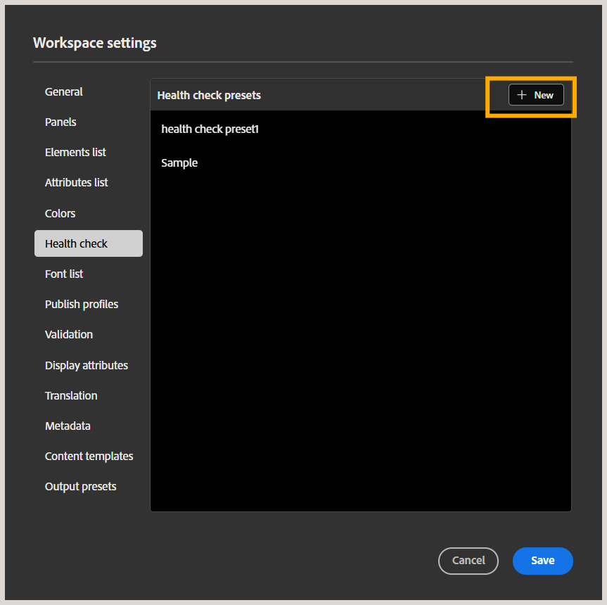

# Creare e gestire i predefiniti di verifica stato

>[!NOTE]
>
> Questa funzione è attivata per impostazione predefinita. Se preferisci non utilizzare questa funzione nel tuo ambiente, contatta il team Customer Success.

In qualità di amministratore, è possibile configurare la funzione di verifica stato a livello di profilo di cartella in Experience Manager, che consente agli autori e ai publisher di eseguire controlli di integrità su una mappa DITA. Questo include il rilevamento precoce di problemi come collegamenti interrotti, ID duplicati e errori di convalida Schematron in una mappa prima della pubblicazione, invece di controllare ogni file singolarmente. I controlli eseguiti sono definiti da un predefinito di controllo di integrità, un insieme di regole che possono essere selezionate ed eseguite dagli autori e dagli editori.

Questo articolo fornisce informazioni sulla creazione e la gestione dei predefiniti di verifica stato.

## Creare un predefinito di verifica stato

Per creare un predefinito di verifica stato a livello di profilo di cartella, effettua le seguenti operazioni:

1. Vai a [Impostazioni Workspace](./workspace-settings.md) e seleziona **Verifica stato** dall&#39;elenco.
1. Nel pannello **Predefiniti verifica stato**, seleziona **Nuovo**.

   
1. Viene visualizzata la finestra di dialogo **Nuovo predefinito di verifica stato**. Aggiungi un nome per il predefinito e seleziona le regole o i controlli che desideri includere: le opzioni disponibili sono Collegamenti interrotti, ID duplicati e Convalide con schema.

   
1. Seleziona **Crea**.
1. Seleziona **Salva** per salvare l&#39;impostazione.

Questo predefinito è ora disponibile per autori e editori. Per gli autori, la funzione è disponibile nel menu Opzioni di una mappa nella vista Mappa e nel pannello Rapporto Verifica stato accanto al pannello Ricerca, consentendo loro di eseguire un controllo di integrità sulla mappa selezionata utilizzando uno dei predefiniti di controllo di integrità configurati per il loro profilo. Per ulteriori dettagli, visualizzare [Altre funzionalità nell&#39;editor mappe](../user-guide/map-editor-other-features.md#run-health-check-on-a-map).

Per gli editori, l&#39;interruttore **Esegui verifica stato prima della generazione dell&#39;output** viene visualizzato nel pannello dei predefiniti, che possono abilitare o disabilitare in base al requisito. Quando questa opzione è abilitata, il rapporto di verifica stato viene aggiunto ai registri all’inizio del processo di pubblicazione, ma non blocca la generazione dell’output.

## Gestire i predefiniti di verifica stato

Una volta creato, il predefinito viene aggiunto al pannello Predefiniti di Verifica stato da cui è possibile eseguire le operazioni di modifica, duplicazione o rimozione sul predefinito.

- **Modifica**: consente di modificare i campi del predefinito, ad esempio il nome del predefinito, i controlli (selezionare o deselezionare i controlli) e di aggiungere o rimuovere i file Schematron allegati al predefinito.
- **Duplicato**: crea un duplicato del predefinito nello stesso elenco.
- **Rimuovi**: rimuove il predefinito dal pannello.

Seleziona **Salva** per salvare le modifiche.
