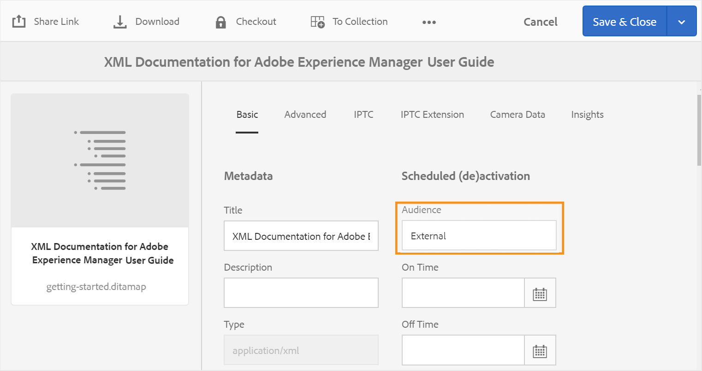

# Configurare le impostazioni di generazione dell’output {#id181AI0B0E30}

AEM Guides offre numerose opzioni di configurazione per personalizzare il processo di generazione dell’output. Questo argomento descrive tutte le configurazioni e le personalizzazioni utili per configurare il processo di generazione dell’output.

## Configurare la scheda Baseline nel dashboard delle mappe DITA {#id223MD0D0YRM}

Le schede seguenti forniscono istruzioni per nascondere la scheda Baseline nel dashboard delle mappe DITA in base alla configurazione di Experience Manager Guides: Cloud Service o On-Premise.

>[!BEGINTABS]

>[!TAB Cloud Service]

1. Utilizza le istruzioni fornite in [Sostituzioni configurazione](download-install-config-override.md#) per creare il file di configurazione.
1. Nel file di configurazione, fornisci i seguenti dettagli \(property\) per configurare la scheda baseline nel dashboard delle mappe.

| PID | Chiave proprietà | Valore proprietà |
|---|------------|--------------|
| `com.adobe.fmdita.config.ConfigManager` | `hide.tabs.baseline` | Booleano\(`true/false`\).**Valore predefinito**: `true` |

>[!NOTE]
>
> Questa configurazione è attivata per impostazione predefinita e la scheda Linea di base non è disponibile nel dashboard delle mappe.

>[!TAB On-Premise]

1. Aprire la pagina Configurazione della console Web Adobe Experience Manager.

   L&#39;URL predefinito per accedere alla pagina di configurazione è:

   ```http
   http://<server name>:<port>/system/console/configMgr
   ```

1. Cerca e fai clic sul bundle **com.adobe.fmdita.config.ConfigManager**.

1. Selezionare l&#39;opzione **Nascondi scheda Previsione**.

1. Fai clic su **Salva**.

>[!NOTE]
>
> Questa configurazione è disabilitata per impostazione predefinita e la scheda Baseline è disponibile nel dashboard delle mappe.

>[!ENDTABS]


## Configurare la pubblicazione mista all’interno di un sito AEM esistente {#id1691I0V0MGR}

Se si dispone di un sito AEM che contiene contenuto DITA, è possibile configurare l&#39;output del sito AEM in modo da pubblicare il contenuto DITA in una posizione predefinita all&#39;interno del sito. Ad esempio, nella schermata seguente di una pagina del sito AEM, il nodo `ditacontent` è riservato per l&#39;archiviazione del contenuto DITA:


I nodi rimanenti nella pagina vengono creati direttamente dall’editor del sito di AEM. La configurazione dell&#39;impostazione di pubblicazione per la pubblicazione del contenuto DITA in una posizione predefinita garantisce che nessuno dei contenuti non DITA esistenti venga modificato dal processo di pubblicazione di AEM Guides.

Per consentire la pubblicazione di contenuto DITA in un nodo predefinito, è necessario eseguire le seguenti configurazioni sul sito esistente:

- Configurare le proprietà del modello del sito

- Aggiungere nodi al sito per pubblicare contenuti DITA


Le schede seguenti forniscono istruzioni per configurare le proprietà del modello del sito esistente in base alla configurazione di Experience Manager Guides: Cloud Service o On-Premise.

>[!BEGINTABS]

>[!TAB Cloud Service]

1. Utilizza Gestione pacchetti per scaricare il file /libs/fmdita/config/templates/default.

   >[!NOTE]
   >
   > Non effettuare personalizzazioni nei file di configurazione predefiniti disponibili nel nodo `libs`. È necessario creare una sovrapposizione del nodo `libs` nel nodo `apps` e aggiornare i file richiesti solo nel nodo `apps`.

1. Aggiungi le seguenti proprietà:

   | Nome proprietà | Tipo | Valore |
   |-------------|----|-----|
   | `topicContentNode` | Stringa | Specificare il nome del nodo in cui pubblicare il contenuto DITA. Ad esempio, il nodo predefinito in cui AEM Guides pubblica il contenuto DITA è: <br> `jcr:content/contentnode` |
   | `topicHeadNode` | Stringa | Specificare il nome del nodo in cui memorizzare le informazioni sui metadati del contenuto DITA. Ad esempio, il nodo predefinito in cui AEM Guides memorizza le informazioni sui metadati è: <br> `jcr:content/headnode` |


La prossima volta che pubblichi un contenuto DITA utilizzando le configurazioni dei modelli del sito, il contenuto viene pubblicato nei nodi specificati nelle proprietà `topicContentNode` e `topicHeadNode`.

>[!TAB On-Premise]

1. Accedi ad AEM e apri la modalità CRXDE Lite.

1. Passa al nodo di configurazione del modello del sito. Ad esempio, AEM Guides memorizza le configurazioni di modelli predefinite nel seguente nodo:

   `/libs/fmdita/config/templates/default`

   >[!NOTE]
   >
   > Non effettuare personalizzazioni nei file di configurazione predefiniti disponibili nel nodo `libs`. È necessario creare una sovrapposizione del nodo `libs` nel nodo `apps` e aggiornare i file richiesti solo nel nodo `apps`.

1. Aggiungi le seguenti proprietà:

   | Nome proprietà | Tipo | Valore |
   |-------------|----|-----|
   | `topicContentNode` | Stringa | Specificare il nome del nodo in cui pubblicare il contenuto DITA. Ad esempio, il nodo predefinito in cui AEM Guides pubblica il contenuto DITA è: <br>`jcr:content/contentnode` |
   | `topicHeadNode` | Stringa | Specificare il nome del nodo in cui memorizzare le informazioni sui metadati del contenuto DITA. Ad esempio, il nodo predefinito in cui AEM Guides memorizza le informazioni sui metadati è: <br>`jcr:content/headnode` |


La schermata seguente mostra le proprietà aggiunte nel nodo del modello predefinito di AEM Guides:

{width="800" align="left"}

La prossima volta che pubblichi un contenuto DITA utilizzando le configurazioni dei modelli del sito, il contenuto viene pubblicato nei nodi specificati nelle proprietà `topicContentNode` e `topicHeadNode`.

Tuttavia, per i siti esistenti, è necessario aggiungere manualmente i nodi `topicContentNode` e `topicHeadNode`.

Per aggiungere i nodi richiesti al sito esistente, effettua le seguenti operazioni:

1. Accedi ad AEM e apri la modalità CRXDE Lite.

1. Individua `jcr:content` all&#39;interno del nodo del sito.

1. Aggiungere `topicContentNode` e `topicHeadNode` nodi con lo stesso nome specificato nelle configurazioni del modello del sito.

>[!ENDTABS]

## Configura percorso di output di base per la pubblicazione

Le schede seguenti forniscono istruzioni per configurare la posizione di output di base in base alla configurazione di Experience Manager Guides: Cloud Service o On-Premise.

>[!BEGINTABS]

>[!TAB Cloud Service]

1. Utilizza le istruzioni fornite in [Sostituzioni configurazione](download-install-config-override.md) per creare il file di configurazione.

1. Nel file di configurazione, fornisci i seguenti dettagli (proprietà) per configurare il percorso di output di base:

   | PID | Chiave proprietà | Valore proprietà |
   |---|---|---|
   | `com.adobe.fmdita.config.ConfigManager` | `base.output.path` | **Valore predefinito:** &quot;/content/dam/fmdita-outputs&quot; |

>[!TAB On-Premise]

1. Aprire la pagina Configurazione della console Web Adobe Experience Manager.

   L&#39;URL predefinito per accedere alla pagina di configurazione è:

   ```http
   http://<server name>:<port>/system/console/configMgr
   ```

1. Cerca e seleziona il bundle *com.adobe.fmdita.config.ConfigManager*.

1. Aggiorna la proprietà **Posizione output di base** per specificare il percorso predefinito nell&#39;archivio AEM in cui verrà salvato PDF dopo la pubblicazione. Inoltre, se viene immesso un percorso non valido, verrà automaticamente ripristinato il percorso predefinito: `/content/dam/fmdita-outputs`.

1. Fai clic su **Salva**.

>[!ENDTABS]

## Utilizzare i metadati nell&#39;output di pubblicazione tramite DITA-OT {#id191LF0U0TY4}

AEM Guides consente di trasmettere metadati personalizzati durante la pubblicazione dell&#39;output tramite DITA-OT. In qualità di amministratore e di editore, è necessario eseguire le seguenti attività per configurare e utilizzare metadati personalizzati nell’output pubblicato:

- In qualità di amministratore, aggiungere i metadati richiesti nel sistema in modo che siano disponibili nella pagina Proprietà della mappa DITA.

- In qualità di amministratore, aggiungi i metadati personalizzati nell&#39;elenco dei metadati in modo che vengano visualizzati nella console delle mappe DITA.

- In qualità di editore, configura e aggiungi i metadati personalizzati con la mappa DITA e genera l’output richiesto.


Per aggiungere i metadati richiesti nel sistema, effettuare le seguenti operazioni:

1. Accedi a Adobe Experience Manager come amministratore.

1. Fai clic sul collegamento Adobe Experience Manager in alto e scegli **Strumenti**.

1. Seleziona **Assets** dall&#39;elenco degli strumenti.

1. Fai clic sul riquadro **Schemi metadati**.

   Viene visualizzata la pagina Forms schema metadati.

1. Selezionare il modulo **default** dall&#39;elenco.

   >[!NOTE]
   >
   > Le proprietà visualizzate nella pagina Proprietà di una mappa DITA vengono ricavate da questo modulo.

1. Fai clic su **Modifica**.

1. Aggiungi i metadati personalizzati che desideri utilizzare negli output pubblicati. Ad esempio, aggiungeremo i metadati del pubblico come segue:

   1. Dall&#39;elenco dei componenti **Genera modulo**, trascinare il componente **Testo a riga singola** nel modulo.

   2. Seleziona il nuovo campo per aprire **Impostazioni** del campo.

   3. In **Etichetta campo**, immettere il nome metadati: Pubblico.

   4. Nell&#39;impostazione **Mappa su proprietà**, specificare ./jcr:content/metadata/&lt;nome dei metadati\>. Per il nostro esempio, lo imposteremo su ./jcr:content/metadata/audience.

   Utilizzando questi passaggi, aggiungi tutti i parametri di metadati richiesti.

1. Fai clic su **Salva**.


Il nuovo parametro ora viene visualizzato nella pagina Proprietà per tutte le mappe DITA.


Successivamente, è necessario rendere disponibili i metadati personalizzati nella console delle mappe DITA. Le schede seguenti forniscono istruzioni per rendere disponibili i metadati personalizzati nella dashboard delle mappe DITA in base alla configurazione di Experience Manager Guides: Cloud Service o On-Premise.

>[!BEGINTABS]

>[!TAB Cloud Service]

1. Utilizza Gestione pacchetti per accedere al file metadataList disponibile nella seguente posizione nell’archivio Git di Cloud Manager:

   /libs/fmdita/config/metadataList

   >[!NOTE]
   >
   > Il file metadataList contiene un elenco di proprietà visualizzate nell&#39;elenco a discesa **Proprietà** di una mappa DITA nel dashboard delle mappe. Per impostazione predefinita, in questo file sono elencate quattro proprietà: docstate, dc:language, dc:description e dc:title.

1. Aggiungi i metadati personalizzati aggiunti nella pagina Forms dello schema metadati. Nel nostro esempio, aggiungi il parametro audience alla fine dell’elenco predefinito.

>[!TAB On-Premise]

1. Accedi ad AEM e apri la modalità CRXDE Lite.

1. Accedere al file metadataList disponibile nel percorso seguente:

   /libs/fmdita/config/metadataList

   >[!NOTE]
   >
   > Il file metadataList contiene un elenco di proprietà visualizzate nell&#39;elenco a discesa **Proprietà** di una mappa DITA nel dashboard delle mappe. Per impostazione predefinita, in questo file sono elencate quattro proprietà: docstate, dc:language, dc:description e dc:title.

1. Aggiungi i metadati personalizzati aggiunti nella pagina Forms dello schema metadati. Nel nostro esempio, aggiungi il parametro audience alla fine dell’elenco predefinito.

1. Fare clic su **Salva tutto**.

>[!ENDTABS]

Ora i metadati personalizzati verranno visualizzati nell&#39;elenco a discesa **Proprietà** della console delle mappe DITA.

Infine, in qualità di editore, è necessario includere i metadati personalizzati nell’output pubblicato. Per elaborare i metadati personalizzati durante la generazione dell’output, effettua le seguenti operazioni:

1. Nell&#39;interfaccia utente di Assets, passare alla mappa DITA che si desidera pubblicare.

1. Selezionare il file mappa DITA e aprirne la pagina delle proprietà.

1. Nella pagina Proprietà, specifica il valore per i metadati personalizzati. Per il nostro esempio, abbiamo specificato il valore External per il parametro audience.

   

1. Fai clic su **Salva e chiudi**.

1. Fare clic sul file mappa DITA per aprire la console Mappa DITA.

1. Nella scheda **Predefiniti di output** selezionare il predefinito di output che si desidera utilizzare per generare l&#39;output.

1. Fai clic su **Modifica**.

1. Dall&#39;elenco a discesa **Proprietà**, selezionare le proprietà che si desidera trasferire al processo di pubblicazione.

   


Le proprietà/metadati selezionati vengono trasmessi al processo di pubblicazione e sono resi disponibili nell’output finale.

### Convalida metadati passati a DITA-OT per l&#39;elaborazione (solo per Cloud Service)

Per convalidare i valori dei metadati passati al DITA-OT, è possibile utilizzare un ambiente locale che utilizza un file jar pronto per il cloud. Poiché non è possibile accedere al file system locale sul cloud, l’unico modo per convalidare il file dei metadati è tramite cloud ready jar.

- Nome file: metadata.xml
- Posizione file: crx-quickstart/profiles/ditamaps/&lt;ditamap-1234\>

  Per accedere a metadata.xml:

   - Accedi al percorso del server in cui è in esecuzione l’istanza di AEM.
   - Esegui la migrazione a crx-quickstart/profiles/ditamaps/&lt;nome-directory-appena creato\>/metadata.xml.
- Formato file di esempio:

  **metadati.xml**

  ```XML
  <?xml version="1.0" encoding="UTF-8" standalone="no"?>
  <root>
     <Path id="/absolutePath/sampleMap.ditamap">
        <metadata>
           <meta isArray="false" key="dc:description">This is a file</meta>
           <meta isArray="false" key="dc:title">Myfile</meta>
           <meta isArray="true" key="multivalueText">One;Two;Three</meta>
        </metadata>
     </Path>
     <Path id="/absolutePath/sampleTopic.dita">
        <metadata>
           <meta isArray="false" key="dc:description">description for the accountability</meta>
           <meta isArray="false" key="dc:title">accountability title</meta>
           <meta isArray="true" key="multivalueText">value1</meta>
        </metadata>
     </Path>
  </root>
  ```


- isArray: attributo booleano che definisce se i metadati sono un valore multiplo \(Array\) o meno. I valori sono delimitati da un punto e virgola.
- ID percorso: percorso assoluto del file memorizzato nella directory temp.

>[!NOTE]
>
> Se per il file non sono presenti metadati particolari, il tag &lt;meta\> con la chiave non verrà visualizzato come proprietà per tale file nel file metadata.xml.

## Configurare il campo dell&#39;argomento della riga di comando DITA-OT per accettare i metadati della mappa radice (solo per Cloud Service)

Per utilizzare il campo dell&#39;argomento della riga di comando DITA-OT per passare i metadati della mappa radice, effettuare le seguenti operazioni:

1. Utilizza le istruzioni fornite in [Sostituzioni configurazione](download-install-config-override.md#) per creare il file di configurazione.
1. Nel file di configurazione, fornisci i seguenti dettagli \(property\) per configurare il campo dell&#39;argomento della riga di comando DITA-OT nel predefinito:

| PID | Chiave proprietà | Valore proprietà |
|---|------------|--------------|
| `com.adobe.fmdita.config.ConfigManager` | `pass.metadata.args.cmd.line` | Booleano\(`true/false`\).**Valore predefinito**: `true` |

- L&#39;impostazione del valore della proprietà su **true** abilita la funzionalità della riga di comando DITA-OT, che consente di passare i metadati tramite la riga di comando DITA-OT.
- Se si imposta il valore della proprietà su **false**, la funzionalità della riga di comando DITA-OT verrà disattivata. Per trasmettere i metadati, puoi quindi utilizzare il campo Proprietà nel predefinito.

## Personalizza console mappe DITA {#id188HC08M0CZ}

AEM Guides offre la flessibilità di estendere le funzionalità della console delle mappe DITA. Ad esempio, se disponi di un set di rapporti diversi da quelli disponibili in AEM Guides, puoi aggiungerli alla console delle mappe. Per personalizzare la console delle mappe, devi creare una libreria client di AEM \(o ClientLib\) che conterrà il codice necessario per eseguire la funzionalità necessaria.

>[!NOTE]
>
> Non è consigliata la modifica diretta ai componenti della pagina, in quanto verrà sovrascritta dalle nuove versioni del prodotto.

AEM Guides fornisce la categoria `apps.fmdita.dashboard-extn` per personalizzare la console delle mappe. Ogni volta che la console delle mappe viene caricata, la funzionalità creata nella categoria `apps.fmdita.dashboard-extn` viene eseguita e caricata.

>[!NOTE]
>
> Per ulteriori informazioni sulla creazione della libreria client di AEM, vedere [Utilizzo delle librerie lato client](https://experienceleague.adobe.com/docs/experience-manager-cloud-service/implementing/developing/full-stack/clientlibs.html?lang=en).

## Gestione della rappresentazione delle immagini durante la generazione dell&#39;output {#id177BF0G0VY4}

AEM viene fornito con una serie di flussi di lavoro e di handle di contenuti multimediali predefiniti per l’elaborazione delle risorse. In AEM, esistono flussi di lavoro predefiniti per gestire l’elaborazione delle risorse per i tipi MIME più comuni. In genere, per ogni immagine caricata, AEM crea più rappresentazioni dello stesso in formato binario. Queste rappresentazioni possono avere dimensioni diverse, una risoluzione diversa, una filigrana aggiunta o altre caratteristiche modificate. Per ulteriori informazioni su come AEM gestisce le risorse, consulta [Elaborazione di Assets tramite gestori di contenuti multimediali e flussi di lavoro](https://experienceleague.adobe.com/docs/experience-manager-cloud-service/assets/asset-microservices-overview.html?lang=en) nella documentazione di AEM.

AEM Guides consente di configurare la rappresentazione dell’immagine da utilizzare al momento della generazione dell’output per i documenti. Ad esempio, puoi scegliere una delle rappresentazioni immagine predefinite oppure crearne una e utilizzare la stessa opzione per pubblicare i documenti. Il mapping della rappresentazione dell&#39;immagine per la pubblicazione dei documenti è memorizzato nel file `/libs/fmdita/config/ **renditionmap.xml**`. Uno snippet di file `renditionmap.xml` è il seguente:

>[!NOTE]
>
> È consigliabile creare una copia del file `renditionmap.xml` nella cartella `apps` per tutte le personalizzazioni.

```XML
<renditionmap>
   <mapelement>
      <mimetype>image/png</mimetype>
      <rendition output="AEMSITE">cq5dam.web.1280.1280.jpeg</rendition>
      <rendition output="PDF">original</rendition>
      <rendition output="HTML5">cq5dam.web.1280.1280.jpeg</rendition>
      <rendition output="HTML5" outputName="ditahtml5">cq5dam.thumbnail.319.319.png</rendition>
      <rendition output="EPUB">cq5dam.web.1280.1280.jpeg</rendition>
      <rendition output="CUSTOM">cq5dam.web.1280.1280.jpeg</rendition>
   </mapelement>
...
</renditionmap>
```

L&#39;elemento `mimetype` specifica il tipo MIME del formato di file. L&#39;elemento `rendition output` specifica il tipo di formato di output e il nome della rappresentazione \(ad esempio, `cq5dam.web.1280.1280.jpeg`\) da utilizzare per la pubblicazione dell&#39;output specificato. Puoi specificare le rappresentazioni immagine da utilizzare per tutti i formati di output supportati: AEMSITE, PDF, HTML5, EPUB e CUSTOM.

Se si desidera specificare rappresentazioni di immagini diverse per un predefinito di output, è possibile utilizzare l&#39;attributo `outputName`, con il relativo valore impostato sul titolo del predefinito, per definire rappresentazioni personalizzate per specifici predefiniti di output nello stesso tipo di output. Questa funzione è utile quando sono necessari formati o dimensioni di immagine diversi per diversi scenari di pubblicazione.

Ad esempio:


```XML
<renditionmap>
   <mapelement>
      <mimetype>image/png</mimetype>
      
      <rendition output="HTML5">cq5dam.web.1280.1280.jpeg</rendition>
      <rendition output="HTML5" outputName="ditahtml5">cq5dam.thumbnail.319.319.png</rendition>
      
   </mapelement>
...
</renditionmap>
```

Nelle rappresentazioni precedenti, quando l&#39;attributo `outputName` è impostato su `ditahtml5` (titolo del predefinito), il predefinito `ditahtml5` utilizza l&#39;immagine miniatura `cq5dam.thumbnail.319.319.png`. Se l&#39;attributo `outputName` non è specificato, tutti gli output di HTML5 utilizzano l&#39;immagine più grande `cq5dam.web.1280.1280.jpeg`.

Se la rappresentazione specificata non è presente, il processo di pubblicazione di AEM Guides cerca innanzitutto la rappresentazione web dell’immagine specificata. Se non viene trovata nemmeno la rappresentazione web, viene utilizzata la rappresentazione originale dell’immagine.

>[!NOTE]
>
> Queste rappresentazioni di immagini controllano solo la generazione dell&#39;output. La rappresentazione Web di un&#39;immagine viene utilizzata quando si apre un documento per l&#39;anteprima o la revisione.

## Configurare il periodo di rimozione automatica per la cronologia di output {#id19AAI070V8Q}

Quando generi un output, questo viene creato insieme ai registri di output. Per le mappe DITA di grandi dimensioni, questi registri possono occupare una grande quantità di spazio nell’archivio. Per impostazione predefinita, i registri vengono memorizzati nella seguente posizione nell’archivio:

`/var/dxml/metadata/outputHistory`

In un certo periodo di tempo, le dimensioni collettive di tutti i file di registro potevano raggiungere i GB. AEM Guides consente di configurare un periodo di tempo per mantenere questi file di registro nell’archivio. Dopo il periodo di tempo specificato, i registri e la cronologia di generazione dell’output vengono eliminati dall’archivio.

>[!NOTE]
>
> La cronologia di generazione dell&#39;output è la voce di registro nell&#39;elenco Output generati della scheda Output.

La configurazione della funzione di rimozione della cronologia influisce sulla generazione dell&#39;output per tutte le mappe DITA nel repository. Nella scheda Output di una mappa DITA, la cronologia viene eliminata dopo il numero di giorni e all&#39;ora specificati nell&#39;impostazione.

>[!NOTE]
>
> La rimozione dei file di registro e della cronologia di generazione dell’output non ha alcun impatto sull’output generato.

Le schede seguenti forniscono istruzioni per impostare un giorno e un’ora per eliminare la cronologia e i registri di output in base alla configurazione di Experience Manager Guides: Cloud Service o On-Premise.

>[!BEGINTABS]

>[!TAB Cloud Service]

Utilizza le istruzioni fornite in [Sostituzioni configurazione](download-install-config-override.md#) per creare il file di configurazione. Nel file di configurazione, fornisci i seguenti dettagli \(property\) per impostare un giorno e un’ora per eliminare la cronologia e i registri di output:

| PID | Chiave proprietà | Valore proprietà |
|---|------------|--------------|
| `com.adobe.fmdita.config.ConfigManager\|output.history.purgeperiod` | Specifica il numero di giorni dopo i quali la cronologia di output e i registri di output vengono eliminati. Se si desidera disattivare questa funzione, impostare questa proprietà su 0.Everyday alla data specificata per l&#39;esecuzione del processo di rimozione sugli output generati prima del numero di giorni specificato in questa proprietà. | **Valore predefinito**: 5 |
| `output.history.purgetime` | Specificare l&#39;ora in cui viene avviato il processo di rimozione. | **Valore predefinito**: 0:00 \(o 12:00 mezzanotte\) |

>[!TAB On-Premise]

1. Aprire la pagina Configurazione della console Web Adobe Experience Manager.

   L&#39;URL predefinito per accedere alla pagina di configurazione è:

   ```http
   http://<server name>:<port>/system/console/configMgr
   ```

1. Cerca e fai clic sul bundle **com.adobe.fmdita.config.ConfigManager**.

1. Nella proprietà **Periodo rimozione cronologia output** specificare il numero di giorni dopo i quali la cronologia di output e i registri di output vengono eliminati. Per impostazione predefinita è impostato su 5 giorni. Per disattivare questa funzione, impostare questa proprietà su 0.

1. Nella proprietà **Tempo rimozione cronologia output** specificare l&#39;ora in cui viene avviato il processo di rimozione. Per impostazione predefinita è impostato su 0:00 \(o 12:00 mezzanotte\). Ogni giorno in questo momento, il processo di rimozione viene eseguito sugli output generati prima del numero di giorni specificato nella proprietà **Periodo di rimozione cronologia output**.

   >[!NOTE]
   >
   > Per impostazione predefinita, la funzione di eliminazione viene eseguita ogni mezzanotte sugli output più vecchi di 5 giorni.

1. Fai clic su **Salva**.

>[!ENDTABS]

## Modifica il limite dell’elenco di output generato di recente {#id1679JH0H0O2}

È possibile modificare il numero massimo di output generati visualizzati nella scheda Output per una mappa DITA.

>[!BEGINTABS]

>[!TAB Cloud Service]

Utilizza le istruzioni fornite in [Sostituzioni configurazione](download-install-config-override.md#) per creare il file di configurazione. Nel file di configurazione, fornisci i seguenti dettagli \(property\) per modificare il numero di output da visualizzare nell’elenco:

| PID | Chiave proprietà | Valore proprietà |
|---|------------|--------------|
| `com.adobe.fmdita.config.ConfigManager` | `output.historylimit` | Valore intero.<br> **Valore predefinito**: 25 |

>[!TAB On-Premise]

Per impostazione predefinita, viene visualizzato un elenco degli ultimi 25 output generati. Per modificare il numero di output da visualizzare nell&#39;elenco, aggiornare l&#39;impostazione **Limite elenco output** nel bundle `com.adobe.fmdita.config.ConfigManager`.

>[!ENDTABS]

>[!TIP]
>
> Consulta la sezione *Cronologia output* nella [Guida alle best practice](https://helpx.adobe.com/content/dam/help/en/xml-documentation-solution/cs-mar-22/Adobe-Experience-Manager-Guides_Best-Practices_EN.pdf) per le best practice sull&#39;utilizzo della cronologia output.

## Ottimizzazione delle prestazioni della generazione di output (solo per on-premise) {#id176LB050VUI}

AEM Guides consente di configurare la dimensione del pool dei processi di generazione dell’output che controlla il numero di processi di generazione dell’output eseguiti contemporaneamente. Per impostazione predefinita, la dimensione del pool di processi è impostata sul numero di core di elaborazione disponibili nel sistema più uno. Puoi cambiare questo valore in 1 per la pubblicazione sequenziale. In questo caso, viene eseguita la prima attività di pubblicazione e l’attività di pubblicazione successiva viene memorizzata nella coda di pubblicazione.

Per modificare la dimensione del pool di elaborazione della generazione dell&#39;output, aggiornare l&#39;impostazione **Dimensione pool di generazione** nel bundle `com.adobe.fmdita.publish.manager.PublishThreadManagerImpl`.

## Configura FrameMaker Publishing Server (solo per on-premise) {#id1678G0Z0TN6}

È possibile utilizzare FrameMaker Publishing Server \(FMPS\) per generare l&#39;output per il contenuto DITA. La configurazione di FMPS consente di generare output in più formati supportati da FMPS.

>[!NOTE]
>
> Per generare l&#39;output utilizzando FMPS, è necessario che il server FMPS sia configurato. Per informazioni dettagliate sull&#39;installazione e la configurazione, vedere la Guida utente di FrameMaker Publishing Server.

Per configurare AEM Guides per l&#39;utilizzo di FMPS, aggiornare le seguenti proprietà del bundle `com.adobe.fmdita.config.ConfigManager` nella console Web.

>[!NOTE]
>
> Accedi a http://&lt;nome server\>:&lt;porta\>/sistema/console/configMgr URL per aprire la console web.

| Proprietà | Descrizione |
|--------|-----------|
| Dominio di accesso FrameMaker Publishing Server | Specifica il nome di dominio o il nome del gruppo di lavoro in cui è ospitato FrameMaker Publishing Server. In base alla versione di FMPS, fornisci il nome di dominio come:-   **FMPS 2020**: indirizzo IP come 192.168.1.101 <br>- **FMPS 2019 e versioni precedenti**: indirizzo IP o nome di dominio |
| URL FRAMEMAKER PUBLISHING SERVER | Specifica l’URL del FrameMaker Publishing Server. In base alla versione FMPS, fornire l&#39;URL FMPS come:<br>- **FMPS 2020**: `http://<fmps_ip>:<port>` \(http://192.168.1.101:7000\) <br> - **FMPS 2019 e versioni precedenti**: `http://<fmps_ip>:<port>/fmserver/v1/` |
| Versione FMPS | Specifica il numero di versione di FrameMaker Publishing Server. In base alla versione di FMPS, fornire le informazioni sulla versione come: <br>- **FMPS 2020**: 2020 <br> - **FMPS 2019 e versioni precedenti**: 2019 o 2017 |
| Nome utente e password FrameMaker Publishing Server | Specifica il nome utente e la password per accedere al FrameMaker Publishing Server. |
| Timeout FMPS | \(*Facoltativo*\) Specifica il tempo \(in secondi\) per il quale AEM Guides attende una risposta da FrameMaker Publishing Server. Se non viene ricevuta alcuna risposta entro il tempo specificato, AEM Guides interrompe l’attività di pubblicazione e l’attività viene contrassegnata come non riuscita. <br> Valore predefinito: 300 secondi \(5 minuti\) |
| URL AEM esterno | *\(Facoltativo\)* L&#39;URL di AEM in cui FrameMaker Publishing Server inserirà i file di output generati. Ad esempio, `http://<server-name>:<port>/`. |
| Nome utente e password amministratore AEM | *\(Facoltativo\)* Il nome utente e la password di un amministratore della configurazione di AEM. Verrà utilizzato da FrameMaker Publishing Server per comunicare con AEM. |
| Timeout attesa esecuzione attività FMPS | Questa impostazione è applicabile solo a FMPS 2020. Specifica il tempo \(in secondi\) dopo il quale FMPS smetterà di attendere l&#39;esecuzione del processo. |


