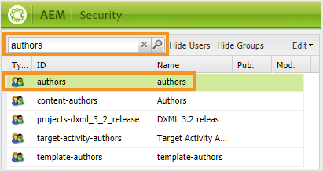

# Configurare la ricerca per l’interfaccia utente di AEM Assets {#id192SC800MY4}

Per impostazione predefinita, l&#39;AEM non riconosce il contenuto DITA, pertanto non fornisce alcun meccanismo per eseguire ricerche nel contenuto DITA all&#39;interno del relativo archivio. AEM Guides consente di aggiungere la funzionalità di ricerca di contenuti DITA nell’archivio AEM.

Per impostazione predefinita, l&#39;AEM non riconosce il contenuto DITA, pertanto non fornisce alcun meccanismo per eseguire ricerche nel contenuto DITA all&#39;interno del relativo archivio. Inoltre, non esiste alcuna funzionalità OOTB per cercare contenuti in base al loro UUID. AEM Guides consente di aggiungere le funzionalità di ricerca di contenuti DITA e basate su UUID nell’archivio AEM.

La configurazione della ricerca del contenuto DITA prevede le seguenti attività:

1. [Aggiungere il componente di ricerca degli elementi DITA nell’interfaccia utente di Assets](#id192SF0F50HS)
1. [Aggiungere un componente di ricerca basato su UUID nell’interfaccia utente di Assets](#id2034F04K05Z)
1. [Fornire autorizzazioni agli utenti](#id192SF0G0RUI)
1. [Aggiungere elementi o attributi personalizzati nella ricerca](#id192SF0G10YK)
1. [Estrai metadati da contenuto esistente](#id192SF0GA0HT)

Oltre ad aggiungere la funzionalità di ricerca, puoi anche configurare le cartelle da non includere nella ricerca. Per ulteriori dettagli, vedere [Escludere i file temporanei dai risultati della ricerca](#id197AHI0035Z).

## Aggiungere il componente di ricerca degli elementi DITA nell’interfaccia utente di Assets {#id192SF0F50HS}

Per aggiungere il componente di ricerca contenuto DITA nell’interfaccia utente di AEM Assets, effettua le seguenti operazioni:

1. Accedi a Adobe Experience Manager come amministratore.

1. Fai clic sul collegamento **Adobe Experience Manager** in alto e scegli **Strumenti**.

1. Selezionare **Generale** dall&#39;elenco degli strumenti e fare clic sul riquadro **Cerca in Forms**.

1. Nell&#39;elenco **Cerca in Forms**, selezionare la **Barra di ricerca amministrazione di Assets**.

1. Fai clic su **Modifica**.
1. Nella scheda **Seleziona predicato**, scorri fino alla fine dell&#39;elenco.

1. Trascinare il predicato **Elemento DITA** nella posizione desiderata nel modulo di ricerca.

   {width="650" align="left"}

1. Fai clic su **Fine** per salvare le modifiche.

   Quando accedi all’opzione Filtri nell’interfaccia utente di Assets, riceverai l’opzione Filtro di ricerca per elemento DITA.

   {width="350" align="left"}


## Aggiungere un componente di ricerca basato su UUID nell’interfaccia utente di Assets {#id2034F04K05Z}

Per aggiungere un componente di ricerca basato su UUID nell’interfaccia utente di AEM Assets, effettua le seguenti operazioni:

1. Accedi a Adobe Experience Manager come amministratore.

1. Fai clic sul collegamento **Adobe Experience Manager** in alto e scegli **Strumenti**.

1. Selezionare **Generale** dall&#39;elenco degli strumenti e fare clic sul riquadro **Cerca in Forms**.

1. Nell&#39;elenco **Cerca in Forms**, selezionare la **Barra di ricerca amministrazione di Assets**.

1. Fai clic su **Modifica**.
1. Nella scheda **Seleziona predicato**, scegli **Predicato proprietà** e trascinalo nella posizione desiderata nel modulo di ricerca.

1. Nella scheda **Impostazioni**, fornisci i seguenti dettagli per il componente **Predicato proprietà** appena aggiunto:

   - **Etichetta campo**: UUID
   - **Nome proprietà**: jcr:content/fmUuid
1. Fai clic su **Fine** per salvare le modifiche.

   Quando accedi all’opzione Filtri nell’interfaccia utente di Assets, riceverai l’opzione Filtro ricerca basato su UUIS.


## Fornire autorizzazioni agli utenti {#id192SF0G0RUI}

Per poter accedere alle funzionalità di ricerca dall’interfaccia utente di Assets, gli autori e gli editori devono disporre di autorizzazioni esplicite. Se non concedi queste autorizzazioni, gli utenti non potranno cercare contenuto DITA in base ai valori elemento/attributo o UUID.

Per fornire l&#39;accesso alla funzione di ricerca DITA, effettuare le seguenti operazioni:

1. Accedere alla pagina delle autorizzazioni di utenti e gruppi. L’URL predefinito per accedere alla pagina è:

   `http://<server name>:<port>/useradmin.html`

1. Cerca il gruppo di utenti o un singolo utente a cui desideri concedere l’accesso. Ad esempio, per concedere l&#39;accesso a tutti gli utenti nel gruppo autori, immettere autori nel campo **Filtra query** e premere **Invio**.

   {width="350" align="left"}

1. Seleziona il gruppo **authors**.

1. Nel riquadro di destra, selezionare la scheda **Autorizzazioni**.

1. Passare alla cartella seguente:

   /conf/global/settings/dam/search

1. Concedi l&#39;autorizzazione **Lettura** per la cartella ricerche.

   {width="650" align="left"}

1. Fai clic su **Salva**.


L’utente o il gruppo di utenti selezionato avrà ora accesso alla funzione di ricerca di contenuti DITA nell’interfaccia utente di Assets.

## Aggiungere elementi o attributi personalizzati nella ricerca {#id192SF0G10YK}

Affinché la ricerca DITA funzioni, è necessaria una preelaborazione del contenuto DITA. Questo passaggio di pre-elaborazione estrae contenuto selettivo da singole mappe e argomenti DITA in modo che possa essere indicizzato per velocizzare la ricerca. Internamente, questo processo è denominato *Serializzazione*. La serializzazione dei file DITA avviene durante il caricamento del contenuto o può anche essere eseguita su richiesta. Viene utilizzato un file di configurazione per determinare la quantità di contenuto da indicizzare da ciascun file DITA. La posizione predefinita del file di serializzazione è:

/libs/fmdita/config/serializationconfig.xml

La configurazione di ricerca predefinita consente di cercare tutti gli elementi e gli attributi all&#39;interno dell&#39;elemento DITA `prolog`. Se desideri eseguire una ricerca in base ad altri elementi o attributi, devi configurare il file di serializzazione della ricerca.

>[!NOTE]
>
> Se si desidera eseguire la configurazione di ricerca predefinita all&#39;interno dell&#39;elemento `prolog`, è possibile saltare questo processo.

Questo file contiene due sezioni principali: set di attributi e set di regole. Di seguito è riportato uno snippet della sezione relativa al set di regole:

```XML
<ruleset filetypes="xml dita"><!-- Element rules --><rule xpath="//[contains(@class, 'topic/topic')]/[contains(@class, 'topic/prolog')]//*[not(*)]" text="yes" attributeset="all-attrs" /><!-- Attribute rules --><rule xpath="//[contains(@class, 'topic/topic')]/[contains(@class, 'topic/prolog')]///@[local-name() != 'class']" /></ruleset>
```

Nella sezione del set di regole puoi specificare:

- Regole per estrarre gli elementi

- Regole per estrarre gli attributi


Una regola è costituita dai seguenti elementi:

xpath
:   Query XPath che recupera gli elementi o gli attributi dai file DITA. La configurazione predefinita per la regola elemento recupera tutti gli elementi `prolog`. La configurazione predefinita per la regola attributo recupera tutti gli attributi degli elementi `prolog`. È possibile specificare una query XPath per serializzare gli elementi o gli attributi che si desidera cercare.

La query XPath contiene il nome della classe del tipo di documento. La classe `topic/topic` viene utilizzata per i documenti DITA di tipo argomento. Se si desidera creare una regola per altri documenti DITA, è necessario utilizzare i seguenti nomi di classe:

| Tipo di documento | Nome classe |
|-------------|----------|
| Argomento | - argomento/argomento |
| Attività | - attività/attività argomento/argomento |
| Concetto | - concetto/concetto argomento/argomento |
| Riferimento | - riferimento/riferimento argomento/argomento |
| Mappa | - mappa/mappa |

text
:   Se desideri cercare il testo all’interno dell’elemento specificato, specifica il valore yes. Se non si specifica alcun valore come, vengono serializzati solo gli attributi all&#39;interno dell&#39;elemento. Gli attributi che si desidera cercare devono essere specificati nella sezione del set di attributi.

attributeset
:   Specificare l&#39;ID del set di attributi che si desidera associare alla regola. Il valore all-attrs è un caso speciale per indicare che tutti gli attributi per questa regola devono essere serializzati.

Un set di attributi contiene un elenco di attributi che si desidera cercare all&#39;interno del contenuto DITA. Il set di attributi contiene quanto segue:

id
:   Identificatore univoco per il set di attributi. Questo ID è specificato nel parametro attributeset di un set di regole.

attributo
:   Elenco di attributi che si desidera cercare. Per ogni attributo, è necessario creare una singola voce nell&#39;elemento `attribute`.

Per aggiungere elementi o attributi DITA personalizzati nel file di serializzazione della ricerca, effettuare le seguenti operazioni:

1. Accedi all’AEM e apri la modalità CRXDE Liti.

1. Passare al file di configurazione della serializzazione disponibile nella posizione seguente:

   /libs/fmdita/config/serializationconfig.xml

1. Creare un nodo di sovrapposizione della cartella `config` all&#39;interno del nodo `apps`.

1. Passare al file di configurazione disponibile nel nodo `apps`:

   `/apps/fmdita/config/serializationconfig.xml`

1. Aggiungere l&#39;elemento o i set di regole di attributo richiesti.

1. Salva il file.

1. Aprire la pagina Configurazione della console Web Adobe Experience Manager. L&#39;URL predefinito per accedere alla pagina di configurazione è:

   http://&lt;nome server\>:&lt;porta\>/system/console/configMgr

1. Cerca e fai clic sul bundle *com.adobe.fmdita.config.ConfigManager*.

1. Fai clic su **Salva**.


Le nuove informazioni di serializzazione vengono memorizzate e attivate per la ricerca. Tuttavia, è necessario estrarre i metadati dal contenuto DITA esistente per renderli disponibili per la ricerca.

## Estrai metadati da contenuto esistente {#id192SF0GA0HT}

Dopo aver apportato modifiche al file di serializzazione della ricerca predefinito, è necessario abilitare l&#39;opzione Estrazione metadati DITA nel bundle *com.adobe.fmdita.config.ConfigManager* e quindi eseguire il flusso di lavoro per estrarre i metadati. In questo modo i metadati richiesti vengono estratti dai file DITA esistenti e lo stesso viene quindi reso disponibile per la ricerca.

Se si creano nuovi file o si modifica un file dopo aver aggiornato il file di serializzazione, i metadati vengono estratti automaticamente da tali file. Il processo di estrazione dei metadati è necessario solo per i file già esistenti nell’archivio AEM.

L&#39;estrazione dei metadati da file DITA esistenti comporta due attività:

1. Abilitazione dell’opzione di estrazione dei metadati in configMgr
1. Esecuzione del flusso di lavoro di estrazione dei metadati

Per abilitare l’opzione di estrazione dei metadati in configMgr, effettua le seguenti operazioni:

1. Aprire la pagina Configurazione della console Web Adobe Experience Manager. L&#39;URL predefinito per accedere alla pagina di configurazione è:

   http://&lt;nome server\>:&lt;porta\>/system/console/configMgr

1. Cerca e fai clic sul bundle *com.adobe.fmdita.config.ConfigManager*.

1. Selezionare l&#39;opzione **Abilita estrazione metadati DITA**.

1. Fai clic su **Salva**.


Per eseguire il flusso di lavoro di estrazione dei metadati, effettua le seguenti operazioni:

1. Accedi a Adobe Experience Manager come amministratore.

1. Fai clic sul collegamento **Adobe Experience Manager** in alto e scegli **Strumenti**.

1. Selezionare **Guide** dall&#39;elenco degli strumenti e fare clic sul riquadro **Estrazione metadati DITA**.

1. Se si desidera estrarre i metadati da un singolo file e dalle relative dipendenze, fare clic sul collegamento **Seleziona un file** e cercare un file.

1. Se desideri estrarre i metadati da più file all&#39;interno di una cartella, fai clic sul collegamento **Seleziona cartella\(s\)**, sfoglia e seleziona la cartella richiesta. Fare clic sul pulsante **Aggiungi** per aggiungere la cartella all&#39;elenco delle attività di serializzazione.

   >[!NOTE]
   >
   > È possibile selezionare e aggiungere più cartelle a un&#39;attività di serializzazione.

1. Fare clic su **Inizio**.

1. Nella finestra di dialogo Conferma estrazione metadati fare clic su **OK**.


## Escludere i file temporanei dai risultati della ricerca {#id197AHI0035Z}

Per impostazione predefinita, la ricerca viene eseguita sull’intero archivio dell’AEM. Potrebbero essere presenti alcune posizioni da escludere dalla ricerca. Ad esempio, quando avvii il flusso di lavoro di traduzione del contenuto, i file non approvati rimangono in una posizione di cartella temporanea. Quando si esegue la ricerca, nei risultati della ricerca vengono restituiti anche i file di questa posizione temporanea.

Per impedire ad AEM Guides di effettuare ricerche nel percorso della cartella di traduzione temporanea, devi aggiungere il percorso della cartella temporanea nell’elenco delle esclusioni.

Per escludere la cartella di traduzione temporanea dalla ricerca, effettua le seguenti operazioni:

>[!NOTE]
>
> Questa procedura consente di aggiungere qualsiasi altro percorso di cartella all&#39;elenco di esclusione.

1. Accedi all’AEM e apri la modalità CRXDE Liti.

1. Passa al nodo damAssetLucene disponibile nella seguente posizione:

   /oak:index/damAssetLucene

1. Aggiungi la seguente proprietà nel nodo damAssetLucene:

   | Nome proprietà | Tipo | Valore |
   |-------------|----|-----|
   | excludedPaths | Stringa\[\] | Aggiungi il seguente valore a questa proprietà: <br>/content/dam/projects/translation\_output |

1. Passa al nodo Lucene disponibile nella posizione seguente:

   /oak:index/lucene

1. Aggiungi la seguente proprietà nel nodo Lucene:

   | Nome proprietà | Tipo | Valore |
   |-------------|----|-----|
   | excludedPaths | Stringa\[\] | Aggiungere i valori seguenti a questa proprietà: <br><ul><li>/var/dxml</li><li>/content/dam/projects/translation\_output</li></ul> |
