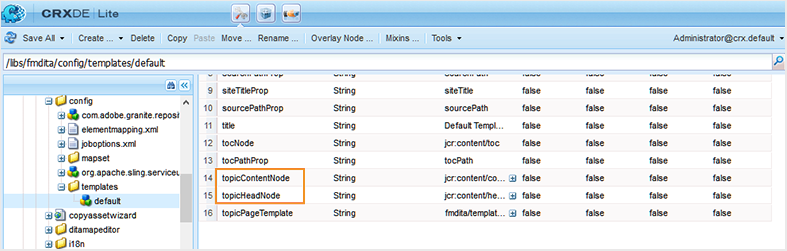

# Configurare le impostazioni di generazione dell’output {#id181AI0B0E30}

AEM Guides offre numerose opzioni di configurazione per personalizzare il processo di generazione dell’output. Questo argomento descrive tutte le configurazioni e le personalizzazioni utili per configurare il processo di generazione dell’output.

## Configurare la scheda Baseline nel dashboard delle mappe DITA {#id223MD0D0YRM}

Puoi configurare e nascondere la scheda Baseline disponibile nel dashboard delle mappe.

L&#39;opzione **Nascondi scheda della baseline** non è attivata per impostazione predefinita ed è necessario attivarla da configMgr. Per abilitare l’opzione per impostazione predefinita nell’editor web, effettua le seguenti operazioni:

1. Aprire la pagina Configurazione della console Web Adobe Experience Manager.

   L&#39;URL predefinito per accedere alla pagina di configurazione è:

   ```http
   http://<server name>:<port>/system/console/configMgr
   ```

1. Cerca e fai clic sul bundle **com.adobe.fmdita.config.ConfigManager**.

1. Selezionare l&#39;opzione **Nascondi scheda Previsione**.

1. Fai clic su **Salva**.

   >[!NOTE]
   >
   > Questa configurazione è disabilitata per impostazione predefinita e la scheda Baseline è disponibile nel dashboard delle mappe.


## Configurare FrameMaker Publishing Server {#id1678G0Z0TN6}

È possibile utilizzare FrameMaker Publishing Server \(FMPS\) per generare l&#39;output per il contenuto DITA. La configurazione di FMPS consente di generare output in più formati supportati da FMPS.

>[!NOTE]
>
> Per generare l&#39;output utilizzando FMPS, è necessario che il server FMPS sia configurato. Per informazioni dettagliate sull&#39;installazione e la configurazione, vedere la Guida utente di FrameMaker Publishing Server.

Per configurare AEM Guides per l&#39;utilizzo di FMPS, aggiornare le seguenti proprietà del bundle `com.adobe.fmdita.config.ConfigManager` nella console Web.

>[!NOTE]
>
> Accedi a http://&lt;nome server\>:&lt;porta\>/sistema/console/configMgr URL per aprire la console web.

| Proprietà | Descrizione |
|--------|-----------|
| Dominio di accesso FrameMaker Publishing Server | Specifica il nome di dominio o il nome del gruppo di lavoro in cui è ospitato FrameMaker Publishing Server. In base alla versione di FMPS, fornisci il nome di dominio come:-   **FMPS 2020**: indirizzo IP come 192.168.1.101 <br>- **FMPS 2019 e versioni precedenti**: indirizzo IP o nome di dominio |
| URL FRAMEMAKER PUBLISHING SERVER | Specifica l’URL del FrameMaker Publishing Server. In base alla versione FMPS, fornire l&#39;URL FMPS come:<br>- **FMPS 2020**: `http://<fmps_ip>:<port>` \(http://192.168.1.101:7000\) <br> - **FMPS 2019 e versioni precedenti**: `http://<fmps_ip>:<port>/fmserver/v1/` |
| Versione FMPS | Specifica il numero di versione di FrameMaker Publishing Server. In base alla versione di FMPS, fornire le informazioni sulla versione come: <br>- **FMPS 2020**: 2020 <br> - **FMPS 2019 e versioni precedenti**: 2019 o 2017 |
| Nome utente e password FrameMaker Publishing Server | Specifica il nome utente e la password per accedere al FrameMaker Publishing Server. |
| Timeout FMPS | \(*Facoltativo*\) Specifica il tempo \(in secondi\) per il quale AEM Guides attende una risposta da FrameMaker Publishing Server. Se non viene ricevuta alcuna risposta entro il tempo specificato, AEM Guides interrompe l’attività di pubblicazione e l’attività viene contrassegnata come non riuscita. <br> Valore predefinito: 300 secondi \(5 minuti\) |
| URL AEM esterno | *\(Facoltativo\)* L&#39;URL di AEM in cui FrameMaker Publishing Server inserirà i file di output generati. Ad esempio, `http://<server-name>:<port>/`. |
| Nome utente e password amministratore AEM | *\(Facoltativo\)* Il nome utente e la password di un amministratore della configurazione di AEM. Verrà utilizzato da FrameMaker Publishing Server per comunicare con AEM. |
| Timeout attesa esecuzione attività FMPS | Questa impostazione è applicabile solo a FMPS 2020. Specifica il tempo \(in secondi\) dopo il quale FMPS smetterà di attendere l&#39;esecuzione del processo. |

## Configurare la pubblicazione mista all’interno di un sito AEM esistente {#id1691I0V0MGR}

Se si dispone di un sito AEM che contiene contenuto DITA, è possibile configurare l&#39;output del sito AEM in modo da pubblicare il contenuto DITA in una posizione predefinita all&#39;interno del sito. Ad esempio, nella schermata seguente di una pagina del sito AEM, il nodo `ditacontent` è riservato per l&#39;archiviazione del contenuto DITA:

{width="300" align="left"}

I nodi rimanenti nella pagina vengono creati direttamente dall’editor del sito di AEM. La configurazione dell&#39;impostazione di pubblicazione per la pubblicazione del contenuto DITA in una posizione predefinita garantisce che nessuno dei contenuti non DITA esistenti venga modificato dal processo di pubblicazione di AEM Guides.

Per consentire la pubblicazione di contenuto DITA in un nodo predefinito, è necessario eseguire le seguenti configurazioni sul sito esistente:

- Configurare le proprietà del modello del sito

- Aggiungere nodi al sito per pubblicare contenuti DITA


Per configurare le proprietà del modello del sito esistente, effettua le seguenti operazioni:

1. Accedi ad AEM e apri la modalità CRXDE Lite.

1. Passa al nodo di configurazione del modello del sito. Ad esempio, AEM Guides memorizza le configurazioni di modelli predefinite nel seguente nodo:

   `/libs/fmdita/config/templates/default`

   >[!NOTE]
   >
   > Non effettuare personalizzazioni nei file di configurazione predefiniti disponibili nel nodo `libs`. È necessario creare una sovrapposizione del nodo `libs` nel nodo `apps` e aggiornare i file richiesti solo nel nodo `apps`.

1. Aggiungi le seguenti proprietà:

   | Nome proprietà | Tipo | Valore |
   |-------------|----|-----|
   | `topicContentNode` | Stringa | Specificare il nome del nodo in cui pubblicare il contenuto DITA. Ad esempio, il nodo predefinito in cui AEM Guides pubblica il contenuto DITA è: <br>`jcr:content/contentnode` |
   | `topicHeadNode` | Stringa | Specificare il nome del nodo in cui memorizzare le informazioni sui metadati del contenuto DITA. Ad esempio, il nodo predefinito in cui AEM Guides memorizza le informazioni sui metadati è: <br>`jcr:content/headnode` |


La schermata seguente mostra le proprietà aggiunte nel nodo del modello predefinito di AEM Guides:

{width="800" align="left"}

La prossima volta che pubblichi un contenuto DITA utilizzando le configurazioni dei modelli del sito, il contenuto viene pubblicato nei nodi specificati nelle proprietà `topicContentNode` e `topicHeadNode`.

Tuttavia, per i siti esistenti, è necessario aggiungere manualmente i nodi `topicContentNode` e `topicHeadNode`.

Per aggiungere i nodi richiesti al sito esistente, effettua le seguenti operazioni:

1. Accedi ad AEM e apri la modalità CRXDE Lite.

1. Individua `jcr:content` all&#39;interno del nodo del sito.

1. Aggiungere `topicContentNode` e `topicHeadNode` nodi con lo stesso nome specificato nelle configurazioni del modello del sito.


## Personalizzare l’output del sito AEM {#id166TG0B30WR}

AEM Guides supporta la creazione di output nei seguenti formati:

- Sito AEM

- PDF

- HTML5
- EPUB
- Output personalizzato tramite DITA-OT

Per l’output Sito di AEM, puoi assegnare diversi modelli di progettazione con diverse attività di output. Questi modelli di progettazione possono eseguire il rendering del contenuto DITA in layout diversi. Ad esempio, puoi specificare diversi modelli di progettazione per il pubblico interno ed esterno.

È inoltre possibile utilizzare plug-in personalizzati DITA Open Toolkit \(DITA-OT\) con AEM Guides. È possibile caricare questi plug-in DITA-OT personalizzati per generare l&#39;output di PDF in un modo specifico.

>[!TIP]
>
> Consulta la sezione *Pubblicazione del sito AEM* nella guida alle best practice[appendix.md\#](appendix.md#) per le best practice sulla creazione dell&#39;output del sito AEM.

### Personalizza modello struttura per generare output {#customize_xml-add-on}

AEM Guides utilizza un set di modelli di progettazione predefiniti per generare l’output del sito AEM. Puoi personalizzare i modelli di progettazione di AEM Guides per generare l’output conforme al tuo branding aziendale. Un modello di progettazione è una raccolta di vari stili \(CSS\), script \(lato server e lato client\), risorse \(immagini, loghi e altre risorse\) e nodi JCR che collegano tutte queste risorse. Un modello di progettazione può essere semplice come un singolo script lato server con solo un paio di nodi JCR o una combinazione complessa di stili, risorse e nodi JCR. I modelli di progettazione vengono utilizzati dal sottosistema di pubblicazione di AEM Guides durante la generazione dell’output del sito AEM e controllano la struttura, l’aspetto dell’output generato.

Non esiste alcuna restrizione relativa alla posizione delle risorse del modello di progettazione nel server, ma in genere sono organizzate in modo logico in base alla loro funzione. Ad esempio, tutti i file JavaScript e CSS del modello predefinito sono memorizzati nella cartella `/etc/designs/fmdita/clientlibs/siteoutput/default`. Ovunque si trovino questi file, sono collegati tra loro da una raccolta di nodi JCR. Insieme, questi nodi JCR e i file costituiscono l’intero modello di progettazione.

Il modello struttura predefinito fornito con AEM Guides consente di personalizzare i componenti della pagina di destinazione, dell’argomento e della ricerca. Potete creare una copia del progetto di default e delle maschere di riferimento corrispondenti e specificare componenti diversi per generare l&#39;output desiderato.

Per specificare il modello di progettazione da utilizzare per la generazione di output del sito AEM, effettua le seguenti operazioni:

1. Accedi ad AEM e apri la modalità CRXDE Lite.

1. Passare al nodo predefinito del modello struttura. La posizione del nodo predefinito del modello struttura è:

   `/libs/fmdita/config/templates/`

   {width="300" align="left"}

   >[!NOTE]
   >
   > Creare una copia dei modelli struttura predefiniti dalla cartella `libs` alla cartella `apps` e apportare le modifiche nella cartella `apps`. È inoltre necessario apportare modifiche ai modelli a cui si fa riferimento dal nodo del modello predefinito. I modelli a cui si fa riferimento si trovano sotto il nodo `/libs/fmdita/templates/default/cqtemplates`. Creare una copia dei modelli a cui si fa riferimento nella cartella `apps` prima di apportare qualsiasi modifica.

1. Fai clic sul componente *default* nel nodo *templates* per accedere alle relative proprietà.

   Nella tabella seguente sono descritte le proprietà del modello struttura di AEM Guides.

   | Proprietà | Descrizione |
   |--------|-----------|
   | `landingPageTemplate`, `searchPageTemplate`, `topicPageTemplate`, `shadowPageTemplate` | Specifica il nodo `cq:Template` per le pagine corrispondenti \(destinazione, ricerca e argomento\). Per impostazione predefinita, il nodo `cq:Template` per queste pagine si trova nel nodo `/libs/fmdita/templates/default/cqtemplates`. Questo nodo definisce la struttura e le proprietà delle pagine di destinazione, ricerca e argomento. <br>`shadowPageTemplate` viene utilizzato per ottimizzare il contenuto a blocchi. Impostare il valore di questa proprietà su: <br> `fmdita/templates/default/cqtemplates/shadowpage` <br> **Nota** Specificare un valore per `topicPageTemplate`. `landingPageTemplate` e `searchPageTemplate` sono proprietà facoltative. Se non desideri che le pagine di ricerca e di destinazione vengano generate, non specificare queste proprietà. |
   | `title` | Nome descrittivo del modello di progettazione. |
   | `topicContentNode` | Posizione del nodo che conterrà il contenuto DITA in una pagina dell&#39;argomento. Il percorso è relativo alla pagina dell&#39;argomento. |
   | `topicHeadNode` | Posizione del nodo che conterrà i valori head \(o metadati\) derivati dal contenuto DITA. Il percorso è relativo alla pagina dell&#39;argomento. |
   | `tocNode` | Posizione del nodo che conterrà il sommario. Percorso relativo alla pagina di destinazione o al percorso di destinazione. |
   | `basePathProp` | Nome della proprietà per la memorizzazione del percorso della directory principale del sito pubblicato. |
   | `indexPathProp` | Nome della proprietà per la memorizzazione del percorso della pagina di destinazione/indice del sito pubblicato. |
   | `pdfPathProp` | Nome della proprietà per l&#39;archiviazione del percorso PDF dell&#39;argomento, se è abilitata la generazione PDF dell&#39;argomento. |
   | `pdfTypeProp` | Nome della proprietà per l’archiviazione del tipo della generazione PDF. Attualmente questa proprietà contiene sempre &quot;Argomento&quot;. |
   | `searchPathProp` | Il nome della proprietà per memorizzare il percorso della pagina di ricerca, se il modello include una pagina di ricerca. |
   | `siteTitleProp` | Nome della proprietà per memorizzare il titolo del sito da pubblicare. Questo titolo è in genere lo stesso del titolo della mappa pubblicata. |
   | `sourcePathProp` | Nome della proprietà per la memorizzazione del percorso dell&#39;argomento DITA di origine per la pagina corrente. |
   | `tocPathProp` | Nome della proprietà per la memorizzazione del percorso della directory principale del sommario per il sito pubblicato. |


>[!NOTE]
>
> Dopo aver creato un nodo del modello di progettazione personalizzato, è necessario aggiornare l’opzione Progettazione nei predefiniti di output del sito AEM per utilizzare il nodo del modello di progettazione personalizzato.

Per ulteriori informazioni, consulta [Creazione del primo sito Web Adobe Experience Manager 6.3](https://helpx.adobe.com/experience-manager/using/first_aem63_website.html) e [Nozioni di base](https://helpx.adobe.com/experience-manager/6-3/sites/developing/using/the-basics.html) sullo sviluppo di un sito Web personale su AEM.

### Usa il titolo del documento per generare l&#39;output del sito AEM

Durante la generazione dell’output del sito AEM, il modo in cui vengono generati gli URL svolge un ruolo importante nella reperibilità dei contenuti. Se utilizzi nomi di file basati su UUID, la generazione di URL basati su UUID dei file non sarà semplice da cercare. In qualità di amministratore o di editore, hai il controllo su come generare gli URL per l’output del sito AEM. AEM Guides offre una configurazione attraverso la quale puoi scegliere di generare gli URL dell’output del sito AEM utilizzando il titolo del file invece dei nomi di file basati su UUID. Per impostazione predefinita, per i file system basati su UUID questa opzione è attivata. Ciò implicava che quando si genera l&#39;output del sito AEM per file system basati su UUID, i titoli del file vengono utilizzati per generare gli URL e non gli UUID dei file.

Durante la generazione dell’output del sito AEM, il modo in cui vengono generati gli URL svolge un ruolo importante nella reperibilità dei contenuti. In caso di file system non basati su UUID, l’output del sito AEM viene generato utilizzando i nomi dei file e non i titoli dei file. In qualità di amministratore o di editore, hai il controllo su come generare gli URL per l’output del sito AEM. AEM Guides offre una configurazione attraverso la quale puoi scegliere di generare gli URL dell’output del sito AEM utilizzando il titolo del file anziché i nomi dei file. Per impostazione predefinita, questa opzione è disattivata. Ciò implicava che quando si genera l’output del sito AEM, i nomi dei file vengono utilizzati per generare gli URL e non il titolo del file. Abilitando questa opzione, puoi scegliere di generare gli URL in base ai titoli dei file.

>[!NOTE]
>
> Puoi configurare ulteriormente le regole in modo da consentire solo un set di caratteri negli URL dell’output di un sito AEM. Per ulteriori dettagli, vedere [Configurare le regole di bonifica del nome file per la creazione di argomenti e la pubblicazione dell&#39;output del sito AEM](#id2164D0KD0XA).

Per configurare la generazione di URL nell’output del sito AEM, effettua le seguenti operazioni:

1. Aprire la pagina Configurazione della console Web Adobe Experience Manager.

   L&#39;URL predefinito per accedere alla pagina di configurazione è:

   ```http
   http://<server name>:<port>/system/console/configMgr
   ```

1. Cerca e fai clic sul bundle **com.adobe.fmdita.config.ConfigManager**.

1. Selezionare l&#39;opzione **Usa titolo per i nomi delle pagine del sito AEM**.

   >[!NOTE]
   >
   > Se desideri generare l’output utilizzando i nomi dei file, deseleziona questa opzione.

1. Fai clic su **Salva**.


### Configurare le regole di bonifica del nome file per la creazione di argomenti e la pubblicazione dell’output del sito AEM {#id2164D0KD0XA}

In qualità di amministratore, puoi definire un elenco di caratteri speciali validi consentiti nei nomi dei file, che alla fine formeranno l’URL di un output del sito AEM. Nelle versioni precedenti, gli utenti potevano definire nomi di file contenenti caratteri speciali come `@`, `$`, `>` e altri. Questi caratteri speciali hanno generato un URL codificato nella generazione di pagine del sito AEM.

A partire dalla versione 3.8, sono state aggiunte configurazioni per definire un elenco di caratteri speciali consentiti nei nomi dei file. Per impostazione predefinita, la configurazione del nome file valida contiene &quot;`a-z A-Z 0-9 - _`&quot;. Ciò implica che durante la creazione di un file, è possibile inserire qualsiasi carattere speciale nel titolo del file, ma internamente verrà sostituito con un trattino \(`-`\) nel nome del file. Ad esempio, puoi assegnare al file il titolo Introduzione 1 o Introduction@1; il nome file corrispondente generato in entrambi i casi sarà Introduzione-1.

Quando definisci un elenco di caratteri validi, ricorda che questi caratteri &quot;`*/:[\]|#%{}?&<>"/+`&quot; e `a space` verranno sempre sostituiti da un trattino \(`-`\).

>[!NOTE]
>
> Se non configuri l’elenco dei caratteri speciali validi, il processo di creazione del file potrebbe fornire risultati imprevisti.

Per configurare i caratteri speciali validi nei nomi di file e nell’output del sito AEM, effettua le seguenti operazioni:

1. Aprire la pagina Configurazione della console Web Adobe Experience Manager.

   L&#39;URL predefinito per accedere alla pagina di configurazione è:

   ```http
   http://<server name>:<port>/system/console/configMgr
   ```

1. Cerca e fai clic sul bundle *com.adobe.fmdita.common.SanitizeNodeNameImpl*.

1. Nel set di caratteri **Non consentito per la pubblicazione nella proprietà AEM Sites**, verificare che la proprietà sia impostata su ```'<>`@$```. È possibile aggiungere altri caratteri speciali all&#39;elenco, tuttavia è necessario che siano presenti i caratteri speciali richiesti.

   >[!NOTE]
   >
   > È inoltre possibile configurare le altre proprietà, ad esempio **Usa caratteri minuscoli** nei nomi dei file, **Separatore** per gestire i caratteri non validi e **Numero massimo di caratteri** consentito nei nomi dei file.

1. Fai clic su **Salva**.

1. Cerca e fai clic sul bundle **com.adobe.fmdita.config.ConfigManager**.

1. Nella proprietà **Regex per caratteri validi**, verificare che la proprietà sia impostata su `[-a-zA-Z0-9_]`. È possibile aggiungere altri caratteri all&#39;elenco, tuttavia è necessario che siano presenti questi caratteri di base e l&#39;elenco deve iniziare con un trattino \(`-`\).

   >[!NOTE]
   >
   > Questa proprietà definisce l’elenco dei caratteri validi utilizzati per creare un nuovo file.

1. Fai clic su **Salva**.


### Configurare l’appiattimento della struttura dei nodi del sito AEM

Quando si genera l&#39;output di AEM Site, viene creato internamente un nodo per ogni elemento degli argomenti. Per una mappa DITA con migliaia di argomenti, questa struttura di nodi può diventare troppo profonda. Questo tipo di struttura di nodi profondamente nidificata può presentare problemi di prestazioni per siti più grandi. L’istantanea seguente mostra la struttura dei nodi profondamente nidificati per un output di un sito AEM:

{width="300" align="left"}

Nell&#39;istantanea precedente, si noti che viene creato un nodo per ogni elemento `p` e i relativi sottoelementi successivi e che viene creata una struttura simile per ogni altro elemento utilizzato nell&#39;argomento.

AEM Guides consente di configurare la modalità di creazione interna della struttura dei nodi dell’output del sito AEM. È possibile appiattire la struttura del nodo in corrispondenza di elementi specifici, il che significa che è possibile definire un elemento che verrà considerato come elemento principale e tutti i sottoelementi al suo interno verranno uniti all’elemento principale. Se ad esempio si decide di appiattire l&#39;elemento `p`, qualsiasi elemento visualizzato all&#39;interno dell&#39;elemento `p` verrà unito all&#39;elemento `p` principale. Non verrà creata una nota separata per alcun sottoelemento all&#39;interno dell&#39;elemento `p`. Lo snapshot seguente visualizza la struttura del nodo appiattita in corrispondenza dell&#39;elemento `p`:

{width="300" align="left"}

Per appiattire la struttura dei nodi del sito AEM, effettua le seguenti operazioni:

1. Specifica l’elemento in corrispondenza del quale desideri appiattire la struttura del nodo.

   1. Sovrapposizione del nodo `libs` nel nodo `apps` e apertura del file elementmapping.xml.

   1. Aggiungere la proprietà `<flatten>true</flatten>` nella definizione dell&#39;elemento in corrispondenza del quale si desidera appiattire la struttura del nodo. Ad esempio, se si desidera appiattire la struttura del nodo in corrispondenza dell&#39;elemento `p`, aggiungere l&#39;attributo appiattire nella definizione dell&#39;elemento `p` come illustrato di seguito:

      ```XML
      <ditaelement>
          <name>p</name>
          <class>- topic/p</class>
          <componentpath>fmdita/components/dita/wrapper</componentpath>
          <type>COMPOSITE</type>
          <target>para</target>
          <flatten>true</flatten>
          <wrapelement>div</wrapelement>
      </ditaelement>
      ```

      >[!NOTE]
      >
      > Per impostazione predefinita, la proprietà del nodo appiattito è stata configurata nell&#39;elemento `p`.

1. Abilitare la configurazione di appiattimento del nodo del sito in configMgr.

   1. Aprire la pagina Configurazione della console Web Adobe Experience Manager.

      L&#39;URL predefinito per accedere alla pagina di configurazione è:

      ```http
      http://<server name>:<port>/system/console/configMgr
      ```

   1. Cerca e fai clic sul bundle *com.adobe.dxml.flattening.FlatteningConfigurationService*.

   1. Selezionare l&#39;opzione **Appiattimento proprietà.enabled**.

   1. Fai clic su **Salva**.


>[!IMPORTANT]
>
> Se hai apportato modifiche al file elementmapping.xml, accertati di aprire configMgr e salvare eventuali bundle per rendere effettive le modifiche.

Ora, quando si genera l&#39;output del sito AEM, i nodi all&#39;interno dell&#39;elemento `p` vengono appiattiti e memorizzati all&#39;interno dell&#39;elemento `p` stesso. Le nuove proprietà di conversione per l&#39;elemento `p` sono disponibili in CRXDE.

{width="650" align="left"}

**Impedisci appiattimento della struttura delle note del sito AEM**

Simile a specificare il nodo da &quot;appiattire&quot; nell’output di AEM Site, puoi anche specificare un elemento da escludere da questa configurazione. Ad esempio, se si desidera appiattire i nodi in corrispondenza dell&#39;elemento `body`, ma non si desidera appiattire alcun elemento `table` in `body`, è possibile aggiungere la proprietà exclude all&#39;interno della definizione dell&#39;elemento `table`.

Per escludere l&#39;elemento `table` dall&#39;appiattimento, aggiungere la seguente proprietà alla definizione dell&#39;elemento `table`:

`<preventancestorflattening>true|false</preventancestorflattening>`

### Configurare il controllo delle versioni per le pagine eliminate nell’output del sito AEM

Quando si genera l&#39;output del sito AEM con l&#39;opzione **Elimina e** Crea **&#x200B;**&#x200B;selezionata per l&#39;impostazione Pagine di output esistenti, viene creata una versione per la pagina\(s\) da eliminare. Puoi configurare il sistema in modo da interrompere la creazione di una versione prima dell’eliminazione.

Per interrompere la creazione di una versione per le pagine da eliminare, effettua le seguenti operazioni:

1. Aprire la pagina Configurazione della console Web Adobe Experience Manager.

   L&#39;URL predefinito per accedere alla pagina di configurazione è:

   ```http
   http://<server name>:<port>/system/console/configMgr
   ```

1. Cerca e fai clic sul bundle *com.adobe.fmdita.config.ConfigManager*.

1. Seleziona **Non creare la versione per le pagine eliminate**.

   >[!NOTE]
   >
   > Selezionando questa opzione, gli utenti potranno eliminare direttamente le pagine senza creare alcuna versione. Se l&#39;opzione non è selezionata, viene creata una versione prima che le pagine\(s\) vengano eliminate.

1. Fai clic su **Salva**.

## Utilizzare i metadati nell&#39;output di pubblicazione tramite DITA-OT {#id191LF0U0TY4}

AEM Guides consente di trasmettere metadati personalizzati durante la pubblicazione dell&#39;output tramite DITA-OT. In qualità di amministratore e di editore, è necessario eseguire le seguenti attività per configurare e utilizzare metadati personalizzati nell’output pubblicato:

- In qualità di amministratore, aggiungere i metadati richiesti nel sistema in modo che siano disponibili nella pagina Proprietà della mappa DITA.

- In qualità di amministratore, aggiungi i metadati personalizzati nell&#39;elenco dei metadati in modo che vengano visualizzati nella console delle mappe DITA.

- In qualità di editore, configura e aggiungi i metadati personalizzati con la mappa DITA e genera l’output richiesto.


Per aggiungere i metadati richiesti nel sistema, effettuare le seguenti operazioni:

1. Accedi a Adobe Experience Manager come amministratore.

1. Fai clic sul collegamento Adobe Experience Manager in alto e scegli **Strumenti**.

1. Seleziona **Assets** dall&#39;elenco degli strumenti.

1. Fai clic sul riquadro **Schemi metadati**.

   Viene visualizzata la pagina Forms schema metadati.

1. Selezionare il modulo **default** dall&#39;elenco.

   >[!NOTE]
   >
   > Le proprietà visualizzate nella pagina Proprietà di una mappa DITA vengono ricavate da questo modulo.

1. Fai clic su **Modifica**.

1. Aggiungi i metadati personalizzati che desideri utilizzare negli output pubblicati. Ad esempio, aggiungeremo i metadati del pubblico come segue:

   1. Dall&#39;elenco dei componenti **Genera modulo**, trascinare il componente **Testo a riga singola** nel modulo.

   1. Seleziona il nuovo campo per aprire **Impostazioni** del campo.

   1. In **Etichetta campo**, immettere il nome metadati: Pubblico.

   1. Nell&#39;impostazione **Mappa su proprietà**, specificare ./jcr:content/metadata/&lt;nome dei metadati\>. Per il nostro esempio, lo imposteremo su ./jcr:content/metadata/audience.

   Utilizzando questi passaggi, aggiungi tutti i parametri di metadati richiesti.

1. Fai clic su **Salva**.


Il nuovo parametro ora viene visualizzato nella pagina Proprietà per tutte le mappe DITA.

{width="650" align="left"}

Successivamente, è necessario rendere disponibili i metadati personalizzati nella console delle mappe DITA. Per rendere disponibili i metadati personalizzati sulla dashboard delle mappe DITA, effettuare le seguenti operazioni:

1. Accedi ad AEM e apri la modalità CRXDE Lite.

1. Accedere al file metadataList disponibile nel percorso seguente:

   /libs/fmdita/config/metadataList

   >[!NOTE]
   >
   > Il file metadataList contiene un elenco di proprietà visualizzate nell&#39;elenco a discesa **Proprietà** di una mappa DITA nel dashboard delle mappe. Per impostazione predefinita, in questo file sono elencate quattro proprietà: docstate, dc:language, dc:description e dc:title.

1. Aggiungi i metadati personalizzati aggiunti nella pagina Forms dello schema metadati. Nel nostro esempio, aggiungi il parametro audience alla fine dell’elenco predefinito.

1. Fare clic su **Salva tutto**.


Ora i metadati personalizzati verranno visualizzati nell&#39;elenco a discesa **Proprietà** della console delle mappe DITA.

Infine, in qualità di editore, è necessario includere i metadati personalizzati nell’output pubblicato. Per elaborare i metadati personalizzati durante la generazione dell’output, effettua le seguenti operazioni:

1. Nell&#39;interfaccia utente di Assets, passare alla mappa DITA che si desidera pubblicare.

1. Selezionare il file mappa DITA e aprirne la pagina delle proprietà.

1. Nella pagina Proprietà, specifica il valore per i metadati personalizzati. Per il nostro esempio, abbiamo specificato il valore External per il parametro audience.

   {width="650" align="left"}

1. Fai clic su **Salva e chiudi**.

1. Fare clic sul file mappa DITA per aprire la console Mappa DITA.

1. Nella scheda **Predefiniti di output** selezionare il predefinito di output che si desidera utilizzare per generare l&#39;output.

1. Fai clic su **Modifica**.

1. Dall&#39;elenco a discesa **Proprietà**, selezionare le proprietà che si desidera trasferire al processo di pubblicazione.

   {width="650" align="left"}


Le proprietà/metadati selezionati vengono trasmessi al processo di pubblicazione e sono resi disponibili nell’output finale.

## Personalizzare la mappatura degli elementi DITA con i componenti AEM {#id1679J600HEL}

Gli elementi DITA in AEM Guides sono mappati ai relativi componenti AEM corrispondenti. AEM Guides utilizza questa mappatura nei flussi di lavoro, ad esempio pubblicazione e revisione, per convertire l’elemento DITA in un componente AEM corrispondente. Il mapping è definito nel file `elementmapping.xml`, a cui è possibile accedere dalla modalità CRXDE Lite. Accedi al seguente URL in modalità CRXDE Lite:

`/libs/fmdita/config/elementmapping.xml`

>[!NOTE]
>
> Non effettuare personalizzazioni nei file di configurazione predefiniti disponibili nel nodo ``libs``. È necessario creare una sovrapposizione del nodo ``libs`` nel nodo ``apps`` e aggiornare i file richiesti solo nel nodo ``apps``.

È possibile utilizzare le mappature di elementi DITA predefinite oppure mappare gli elementi DITA ai componenti AEM personalizzati. Per utilizzare i componenti AEM personalizzati, è necessario comprendere la struttura del file `elementmapping.xml`.

### struttura elementmapping.xml

Di seguito viene illustrata una panoramica di alto livello della struttura `elementmapping.xml`:

1. Per ogni elemento DITA viene innanzitutto eseguita la ricerca di una mappatura di componente corrispondente in base al nome dell&#39;elemento. Ad esempio:

   ```XML
   <ditaelement>     
      <name>**substeps**</name>  
      <class>- topic/ol task/substeps</class>  
      <componentpath>dita/components/ditaolist</componentpath>  
      <type>COMPOSITE</type>  
      <target>para</target>
   </ditaelement>
   ```

   Nell&#39;esempio precedente, tutti gli elementi DITA `substeps` vengono sottoposti a rendering utilizzando il componente `dita/components/ditaolist`.

1. Se un elemento DITA non trova una corrispondenza basata sul nome, viene eseguita una corrispondenza sulla base di `class`. Ad esempio:

   ```XML
   <ditaelement>  
      <name>topic</name>  
      <class>**- topic/topic**</class>  
      <componentpath>fmdita/components/dita/topic</componentpath>  
      <type>COMPOSITE</type>  
      <target>para</target>  
      <attributemap> 
         <attribute from="id" to="id" />  
      </attributemap>
   </ditaelement>
   ```

   Nell&#39;esempio precedente, se non è stata definita alcuna mappatura per l&#39;elemento `task`, l&#39;elemento `task` viene mappato al componente precedente perché `task` è ereditato dal componente `topic`.

1. Quando a un elemento corrisponde un mapping di componenti, l&#39;ulteriore elaborazione degli elementi figlio è determinata da `type`. Ad esempio:

   ```XML
   <ditaelement>  
      <name>title</name>  
      <class>- topic/title</class>  
      <componentpath>foundation/components/title</componentpath>  
      <type>**STANDALONE**</type>  
      <target>para</target>  
      <textprop>jcr:title</textprop>
   </ditaelement>
   ```

   `type` accetta i seguenti valori:

   - COMPOSITE: la mappatura da elemento a componente *continua anche per gli elementi figlio*.

   - STANDALONE: gli elementi secondari dell&#39;elemento corrente sono *non mappati ulteriormente*.

   Nell&#39;esempio precedente, se l&#39;elemento `<title>` include elementi figlio, questi non verranno mappati ad alcun altro componente. Il componente per l&#39;elemento `<title>` è responsabile del rendering di tutti gli elementi figlio all&#39;interno dell&#39;elemento `<title>`.

1. Se sono presenti più componenti mappati a un singolo elemento DITA, viene selezionata la corrispondenza migliore per l’elemento. Per selezionare il componente di corrispondenza migliore, viene considerata la specializzazione del dominio e della struttura degli elementi DITA.

   Se sono presenti elementi DITA con specializzazione di dominio e un componente è mappato per la specializzazione di dominio, a tale componente viene assegnata la priorità alta.

   Analogamente, se esistono elementi DITA con specializzazione strutturale e un componente è mappato per la specializzazione strutturale, a tale componente viene assegnata la priorità alta.

1. È possibile utilizzare `<attributemap>` nella mappatura degli elementi per mappare i valori degli attributi alle proprietà corrispondenti del nodo.

1. `textprop` può essere utilizzato per serializzare il contenuto di testo di un elemento DITA in una proprietà nodo. Inoltre, può essere utilizzato più volte in un tag elemento per serializzare il contenuto di testo in più posizioni nella gerarchia pubblicata. Puoi anche personalizzare la posizione e il nome della proprietà target. Ad esempio:

   ```XML
   <ditaelement> 
       <name>title</name> 
       <class>- topic/title</class> 
       <componentpath>foundation/components/title</componentpath> 
       <type>STANDALONE</type> 
       <target>para</target> 
       <textprop>**jcr:title**</textprop>
   </ditaelement>
   ```

   La mappatura dell&#39;elemento precedente specifica che il contenuto di testo dell&#39;elemento `<title>` verrà salvato come valore di una proprietà denominata `jcr:title` nel nodo di output.

1. `xmlprop` può essere utilizzato per serializzare l&#39;intero XML di un dato elemento a una proprietà del nodo. Il componente può quindi leggere questa proprietà del nodo ed eseguire il rendering personalizzato. Ad esempio:

   ```XML
   <ditaelement> 
       <name>svg-container</name> 
       <class>+ topic/foreign svg-d/svg-container</class> 
       <componentpath>fmdita/components/dita/svg</componentpath> 
       <type>STANDALONE</type> 
       <target>para</target> 
       <xmlprop>**data**</xmlprop>
   </ditaelement>
   ```

   Il mapping di elementi sopra riportato specifica che l&#39;intero markup XML per l&#39;elemento `<svg-container>` verrà salvato come valore di una proprietà denominata `data` nel nodo di output.

1. Esiste uno speciale mapping di attributi per gestire la risoluzione del percorso nel processo di generazione dell&#39;output. Ad esempio:

   ```XML
   <attributemap> 
       <attribute from="href" to="fileReference" ispath="true" rel="source" /> 
       <attribute from="height" to="height" /> 
       <attribute from="width" to="width" />
   </attributemap>
   ```

   Per `attributemap`, l&#39;attributo `href` nell&#39;elemento DITA verrà mappato a una proprietà nodo denominata `fileReference`. Poiché `ispath` è impostato su `true`, il processo di generazione dell&#39;output risolve questo percorso e lo imposta nella proprietà del nodo `fileReference`.

   La modalità di risoluzione viene determinata in base al valore dell&#39;attributo `rel` nella mappatura degli attributi.

   - Se `rel=source`, il valore di `href` viene risolto rispetto al file di origine DITA in fase di elaborazione. Il valore di `href` è risolto e posizionato nel valore della proprietà `fileReference`.

   - Se `rel=target`, il valore di `href` viene risolto rispetto al percorso di pubblicazione principale. Il valore di `href` è risolto e posizionato nel valore della proprietà `fileReference`.

   Se non desideri che si verifichi alcuna pre-elaborazione o risoluzione sugli attributi del percorso, non è necessario specificare l&#39;attributo `ispath`. Il valore viene copiato così come è e il componente può eseguire la risoluzione richiesta.


### Schema elemento DITA

Di seguito è riportato un esempio dello schema dell&#39;elemento DITA nel file `elementmapping.xml`:

```XML
<ditaelement>         
    <name>element_name</name>     
    <class>element_class</class>     
    <componentpath>fmdita/components/dita/component_name</componentpath>     
    <type>COMPOSITE|STANDALONE</type>      
    <attributeprop>propname_a</attributeprop>       
    <textprop>propname_t</textprop>     
    <xmlprop>propname_x</xmlprop>      
    <xpath>xpath expression string</xpath>      
    <target>head|para</target>      
    <wrapelement>div</wrapelement>      
    <wrapclass>class_name</wrapclass>      
    <attributemap>           
    <attribute from="attrname" to="propname" ispath="true|false" rel="source|target" />     
    </attributemap>     
    <skip>true|false</skip> 
</ditaelement>
```

Nella tabella seguente vengono descritti gli elementi dello schema di elementi DITA:

| Elemento | Descrizione |
|-------|-----------|
| `<ditaelement>` | Nodo di primo livello per ogni elemento di mappatura. |
| `<class>` | Attributo di classe dell&#39;elemento DITA di destinazione per il quale si sta scrivendo il componente. <br>Ad esempio, l&#39;attributo di classe per l&#39;argomento DITA è: <br>`topic/topic` |
| `<componentpath>` | Percorso CRXDE del componente AEM mappato. |
| `<type>` | Valori possibili: <br>- **COMPOSITO**: Elabora anche elementi figlio <br>- **STANDALONE**: ignora l&#39;elaborazione degli elementi figlio |
| `<attributeprop>` | Utilizzato per la mappatura di attributi e valori DITA serializzati ai nodi AEM come proprietà. Ad esempio, se si dispone dell&#39;elemento `<note type="Caution">` e il componente mappato per questo elemento ha `<attributeprop>attr_t</ attributeprop>`, l&#39;attributo e il valore del nodo vengono serializzati nella proprietà `attr_t` del nodo AEM corrispondente \( `attr_t->type="caution"`\). |
| `<textprop>propname_t</textprop>` | Salva l&#39;output `getTextContent()` nella proprietà definita da `propname_t.` **Nota:** Si tratta di una proprietà ottimizzata. |
| `<xmlprop>propname_x </xmlprop>` | Salva l&#39;XML serializzato di questo nodo nella proprietà definita da `propname_x.` **Nota:** Si tratta di una proprietà ottimizzata. |
| `<xpath>` | Se l&#39;elemento XPath viene fornito nel mapping di elementi, insieme al nome e alla classe dell&#39;elemento deve essere soddisfatta anche la condizione XPath affinché venga utilizzato il mapping di componenti. |
| `<target>` | Posizionare l&#39;elemento DITA nell&#39;archivio crx nella posizione specificata. <br>Valori possibili:<br>- **head**: sotto il nodo head <br>- **text**: sotto il nodo paragrafo |
| `<wrapelement>` | L’elemento HTML in cui racchiudere il contenuto. |
| `<wrapclass>` | Il valore dell&#39;elemento alla proprietà `wrapclass.` |
| `<attributemap>` | Nodo contenitore contenente uno o più nodi `<attribute>`. |
| `<attribute from="attrname" to="propname" ispath="true\|false" rel="source\|target" />` | Mappa gli attributi DITA alle proprietà di AEM:<br>- **`from`**: nome attributo DITA<br>- **`to`**: nome proprietà componente AEM <br>- **`ispath`**: Se l&#39;attributo è un valore percorso \(ad esempio: *image*\)<br>- **`rel`**: se il percorso è l&#39;origine o la destinazione <br>**Nota:** Se `attrname` inizia con `%`, mappa `attrname minus '%'` a prop &#39; `propname`&#39;. |

**Note aggiuntive**

- Se si prevede di ignorare la mappatura degli elementi predefinita, è consigliabile non apportare le modifiche nel file `elementmapping.xml` predefinito. Devi creare un nuovo file XML di mappatura e posizionarlo in un’altra posizione, preferibilmente all’interno della cartella delle app personalizzate che crei.

- Nel file `elementmapping.xml` sono presenti molte voci di mapping che fanno riferimento al componente fmdita/components/dita/wrapper. Wrapper è un componente generico che esegue il rendering di costrutti DITA relativamente semplici utilizzando le proprietà sul nodo del sito per generare HTML rilevanti. Utilizza la proprietà `wrapelement` per generare tag di inclusione e delega il rendering secondario ai componenti corrispondenti. Ciò è utile nei casi in cui desideri solo un componente contenitore. Invece di creare un nuovo componente che esegue il rendering di un tag contenitore specifico come `div` o `p`, è possibile utilizzare il componente Wrapper con le proprietà `wrapelement` e `wrapclass` per ottenere lo stesso effetto.

- Si sconsiglia di salvare grandi quantità di testo nelle proprietà String JCR. Il calcolo del tipo di proprietà ottimizzato nella generazione dell’output assicura che il contenuto di testo di grandi dimensioni non venga salvato come tipo di stringa. Quando invece è necessario salvare un contenuto superiore a una determinata soglia, il tipo della proprietà viene modificato in binario. Per impostazione predefinita, questa soglia è configurata a 512 byte, ma può essere modificata in Configuration Manager \(*com.adobe.fmdita.config.ConfigManager*\) modificando l&#39;impostazione **Salva come soglia binaria**.

- Se si prevede di ignorare alcuni \(e non tutti\) dei mapping degli elementi, non è necessario replicare l&#39;intero file `elementmapping.xml`. È necessario creare un nuovo file di mapping XML e definire solo gli elementi sovrascritti.

- Dopo aver creato il file XML nel percorso personalizzato, aggiornare l&#39;impostazione `Override Element Mapping` nel bundle `com.adobe.fmdita.config.ConfigManager`.


## Personalizza console mappe DITA {#id188HC08M0CZ}

AEM Guides offre la flessibilità di estendere le funzionalità della console delle mappe DITA. Ad esempio, se disponi di un set di rapporti diversi da quelli disponibili in AEM Guides, puoi aggiungerli alla console delle mappe. Per personalizzare la console delle mappe, devi creare una libreria client di AEM \(o ClientLib\) che conterrà il codice necessario per eseguire la funzionalità necessaria.

>[!NOTE]
>
> Non è consigliata la modifica diretta ai componenti della pagina, in quanto verrà sovrascritta dalle nuove versioni del prodotto.

AEM Guides fornisce la categoria `apps.fmdita.dashboard-extn` per personalizzare la console delle mappe. Ogni volta che la console delle mappe viene caricata, la funzionalità creata nella categoria `apps.fmdita.dashboard-extn` viene eseguita e caricata.

>[!NOTE]
>
> Per ulteriori informazioni sulla creazione della libreria client di AEM, vedere [Utilizzo delle librerie lato client](https://helpx.adobe.com/experience-manager/6-4/sites/developing/using/clientlibs.html).

## Gestione della rappresentazione delle immagini durante la generazione dell&#39;output {#id177BF0G0VY4}

AEM viene fornito con una serie di flussi di lavoro e di handle di contenuti multimediali predefiniti per l’elaborazione delle risorse. In AEM, esistono flussi di lavoro predefiniti per gestire l’elaborazione delle risorse per i tipi MIME più comuni. In genere, per ogni immagine caricata, AEM crea più rappresentazioni dello stesso in formato binario. Queste rappresentazioni possono avere dimensioni diverse, una risoluzione diversa, una filigrana aggiunta o altre caratteristiche modificate. Per ulteriori informazioni su come AEM gestisce le risorse, consulta [Elaborazione di Assets tramite gestori di contenuti multimediali e flussi di lavoro](https://helpx.adobe.com/experience-manager/6-5/assets/using/media-handlers.html) nella documentazione di AEM.

AEM Guides consente di configurare la rappresentazione dell’immagine da utilizzare al momento della generazione dell’output per i documenti. Ad esempio, puoi scegliere una delle rappresentazioni immagine predefinite oppure crearne una e utilizzare la stessa opzione per pubblicare i documenti. Il mapping della rappresentazione dell&#39;immagine per la pubblicazione dei documenti è memorizzato nel file `/libs/fmdita/config/ **renditionmap.xml**`. Uno snippet di file `renditionmap.xml` è il seguente:

>[!NOTE]
>
> È consigliabile creare una copia del file `renditionmap.xml` nella cartella `apps` per tutte le personalizzazioni.

```XML
<renditionmap>
   <mapelement>
      <mimetype>image/png</mimetype>
      <rendition output="AEMSITE">cq5dam.web.1280.1280.jpeg</rendition>
      <rendition output="PDF">original</rendition>
      <rendition output="HTML5">cq5dam.web.1280.1280.jpeg</rendition>
      <rendition output="HTML5" outputName="ditahtml5">cq5dam.thumbnail.319.319.png</rendition>
      <rendition output="EPUB">cq5dam.web.1280.1280.jpeg</rendition>
      <rendition output="CUSTOM">cq5dam.web.1280.1280.jpeg</rendition>
   </mapelement>
...
</renditionmap>
```

L&#39;elemento `mimetype` specifica il tipo MIME del formato di file. L&#39;elemento `rendition output` specifica il tipo di formato di output e il nome della rappresentazione \(ad esempio, `cq5dam.web.1280.1280.jpeg`\) da utilizzare per la pubblicazione dell&#39;output specificato. Puoi specificare le rappresentazioni immagine da utilizzare per tutti i formati di output supportati: AEMSITE, PDF, HTML5, EPUB e CUSTOM.

Se si desidera specificare rappresentazioni di immagini diverse per un predefinito di output, è possibile utilizzare l&#39;attributo `outputName` per definire rappresentazioni personalizzate per specifici predefiniti di output nello stesso tipo di output. Questa funzione è utile quando sono necessari formati o dimensioni di immagine diversi per diversi scenari di pubblicazione.

Ad esempio:


```XML
<renditionmap>
   <mapelement>
      <mimetype>image/png</mimetype>
      
      <rendition output="HTML5">cq5dam.web.1280.1280.jpeg</rendition>
      <rendition output="HTML5" outputName="ditahtml5">cq5dam.thumbnail.319.319.png</rendition>
      
   </mapelement>
...
</renditionmap>
```

Nelle rappresentazioni precedenti, con l&#39;attributo `outputName` definito nella rappresentazione, il predefinito ditahtml5 utilizza `cq5dam.thumbnail.319.319.png` e senza `outputName`, tutti gli output HTML5 utilizzano `cq5dam.web.1280.1280.jpeg`.

Se la rappresentazione specificata non è presente, il processo di pubblicazione di AEM Guides cerca innanzitutto la rappresentazione web dell’immagine specificata. Se non viene trovata nemmeno la rappresentazione web, viene utilizzata la rappresentazione originale dell’immagine.

>[!NOTE]
>
> Queste rappresentazioni di immagini controllano solo la generazione dell&#39;output. La rappresentazione Web di un&#39;immagine viene utilizzata quando si apre un documento per l&#39;anteprima o la revisione.

## Configurare il periodo di rimozione automatica per la cronologia di output {#id19AAI070V8Q}

Quando generi un output, questo viene creato insieme ai registri di output. Per le mappe DITA di grandi dimensioni, questi registri possono occupare una grande quantità di spazio nell’archivio. Per impostazione predefinita, i registri vengono memorizzati nella seguente posizione nell’archivio:

/var/dxml/metadata/outputHistory/

In un certo periodo di tempo, le dimensioni collettive di tutti i file di registro potevano raggiungere i GB. AEM Guides consente di configurare un periodo di tempo per mantenere questi file di registro nell’archivio. Dopo il periodo di tempo specificato, i registri e la cronologia di generazione dell’output vengono eliminati dall’archivio.

>[!NOTE]
>
> La cronologia di generazione dell&#39;output è la voce di registro nell&#39;elenco Output generati della scheda Output.

La configurazione della funzione di rimozione della cronologia influisce sulla generazione dell&#39;output per tutte le mappe DITA nel repository. Nella scheda Output di una mappa DITA, la cronologia viene eliminata dopo il numero di giorni e all&#39;ora specificati nell&#39;impostazione.

>[!NOTE]
>
> La rimozione dei file di registro e della cronologia di generazione dell’output non ha alcun impatto sull’output generato.

Per impostare un giorno e un’ora per eliminare la cronologia e i registri di output, effettua le seguenti operazioni:

1. Aprire la pagina Configurazione della console Web Adobe Experience Manager.

   L&#39;URL predefinito per accedere alla pagina di configurazione è:

   ```http
   http://<server name>:<port>/system/console/configMgr
   ```

1. Cerca e fai clic sul bundle **com.adobe.fmdita.config.ConfigManager**.

1. Nella proprietà **Periodo rimozione cronologia output** specificare il numero di giorni dopo i quali la cronologia di output e i registri di output vengono eliminati. Per impostazione predefinita è impostato su 5 giorni. Per disattivare questa funzione, impostare questa proprietà su 0.

1. Nella proprietà **Tempo rimozione cronologia output** specificare l&#39;ora in cui viene avviato il processo di rimozione. Per impostazione predefinita è impostato su 0:00 \(o 12:00 mezzanotte\). Ogni giorno in questo momento, il processo di rimozione viene eseguito sugli output generati prima del numero di giorni specificato nella proprietà **Periodo di rimozione cronologia output**.

   >[!NOTE]
   >
   > Per impostazione predefinita, la funzione di eliminazione viene eseguita ogni mezzanotte sugli output più vecchi di 5 giorni.

1. Fai clic su **Salva**.


## Modifica il limite dell’elenco di output generato di recente {#id1679JH0H0O2}

È possibile modificare il numero massimo di output generati visualizzati nella scheda Output per una mappa DITA. Per impostazione predefinita, viene visualizzato un elenco degli ultimi 25 output generati. Per modificare il numero di output da visualizzare nell&#39;elenco, aggiornare l&#39;impostazione **Limite elenco output** nel bundle `com.adobe.fmdita.config.ConfigManager`.

>[!TIP]
>
> Consulta la sezione *Cronologia output* nella guida alle best practice[appendix.md\#](appendix.md#) per le best practice sull&#39;utilizzo della cronologia degli output.

## Ottimizzazione delle prestazioni della generazione di output {#id176LB050VUI}

AEM Guides consente di configurare la dimensione del pool dei processi di generazione dell’output che controlla il numero di processi di generazione dell’output eseguiti contemporaneamente. Per impostazione predefinita, la dimensione del pool di processi è impostata sul numero di core di elaborazione disponibili nel sistema più uno. Puoi cambiare questo valore in 1 per la pubblicazione sequenziale. In questo caso, viene eseguita la prima attività di pubblicazione e l’attività di pubblicazione successiva viene memorizzata nella coda di pubblicazione.

Per modificare la dimensione del pool di elaborazione della generazione dell&#39;output, aggiornare l&#39;impostazione **Dimensione pool di generazione** nel bundle `com.adobe.fmdita.publish.manager.PublishThreadManagerImpl`.
