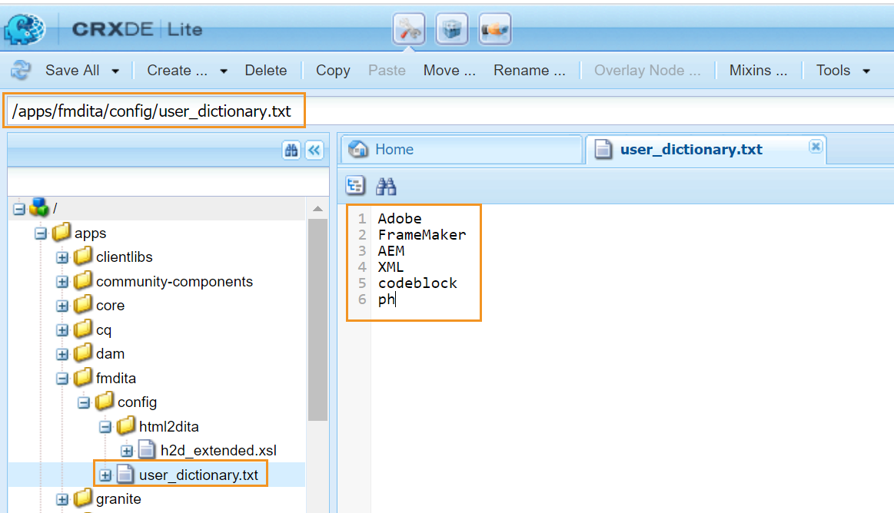

# Personalizzare il dizionario predefinito dell’AEM {#id209SD8000WU}

L’editor web può essere configurato per utilizzare il correttore ortografico AEM o il correttore ortografico del browser. Se si sceglie di utilizzare il correttore ortografico dell&#39;AEM, si ottiene la flessibilità necessaria per definire l&#39;elenco di parole personalizzato. Queste parole personalizzate vengono quindi aggiunte al dizionario dell’AEM e non vengono contrassegnate come \(as correct\) nell’editor Web.

Per creare un elenco di parole personalizzato aggiunto nel dizionario AEM, effettuare le seguenti operazioni:

1. Accedi all’AEM e apri la modalità CRXDE Liti.

1. Passa al seguente nodo:

   /apps/fmdita/config

1. Crea un nuovo file denominato user\_dictionary.txt.

1. Aprire il file e aggiungere un elenco di parole che si desidera definire nel dizionario personalizzato.

   La schermata seguente mostra l&#39;elenco di parole personalizzate aggiunto al file user\_dictionary.txt:

   {width="650" align="left"}

1. Salva e chiudi il file.

Per aggiornare l&#39;elenco delle parole personalizzate nel dizionario AEM, gli autori dovranno riavviare la sessione dell&#39;editor Web.

**Argomento padre:**&#x200B;[ Personalizza editor Web](conf-web-editor.md)
