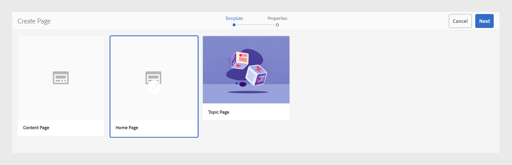

# Scaricare e installare modelli AEM Sites

Per scaricare e installare modelli AEM Sites su Experience Manager Guides for On-Premise Software, effettua le seguenti operazioni:


## Installazione del pacchetto

1. Scarica i seguenti pacchetti

   - Componenti: [guides-components-all.zip](https://github.com/adobe/aemg-sites-components/releases/tag/v1.0.0)

   - Siti per software locale: [Docs](https://github.com/adobe/aemg-docs/releases/tag/v1.0.0)

1. Accedi all’istanza dell’AEM e passa a Gestione pacchetti CRX. L’URL predefinito per accedere al gestore di pacchetti è:

   ```http
   http://<server name>:<port>/crx/packmgr/index.jsp
   ```

   Gestione pacchetti gestisce i pacchetti nell’installazione AEM locale. Per ulteriori informazioni sull&#39;utilizzo di Gestione pacchetti, vedere [Come utilizzare i pacchetti](https://helpx.adobe.com/experience-manager/6-5/sites/administering/using/package-manager.html) nella documentazione AEM.

1. Per caricare il pacchetto, fare clic su **Carica pacchetto**.

1. Nella finestra di dialogo **Carica pacchetto**, individua il file scaricato nel passaggio 1 e fai clic su **OK**.

   Il pacchetto viene caricato nell’istanza AEM.

1. Per installare il pacchetto, fare clic su **Installa**.

1. Nella finestra di dialogo **Installa pacchetto**, fare clic su **Installa** per installare i pacchetti.


## Configurare i modelli da utilizzare con i predefiniti di AEM Sites

Una volta installati i pacchetti, nell&#39;interfaccia utente Sites viene creato un sito denominato **AEMG**. Questo sito di esempio mostra come impostare la struttura del sito per la generazione dell’output di AEM Sites. Questo è solo un esempio. Puoi creare siti personalizzati in base alle tue esigenze.


**AEMG** contiene i seguenti componenti.
- Nella cartella **AEMG** è presente una cartella per la lingua inglese (en). Puoi creare copie in lingua simili in base alle tue esigenze. Ad esempio, un sito web multilingue include copie in lingua inglese (en), tedesca (de) e francese (fr).  Ulteriori informazioni sulla creazione di una copia per lingua mediante la [Creazione guidata copia lingua](https://experienceleague.adobe.com/en/docs/experience-manager-65/content/sites/administering/introduction/tc-wizard).
- All&#39;interno della cartella della lingua inglese (en), Experience Manager Guides fornisce molte pagine di esempio pronte all&#39;uso come **Ricerca**, **Accedi**, **Documenti** e **Supporto**.

- **Docs** è la home page della documentazione di esempio. Funge da posizione centrale per tutta la documentazione relativa al prodotto
e mostra ogni prodotto per il quale la documentazione è disponibile come singoli riquadri.

- Insieme alla home page della documentazione, sono disponibili pagine di esempio per **Ricerca**, **Accesso** e **Supporto**. Puoi personalizzare questi esempi in base alle tue esigenze.
- Puoi avere pagine iniziali per singoli prodotti, ad esempio Product1. Una pagina di esempio **Product1** è presente in **Docs**, che è la home page della documentazione.

- Experience Manager Guides fornisce anche i seguenti modelli predefiniti:

   - Modello **Pagina di contenuto**: utilizza questo modello per creare le pagine standard che contengono la maggior parte del contenuto del sito di prodotti. Possono includere testo, immagini, video e altri elementi di contenuto. Questo modello contiene solo l’intestazione e il piè di pagina. Personalizza e utilizzalo per creare qualsiasi pagina in base alle tue esigenze. Ad esempio, puoi creare la pagina di supporto o la pagina di accesso per il tuo prodotto.
   - Modello **Home page**: la pagina di destinazione principale di un sito Web, che include una panoramica, sezioni chiave come gli elementi e le funzionalità chiave e collegamenti di navigazione. Ad esempio, la pagina principale di un prodotto ABC si connette alle altre pagine di contenuto o funzionalità.
   - Modello **Pagina argomento**: pagine utilizzate per organizzare e presentare contenuti basati su argomenti. Ad esempio, una guida utente contiene diverse pagine di argomenti, ciascuna delle quali contiene un argomento specifico relativo alle funzioni e alla risoluzione dei problemi.

  

Utilizza questi esempi e modelli per generare gli output di AEM Sites:
- La home page di un prodotto corrisponde alla home page di una mappa e viene creata utilizzando il modello Home page. Seleziona questo percorso nel predefinito AEM Sites per pubblicare sotto di esso i contenuti della mappa. La home page del prodotto può includere altre home page.
- Ad esempio, un prodotto come Experience Manager Guides richiede tre manuali per utenti, amministratori e sviluppatori.  Creare una home page per ogni manuale utilizzando il modello Home Page, quindi selezionare la home page corrispondente nel predefinito di output di AEM Sites.

Ulteriori informazioni sulla creazione e la configurazione di [predefiniti AEM Sites nell&#39;editor Web](../user-guide/generate-output-aem-site-web-editor.md).

## Creare una home page utilizzando il modello

Per creare la home page del prodotto, effettua le seguenti operazioni:
1. Una volta installato il pacchetto, selezionare **Sites** dal pannello di navigazione globale.
1. Seleziona il modello &quot;AEMG Docs&quot; installato nell’interfaccia utente di Sites.
1. Nell&#39;interfaccia utente di Sites, fai clic sul pulsante **Crea** nell&#39;angolo in alto a destra.
1. Seleziona **Pagina** dal menu a discesa **Crea**.
1. Seleziona **Home page** e fai clic su **Avanti**.
1. Inserisci il titolo del sito e il nome del sito, quindi fai clic su **Crea** nell&#39;angolo in alto a destra. Un modello di sito AEM viene creato utilizzando il modello di sito **Home page**. È ad esempio possibile creare una home page per il prodotto `Product ABC`.


>[!NOTE]
>
>Dopo aver creato la home page, puoi utilizzare questo percorso come **percorso Publish** per generare l&#39;output dei predefiniti di AEM Sites. Esempio: `aemg-docs-en/docs/product-abc`.

## Modifica modelli di argomento per AEM Sites

Puoi anche personalizzare i modelli di argomento per il tuo AEM Sites. Puoi modificare il contenuto o configurare le proprietà dei diversi componenti AEM nel tuo argomento. Ad esempio, puoi aggiungere o rimuovere componenti in base alle tue esigenze.\
Per modificare i modelli di argomento, effettuare le seguenti operazioni:
1. Seleziona il modello da modificare.
1. Seleziona l&#39;icona **Modifica** in alto.

Viene aperto l’Editor modelli AEM. È possibile modificare il modello di argomento. Ulteriori informazioni sulla [creazione di modelli di pagina](https://experienceleague.adobe.com/en/docs/experience-manager-65/content/sites/authoring/siteandpage/templates#editing-a-template-structure-template-author).


## Personalizzare i modelli di AEM Sites esistenti

Oltre ai modelli predefiniti, puoi utilizzare i modelli esistenti con i predefiniti di AEM Sites. Per personalizzare i modelli AEM Sites esistenti, effettua le seguenti operazioni:

### Configurazione modello

Sono necessari i due tipi di modelli seguenti:

- Categoria o modello di destinazione: questo modello viene utilizzato per la pagina di destinazione della documentazione del prodotto e corrisponde a una mappa DITA.  La pagina del sito AEM per una mappa DITA viene generata utilizzando questo modello. Puoi utilizzare questo modello a qualsiasi livello.
: aggiungi un componente testo al modello esistente. Il componente testo deve avere una proprietà obbligatoria, `text="$category.html$"`.
- Ad esempio, è possibile scegliere modelli di vendita al dettaglio e utilizzare il modello sezione-pagina come modello della pagina di destinazione per la mappa DITA. Per farlo, apporta le modifiche come mostrato nella schermata seguente:
  
   - Pagina dettagli o Modello pagina argomenti: utilizza questo modello per il contenuto degli argomenti di una mappa. Tutte le pagine Sites di contenuto DITA/XML vengono create utilizzando i modelli di pagina per argomento. Per creare questi modelli, sono disponibili due prerequisiti:
      - Aggiungi un componente testo al modello, contenuto in un componente contenitore, con una proprietà obbligatoria. `text="$topic.content$"`.

        
      - Rifletti lo stesso contenitore e componente di testo nella struttura dello stesso modello, come mostrato nella schermata seguente:

        

### Assegna tag a pagina categoria come contenitore di documentazione

Se per le pagine della documentazione che utilizzano il modello precedente viene creata una gerarchia di siti, scegliere una delle pagine delle categorie create in tale gerarchia. Assegna un ID alla pagina della categoria come contenitore della documentazione.
A tale scopo, assegnare alla proprietà `id` un valore `category-page`. Fai riferimento alla schermata seguente:

