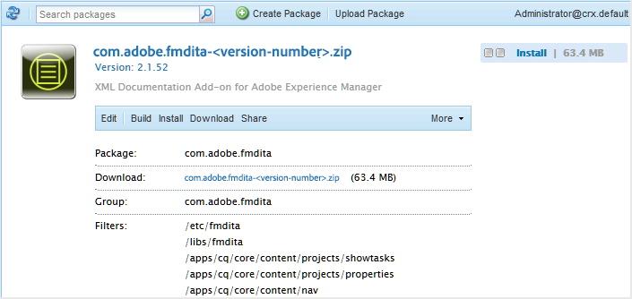

# Scarica e installa AEM Guides per la prima volta {#id213BCL00KEV}

Per scaricare e installare AEM Guides per la prima volta in un computer, effettua le seguenti operazioni:

>[!IMPORTANT]
>
> Se desideri utilizzare Livefyre insieme ad AEM Guides, assicurati di installare le versioni di Livefyre precedenti alla 3.0 prima di installare AEM Guides. Se utilizzi Livefyre versione 3.0 o successiva, non esiste alcuna restrizione di questo tipo.

1. Scarica AEM Guides da [Adobe Software Distribution Portal](https://experience.adobe.com/#/downloads/content/software-distribution/it/aem.html).

   >[!NOTE]
   >
   >Prima di installare Experience Manager Guides, assicurati che il tuo sistema soddisfi i [requisiti tecnici](../install-guide/download-install-technical-requirements.md).

1. Accedi all’istanza dell’AEM e passa a Gestione pacchetti CRX. L’URL predefinito per accedere al gestore di pacchetti è:

   ```http
   http://<server name>:<port>/crx/packmgr/index.jsp
   ```

   Gestione pacchetti gestisce i pacchetti nell’installazione AEM locale. Per ulteriori informazioni sull&#39;utilizzo di Gestione pacchetti, vedere [Come utilizzare i pacchetti](https://helpx.adobe.com/experience-manager/6-5/sites/administering/using/package-manager.html) nella documentazione AEM.

   {width="650" align="left"}

1. Per caricare il pacchetto AEM Guides, fai clic su **Carica pacchetto**.

1. Nella finestra di dialogo Carica pacchetto, individua il file AEM Guides scaricato al passaggio 1 e fai clic su **OK**.

   Il pacchetto viene caricato nell’istanza AEM.

1. Per installare il pacchetto, fare clic su **Installa**.

   {width="650" align="left"}

1. Nella finestra di dialogo Installa pacchetto, fai clic su **Installa**.

1. Per iniziare a utilizzare AEM Guides, fare clic sul pulsante Home  nell&#39;angolo superiore sinistro di Gestione pacchetti CRX.


>[!NOTE]
>
> Eseguire la procedura di installazione su tutte le istanze dei server AEM presenti nella configurazione.

**Argomento padre:**[ Scarica e installa](download-install.md)
