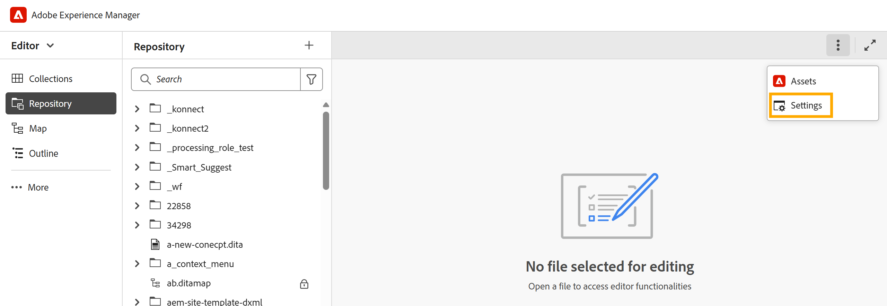

# Configurare le impostazioni dell’editor

Nella configurazione locale, l&#39;opzione **Impostazioni** viene visualizzata nella barra delle schede dell&#39;editor. Nella configurazione di Cloud Service, questa opzione è stata rinominata in **Impostazioni Workspace**.

Tutte le opzioni di configurazione esistenti disponibili in **Impostazioni editor** rimangono invariate.

{width="650" align="left"}

Per informazioni sulle opzioni di configurazione disponibili, visualizzare [Configura impostazioni di Workspace](../cs-install-guide/workspace-settings.md).

