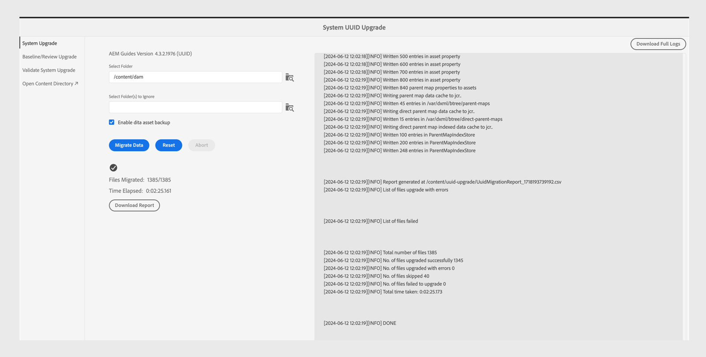

# 4.3.1 migrazione di contenuti da non-UUID a 4.3.2 UUID

Per migrare il contenuto dalla versione 4.3.1 non-UUID alla versione 4.3.2 UUID, effettua le seguenti operazioni.

>[!IMPORTANT]
>
> * Prima di avviare il processo di migrazione, assicurati di disporre di:
>
>   1. Chiuse tutte le recensioni attive.
>   1. Ha chiuso tutte le attività di traduzione.
> * Prima di eseguire la migrazione del contenuto al server UUID, accertati di avere installato un server non UUID con una versione compatibile di AEM Guides.
> * Se utilizzi una versione precedente alla 4.3.1, effettua l’aggiornamento alla versione 4.3.1. Segui le [istruzioni di aggiornamento](./upgrade-xml-documentation.md) specifiche per la versione con licenza del tuo prodotto.
> * Attualmente, le versioni successive alla versione 4.3.1 non sono supportate per la migrazione.

## Installazione del pacchetto

Scarica i pacchetti richiesti da Adobe Software Distribution Portal, in base alla versione:

1. **Pre-migrazione**: [com.adobe.guides.pre-uuid-migration-1.2.27.zip](https://experience.adobe.com/#/downloads/content/software-distribution/en/aem.html?package=%2Fcontent%2Fsoftware-distribution%2Fen%2Fdetails.html%2Fcontent%2Fdam%2Faem%2Fpublic%2Faemdox%2Fother-packages%2Fuuid-migration%2F3-0%2Fcom.adobe.guides.pre-uuid-migration-1.2.27.zip)
1. **Scarica UUID versione 4.3.2**: [com.adobe.fmdita-6.5-uuid-4.3.2.1977.zip](https://experience.adobe.com/#/downloads/content/software-distribution/en/aem.html?package=%2Fcontent%2Fsoftware-distribution%2Fen%2Fdetails.html%2Fcontent%2Fdam%2Faem%2Fpublic%2Faemdox%2Fother-packages%2Fuuid-migration%2F3-0%2Fcom.adobe.fmdita-6.5-uuid-4.3.2.1977.zip)
1. **Migrazione**: [com.adobe.guides.uuid-upgrade-1.2.110.zip](https://experience.adobe.com/#/downloads/content/software-distribution/en/aem.html?package=%2Fcontent%2Fsoftware-distribution%2Fen%2Fdetails.html%2Fcontent%2Fdam%2Faem%2Fpublic%2Faemdox%2Fother-packages%2Fuuid-migration%2F3-0%2Fcom.adobe.guides.uuid-upgrade-1.2.110.zip)

## Controlli di premigrazione

Esegui i seguenti controlli sulla versione 4.3.1 non-UUID:

1. Installa il pacchetto di pre-migrazione [com.adobe.guides.pre-uuid-migration-1.2.27.zip](https://experience.adobe.com/#/downloads/content/software-distribution/en/aem.html?package=%2Fcontent%2Fsoftware-distribution%2Fen%2Fdetails.html%2Fcontent%2Fdam%2Faem%2Fpublic%2Faemdox%2Fother-packages%2Fuuid-migration%2F3-0%2Fcom.adobe.guides.pre-uuid-migration-1.2.27.zip) nella versione 4.3.1.

   >[!NOTE]
   >
   >* Per eseguire la migrazione è necessaria l’autorizzazione di amministratore.
   >* Si consiglia di correggere i file con errori prima di procedere con la migrazione.

1. Se nel sistema sono presenti più di 100.000 file DITA, aggiornare le configurazioni del limite di query affinché lo script funzioni:

   * Passa a `/system/console/configMgr and increase both the configs to more than number of assets - queryLimitInMemory` e `queryLimitReads under org.apache.jackrabbit.oak.query.QueryEngineSettingsService`

1. Avvia `http://<server-name>/libs/fmdita/clientlibs/xmleditor_uuid_upgrade/page.html`.
1. Selezionare **Valutazione della compatibilità** dal pannello a sinistra e sfogliare il percorso della cartella `/content/dam` per tutte le risorse.
1. Controlla la compatibilità per elencare le seguenti informazioni:
   * File totali
   * Tempo stimato per la migrazione
   * Numero di file con errori
   * File con nome file GUID

   

1. Se viene visualizzato l’errore, analizza i registri e correggi tali errori. È possibile rieseguire la matrice di compatibilità dopo aver corretto gli errori.

1. Seleziona **Configura convalide** dal pannello a sinistra. Quindi **Seleziona mappa** e **Seleziona predefinito** della mappa per configurarli. L’elenco di convalida dell’output corrente visualizza i file di output presenti prima della migrazione e può essere convalidato in base ai file di output generati successivamente alla migrazione.

   Selezionando più mappe DITA e mappe di grandi dimensioni, puoi verificare che la migrazione di tutto il contenuto sia stata completata senza problemi. La selezione di predefiniti contenenti linee di base garantisce anche la corretta migrazione delle linee di base e delle versioni.

   

1. (Facoltativo) Esegui la rimozione della versione del contenuto per rimuovere le versioni non necessarie e velocizzare il processo di migrazione. Per eseguire l&#39;eliminazione della versione, selezionare l&#39;opzione **Eliminazione versione** dalla schermata di migrazione e passare all&#39;interfaccia utente tramite l&#39;URL `http://<server- name>/libs/fmdita/clientlibs/xmleditor_uuid_upgrade/page.html`.
   >[!NOTE]
   >
   >Questa utility non rimuove le versioni utilizzate nelle linee di base o nelle revisioni né dispone di etichette.

Per ulteriori dettagli, visualizzare [Rimuovi versioni precedenti](../install-guide/version-management.md#purge-older-versions-of-dita-files).

## Prerequisiti per la migrazione

1. Esegui migrazione UUID solo su un’istanza Autore.
1. Garantire la conformità dell&#39;infrastruttura seguente:
   * L’istanza di authoring viene ridimensionata in termini di CPU e memoria per supportare un’elaborazione più rapida e memoria aggiuntiva necessaria per le attività in blocco. ad esempio, se il CPU e la memoria attualmente allocati sono 8 vCPU e 24 GB heap, utilizza dimensioni doppie per questa attività.
   * Lo spazio su disco complessivo e lo spazio su disco temporaneo `(crx-quickstart directory)` devono avere un buffer pari a 10 volte lo spazio già utilizzato. Una volta completata la migrazione, è possibile recuperare la maggior parte dello spazio su disco eseguendo la compattazione.
   * Esegui **Compressione Tar offline** prima di avviare questa attività.
   * Assicurati che non sia pianificata alcuna indicizzazione o manutenzione del sistema durante la finestra di questa migrazione.

1. Installa la versione UUID della versione supportata su quella non UUID. Ad esempio, se utilizzi la build 4.3.1 non UUID, devi installare UUID versione 4.3.2 [com.adobe.fmdita-6.5-uuid-4.3.2.1977.zip](https://experience.adobe.com/#/downloads/content/software-distribution/en/aem.html?package=%2Fcontent%2Fsoftware-distribution%2Fen%2Fdetails.html%2Fcontent%2Fdam%2Faem%2Fpublic%2Faemdox%2Fother-packages%2Fuuid-migration%2F3-0%2Fcom.adobe.fmdita-6.5-uuid-4.3.2.1977.zip)) ed eseguire la migrazione.

1. Installa il pacchetto di aggiornamento della migrazione UUID [com.adobe.guides.uuid-upgrade-1.2.110.zip](https://experience.adobe.com/#/downloads/content/software-distribution/en/aem.html?package=%2Fcontent%2Fsoftware-distribution%2Fen%2Fdetails.html%2Fcontent%2Fdam%2Faem%2Fpublic%2Faemdox%2Fother-packages%2Fuuid-migration%2F3-0%2Fcom.adobe.guides.uuid-upgrade-1.2.110.zip).
1. Disattivare i moduli di avvio per i seguenti flussi di lavoro utilizzando l&#39;URL: `http://<server-name>/libs/cq/workflow/content/console.html`.

   * Flusso di lavoro Aggiorna risorsa DAM
   * Flusso di lavoro Writeback di metadati DAM

   >[!NOTE]
   >
   >Idealmente tutti i moduli di avvio dei flussi di lavoro, che vengono eseguiti su qualsiasi percorso all&#39;interno di `content/dam`, dovrebbero essere disabilitati.

1. Aggiorna le seguenti configurazioni in base alle modifiche suggerite:

   | Configurazione | Proprietà | Valore |
   |---|---|---|
   | `com.adobe.fmdita.config.ConfigManager` | Abilita moduli di avvio dei flussi di lavoro di post-elaborazione | Disabilita |
   | `com.adobe.fmdita.config.ConfigManager` | uuid. regex | `^GUID-(?<id>.*)` |
   | `com.adobe.fmdita.postprocess.version.PostProcessVersionObservation` | Abilita postelaborazione versione | Disabilita |
   | Day CQ Tagging Service | Abilita convalida (validation.enabled) | Disabilita |

1. Aggiungi un logger separato per:
   * `com.adobe.fmdita.uuid`
   * `com.adobe.guides.uuid`.

1. (Se non eseguito in precedenza) Se nel sistema sono presenti più di 100.000 file DITA, aggiornare `queryLimitReads` in `org.apache.jackrabbit.oak.query.QueryEngineSettingsService` a un valore maggiore (qualsiasi valore maggiore del numero di risorse presenti, ad esempio 200.000).

   | PID | Chiave proprietà | Valore proprietà |
   |---|---|---|
   | org.apache.jackrabbit.oak.query.QueryEngineSettingsService | queryLimitReads | Valore: 200000   Valore predefinito: 100000 |

## Migrazione

1. Avvia `http://<server-name>/libs/fmdita/clientlibs/xmleditor_uuid_upgrade/page.html`.

   
   >[!NOTE]
   >
   > Se si sceglie &quot;Abilita backup risorse DITA&quot;, i file di backup temporanei vengono archiviati in `/content/uuid-upgrade` e i backup dei file DITA vengono eliminati al termine della migrazione di un file.

1. Seleziona **Aggiornamento di sistema** dal pannello a sinistra per eseguire la migrazione. Si consiglia di eseguire la migrazione di tutti i dati contemporaneamente, in quanto il sistema gestisce in modo ottimale la gestione dei batch internamente. Solo i file che non sono risorse DITA e non sono utilizzati in alcuna risorsa DITA possono essere ignorati per la migrazione.

1. (Facoltativo) Seleziona le cartelle per le quali desideri saltare la migrazione. Utilizza questa opzione per eseguire la migrazione di queste cartelle in un secondo momento o saltare la migrazione. Assicurati che queste cartelle non dispongano di risorse DITA e che nessuna risorsa DITA vi faccia riferimento (e che in futuro non vi farà riferimento). Ad esempio, `content/dam/projects`.

1. Selezionare *Abilita backup risorse dita* per creare un backup della risorsa prima della migrazione. Questo backup viene utilizzato per il rollback in caso di errore durante la migrazione di un file. Se la migrazione ha esito positivo, il backup viene eliminato. Tuttavia, questo rallenta il processo di migrazione.

1. Avvia la migrazione.
   >[!NOTE]
   >
   > Scarica i registri completi e osserva eventuali errori. Se viene rilevato un errore o un&#39;eccezione *Non procedere*, ma correggere prima l&#39;errore. Gli errori comuni sono elencati alla fine di questo articolo.

1. Una volta completata la migrazione, il rapporto è disponibile per il download e possono essere scaricati anche interi registri.

1. Selezionare **Scarica report** durante l&#39;esecuzione della migrazione per verificare se tutti i file nella cartella sono aggiornati correttamente e se tutte le funzionalità funzionano solo per tale cartella.

   >[!NOTE]
   >
   > È possibile eseguire la migrazione dei contenuti a livello di cartella, `/content/dam` completo o nella stessa cartella (eseguire di nuovo la migrazione).

   Inoltre, è importante assicurarsi che la migrazione dei contenuti venga eseguita per tutte le risorse multimediali, come immagini e grafici utilizzati nel contenuto DITA.

1. Dopo aver eseguito la migrazione di tutti i file, selezionare **Aggiornamento baseline/revisione** dal pannello di sinistra per migrare le baseline e rivedere a livello di cartella.

>[!NOTE]
>
>Se si riavvia il sistema o la migrazione viene interrotta, lo script riprenderà quando verrà rieseguito con gli stessi parametri di prima. Contatta il team di successo del cliente in caso di problemi dovuti alla chiusura.

## Analisi dei rapporti da ogni passaggio

**Passaggio: aggiornamento del sistema**

| Riepilogo dopo il completamento del processo | Come si interpreta? | Azione |
|---|---|---|
| Numero totale di file: 345997 | Numero totale di file elaborati nel set di cartelle specificato. | ND |
| Numero di file aggiornati correttamente: 344516 | Numero di file migrati correttamente a UUID. | ND |
| Numero di file aggiornati con errori: 29 | In questi file si sono verificati errori che devono essere identici a quelli riportati nel passaggio di premigrazione. | ND |
| Numero di file ignorati: 1452 | Alcuni file nell’archivio DAM possono contenere risorse secondarie che vengono ignorate in quanto non sono idonee per la migrazione UUID. | ND |
| Numero di file non aggiornati: 0 | Se il conteggio non è 0, i registri devono essere analizzati per individuare eventuali problemi. | Se si seleziona l&#39;eccezione, potrebbe essere necessario correggere l&#39;errore ed eseguire nuovamente la migrazione. |
| Tempo totale impiegato: 2:40:06.157 |  |  |

**Passaggio: Aggiorna linee di base**

| Riepilogo dopo il completamento del processo | Come si interpreta? | Azione |
|---|---|---|
| Numero totale di file: 4833 | Numero di mappe DITA con almeno 1 linea di base. |
| Numero di file aggiornati correttamente: 4705 | Numero di mappe DITA aggiornate con tutte le linee di base. |
| Numero di file aggiornati con errori: 0 | Numero di mappe DITA le cui linee di base non sono state aggiornate. |
| Numero di file ignorati: 1647 | Numero di mappe DITA senza alcuna linea di base. |
| Numero di file non aggiornati: 128 | Il numero di oggetti della baseline non validi (vuoti) è elencato nel rapporto (Excel). | Verifica la presenza di errori diversi da: `baselineObj not found on` |

## Postmigrazione

1. Al termine della migrazione, selezionare **Convalida aggiornamento sistema** dal pannello di sinistra e convalidare i file di output prima e dopo la migrazione per verificare che la migrazione sia stata eseguita correttamente.

   

1. Dopo la migrazione del server, abilita correttamente i flussi di lavoro e le configurazioni seguenti (inclusi tutti gli altri flussi di lavoro inizialmente disabilitati durante la migrazione) per continuare a lavorare sul server:

   * Flusso di lavoro Aggiorna risorsa DAM
   * Flusso di lavoro per metadati DAM

   >[!NOTE]
   >
   >È consigliabile abilitare tutti i moduli di avvio dei flussi di lavoro in esecuzione in qualsiasi percorso all&#39;interno di `content/dam` prima della migrazione.

1. Abilita le seguenti configurazioni:

   | Configurazione | Proprietà | Valore |
   |---|---|---|
   | `com.adobe.fmdita.config.ConfigManager` | *Abilita moduli di avvio flusso di lavoro post-elaborazione* | Abilita |
   | `com.adobe.fmdita.postprocess.version.PostProcessVersionObservation` | *Abilita Postelaborazione Versione* | Abilita |
   | Day CQ Tagging Service | *Abilita convalida (validation.enabled)* | Abilita |

1. Proprietà di Assets da rivedere dopo la migrazione:

   | Configurazione | Proprietà | Valore pre-migrazione per non-UUID | Valore post-migrazione su UUID |
   |---|---|---|---|
   | `com.adobe.fmdita.config.ConfigManager` | **Usa titolo per i nomi delle pagine del sito AEM** | False (valore predefinito) | Vero |

   >[!NOTE]
   >
   > Se prima della migrazione la proprietà **Utilizza il titolo per i nomi delle pagine del sito AEM** in `com.adobe.fmdita.config.ConfigManager` è impostata su *False*, dopo la migrazione sarà necessario aggiornare la proprietà.

1. Al termine della convalida, è possibile recuperare la maggior parte dello spazio su disco eseguendo la compattazione (fare riferimento a `https://experienceleague.adobe.com/docs/experience-manager-65/deploying/deploying/revision-cleanup.html?lang=it`).

