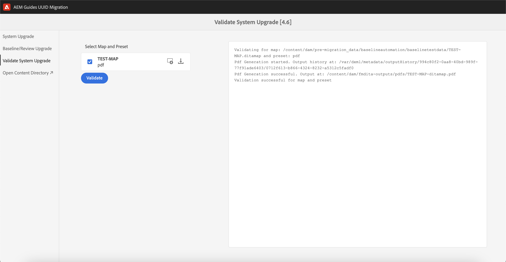

# Migrare contenuti non UUID con versioni dall’interfaccia utente

Se utilizzi la versione 4.3.x o successiva, esegui questi passaggi per migrare il contenuto non UUID con le versioni al contenuto UUID.

## Matrice di compatibilità

| Versione corrente di AEM Guides (non UUID) | Versione richiesta per la migrazione a UUID | Percorso di aggiornamento supportato |
|---|---|---|
| 4.3.x o superiore | 4.3.0 non UUID | Installare 4.3.1 (UUID) |

## Pacchetti richiesti

1. **Eliminazione versione**: `com.adobe.guides.version-purge-1.0.11.zip` (facoltativo)
1. **Pre-migrazione**: `com.adobe.guides.pre-uuid-migration-1.1.2 .zip`
1. **Migrazione**: `com.adobe.guides.uuid-upgrade-1.1.13.zip`

## Pre-migrazione

1. (Facoltativo) Esegui la rimozione della versione del contenuto per rimuovere le versioni non necessarie e velocizzare il processo di migrazione. Per eseguire la rimozione della versione 4.1 (NON supportata nella versione 4.0), installare il pacchetto `com.adobe.guides.version-purge-1.0.11.zip` e passare all&#39;interfaccia utente tramite questo URL `http://<server-name> /libs/fmdita/clientlibs/xmleditor_version_purge/page.html`.

   >[!NOTE]
   >
   >Questa utility non rimuove le versioni utilizzate nelle linee di base o nelle revisioni né dispone di etichette.
1. Installare il pacchetto di pre-migrazione (`ccom.adobe.guides.pre-uuid-migration-1.1.2 .zip`).

   >[!NOTE]
   >
   >* Per eseguire la migrazione è necessaria l’autorizzazione di amministratore.
   >* Si consiglia di correggere i file con errori prima di procedere con la migrazione.

1. Selezionare **Valutazione della compatibilità** dal pannello di sinistra e sfogliare il percorso di una cartella.
1. Controlla la compatibilità per elencare le seguenti informazioni:
   * File totali
   * Versioni totali
   * Tempo stimato per la migrazione
   * Numero di file con errori

{width="800" align="left"}

1. Seleziona **Configura convalide** dal pannello a sinistra. Quindi **Seleziona mappa** e **Seleziona predefinito** della mappa per configurarli. L’elenco di convalida dell’output corrente visualizza i file di output presenti prima della migrazione e può essere convalidato in base ai file di output generati successivamente alla migrazione.

{width="800" align="left"}

## Migrazione

### Passaggio 1: aggiornare la configurazione

1. Assicurati che lo spazio disponibile sia almeno 10 volte superiore allo spazio occupato da AEM (directory crx-quickstart) durante la migrazione. Dopo aver completato la migrazione, è possibile recuperare la maggior parte dello spazio su disco eseguendo la compattazione (fare riferimento a [Pulizia revisioni](https://experienceleague.adobe.com/docs/experience-manager-65/deploying/deploying/revision-cleanup.html?lang=it)).

1. Abilita *Abilita moduli di avvio flusso di lavoro elaborazione Post* in `com.adobe.fmdita.config.ConfigManager` e *Abilita post-elaborazione versione* in `com.adobe.fmdita.postprocess.version.PostProcessVersionObservation.`

1. Installa la versione UUID della versione supportata su quella non UUID. Ad esempio, se utilizzi una build 4.0 non UUID o una build 4.1 non UUID, devi installare UUID versione 4.1.

1. Installa il nuovo pacchetto per la migrazione UUID (`com.adobe.guides.uuid-upgrade-1.1.13`).

1. Disattivare i seguenti flussi di lavoro e qualsiasi altro flusso di lavoro in esecuzione su `/content/dam` utilizzando i moduli di avvio in `http://localhost:4502/libs/cq/workflow/content/console.html`.

   * Flusso di lavoro Aggiorna risorsa DAM
   * Flusso di lavoro Writeback di metadati DAM

1. Disabilita *Abilita moduli di avvio flusso di lavoro elaborazione Post* in `com.adobe.fmdita.config.ConfigManager` e disabilita *Abilita post-elaborazione versione* in `com.adobe.fmdita.postprocess.version.PostProcessVersionObservation`.

1. Disabilitare la proprietà Abilita la convalida (`validation.enabled`) nel servizio di assegnazione tag Day CQ.

1. Verificare che la cartella delle proprietà `uuid.regex` sia impostata correttamente in `com.adobe.fmdita.config.ConfigManager`. Se è vuoto, impostarlo sul valore predefinito - `^GUID-(?<id>.*)`.
1. Aggiungere un logger separato per `com.adobe.fmdita.uuid.upgrade.UuidUpgrade` La risposta del browser è disponibile anche in `/content/uuid-upgrade/logs`.

### Passaggio 2: eseguire la migrazione e convalidare

#### Installare il pacchetto di migrazione

{width="800" align="left"}

* Seleziona **Aggiornamento di sistema** dal pannello a sinistra per eseguire la migrazione. Iniziare da una cartella con dati più piccoli prima di eseguirla su `/content/dam`.

* Selezionare **Scarica report** durante l&#39;esecuzione della migrazione per verificare se tutti i file nella cartella sono aggiornati correttamente e se tutte le funzionalità funzionano solo per tale cartella.

>[!NOTE]
>
> È possibile eseguire la migrazione dei contenuti a livello di cartella, `/content/dam` completo o sulla stessa cartella (eseguire di nuovo la migrazione).

Inoltre, è importante assicurarsi che la migrazione dei contenuti venga eseguita anche per tutte le risorse multimediali, come immagini e grafici utilizzati nel contenuto DITA.

#### Migrazione di base e revisione

Seleziona **Aggiornamento baseline/revisione** dal pannello a sinistra per eseguire la migrazione delle baseline e la revisione a livello di cartella.

{width="800" align="left"}

### Passaggio 3: ripristinare la configurazione

Una volta completata la migrazione del server, abilita la post-elaborazione, l’assegnazione di tag e i seguenti flussi di lavoro (inclusi tutti gli altri flussi di lavoro inizialmente disabilitati durante la migrazione) per continuare a lavorare sul server.

* Flusso di lavoro Aggiorna risorsa DAM
* Flusso di lavoro per metadati DAM

>[!NOTE]
>
>Se alcuni file non vengono elaborati o danneggiati prima della migrazione, verrebbero danneggiati prima della migrazione e rimarrebbero danneggiati anche dopo la migrazione.

## Convalida della migrazione

Una volta completata la migrazione, seleziona **Convalida aggiornamento sistema** dal pannello a sinistra e convalida i file di output prima e dopo la migrazione per garantire il completamento della migrazione.

{width="800" align="left"}

1. Al termine della migrazione, è possibile recuperare la maggior parte dello spazio su disco eseguendo la compattazione (fare riferimento a `https://experienceleague.adobe.com/docs/experience-manager-65/deploying/deploying/revision-cleanup.html?lang=it`).

