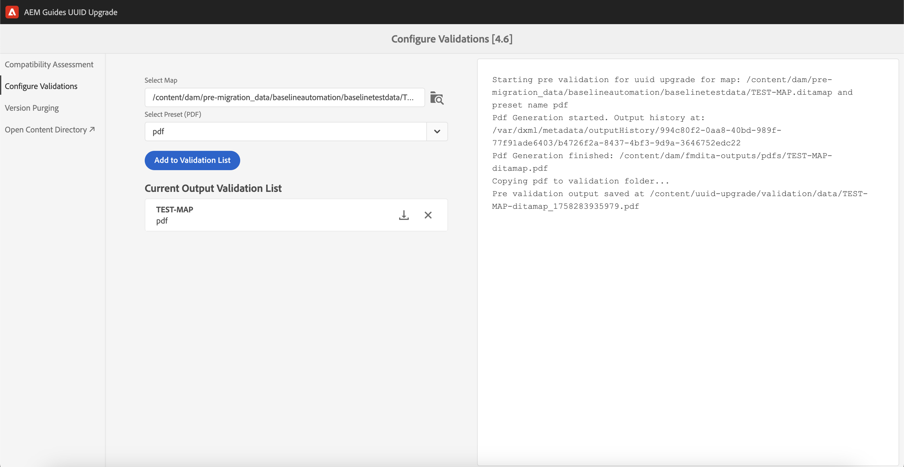

# Migra contenuti con versione

>[!NOTE]
>
> Puoi migrare il contenuto non UUID al contenuto UID in Experience Manager Guides. Questo articolo verrà archiviato a novembre 2024.
>Visualizza [**Migrazione contenuti da non-UUID a UUID**](./migrate-non-uuid-uuid.md) per la documentazione più recente e dettagliata.

Esegui questi passaggi per migrare il contenuto con versione non UUID al contenuto UID.

>[!NOTE]
>
>Segui le [istruzioni di aggiornamento](./upgrade-xml-documentation.md) specifiche per la versione con licenza del tuo prodotto.

## Matrice di compatibilità

| Versione corrente di Experience Manager Guides (non UUID) | Versione richiesta per la migrazione a UUID | Percorso di aggiornamento supportato |
|---|---|---|
| 3.8.5, 4.0.x o 4.1.x | 4.1 non UUID | Installare 4.1 (UUID) ed eseguire la migrazione |
| 4.2, 4.2.x o 4.3 | 4.3.0 non UUID | Installa 4.3.1 (UUID) ed esegui la migrazione |
| 4.3.1. | ND | ND |

## Installazione del pacchetto

Scarica i pacchetti richiesti da Adobe Software Distribution Portal, in base alla versione:

  Pacchetti per il percorso di aggiornamento versione 4.1

1. **Pre-migrazione**: [com.adobe.guides.pre-uuid-migration-1.0.9.zip](https://experience.adobe.com/#/downloads/content/software-distribution/en/aem.html?package=%2Fcontent%2Fsoftware-distribution%2Fen%2Fdetails.html%2Fcontent%2Fdam%2Faem%2Fpublic%2Faemdox%2Fother-packages%2Fuuid-migration%2F1-0%2Fcom.adobe.guides.pre-uuid-migration-1.0.9.zip)
1. **Migrazione**: [com.adobe.guides.uuid-upgrade-1.0.19.zip](https://experience.adobe.com/#/downloads/content/software-distribution/en/aem.html?package=%2Fcontent%2Fsoftware-distribution%2Fen%2Fdetails.html%2Fcontent%2Fdam%2Faem%2Fpublic%2Faemdox%2Fother-packages%2Fuuid-migration%2F1-0%2Fcom.adobe.guides.uuid-upgrade-1.0.19.zip)

 Pacchetti per il percorso di aggiornamento versione 4.3.1

1. **Pre-migrazione**: [com.adobe.guides.pre-uuid-migration-1.1.3.zip](https://experience.adobe.com/#/downloads/content/software-distribution/en/aem.html?package=%2Fcontent%2Fsoftware-distribution%2Fen%2Fdetails.html%2Fcontent%2Fdam%2Faem%2Fpublic%2Faemdox%2Fother-packages%2Fuuid-migration%2Fcom.adobe.guides.pre-uuid-migration-1.1.3.zip)
1. **Migrazione**: [com.adobe.guides.uuid-upgrade-1.1.15.zip](https://experience.adobe.com/#/downloads/content/software-distribution/en/aem.html?package=%2Fcontent%2Fsoftware-distribution%2Fen%2Fdetails.html%2Fcontent%2Fdam%2Faem%2Fpublic%2Faemdox%2Fother-packages%2Fuuid-migration%2Fcom.adobe.guides.uuid-upgrade-1.1.15.zip)

## Pre-migrazione

Esegui i seguenti controlli sulla versione non UUID (4.1 non UUID o 4.3.0 non UUID):

1. Installa il pacchetto di pre-migrazione in base alla versione.

   >[!NOTE]
   >
   >* Per eseguire la migrazione è necessaria l’autorizzazione di amministratore.
   >* Si consiglia di correggere i file con errori prima di procedere con la migrazione.

1. (Facoltativo) Esegui la rimozione della versione del contenuto per rimuovere le versioni non necessarie e velocizzare il processo di migrazione. Per eseguire l&#39;eliminazione della versione, selezionare l&#39;opzione **Eliminazione versione** dalla schermata di migrazione e passare all&#39;interfaccia utente tramite l&#39;URL `http://<server- name>/libs/fmdita/clientlibs/xmleditor_uuid_upgrade/page.html`.
   >[!NOTE]
   >
   >Questa utility non rimuove le versioni utilizzate nelle linee di base o nelle revisioni né dispone di etichette.

1. Avvia `http://<server-name>/libs/fmdita/clientlibs/xmleditor_uuid_upgrade/page.html`.
1. Selezionare **Valutazione della compatibilità** dal pannello di sinistra e sfogliare il percorso di una cartella.
1. Controlla la compatibilità per elencare le seguenti informazioni:
   * File totali
   * Versioni totali
   * Tempo stimato per la migrazione
   * Numero di file con errori

   {width="800" align="left"}

1. Seleziona **Configura convalide** dal pannello a sinistra. Quindi **Seleziona mappa** e **Seleziona predefinito** della mappa per configurarli. L’elenco di convalida dell’output corrente visualizza i file di output presenti prima della migrazione e può essere convalidato in base ai file di output generati successivamente alla migrazione.

   {width="800" align="left"}

## Migrazione

### Passaggio 1: aggiornare la configurazione

1. Assicurati che lo spazio disponibile sia almeno dieci volte superiore a quello occupato da AEM (directory crx-quickstart) durante la migrazione. Dopo aver completato la migrazione, è possibile recuperare la maggior parte dello spazio su disco eseguendo la compattazione (fare riferimento a [Pulizia revisioni](https://experienceleague.adobe.com/docs/experience-manager-65/deploying/deploying/revision-cleanup.html?lang=en)).

1. Abilita *Abilita moduli di avvio del flusso di lavoro di post-elaborazione* in `com.adobe.fmdita.config.ConfigManager` e *Abilita versione post-elaborazione* in `com.adobe.fmdita.postprocess.version.PostProcessVersionObservation.`

1. Installa la versione UUID della versione supportata su quella non UUID. Ad esempio, se utilizzi la build 4.1 non UUID, devi installare UUID versione 4.1 ed eseguire la migrazione.

1. Installa il nuovo pacchetto per la migrazione UUID.

1. Disattivare i seguenti flussi di lavoro e qualsiasi altro flusso di lavoro in esecuzione su `/content/dam` utilizzando i moduli di avvio in `http://<server-name>/libs/cq/workflow/content/console.html`.

   * Flusso di lavoro Aggiorna risorsa DAM
   * Flusso di lavoro Writeback di metadati DAM

1. Disabilita *Abilita moduli di avvio flusso di lavoro post-elaborazione* in `com.adobe.fmdita.config.ConfigManager` e disabilita *Abilita post-elaborazione versione* in `com.adobe.fmdita.postprocess.version.PostProcessVersionObservation`.

1. Disabilitare la proprietà Abilita la convalida (`validation.enabled`) nel servizio di assegnazione tag Day CQ.

1. Verificare che la cartella delle proprietà `uuid.regex` sia impostata correttamente in `com.adobe.fmdita.config.ConfigManager`. Se è vuoto, impostarlo sul valore predefinito - `^GUID-(?<id>.*)`.
1. Aggiungere un logger separato per `com.adobe.fmdita.uuid` La risposta del browser è disponibile anche in `/content/uuid-upgrade/logs`.

### Passaggio 2: eseguire la migrazione e convalidare

#### Installare il pacchetto di migrazione

1. Avvia `http://<server-name>/libs/fmdita/clientlibs/xmleditor_uuid_upgrade/page.html`.

   {width="800" align="left"}

1. Seleziona **Aggiornamento di sistema** dal pannello a sinistra per eseguire la migrazione. Iniziare da una cartella con dati più piccoli prima di eseguirla su `/content/dam`.

1. Selezionare **Scarica report** durante l&#39;esecuzione della migrazione per verificare se tutti i file nella cartella sono aggiornati correttamente e se tutte le funzionalità funzionano solo per tale cartella.

>[!NOTE]
>
> È possibile eseguire la migrazione dei contenuti a livello di cartella, `/content/dam` completo o nella stessa cartella (eseguire di nuovo la migrazione).

Inoltre, è importante assicurarsi che la migrazione dei contenuti venga eseguita per tutte le risorse multimediali, come immagini e grafici utilizzati nel contenuto DITA.

#### Migrazione di base e revisione

Seleziona **Aggiornamento baseline/revisione** dal pannello a sinistra per eseguire la migrazione delle baseline e la revisione a livello di cartella.

{width="800" align="left"}

### Passaggio 3: ripristinare la configurazione

Dopo aver eseguito correttamente la migrazione del server, abilita la post-elaborazione, l’assegnazione di tag e i seguenti flussi di lavoro (inclusi tutti gli altri flussi di lavoro inizialmente disabilitati durante la migrazione) per continuare a lavorare sul server.

* Flusso di lavoro Aggiorna risorsa DAM
* Flusso di lavoro per metadati DAM

>[!NOTE]
>
>Se alcuni file non vengono elaborati o danneggiati prima della migrazione, verranno danneggiati prima della migrazione e rimarranno danneggiati anche dopo la migrazione.

## Convalida della migrazione

1. Al termine della migrazione, selezionare **Convalida aggiornamento sistema** dal pannello di sinistra e convalidare i file di output prima e dopo la migrazione per verificare che la migrazione sia stata eseguita correttamente.

   {width="800" align="left"}

1. Al termine della convalida, è possibile recuperare la maggior parte dello spazio su disco eseguendo la compattazione (fare riferimento a `https://experienceleague.adobe.com/docs/experience-manager-65/deploying/deploying/revision-cleanup.html?lang=en`).
