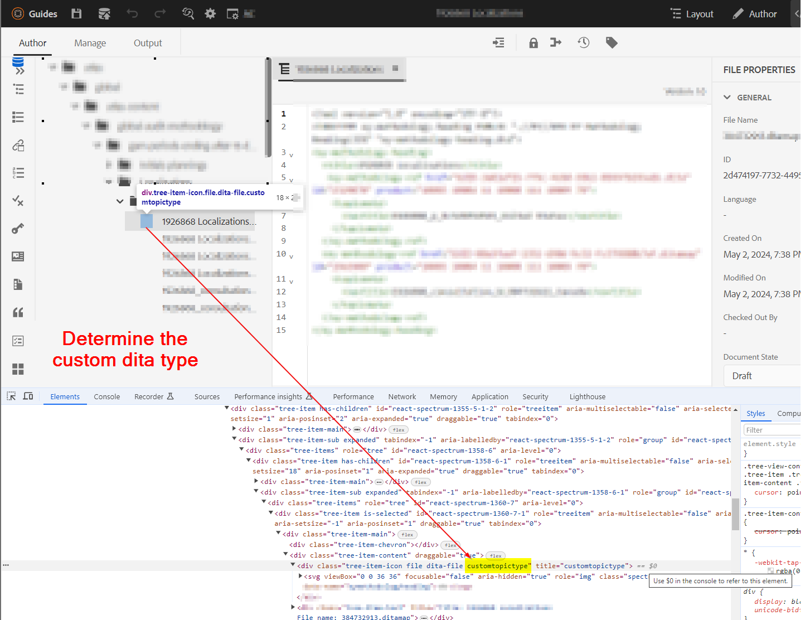
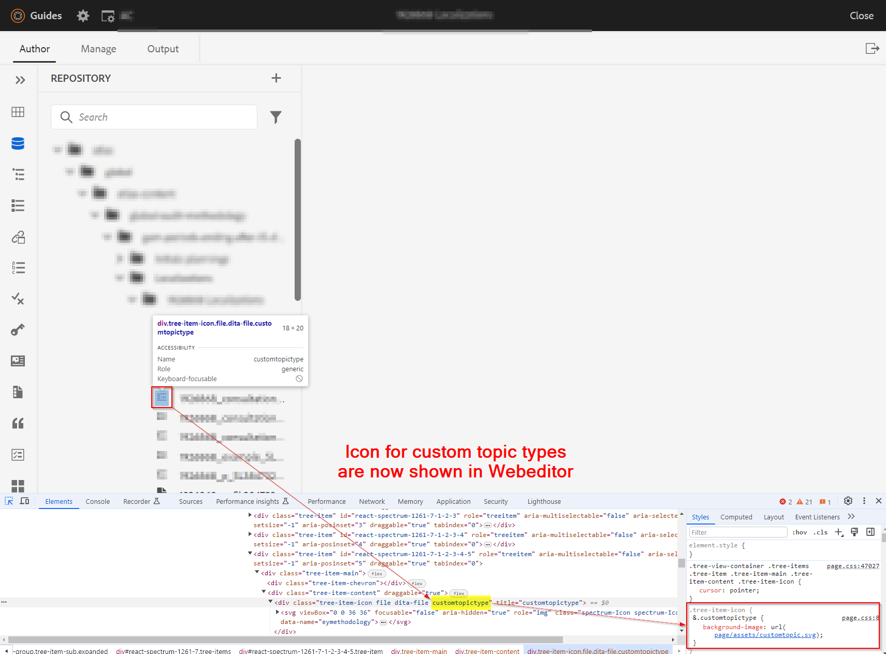
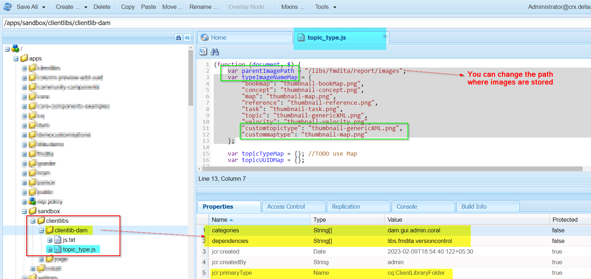

# Configurazione dell’icona per i tipi dita (topic o map) personalizzati/specializzati


## Dichiarazione di problema

Con lo schema personalizzato utilizzato in AEM Guides, puoi creare tipi di argomenti o mappe personalizzati e con questo puoi notare che i tipi di argomenti/mappe personalizzati non mostrano l’icona nell’editor web o nell’interfaccia utente di Assets. Vedi la schermata seguente come riferimento


Pertanto, per assegnare un’icona ai tipi di argomento/mappa personalizzati, devi effettuare le seguenti operazioni:
- Trovare il tipo di argomento/mappa personalizzato
- Scrivi gli stili per aggiungere l’icona desiderata per il tipo personalizzato


Possiamo implementare i passaggi precedenti per mostrare l’icona nell’editor web (vista archivio) e nell’interfaccia utente di Assets. Di seguito sono riportati i passaggi per entrambi


## Visualizzazione dell&#39;icona per l&#39;argomento o la mappa personalizzati nella visualizzazione editor Web

_Passaggio 1 :_Determinare il tipo di dita per l&#39;argomento/app dita personalizzato
- Apri la vista archivio in editor web > apri console sviluppatori nel browser
- Controlla lo spazio delle icone accanto all’argomento o alla mappa elencati
- Controlla la classe assegnata all&#39;argomento personalizzato
- Vedi la schermata seguente per ulteriori dettagli 
- Questa classe verrà utilizzata per assegnare un&#39;icona e scrivere css per questo

_Passaggio 2 :_Crea CSS e assegna l&#39;icona a questo tipo di dita
- Crea una libreria client in /apps, supponiamo che tu crei un cq:ClientLibraryFolder nel percorso desiderato
   - aggiungi le categorie &quot;apps.fmdita.xml_editor.page&quot;
- crea una cartella &quot;assets&quot; sotto questa directory e aggiungi tutte le icone che desideri utilizzare per i tipi dita personalizzati
- aggiungi un file css nella cartella della libreria client, ad esempio &quot;tree-icons.css&quot;
   - aggiungi il seguente codice

```
            .tree-item-icon {
                &.custommaptype {
                    background-image: url('assets/custommap.svg')
                }
                &.customtopictype {
                    background-image: url('assets/customtopic.svg')
                }
            }
```

- aggiungi css.txt nella cartella della libreria client e aggiungi il riferimento a &quot;tree-icon.css&quot; appena creato
- salva/implementa queste modifiche

Fai riferimento alla schermata seguente per ulteriori dettagli.


E l&#39;output finale è mostrato nella schermata seguente



## Icona visualizzata per argomento/mappa personalizzato nell’interfaccia utente di Assets

_Passaggio 1 :_che determina il tipo dita dell&#39;argomento/mappa dita personalizzato
- questo è spiegato nel passaggio 1 dei metodi precedenti

_Passaggio 2 :_Crea JavaScript per definire quali icone caricare per il tipo di dita personalizzato per i tipi di argomento/mappa personalizzati
- Crea una libreria client in /apps, supponiamo che tu crei un cq:ClientLibraryFolder nel percorso desiderato
   - aggiungi le seguenti proprietà:
      - Valore &quot;Categories&quot;(stringa multivalore) come &quot;dam.gui.admin.coral&quot;
      - valore &quot;dependencies&quot;(stringa multivalore) come &quot;libs.fmdita.versioncontrol&quot;
- Crea una copia del file &quot;/libs/fmdita/clientlibs/clientlibs/xmleditor/clientlib-dam/topic_type.js&quot; in questa directory /apps
   - modificare &quot;topic_type.js&quot; copiato e modificare/aggiungere customtopictype nella variabile &quot;typeImageNameMap&quot;
   - È inoltre possibile modificare il percorso della cartella delle immagini modificando il valore della variabile &quot;parentImagePath&quot; in cui sono memorizzate le icone personalizzate
- Crea un file denominato js.txt nella cartella della libreria client e aggiungi un riferimento a &quot;topic_type.js&quot;
- salva/implementa queste modifiche
Fai riferimento alla schermata seguente per ulteriori dettagli.
  

L&#39;output finale verrà visualizzato come mostrato nella schermata 
