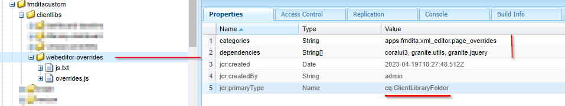

# Aggiungi un nuovo pulsante actionable personalizzato nella barra degli strumenti dell’editor web

Questo articolo illustra come aggiungere un nuovo pulsante personalizzato nella barra degli strumenti di webeditor e chiamare JavaScript per eseguire l’operazione personalizzata desiderata.

L’aggiunta di un pulsante actionable a webeditor prevede i seguenti passaggi:
- Aggiunta del pulsante in *ui_config.json* nella posizione in cui è necessario
- Registrazione dell’evento pulsante al clic nell’editor web per consentire all’utente di eseguire un’azione quando fa clic su di esso


## Implementazione con un esempio

Cerchiamo di capire questo con un esempio in cui un autore vuole aggiungere un riferimento jira a una sezione di prologo dell’argomento. La sezione prologo con jira reference-id incorporato potrebbe essere simile alla seguente:


L’elemento &quot;change-request-id&quot; che contiene l’ID JIRA deve essere recuperato dall’API (ad esempio, in base a una query JIRA specifica rappresentata dall’applicazione). Quando l’utente crea la sezione prolog, dovrebbe poter fare clic su un pulsante e inserire un ID di riferimento jira dalla barra degli strumenti dell’editor web, ad esempio:


Quando l’utente fa clic sul pulsante, dovrebbe mostrare una finestra di dialogo che dovrebbe richiamare le opzioni possibili e consentire all’utente di selezionare l’ID JIRA desiderato, ad esempio:


che deve quindi aggiungere &quot;change-request-id&quot; al prologo:


## Implementazione di


### Aggiungi il pulsante nell’editor web configurandolo in *ui_config.json*

Utilizza i profili cartella per controllare *ui_config.json* nella scheda &quot;Configurazione editor XML&quot; e aggiungi il JSON di configurazione del pulsante nella sezione desiderata del gruppo &quot;toolbar&quot;

```
{
    "on-click":"insertJIRARef",
    "icon":"linkCheck",
    "variant":"quiet",
    "type":"button",
    "title":"Insert JIRA Reference"
}
```

[usa questo collegamento per ulteriori informazioni sul profilo cartella e sulla configurazione di ui_config.json](https://experienceleague.adobe.com/docs/experience-manager-guides-learn/videos/advanced-user-guide/editor-configuration.html?lang=en)


### Gestire l’evento al clic per il nuovo pulsante

>[!NOTE]
>
>I passaggi indicati di seguito sono disponibili come pacchetto allegato a questo post


- Dopo aver salvato il profilo della cartella, crea una &quot;cq:ClientLibraryFolder&quot; sotto una directory di progetto (potrebbe essere in */apps*) e aggiungi le proprietà come mostrato nella schermata seguente:
  

```
This example uses "coralui3" library to show a dialog as it is used in the Javascript sample we presented.
You may use different library of your choice.
```

- In questa cartella della libreria client, crea due file come indicato di seguito:
   - *overrides.js*: che avrà il codice javascript per gestire l’evento al clic per &quot;insertJIRARef&quot; (utilizza il pacchetto allegato per ottenere il contenuto di questo javascript)
   - *js.txt*: che includerà &quot;overrides.js&quot; per abilitare questo javascript

- Salva le modifiche ed è necessario essere pronti per il test.


### Test

- Apri editor web
- In Preferenze utente, scegli il profilo cartella in cui hai aggiunto il profilo personalizzato. *ui_config.json*. Se l’hai aggiunto al profilo Globale probabilmente lo stai già utilizzando.
- Quando apri un argomento, la barra degli strumenti presenta un nuovo pulsante &quot;Inserisci riferimento Jira&quot;
- Puoi quindi aggiungere all’argomento la sezione prologo come dato di seguito e provare a fare clic sul pulsante &quot;Inserisci riferimento Jira&quot; all’interno dell’elemento prologo &quot;change-request-reference&quot;

```
<prolog>
    <change-historylist>
        <change-item>
            <change-request-reference>
            </change-request-reference>
            <change-completed></change-completed>
            <change-summary></change-summary>
        </change-item>
    </change-historylist>
</prolog>
```

Fai riferimento alla schermata seguente per sapere come apparirà:


### Allegati

- Esempio di pacchetto clientlibs che installerà la libreria client dell’editor web con codice JavaScript per l’azione del pulsante della barra degli strumenti: [scarica con questo collegamento](../../../assets/authoring/webeditor-addbuttonontoolbar-insertjira-clientlib.zip)
- Esempio *ui_config.json* che puoi caricare in un profilo di cartella: [scarica un esempio di ui_config.json](../../../assets/authoring/sample_ui_config_Guides4.2-InsertJiraReference.json)

```
Please note this is compatible to AEM 6.5 and AEM Guides version 4.2.
If you are using a different version please add the toolbar button to the ui_config.json manually.
```
