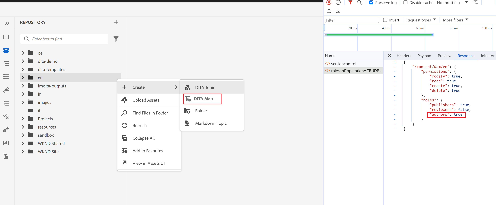

# Mostra/Nascondi &#39;Crea DitaMAP&#39; dal menu di scelta rapida delle cartelle nell&#39;editor Web

In questo articolo verrà illustrato come personalizzare l&#39;Editor Web Guide per nascondere o visualizzare l&#39;opzione &quot;Crea DitaMap&quot; nel menu di scelta rapida delle cartelle in base alle autorizzazioni di utenti/gruppi.
In questo caso d’uso questa opzione verrà nascosta per tutti gli utenti non autori.

## Prerequisiti

Sfrutteremo il pacchetto dell’estensione AEM Guides che consente di personalizzare l’interfaccia utente dell’app in base alle tue esigenze.
Consulta questa [documentazione](https://github.com/adobe/guides-extension/tree/main) per ulteriori informazioni sul funzionamento di Guides Extension Framework.

Ora iniziamo e scopri come personalizzare il menu di scelta rapida delle cartelle per nascondere questa opzione per tutti gli utenti non autori.

Come puoi vedere dallo snippet qui sotto, l’opzione &quot;create DitaMap&quot; (crea DitaMap) è visibile per un utente che crea.



Vediamo ora come è possibile nascondere questa opzione utilizzando Guides Extension Framework.

## Passaggi di implementazione

L’implementazione è suddivisa nelle seguenti parti:

- **Modifiche nel controller Folder_options**

  A ogni menu di scelta rapida è associato un ID controller. Questo controller gestisce la funzionalità on-event per le varie opzioni del menu di scelta rapida.

  In questo esempio personalizzeremo il menu di scelta rapida delle cartelle per nascondere l’opzione &quot;Crea DitaMap&quot; per i non autori. A questo scopo, verranno apportate modifiche al file folder_options.ts presente in /src nell’archivio del framework di estensione delle guide.

  Stiamo utilizzando &quot;viewState&quot; come &quot;REPLACE&quot; per nascondere questa opzione dal menu di scelta rapida.
Stiamo chiamando un nuovo widget in questa cartella_options tramite la chiave &#39;id&#39;.

```typescript
const folderOptions = {
  id: "folder_options",
  contextMenuWidget: "repository_panel",
  view: {
    items: [
      {
        component: "widget",
        id: "customditamap",
        target: {
          key: "displayName",
          value: "DITA Map",
          viewState: VIEW_STATE.REPLACE,
        },
      },
    ],
  },
};
```

- **Creazione di un nuovo widget per gestire la logica**

  È necessaria una nuova creazione di widget (customoptions.ts) per scrivere la logica e nascondere questa opzione solo per gli utenti non autori. Per ottenere questo risultato, abbiamo utilizzato il tasto &quot;show&quot;, che funge da interruttore nella struttura JSON.

  Puoi scrivere un servlet esterno per controllare i dettagli del gruppo. In questo modo è possibile personalizzare anche le opzioni di menu delle cartelle per il gruppo personalizzato.
In questo esempio, abbiamo sfruttato la chiamata &quot;rolesapi&quot; dell’AEM OOTB per recuperare i dettagli utente e impostare la risposta in &quot;isAuthor&quot;, come mostrato nei frammenti precedenti.

```typescript
const folderOptions = {
  id: "customditamap",
  view: {
    component: "button",
    quiet: true,
    icon: "breakdownAdd",
    label: "DITA Map",
    "on-click": "createNewDitaMap",
    show: "@extraProps.isAuthor",
  },
};
```

Attraverso questo, siamo in grado di nascondere il pulsante con l&#39;etichetta &quot;Dita Map&quot; in base al valore di &quot;show&quot;.

È stato aggiunto un controller per impostare l’attributo &quot;isAuthor&quot; nel modello. Questa operazione può essere eseguita utilizzando la seguente sintassi nel controller.

```typescript
this.model.extraProps.set("key", value);
```

Qui la chiave è &quot;isAuthor&quot; e il valore è la risposta della chiamata rolesapi.
Abbiamo anche definito l’evento &quot;createNewDitaMap&quot; per abilitare l’opzione create DitaMap (per gli utenti autori).

```typescript
controller: {
    init: function () {
      this.model.extraProps.set("isAuthor", false);

      rolesApiResponse.then((result) => {
        console.log(result);
        this.model.extraProps.set(
          "isAuthor",
          result["/content/dam"].roles.authors
        );

        console.log("testresult" + result["/content/dam"].roles.authors);
      });
    },
    createNewDitaMap() {
      repositoryController && repositoryController.next("create_new.map");
    },
  },
```

- **Aggiunta del codice personalizzato**

  Importare i file folder_options.ts e customoptions.ts nel file index.ts in /src.

## Test

- Accedi all’AEM con un utente che non fa parte del gruppo authors. L&#39;opzione Crea DitaMap è nascosta nel menu di scelta rapida di qualsiasi cartella, come illustrato di seguito.
Questo caso d’uso è stato aggiunto a GIT. Di seguito trovi le relative risorse.


### Risorse correlate

- **Archivio base framework estensioni** - [GIT](https://github.com/adobe/guides-extension/tree/main)

- **Documentazione** - [sull&#39;Experience League](../../../../../guides-ui-extensions/aem_guides_framework/basic-customisation.md)

- **Casi d&#39;uso comuni documentati** - [sull&#39;Experience League](../../../../../guides-ui-extensions/aem_guides_framework/jui-framework.md)

- **Archivio pubblico con esempi** - [su GIT](https://github.com/adobe/guides-extension/tree/sc-expert-session). Consulta la filiale sc-expert-session

```

```
