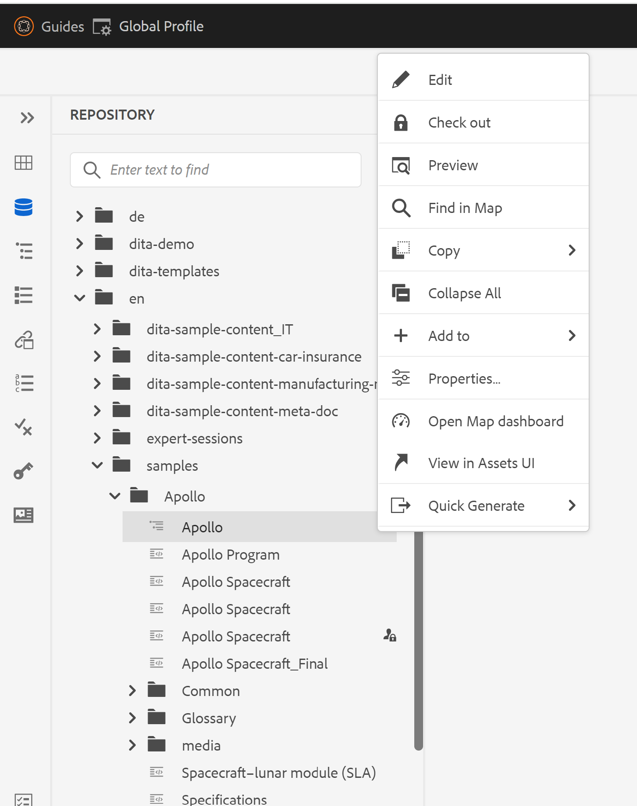

# Rimuovi l’opzione Elimina dal menu di scelta rapida dei file nell’editor web

Questo articolo illustra come nascondere l’opzione Elimina dal menu di scelta rapida dei file nell’editor di AEM Guides per utenti o gruppi specifici. Per altre personalizzazioni sulle opzioni del menu di scelta rapida dei file, controlla il framework dell’estensione delle guide. Ulteriori dettagli sono disponibili [qui](https://github.com/adobe/guides-extension/tree/main).

Come puoi vedere dallo snippet qui sotto, il menu di scelta rapida del file presenta l’opzione Elimina disponibile per questo utente specifico.


Ora vediamo come nascondere l’opzione &quot;Elimina&quot; per questo utente.

## Passaggi di implementazione:

- Passa a Strumenti > Sicurezza > Autorizzazioni dalla pagina Home di AEM.
- Scegliere il gruppo o l&#39;utente dalla casella di ricerca.
- Fai clic su &quot;Aggiungi ACE&quot; dall’angolo in alto a destra.
- Scegli il percorso della cartella.
- Includere i privilegi &quot;jcr:removeChildNodes&quot; e &quot;jcr:removeNode&quot;.
- Scegli &quot;Tipo di autorizzazione&quot; come &quot;Nega&quot; e fai clic su &quot;Aggiungi&quot; come mostrato di seguito.


### Test

- Accedi ad AEM come utente per il quale sono stati aggiunti gli ACE.
- Apri l’editor web.
- Passare alla visualizzazione del repository e scegliere la cartella per la quale sono stati aggiunti gli ACE.
- Aprire il menu di scelta rapida dei file.
- L&#39;opzione &#39;Elimina&#39; non verrà visualizzata nel menu di scelta rapida.

Il menu di scelta rapida del file sarà ora simile al seguente:



```
Please note that these steps would also remove 'move' and 'rename' options from the Editor as they are also tied to delete process at the backend.
```
