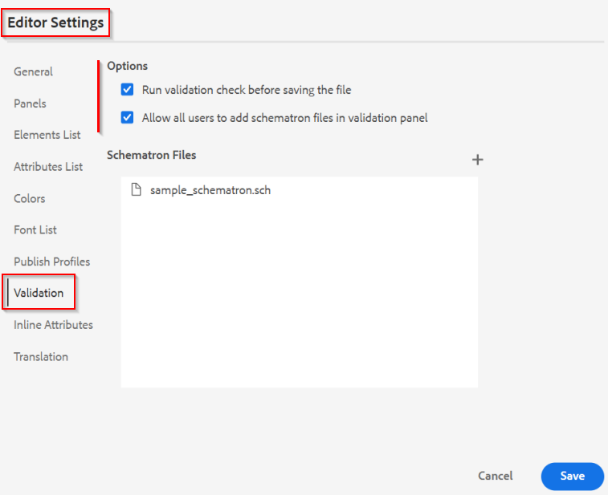
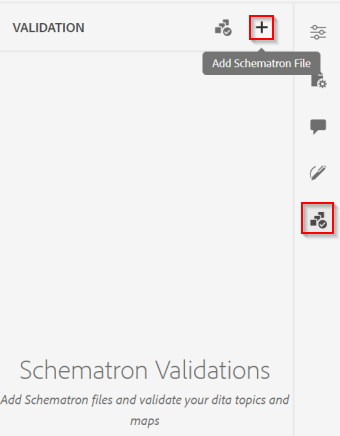
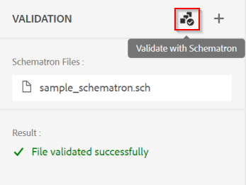

# Controllo della qualità dei contenuti nell’editor web

Questo articolo offre una panoramica delle possibilità di convalida nell’editor web delle guide dell’AEM.
Per progettazione, l&#39;editor Web sfrutta l&#39;impostazione dello schema DITA nel sistema per imporre agli utenti di creare contenuto compatibile con DITA. In questo modo, tutto il contenuto memorizzato nel sistema è strutturato, riutilizzabile e valido.

Oltre al supporto per le regole DITA, l’editor web supporta anche la convalida dei contenuti basati su &quot;*Schematron*&quot;.

&quot;*Schematron*&quot; fa riferimento a un linguaggio di convalida basato su regole utilizzato per definire test per un file XML. Potete importare i file Schematron e modificarli nell&#39;Editor Web. Utilizzando un file &quot;Schematron&quot; è possibile definire determinate regole e quindi convalidarle per un argomento DITA o una mappa. Le regole di schema possono garantire la coerenza della struttura XML imponendo restrizioni definite come regole. Tali restrizioni sono dettate dalle PMI proprietarie della qualità e della coerenza dei contenuti.

    NOTA: l&#39;editor Web supporta ISO Schematron.


## Conoscenza del funzionamento di &quot;Schematron&quot; nell’editor web

### Configurazione delle regole di Schematron

Consulta la sezione &quot;Supporto per i file Schematron&quot; in [Guida utente](https://helpx.adobe.com/content/dam/help/en/xml-documentation-solution/4-2/Adobe-Experience-Manager-Guides_UUID_User-Guide_EN.pdf#page=148)


### Applica regole di convalida al salvataggio dei file

Le impostazioni dell’editor web consentono agli utenti avanzati di impostare regole/file Schematron che verranno eseguiti ogni volta che un utente aggiorna il contenuto. Per ulteriori informazioni, consulta la sezione &quot;Convalida&quot; in [Guida utente](https://helpx.adobe.com/content/dam/help/en/xml-documentation-solution/4-2/Adobe-Experience-Manager-Guides_UUID_User-Guide_EN.pdf#page=58)




### È possibile eseguire la convalida manualmente?

Sì, come autore/utente durante la creazione di contenuti puoi utilizzare il pannello Schematron nell’editor web per caricare un file schematron ed eseguire convalide sul file aperto nell’editor.

    Affinché ciò funzioni, l&#39;amministratore del profilo di cartella deve consentire a tutti gli utenti di aggiungere file Schemtron nel pannello Convalida. Vedi le impostazioni dell’editor (schermata data sopra)





### Regole supportate

La versione corrente delle guide AEM supporta la convalida utilizzando solo le regole basate su &quot;Asserzioni&quot;. (vedere [rapporto vs. risorse](https://schematron.com/document/205.html)) Eventuali regole basate su &quot;Rapporti&quot; non sono ancora supportate.


### Esempi e ulteriori informazioni sulle regole di Schematron

#### Casi d’uso di esempio

- Controlla se un collegamento è esterno e se ha ambito &quot;esterno&quot;

  ```
  <sch:pattern>
      <sch:rule context="xref[contains(@href, 'http') or contains(@href, 'https')]">
          <sch:assert test="@scope = 'external' and @format = 'html'">
              All external xref links must be with scope='external' and format='html'
          </sch:assert>
      </sch:rule>
  </sch:pattern>
  ```

- Controlla se c&#39;è almeno un &quot;topicref&quot; in una mappa o almeno un &quot;li&quot; sotto un &quot;ul&quot;

  ```
  <sch:pattern>
      <sch:rule context="map">
          <sch:assert test="count(topicref) > 0">
              There should be atleast one topicref in map
          </sch:assert>
      </sch:rule>
  
      <sch:rule context="ul">
          <sch:assert test="count(li) > 1" >
              A list must have more than one item.
          </sch:assert>
      </sch:rule>
  </sch:pattern>
  ```

- L’elemento &quot;indexterm&quot; deve essere sempre presente in un &quot;prologo&quot;

  ```
  <sch:pattern>
      <sch:rule context="*[contains(@class, ' topic/indexterm ')]">
          <sch:assert test="ancestor::node()/local-name() = 'prolog'">
              The indexterm element should be in a prolog.
          </sch:assert>
      </sch:rule>
  </sch:pattern>
  ```

#### Riferimenti

- Informazioni  [Nozioni di base sugli schemi](https://da2022.xatapult.com/#what-is-schematron)
- Ulteriori informazioni su [Regole di asserzione in Schematron](https://www.xml.com/pub/a/2003/11/12/schematron.html#Assertions)
- [File di schema di esempio](../../../assets/authoring/sample_schematron.sch)
